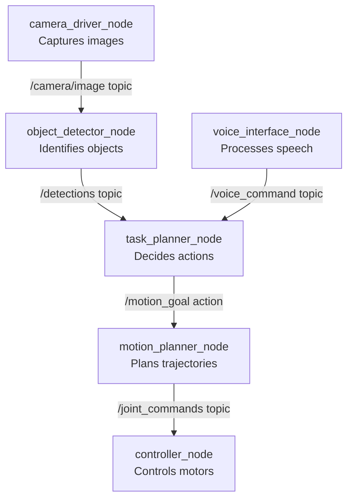
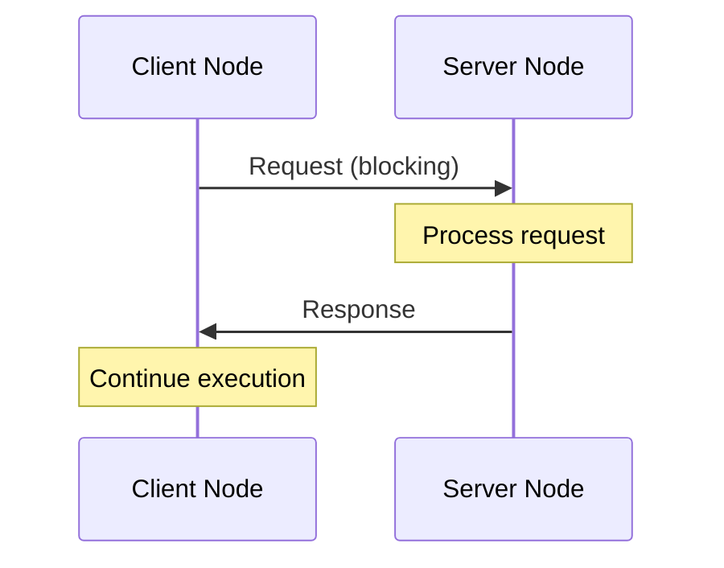
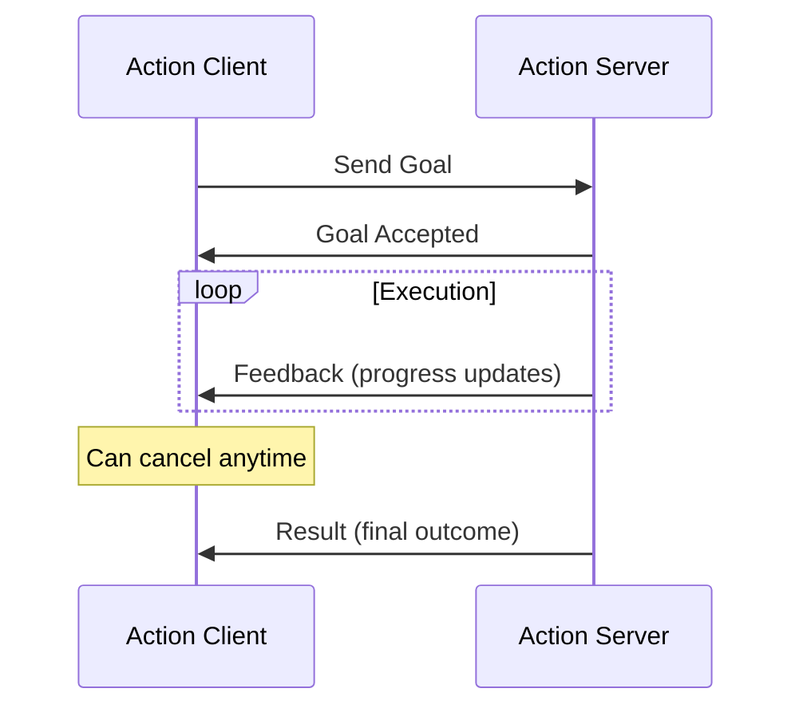
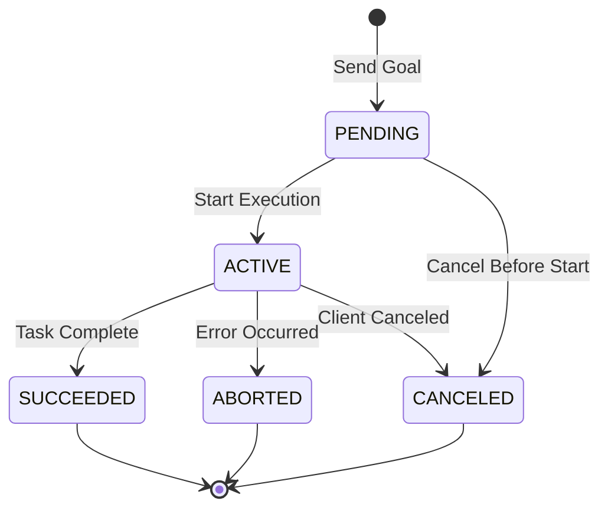
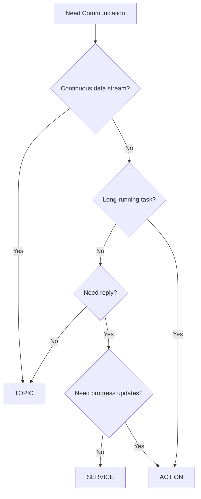
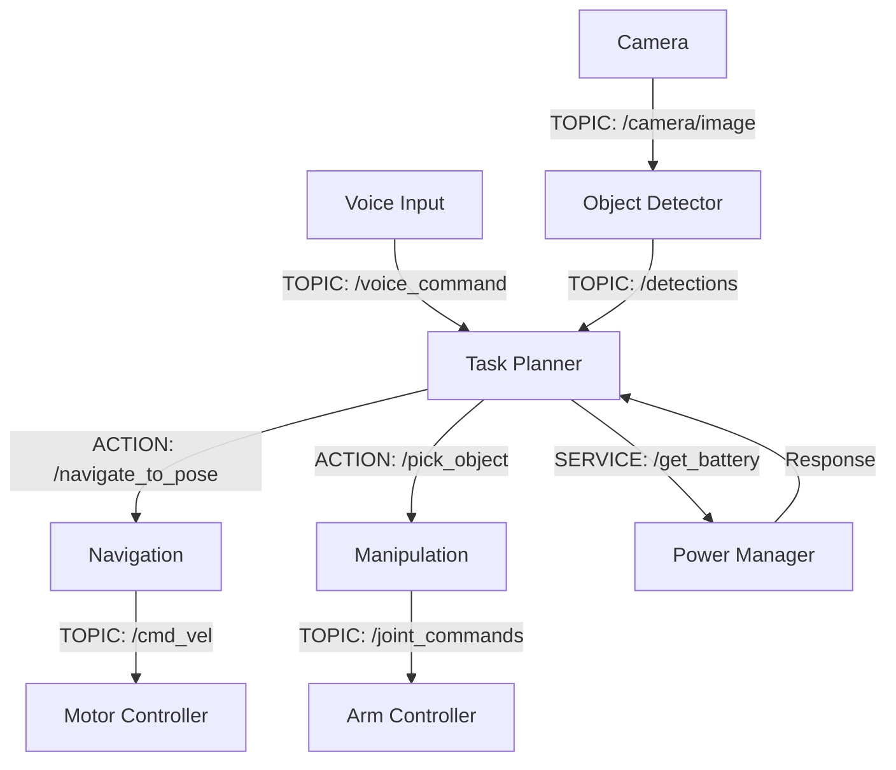

# Chapter 5: Nodes, Topics, Services, and Actions

## Learning Objectives

By the end of this chapter, you will be able to:

- Explain what ROS 2 nodes are and how they organize robot functionality
- Describe the publish-subscribe pattern and when to use topics
- Understand the request-response pattern and when to use services
- Explain the goal-feedback-result pattern and when to use actions
- Compare and contrast topics, services, and actions
- Identify appropriate communication patterns for humanoid robot scenarios
- Understand Quality of Service (QoS) policies and their importance
- Read and interpret ROS 2 system diagrams

## Prerequisites

- Chapter 4: Introduction to ROS 2 (understanding of ROS 2 architecture and purpose)
- Basic understanding of program execution and processes
- Familiarity with the concept of functions/procedures
- No programming experience required for this conceptual chapter

## Introduction: Why This Matters

Imagine you're coordinating a group of specialists to complete a complex task—building a house. You have:

- **Architect** (continuously provides blueprints as they evolve)
- **Suppliers** (deliver materials when requested)
- **Contractors** (execute multi-day tasks like roofing, with progress updates)

These specialists need different communication styles:

1. **Blueprints**: Continuously broadcast to anyone interested (like a newsletter)
2. **Material orders**: Request → Response (like ordering pizza)
3. **Roofing project**: Long task with progress updates and ability to cancel (like tracked package delivery)

ROS 2 provides exactly these three communication patterns for robot components:

1. **Topics** (Publish-Subscribe): Continuous data streams
2. **Services** (Request-Response): One-time queries or commands
3. **Actions** (Goal-Feedback-Result): Long-running tasks with feedback

Understanding which pattern to use when is crucial for designing effective robot systems. In this chapter, we'll explore each pattern in depth, see how they work in humanoid robots, and learn how to choose the right tool for each job.

## Nodes: The Building Blocks

Before diving into communication patterns, let's fully understand **nodes**—the entities that communicate.

### What is a Node?

**Definition**: A node is an independent executable program (process) that performs a specific computation in a robot system.

**Key Characteristics**:

1. **Independent Process**: Runs as separate OS-level process
2. **Single Responsibility**: Each node has one focused purpose
3. **Discoverable**: Automatically finds other nodes on the network
4. **Communicates via ROS 2**: Uses topics, services, and/or actions

**Analogy**: Nodes are like apps on your smartphone:
- Each app runs independently
- Apps can share data (like camera app sharing photos)
- Apps communicate through standard OS mechanisms
- Closing one app doesn't crash others

### Node Examples in a Humanoid Robot



**camera_driver_node**:
- Purpose: Interface with camera hardware
- Publishes: Raw images to `/camera/image` topic
- Runs at: 30 Hz (30 times per second)

**object_detector_node**:
- Purpose: Identify objects in images using computer vision
- Subscribes to: `/camera/image` topic
- Publishes: Object detections to `/detections` topic
- Runs at: 10 Hz (processes every 3rd image)

**task_planner_node**:
- Purpose: High-level decision making
- Subscribes to: `/voice_command`, `/detections`
- Sends: Goals to motion planner via actions
- Runs at: 1 Hz (re-evaluates plan every second)

**motion_planner_node**:
- Purpose: Calculate collision-free trajectories
- Receives: Action goals (target poses)
- Publishes: Planned trajectories to `/joint_commands`
- Runs at: Variable (depends on planning complexity)

**controller_node**:
- Purpose: Low-level motor control
- Subscribes to: `/joint_commands`
- Controls: Physical motors
- Runs at: 100-1000 Hz (very fast for smooth motion)

### Node Lifecycle

ROS 2 nodes can have simple or complex lifecycles:

**Simple Node** (most common):
```
Inactive → Running → Shutdown
```

**Lifecycle Node** (for safety-critical components):
```
Unconfigured → Inactive → Active → Inactive → Finalized
         ↑_______________________↓
```

**Lifecycle Benefits**:
- Controlled startup/shutdown sequences
- Ability to reconfigure without full restart
- Clean error recovery

**Example—Humanoid Balance Controller**:
1. **Unconfigured**: Load parameters, allocate memory
2. **Inactive**: Ready but not controlling motors (safe state)
3. **Active**: Actively controlling balance
4. **Error → Inactive**: If problem detected, safely return to inactive
5. **Finalized**: Clean shutdown

## Communication Pattern 1: Topics (Publish-Subscribe)

### What are Topics?

**Topic**: A named channel for continuous data streams using publish-subscribe pattern.

**How Topics Work**:

```mermaid
graph LR
    A[Publisher Node] -->|publish| B[/camera/image<br/>Topic]
    B -->|subscribe| C[Subscriber Node 1]
    B -->|subscribe| D[Subscriber Node 2]
    B -->|subscribe| E[Subscriber Node 3]
```

**Key Properties**:

1. **Many-to-Many**: Multiple publishers and subscribers allowed
2. **Asynchronous**: Publishers don't wait for subscribers
3. **Continuous**: Data flows as long as publisher is active
4. **Unidirectional**: Publishers send, subscribers receive (no reply)
5. **Decoupled**: Publishers don't know who's subscribed

### Topic Anatomy

**Topic Name** (hierarchical namespace):
```
/robot_name/sensor_type/data_description

Examples:
/humanoid_1/camera/left/image_raw
/humanoid_1/sensors/imu/data
/humanoid_1/joint_states
```

**Message Type** (defines data structure):
```
sensor_msgs/Image          # Camera images
sensor_msgs/JointState     # Joint positions and velocities
geometry_msgs/Twist        # Linear and angular velocity
std_msgs/String            # Simple text
```

**Example Message**:
```yaml
# geometry_msgs/Twist (velocity command)
linear:
  x: 0.5   # Move forward at 0.5 m/s
  y: 0.0
  z: 0.0
angular:
  x: 0.0
  y: 0.0
  z: 0.1  # Turn left at 0.1 rad/s
```

### When to Use Topics

**Use topics for**:
✓ Continuous sensor data (camera images, IMU, joint states)
✓ Command streams (velocity commands, joint positions)
✓ Periodic status updates
✓ Broadcasting data to multiple consumers
✓ Fire-and-forget communication (don't need confirmation)

**Don't use topics for**:
✗ One-time queries ("Is door open?")
✗ Commands requiring acknowledgment
✗ Long-running tasks with progress updates
✗ Request-response interactions

### Humanoid Robot Topic Examples

**Sensor Topics**:
```
/camera/left/image_raw                  # 30 Hz
/camera/right/image_raw                 # 30 Hz
/lidar/scan                             # 10 Hz
/imu/data                               # 100 Hz
/joint_states                           # 50-100 Hz
/force_torque/left_foot                 # 100 Hz
/force_torque/right_foot                # 100 Hz
```

**Control Topics**:
```
/joint_trajectory_controller/command    # Arm movement commands
/walking_controller/cmd_vel             # Walking velocity commands
/head_controller/command                # Head orientation commands
```

**Status Topics**:
```
/battery_state                          # Battery percentage
/diagnostics                            # System health
/robot_state                            # Current mode (idle/walking/manipulating)
```

### Quality of Service (QoS) Policies

Not all data is equal. Camera images and safety-critical commands have different requirements:

**QoS Parameters**:

**Reliability**:
- **RELIABLE**: Guarantee delivery (TCP-like)
  - Use for: Commands, important status
- **BEST_EFFORT**: Send and forget (UDP-like)
  - Use for: High-rate sensors (cameras, lidar)

**History**:
- **KEEP_LAST(N)**: Keep only N most recent messages
  - Use for: Real-time data (only current state matters)
- **KEEP_ALL**: Store all messages until processed
  - Use for: Commands that must all be executed

**Durability**:
- **VOLATILE**: New subscribers miss old data
- **TRANSIENT_LOCAL**: New subscribers receive recent data
  - Use for: Configuration, maps

**Deadline**:
- Maximum acceptable time between messages
- Triggers warning if violated
  - Use for: Safety-critical sensors

**Example QoS Configurations**:

**Camera Images** (high-rate sensor data):
```python
qos = QoSProfile(
    reliability=ReliabilityPolicy.BEST_EFFORT,  # OK to drop frames
    history=HistoryPolicy.KEEP_LAST,
    depth=1,  # Only need most recent frame
    durability=DurabilityPolicy.VOLATILE
)
```

**Joint Commands** (safety-critical control):
```python
qos = QoSProfile(
    reliability=ReliabilityPolicy.RELIABLE,  # Must arrive
    history=HistoryPolicy.KEEP_LAST,
    depth=10,  # Buffer recent commands
    deadline=Duration(seconds=0.01)  # Must arrive within 10ms
)
```

## Communication Pattern 2: Services (Request-Response)

### What are Services?

**Service**: A synchronous request-response communication pattern for one-time interactions.

**How Services Work**:



**Key Properties**:

1. **Synchronous**: Client waits for response (blocking)
2. **One-to-One**: One client, one server per request
3. **Bidirectional**: Request → Response
4. **Short-Lived**: For quick operations (< 1 second typically)

### Service Anatomy

**Service Name**:
```
/namespace/service_name

Examples:
/humanoid/get_battery_level
/vision/detect_objects
/arm/set_gripper_state
```

**Service Type** (Request + Response definition):
```
std_srvs/SetBool
  Request:
    bool data     # True or False
  Response:
    bool success  # Did it work?
    string message  # Optional status message

example_interfaces/AddTwoInts
  Request:
    int64 a
    int64 b
  Response:
    int64 sum
```

### When to Use Services

**Use services for**:
✓ One-time queries ("What's battery level?")
✓ Configuration changes ("Set mode to autonomous")
✓ Triggering actions ("Open gripper")
✓ State queries ("Is robot ready?")
✓ Quick computations ("Calculate inverse kinematics")

**Don't use services for**:
✗ Continuous data streams
✗ Long-running tasks (> 1 second)
✗ Broadcasting to multiple recipients
✗ Real-time control loops

### Humanoid Robot Service Examples

**Configuration Services**:
```
/set_operating_mode
  Request: mode (idle/walking/manipulation)
  Response: success, message

/configure_camera
  Request: resolution, frame_rate
  Response: success, message
```

**Query Services**:
```
/get_battery_level
  Request: (empty)
  Response: percentage (float)

/is_object_reachable
  Request: object_pose
  Response: reachable (bool), reason (string)
```

**Control Services**:
```
/open_gripper
  Request: opening_width (meters)
  Response: success, final_width

/enable_balance_control
  Request: enable (bool)
  Response: success, message
```

**Computation Services**:
```
/compute_inverse_kinematics
  Request: target_pose
  Response: success, joint_positions

/check_collision
  Request: trajectory
  Response: has_collision (bool), collision_point
```

### Service Timeout and Error Handling

**Problem**: What if service never responds?

**Solution**: Timeout and fallback logic

**Pseudocode**:
```python
# Call service with 2-second timeout
response = call_service('/detect_objects', timeout=2.0)

if response is None:
    # Timeout occurred
    log_error("Object detection service timeout")
    use_fallback_behavior()
elif not response.success:
    # Service responded but failed
    log_error(f"Detection failed: {response.message}")
    retry_with_different_parameters()
else:
    # Success
    process_detections(response.objects)
```

## Communication Pattern 3: Actions (Goal-Feedback-Result)

### What are Actions?

**Action**: An asynchronous goal-oriented communication pattern for long-running, preemptible tasks with continuous feedback.

**How Actions Work**:



**Key Properties**:

1. **Asynchronous**: Client doesn't block waiting for result
2. **Long-Running**: For tasks taking seconds to minutes
3. **Feedback**: Progress updates during execution
4. **Preemptible**: Can cancel or change goal mid-execution
5. **Stateful**: Tracks goal status (pending/active/succeeded/aborted/canceled)

### Action Anatomy

**Action Name**:
```
/namespace/action_name

Examples:
/navigate_to_pose
/pick_object
/follow_trajectory
```

**Action Type** (Goal + Feedback + Result):
```yaml
# NavigateToPose action

Goal:
  target_pose:
    position: {x, y, z}
    orientation: {x, y, z, w}

Feedback:
  current_pose:
    position: {x, y, z}
    orientation: {x, y, z, w}
  distance_remaining: float
  estimated_time_remaining: float

Result:
  success: bool
  final_pose:
    position: {x, y, z}
    orientation: {x, y, z, w}
  total_distance_traveled: float
```

### When to Use Actions

**Use actions for**:
✓ Long-running tasks (navigation, manipulation)
✓ Tasks requiring progress feedback
✓ Preemptible operations (can cancel mid-execution)
✓ Goal-oriented behaviors (reach pose, grasp object)
✓ Tasks with clear success/failure criteria

**Don't use actions for**:
✗ Continuous data streams (use topics)
✗ Quick queries (use services)
✗ Real-time control loops
✗ Simple on/off commands

### Humanoid Robot Action Examples

**Navigation Actions**:
```
/navigate_to_pose
  Goal: target_pose
  Feedback: current_pose, distance_remaining, ETA
  Result: success, final_pose

/follow_path
  Goal: waypoints[]
  Feedback: current_waypoint_index, distance_to_next
  Result: success, waypoints_reached
```

**Manipulation Actions**:
```
/pick_object
  Goal: object_id, grasp_pose
  Feedback: current_step (approaching/grasping/lifting), progress
  Result: success, final_object_pose

/place_object
  Goal: target_location
  Feedback: current_step (moving/descending/releasing), progress
  Result: success, placement_accuracy
```

**Whole-Body Actions**:
```
/stand_up_from_sitting
  Goal: target_posture
  Feedback: current_phase (weight_shift/push_up/balance), progress_percent
  Result: success, final_stability_score

/climb_stairs
  Goal: num_steps, step_height
  Feedback: current_step_number, current_phase, foot_contact_status
  Result: success, steps_climbed
```

**Complex Task Actions**:
```
/make_coffee
  Goal: coffee_type, milk_preference
  Feedback: current_subtask (grasp_cup/place_under_machine/press_button/retrieve), progress
  Result: success, coffee_temperature, message
```

### Action States and Lifecycle

**Goal States**:
```
PENDING    → Goal accepted, waiting to start
ACTIVE     → Currently executing
SUCCEEDED  → Completed successfully
ABORTED    → Failed during execution
CANCELED   → Canceled by client
```

**State Transitions**:


### Preemption (Canceling Actions)

**Scenario**: Robot navigating to kitchen when user says "Stop!"

**Without Preemption**:
- Robot continues to kitchen (dangerous!)

**With Preemption** (Actions support):
```python
# Client code
action_client.send_goal(navigate_to_kitchen)

# User says "Stop!"
action_client.cancel_goal()  # Robot stops safely

# Server code (simplified)
while executing_navigation:
    if is_canceled():
        stop_motors_safely()
        return Result(success=False, message="Canceled by user")

    move_one_step()
    send_feedback(current_pose, distance_remaining)
```

## Comparing Communication Patterns

### Decision Matrix

| Criteria | Topic | Service | Action |
|----------|-------|---------|--------|
| **Duration** | Continuous | < 1 sec | > 1 sec |
| **Synchronous** | No | Yes | No |
| **Bidirectional** | No | Yes | Yes |
| **Feedback** | No | No | Yes |
| **Cancelable** | N/A | No | Yes |
| **Many Receivers** | Yes | No | No |
| **Example** | Camera stream | Battery query | Navigate to pose |

### Choosing the Right Pattern

**Flowchart**:


### Real-World Examples

**Scenario 1: Camera Images**
- **Continuous?** Yes → **TOPIC**
- Example: `/camera/image` at 30 Hz

**Scenario 2: Check Battery Level**
- **Continuous?** No
- **Long-running?** No
- **Need reply?** Yes
- **Progress updates?** No → **SERVICE**
- Example: `/get_battery_level` service

**Scenario 3: Navigate to Pose**
- **Continuous?** No
- **Long-running?** Yes (5-30 seconds) → **ACTION**
- Example: `/navigate_to_pose` action

**Scenario 4: Motor Commands**
- **Continuous?** Yes → **TOPIC**
- Example: `/joint_commands` at 100 Hz

**Scenario 5: Grasp Object**
- **Continuous?** No
- **Long-running?** Yes (2-10 seconds)
- **Need feedback?** Yes (current grasp phase)
- **Cancelable?** Yes (safety) → **ACTION**
- Example: `/grasp_object` action

## Complete Humanoid System Example

Let's see all three patterns working together in a complete scenario:

**Task**: "Bring me the red mug from the kitchen"

**System Architecture**:



**Communication Flow**:

1. **Voice command** (TOPIC):
   - Voice interface publishes to `/voice_command`
   - Task planner subscribes

2. **Battery check** (SERVICE):
   - Task planner calls `/get_battery_level`
   - Power manager responds: 75%

3. **Object detection** (TOPIC):
   - Camera continuously publishes to `/camera/image`
   - Object detector subscribes, publishes detections to `/detections`
   - Task planner subscribes to detections

4. **Navigate to kitchen** (ACTION):
   - Task planner sends goal to `/navigate_to_pose` action
   - Navigation server provides feedback (distance remaining)
   - Navigation server publishes velocity commands to `/cmd_vel` (TOPIC)
   - Motor controller subscribes to `/cmd_vel`
   - Navigation completes, returns result

5. **Pick up mug** (ACTION):
   - Task planner sends goal to `/pick_object` action
   - Manipulation server provides feedback (grasp phase)
   - Manipulation publishes joint commands to `/joint_commands` (TOPIC)
   - Arm controller subscribes to `/joint_commands`
   - Manipulation completes, returns result

6. **Return to user** (ACTION):
   - Navigate back using `/navigate_to_pose` action

## Integration: Communication Patterns in Practice

Understanding these patterns is essential for the rest of the book:

**Chapter 6**: Connecting Python agents to ROS 2
- You'll use rclpy to create publishers, subscribers, service clients/servers, and action clients/servers

**Chapter 7**: URDF robot models
- Robot state publisher uses topics to broadcast joint states

**Module 2**: Digital Twin simulation
- Gazebo publishes sensor data via topics
- Controllers subscribe to command topics

**Module 3**: NVIDIA Isaac
- Isaac ROS packages use all three patterns for perception and control

**Module 4**: Vision-Language-Action models
- High-level commands via actions
- Continuous sensor streams via topics
- Configuration queries via services

## Questions and Answers

**Q: Can a node be both publisher and subscriber on the same topic?**

A: Yes! Common pattern. Example: A filter node subscribes to `/camera/raw_image`, processes it, and publishes to `/camera/filtered_image`.

**Q: What happens if no one subscribes to a topic?**

A: Publisher continues publishing (wastes some resources). No error occurs. Use `get_subscription_count()` to check if anyone is listening.

**Q: Can I call a service from within an action server?**

A: Yes! Actions, services, and topics can freely interact. Example: Navigation action might call `/check_collision` service during execution.

**Q: What happens if action server crashes mid-execution?**

A: Client receives error notification (goal aborted). Robust systems use lifecycle nodes and heartbeat monitoring to detect and recover from failures.

**Q: How do I choose QoS settings?**

A: Start with defaults, then tune based on:
- **Sensors**: BEST_EFFORT, KEEP_LAST(1) for high-rate data
- **Commands**: RELIABLE, KEEP_LAST(10) for important control
- **Critical safety**: RELIABLE, DEADLINE policies, KEEP_ALL

**Q: Can actions run in parallel?**

A: Yes! An action server can handle multiple goals simultaneously if programmed to do so. Or run multiple separate action servers.

**Q: What's the maximum message size for topics?**

A: DDS typically supports up to 64 KB by default, configurable to larger (MB range). For very large data (HD video), consider sending metadata and using shared memory or separate data transfer.

## Connections to Other Modules

- **Chapter 4** provided ROS 2 foundation—this chapter detailed the communication primitives
- **Chapter 6** will show Python code (rclpy) implementing these patterns
- **Chapter 7** will use topics for robot state publishing
- **Module 2** will demonstrate these patterns in simulation
- **Module 3** will show Isaac ROS packages using topics, services, and actions
- **Module 4** will integrate VLA models using these communication patterns

## Summary

ROS 2 provides three communication patterns optimized for different robotic scenarios. The key takeaways:

1. **Nodes**: Independent processes with single responsibilities, communicate via ROS 2 patterns
2. **Topics** (Publish-Subscribe):
   - Continuous, asynchronous data streams
   - Many-to-many, unidirectional
   - Use for: Sensors, continuous commands, status broadcasts
   - QoS policies tune reliability, latency, and durability
3. **Services** (Request-Response):
   - Synchronous, one-time interactions
   - One-to-one, bidirectional
   - Use for: Queries, configuration, quick commands
   - Should complete quickly (< 1 second)
4. **Actions** (Goal-Feedback-Result):
   - Asynchronous, long-running tasks
   - One-to-one, bidirectional, with continuous feedback
   - Use for: Navigation, manipulation, complex behaviors
   - Preemptible (can cancel mid-execution)
5. **Choosing Patterns**: Consider duration, need for reply, feedback requirements, and cancelability
6. **Integration**: Real systems use all three patterns working together

Mastering these communication patterns is essential for building modular, maintainable robot systems. They enable the coordination of complex subsystems—from sensors to actuators to AI decision-making—that make humanoid robots possible.

As you progress through this book, you'll see these patterns repeatedly. In the next chapter, we'll transition from conceptual understanding to practical implementation, showing how to connect Python AI agents to ROS 2 using these exact patterns.

## References

1. Open Robotics. (2024). "ROS 2 Concepts: Topics, Services, Actions." https://docs.ros.org/en/rolling/Concepts.html
   - Official ROS 2 documentation on communication patterns

2. Maruyama, Y., et al. (2016). "Exploring the performance of ROS2." *IEEE RTCSA*, 415-424.
   - Performance comparison of communication patterns

3. Macenski, S., et al. (2020). "The Marathon 2: A Navigation System." *IEEE/RSJ IROS*.
   - Real-world use of actions for robot navigation

4. Object Management Group. (2015). "Data Distribution Service (DDS) v1.4."
   - QoS policies underlying ROS 2 topics

5. Quigley, M., et al. (2009). "ROS: An open-source Robot Operating System." *ICRA Workshop on Open Source Software*.
   - Original ROS concepts (topics/services evolved from ROS 1)

6. Bustos, P., et al. (2022). "Understanding Quality of Service (QoS) in ROS 2." *Journal of Open Source Software*, 7(70), 4057.
   - Detailed analysis of QoS policies

7. Open Robotics. (2024). "ROS 2 Design: Composition." https://design.ros2.org/articles/composition.html
   - Node composition and communication patterns

8. Thomas, D., et al. (2014). "Deterministic ROS 2 communication with Quality of Service." *ROSCon*.
   - QoS design rationale

9. Brawner, A., et al. (2021). "Nav2: The Navigation Framework." https://navigation.ros.org/
   - Large-scale use of actions in navigation stack

---

**End of Chapter 5**

You now understand the three fundamental communication patterns in ROS 2 and can identify which to use for different scenarios. In Chapter 6, you'll see these concepts in action as we write Python code to create nodes, publish to topics, call services, and send action goals—connecting AI agents to the humanoid robot's nervous system.
