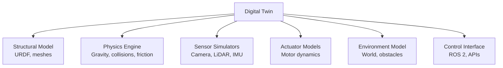
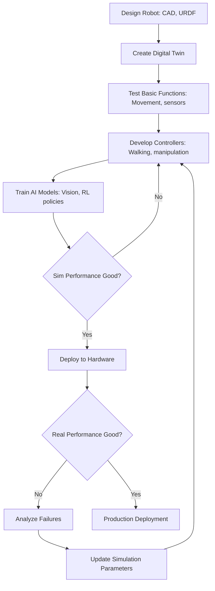

# Chapter 8: What is a Digital Twin in Robotics?

## Learning Objectives

By the end of this chapter, you will be able to:

- Define what a digital twin is in the context of robotics
- Explain the benefits of simulation before hardware deployment
- Understand the components of a robot digital twin (physics, sensors, actuators)
- Describe the sim-to-real transfer challenge and approaches
- Identify use cases for digital twins in humanoid robotics
- Compare different simulation platforms (Gazebo, Isaac Sim, others)
- Understand the role of digital twins in the robot development lifecycle

## Prerequisites

- Chapter 2: Understanding Humanoid Robots (robot subsystems)
- Chapter 7: URDF (robot modeling basics)
- Basic understanding of physics (gravity, friction, collisions)

## Introduction: Why This Matters

Imagine you're developing a new walking controller for a humanoid robot. Testing directly on hardware means:

- **Risk**: Robot might fall and damage expensive hardware ($200k+)
- **Time**: Each test takes minutes to set up, deploy, run
- **Safety**: Requires safety barriers, human oversight
- **Limited scenarios**: Can't easily test extreme conditions (ice, stairs, obstacles)
- **Cost**: Hardware wear and tear from repeated testing

Now imagine you had a perfect virtual copy of your robot—a **digital twin**—where you could:

- Test falling thousands of times without damage
- Run tests 100x faster than real-time
- Easily create challenging scenarios (slippery floors, random obstacles)
- Test dangerous situations safely
- Iterate rapidly on controller designs

This is the power of robot simulation and digital twins.

In this chapter, we'll explore what digital twins are, how they accelerate robot development, and why they're essential for modern humanoid robotics—especially when combined with AI and machine learning.

## What is a Digital Twin?

### Definition

A **digital twin** in robotics is a virtual replica of a physical robot that:

1. **Models the robot's structure** (geometry, kinematics from URDF)
2. **Simulates physics** (gravity, friction, collisions, dynamics)
3. **Emulates sensors** (cameras, LiDAR, IMU, force sensors)
4. **Mimics actuators** (motors, joint controllers)
5. **Runs in real-time or faster** (enabling rapid iteration)

**Key Insight**: A digital twin isn't just a 3D model—it's a functional simulation that behaves like the real robot, enabling testing of control algorithms, AI models, and behaviors before hardware deployment.

### Digital Twin vs. 3D Model

| Aspect | 3D Model | Digital Twin |
|--------|----------|--------------|
| **Purpose** | Visualization | Testing & validation |
| **Physics** | None | Accurate dynamics |
| **Interaction** | Static display | Dynamic behavior |
| **Sensors** | No data | Simulated sensor outputs |
| **Control** | Not controllable | Responds to commands |
| **Example** | CAD rendering | Gazebo simulation |

### Components of a Robot Digital Twin



**1. Structural Model**:
- Based on URDF (Chapter 7)
- Link geometry (visual and collision)
- Joint definitions and limits
- Mass and inertia properties

**2. Physics Engine**:
- Gravity simulation
- Collision detection and response
- Friction and contact forces
- Rigid body dynamics
- Sometimes deformable objects

**3. Sensor Simulators**:
- Camera rendering (RGB, depth)
- LiDAR ray casting
- IMU (orientation, acceleration)
- Force/torque sensors
- GPS, magnetometer, etc.

**4. Actuator Models**:
- Motor torque limits
- Joint friction and damping
- Control delays
- Actuator dynamics

**5. Environment Model**:
- Ground plane
- Obstacles and terrain
- Lighting (for cameras)
- Physics materials (floor friction, etc.)

**6. Control Interface**:
- ROS 2 topics for sensor data
- ROS 2 topics/actions for commands
- Plugin architecture for custom behaviors

## Why Digital Twins Matter for Humanoid Robots

### 1. Safety and Risk Mitigation

**Humanoid Challenges**:
- Bipedal robots are inherently unstable
- Falls can cause expensive damage
- Testing extreme scenarios (stairs, slippery surfaces) is dangerous

**Digital Twin Benefits**:
- Simulate falls safely
- Test edge cases without risk
- Validate safety systems before hardware deployment

**Example**: Test balance recovery on icy surface:
```
Simulation: Apply random force → Robot slips → Test recovery
Hardware: Only deploy controller after 10,000 simulated recoveries succeed
```

### 2. Rapid Iteration and Development Speed

**Traditional Hardware-First Development**:
```
1. Design controller
2. Deploy to robot (10 minutes)
3. Run test (2 minutes)
4. Analyze failure
5. Modify controller
6. Repeat
→ 5-10 iterations per day
```

**Simulation-First Development**:
```
1. Design controller
2. Deploy to simulation (10 seconds)
3. Run test (10 seconds in simulation, but 100x speed → 0.1 seconds)
4. Analyze failure
5. Modify controller
6. Repeat
→ 500-1000 iterations per day
```

**Impact**: 100x more iterations enables faster convergence on robust solutions.

### 3. Synthetic Data Generation for AI

**Machine Learning Challenge**: Need millions of training examples.

**Hardware Approach**: Impractical
- Collecting 1 million camera images with labels takes months
- Expensive in time and resources

**Digital Twin Approach**: Practical
- Generate millions of labeled images in days
- Vary lighting, object positions, backgrounds automatically
- Perfect ground truth (positions, orientations, object IDs)

**Example—Object Detection Training**:
```
Simulation generates:
- 100,000 camera images
- 500,000 object bounding boxes (auto-labeled)
- Varying lighting conditions
- Randomized object poses
→ Train robust detector in 1 week vs. 6 months
```

### 4. Parallel Experimentation

**Physical Robot**: One robot, one experiment at a time

**Digital Twin**: Run hundreds of experiments in parallel
- Test different parameter settings
- Hyperparameter search for controllers
- Genetic algorithms with population of 100+ robots

**Example—Gait Optimization**:
```
Spawn 100 virtual humanoids with different walking parameters
Run for 10 seconds (simulated)
Select top 10 performers
Mutate and repeat
→ Evolve optimized gait in hours instead of weeks
```

### 5. Scenario Coverage and Edge Case Testing

**Real World**: Limited control over conditions
- Can't easily test on ice, mud, stairs, etc.
- Weather-dependent for outdoor testing
- Difficult to reproduce exact scenarios

**Digital Twin**: Complete control
- Create exact scenarios programmatically
- Test thousands of variations
- Reproduce bugs precisely

**Example Test Scenarios**:
- Walking on 15° slope
- Recovering from 20kg lateral push
- Grasping objects with 5% position error
- Camera occlusion by 50%
- Noisy IMU readings

### 6. Cost Reduction

**Hardware Costs**:
- Humanoid robot: $200k-$700k
- Maintenance and repairs: $50k/year
- Lab space and infrastructure: $100k+

**Digital Twin Costs**:
- Simulation software: $0-$10k (Gazebo free, Isaac Sim free for research)
- Computing hardware: $5k-$20k for GPU workstation
- Cloud computing: $1-$5 per hour

**ROI**: Simulation pays for itself after avoiding single major hardware failure.

## The Sim-to-Real Gap

### The Challenge

**Problem**: Controllers that work perfectly in simulation often fail on real hardware.

**Why?**
1. **Physics Approximations**:
   - Simplified friction models
   - Idealized contact dynamics
   - Numerical integration errors

2. **Sensor Differences**:
   - Perfect simulated sensors vs. noisy real sensors
   - Different camera color/exposure
   - Timing delays not modeled

3. **Actuator Differences**:
   - Simplified motor models
   - Backlash and compliance not captured
   - Wear and tear in real motors

4. **Environment Differences**:
   - Real-world variability (floor irregularities, lighting changes)
   - Unexpected interactions

**Example**:
```
Simulation: Robot walks perfectly on flat, uniform ground
Reality: Robot falls because real floor has slight slope and different friction
```

### Approaches to Bridging the Gap

**1. Domain Randomization**:

Intentionally vary simulation parameters to create diversity:

```python
# Randomize physics parameters
mass = nominal_mass * random.uniform(0.8, 1.2)
friction = random.uniform(0.3, 0.9)
motor_noise = random.normal(0, 0.05)
camera_exposure = random.uniform(0.5, 2.0)
```

**Benefit**: Controller learns to be robust to variations, generalizes better to reality.

**2. Sim-to-Real Transfer Learning**:

Train in simulation, fine-tune on real hardware:

```
1. Train policy in simulation (1M episodes)
2. Deploy to robot
3. Collect 1000 real-world episodes
4. Fine-tune policy with real data
5. Deploy refined policy
```

**3. System Identification**:

Measure real robot parameters and update simulation:

```
1. Run experiments on real robot
2. Estimate actual mass, friction, motor characteristics
3. Update simulation parameters
4. Re-train controller with accurate sim
```

**4. Adversarial Training**:

Make simulation harder than reality:
- Add sensor noise beyond real levels
- Reduce actuator capabilities below real levels
- Add random disturbances

**If controller succeeds in harsh sim, likely succeeds in easier reality.**

**5. Hybrid Approach**:

Use simulation for initial development, real hardware for validation:
```
1. Develop core algorithm in sim (fast iteration)
2. Test on hardware (validate transferability)
3. Refine in sim based on hardware failures
4. Re-test on hardware
5. Iterate until performance acceptable
```

## Simulation Platforms for Humanoid Robotics

### Gazebo Classic / Gazebo Sim (formerly Ignition)

**Overview**:
- Open-source physics simulation
- Tight ROS 2 integration
- Widely used in robotics research and industry

**Strengths**:
- Free and open-source
- Extensive plugin ecosystem
- Good physics accuracy for rigid bodies
- ROS 2 native support
- Large community

**Limitations**:
- Slower than some commercial alternatives
- Limited visual quality
- Physics can be unstable for complex contacts
- Requires GPU for real-time performance

**Best For**:
- Academic research
- ROS 2-based development
- Rigid body robots (wheeled, arms, simple humanoids)

### NVIDIA Isaac Sim

**Overview**:
- Photorealistic simulation built on NVIDIA Omniverse
- GPU-accelerated physics and rendering
- AI-focused features (synthetic data generation, RL training)

**Strengths**:
- Photorealistic visuals
- Fast physics (GPU-based)
- Synthetic data generation tools
- ROS 2 integration
- Domain randomization built-in
- Scales to thousands of robots

**Limitations**:
- Requires NVIDIA GPU (RTX series)
- Steeper learning curve
- Less mature than Gazebo

**Best For**:
- Computer vision training
- Large-scale RL training
- Sim-to-real transfer
- Photorealistic rendering needs

### MuJoCo (Multi-Joint Dynamics with Contact)

**Overview**:
- Fast physics engine for robotics and biomechanics
- Used extensively in RL research

**Strengths**:
- Very fast (10-100x real-time common)
- Accurate contact dynamics
- Differentiable physics (gradient-based optimization)
- Python bindings

**Limitations**:
- Minimal visualization (needs external tools)
- No sensor simulation
- Less full-stack solution

**Best For**:
- RL training (especially model-based)
- Control optimization
- Rapid prototyping

### PyBullet

**Overview**:
- Python-based physics engine
- Easy to use, good for RL

**Strengths**:
- Simple Python API
- Fast enough for RL
- Free and open-source
- Built-in camera/sensor support

**Limitations**:
- Less accurate than specialized simulators
- Limited visual quality
- Smaller ecosystem than Gazebo

**Best For**:
- RL prototyping in Python
- Educational purposes
- Quick experiments

### Comparison Matrix

| Feature | Gazebo | Isaac Sim | MuJoCo | PyBullet |
|---------|--------|-----------|--------|----------|
| **Cost** | Free | Free (research) | Free | Free |
| **ROS 2** | Excellent | Good | Manual | Manual |
| **Physics Speed** | Medium | Fast (GPU) | Very Fast | Fast |
| **Visual Quality** | Basic | Photorealistic | Minimal | Basic |
| **Learning Curve** | Medium | High | Medium | Low |
| **Best Use** | General robotics | AI/ML training | RL research | Prototyping |

## Digital Twin Workflow

### Typical Development Lifecycle



**Phase 1: Design (Weeks 1-2)**:
- CAD design
- Export URDF
- Import to simulator
- Verify model looks correct

**Phase 2: Basic Validation (Weeks 3-4)**:
- Test sensors produce data
- Test joint control
- Verify physics is reasonable

**Phase 3: Controller Development (Weeks 5-12)**:
- Develop walking controller
- Develop manipulation controllers
- Test in various simulated scenarios

**Phase 4: AI Training (Weeks 8-16, parallel with Phase 3)**:
- Generate synthetic training data
- Train vision models
- Train RL policies
- Validate in simulation

**Phase 5: Hardware Validation (Weeks 13-16)**:
- Deploy to real robot
- Compare sim vs. real performance
- Identify sim-to-real gaps
- Refine simulation

**Phase 6: Production (Week 17+)**:
- Ongoing: Use simulation for regression testing
- Test new features in sim before hardware
- Generate training data for model updates

## Use Cases: Digital Twins in Practice

### Use Case 1: Reinforcement Learning for Bipedal Walking

**Challenge**: Train humanoid to walk on varied terrain.

**Approach**:
1. Create digital twin in Isaac Sim
2. Randomize terrain (slopes, steps, obstacles)
3. Train RL policy with PPO algorithm
4. Run millions of episodes in simulation
5. Transfer trained policy to hardware

**Results** (typical):
- 10 million simulated steps in 2 days
- Policy learns robust walking
- Sim-to-real transfer: 70-90% success rate
- Fine-tuning on hardware: 95%+ success

### Use Case 2: Object Detection for Manipulation

**Challenge**: Train detector to find cups for grasping.

**Approach**:
1. Create kitchen environment in Gazebo
2. Randomize cup positions, colors, lighting
3. Render 100,000 images from robot's camera
4. Auto-label with ground truth (sim knows cup positions)
5. Train YOLOv8 detector
6. Test on real robot

**Results**:
- 100,000 labeled images in 1 day (vs. weeks manually)
- Detector achieves 92% mAP in simulation
- Real-world performance: 85% mAP (good transfer)

### Use Case 3: Safety Validation

**Challenge**: Ensure balance controller prevents falls.

**Approach**:
1. Simulate 10,000 push scenarios
   - Random push directions
   - Random push magnitudes (0-50N)
   - Random timings
2. Measure fall rate
3. Iterate controller until fall rate < 1%
4. Deploy to hardware with confidence

**Results**:
- 10,000 tests in simulation: 2 hours
- Same tests on hardware: impossible (would take months)
- Hardware deployment: Zero falls in 500 real-world tests

## Integration: Digital Twins in This Book's Workflow

Digital twins connect throughout the remaining modules:

**Module 2 (Chapters 9-11)**:
- Chapter 9: Gazebo physics simulation
- Chapter 10: Simulated sensors
- Chapter 11: Unity for visualization

**Module 3 (Chapters 12-15)**:
- Chapter 12: Isaac Sim overview
- Chapter 13: Simulated perception
- Chapter 15: RL training in simulation

**Module 4 (Chapters 16-19)**:
- Simulate VLA pipeline before hardware
- Generate synthetic data for VLA training

**Capstone (Chapters 20-22)**:
- Integrate digital twin in full pipeline
- Test entire system in simulation first
- Deploy to hardware with confidence

## Questions and Answers

**Q: Can simulation ever be 100% accurate?**

A: No. The real world has infinite complexity. But simulations can be accurate enough for most purposes, and techniques like domain randomization compensate for inaccuracies.

**Q: Should I always use simulation before hardware?**

A: For complex behaviors (walking, manipulation), yes. For simple tasks (reading sensor, moving single joint), direct hardware testing may be faster.

**Q: How do I know if my simulation is accurate enough?**

A: Compare sim vs. real for specific metrics. If sim predicts hardware performance within 10-20%, usually good enough for development. Fine-tune on hardware for final performance.

**Q: Can I simulate soft materials (cloth, deformable objects)?**

A: Yes, but computationally expensive. Gazebo has limited support. Isaac Sim and specialized simulators (SOFA, Vega FEM) handle deformables better.

**Q: What about human-robot interaction?**

A: Simulating humans is challenging. Simple approaches: scripted human models. Advanced: ML-based human behavior models. Often need hardware testing for HRI validation.

**Q: Do I need a powerful GPU?**

A: Depends on simulator. Gazebo: GPU helps but not required. Isaac Sim: RTX GPU strongly recommended. MuJoCo/PyBullet: CPU sufficient for many tasks.

## Connections to Other Modules

- **Chapter 7 (URDF)** provides robot model for digital twin
- **Chapter 9** will detail Gazebo physics simulation
- **Chapter 10** will show sensor simulation implementation
- **Chapter 11** will demonstrate Unity for high-quality visualization
- **Module 3** will use Isaac Sim as advanced digital twin platform

## Summary

Digital twins accelerate humanoid robot development by enabling safe, fast, cost-effective testing in simulation. The key takeaways:

1. **Digital Twin Definition**: Virtual replica with physics, sensors, actuators—not just 3D model
2. **Benefits**: Safety, rapid iteration, synthetic data, parallel experiments, cost reduction
3. **Sim-to-Real Gap**: Simulation is imperfect; use domain randomization, transfer learning, system ID
4. **Platforms**: Gazebo (ROS-native), Isaac Sim (AI-focused), MuJoCo (fast RL), PyBullet (simple Python)
5. **Workflow**: Design → Simulate → Develop → Train → Hardware validation → Production
6. **Use Cases**: RL training, object detection, safety validation

Digital twins are essential for modern robotics, especially for complex systems like humanoid robots where hardware testing is expensive and risky. They enable AI-driven development at scale.

In the next chapters, we'll dive deep into Gazebo simulation, learning how physics engines work and how to simulate sensors for realistic testing.

## References

1. Grieves, M., & Vickers, J. (2017). "Digital Twin: Mitigating Unpredictable, Undesirable Emergent Behavior in Complex Systems." *Transdisciplinary Perspectives on Complex Systems*.

2. Koenig, N., & Howard, A. (2004). "Design and Use Paradigms for Gazebo, An Open-Source Multi-Robot Simulator." *IEEE/RSJ IROS*.

3. Makoviychuk, V., et al. (2021). "Isaac Gym: High Performance GPU-Based Physics Simulation For Robot Learning." *NeurIPS*.

4. Todorov, E., et al. (2012). "MuJoCo: A Physics Engine for Model-Based Control." *IEEE/RSJ IROS*.

5. Peng, X. B., et al. (2018). "Sim-to-Real Transfer of Robotic Control with Dynamics Randomization." *ICRA*.

6. Tobin, J., et al. (2017). "Domain Randomization for Transferring Deep Neural Networks from Simulation to the Real World." *IEEE/RSJ IROS*.

7. Tan, J., et al. (2018). "Sim-to-Real: Learning Agile Locomotion For Quadruped Robots." *RSS*.

8. Open Robotics. (2024). "Gazebo Documentation." https://gazebosim.org/

---

**Next Chapter**: Chapter 9 will explore Gazebo simulation in detail, showing how physics engines simulate gravity, collisions, friction, and balance for humanoid robots.
