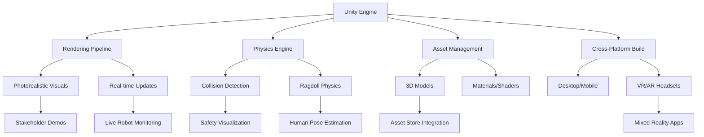
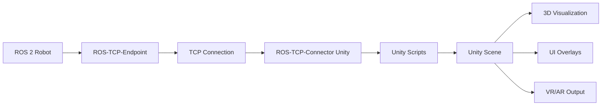
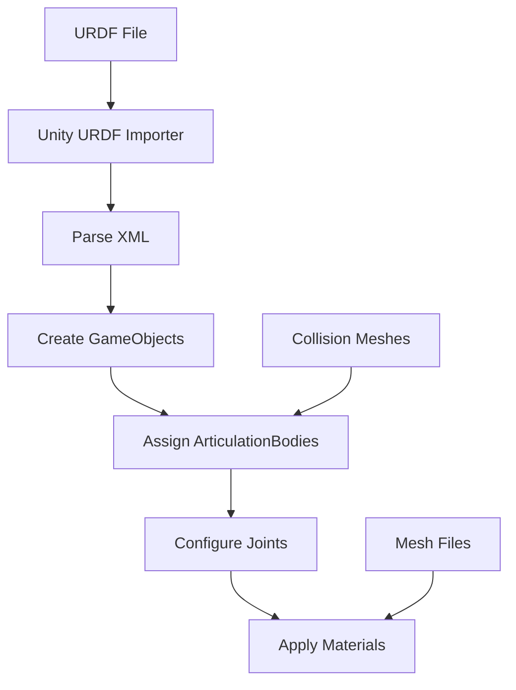
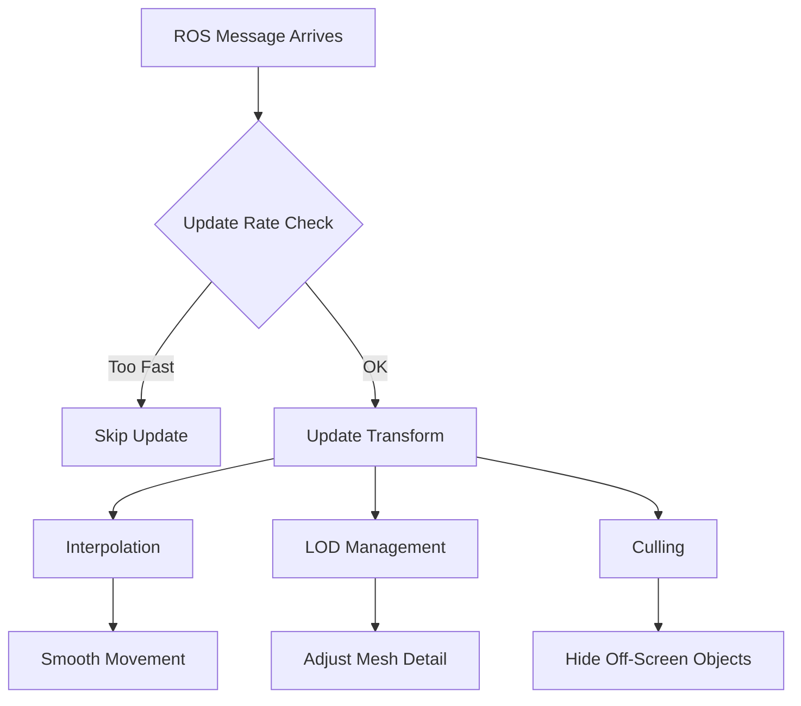
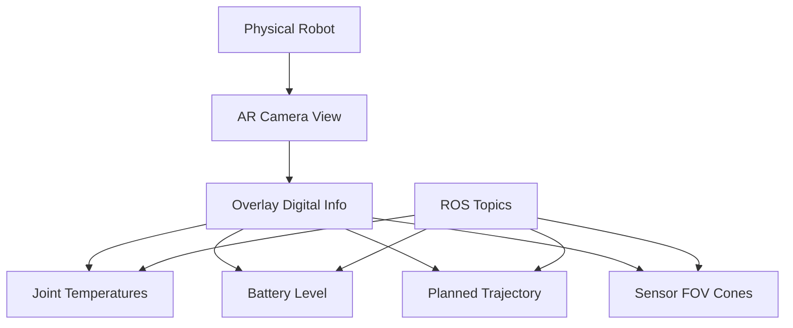
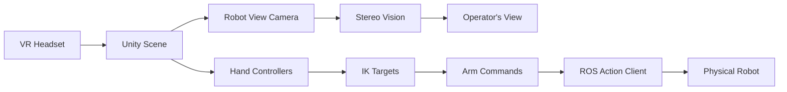
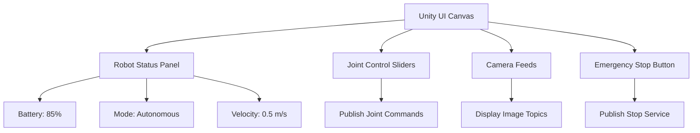

# Chapter 11: Unity Visualization and Mixed Reality

## Learning Objectives

By the end of this chapter, you will:

1. Understand Unity's role in robotics visualization and mixed reality applications
2. Learn how to bridge ROS 2 with Unity using ROS-TCP-Connector
3. Explore real-time 3D visualization techniques for humanoid robots
4. Understand mixed reality (MR) and augmented reality (AR) concepts for robotics
5. Learn how to create interactive visualizations for robot teleoperation
6. Explore Unity's rendering pipeline for photorealistic robot visualization
7. Understand the benefits of Unity for stakeholder demonstrations and human-robot interaction

## Prerequisites

Before starting this chapter, you should understand:

- **ROS 2 fundamentals**: Topics, services, and actions (Chapter 5)
- **URDF robot modeling**: Link and joint definitions (Chapter 7)
- **Digital twin concepts**: Simulation and visualization purposes (Chapter 8)
- **Basic 3D graphics concepts**: Transforms, meshes, and materials
- **C# programming basics**: For Unity scripting (helpful but not required)

Recommended setup:
- Unity 2022.3 LTS or newer installed
- ROS 2 Humble or newer on Ubuntu 22.04 or via Docker
- ROS-TCP-Connector Unity package
- Basic understanding of network communication (TCP/IP)

## Introduction

Imagine a factory floor manager watching a digital replica of their humanoid robot fleet on a tablet, seeing real-time sensor data overlaid on the physical robots through augmented reality glasses. Or consider a robot operator thousands of miles away controlling a humanoid through an immersive 3D interface that shows the robot's perspective, joint states, and collision predictions. These scenarios are made possible by **Unity**, a powerful real-time 3D engine traditionally used for games but increasingly adopted in robotics for visualization, simulation, and mixed reality applications.

While Gazebo excels at physics simulation for testing algorithms, Unity offers complementary strengths: **photorealistic rendering**, **cross-platform deployment** (desktop, mobile, VR/AR headsets), **intuitive visual development**, and **rich asset ecosystems**. Unity transforms robotics development by bridging the gap between technical simulation and human-centered visualization.

This chapter explores how Unity integrates with the ROS 2 ecosystem to provide:
- **Real-time visualization**: Live 3D rendering of robot state from ROS topics
- **Mixed reality interfaces**: AR/VR applications for teleoperation and monitoring
- **Stakeholder communication**: Photorealistic demonstrations for non-technical audiences
- **Human-robot interaction**: Intuitive interfaces for operators and researchers

### Why Unity for Robotics?

Unity's game engine architecture provides several advantages for robotics applications:



**Key Unity advantages**:
1. **Visual fidelity**: High-quality rendering for photorealistic robot visualization
2. **Accessibility**: User-friendly editor for non-programmers (artists, designers)
3. **Performance**: Optimized rendering engine for 60+ FPS on various devices
4. **Ecosystem**: Large asset store with pre-built models, environments, and tools
5. **Mixed reality**: Native support for VR/AR platforms (HoloLens, Quest, Magic Leap)

### Unity vs. Gazebo: Complementary Tools

Unity and Gazebo serve different purposes in the robotics pipeline:

| Feature | Gazebo | Unity |
|---------|--------|-------|
| **Primary purpose** | Physics simulation | Visualization & MR |
| **Physics accuracy** | High-fidelity (ODE, Bullet) | Moderate (PhysX, mostly visual) |
| **Rendering quality** | Functional | Photorealistic |
| **ROS integration** | Native (plugins) | Via ROS-TCP-Connector |
| **Performance** | Physics-limited | Rendering-optimized |
| **Use case** | Algorithm testing | Stakeholder demos, teleoperation |
| **VR/AR support** | Limited | Excellent |
| **Learning curve** | Steeper (XML, C++) | Gentler (visual editor, C#) |

**Typical workflow**: Develop and test algorithms in Gazebo → Deploy to hardware → Visualize with Unity for monitoring and demonstration.

## Core Concepts

### 1. ROS-Unity Integration Architecture

Unity does not natively communicate with ROS. The **ROS-TCP-Connector** package bridges this gap by establishing TCP/IP connections between ROS 2 nodes and Unity scripts.

#### Architecture Overview



**Components**:
1. **ROS-TCP-Endpoint** (ROS side): Python node that listens for TCP connections and forwards ROS messages
2. **ROS-TCP-Connector** (Unity side): Unity package that connects to endpoint and deserializes messages
3. **Unity scripts**: C# scripts that subscribe to ROS topics and update GameObjects

#### Message Flow Example

```csharp
// Unity C# script subscribing to JointState messages
using UnityEngine;
using Unity.Robotics.ROSTCPConnector;
using RosMessageTypes.Sensor;

public class JointStateSubscriber : MonoBehaviour
{
    void Start()
    {
        ROSConnection.GetOrCreateInstance().Subscribe<JointStateMsg>(
            "/joint_states", UpdateJointVisuals
        );
    }

    void UpdateJointVisuals(JointStateMsg jointState)
    {
        for (int i = 0; i < jointState.name.Length; i++)
        {
            string jointName = jointState.name[i];
            float position = (float)jointState.position[i];

            // Find corresponding Unity GameObject and update rotation
            GameObject joint = GameObject.Find(jointName);
            if (joint != null)
            {
                joint.transform.localRotation =
                    Quaternion.Euler(0, 0, position * Mathf.Rad2Deg);
            }
        }
    }
}
```

**Key points**:
- Unity subscribes to ROS topics as if it were another ROS node
- Messages are serialized (ROS) → TCP → deserialized (Unity)
- Unity GameObjects update in real-time based on ROS data

### 2. URDF Import and Articulation Bodies

Unity can import URDF files to automatically create robot hierarchies with joints and links.

#### URDF Importer Workflow



**Steps**:
1. **Import URDF**: Unity parses links, joints, and visual/collision meshes
2. **Create hierarchy**: Each link becomes a GameObject with parent-child relationships
3. **Add ArticulationBodies**: Unity's physics component for multi-joint systems
4. **Configure joints**: Joint types (revolute, prismatic) and limits are set
5. **Apply materials**: Visual meshes get materials for rendering

**ArticulationBody vs. Rigidbody**:
- **Rigidbody**: Unity's standard physics body, struggles with long kinematic chains (humanoids)
- **ArticulationBody**: Designed for multi-joint systems (robots, ragdolls), uses reduced-coordinate dynamics

```csharp
// Pseudo-code: Creating an ArticulationBody for a robot link
GameObject upperArm = new GameObject("upper_arm");
ArticulationBody ab = upperArm.AddComponent<ArticulationBody>();

ab.jointType = ArticulationJointType.RevoluteJoint;
ab.anchorRotation = Quaternion.Euler(90, 0, 0); // Joint axis
ab.xDrive = new ArticulationDrive
{
    lowerLimit = -120f,
    upperLimit = 120f,
    stiffness = 10000f,
    damping = 100f,
    forceLimit = 500f
};
```

### 3. Real-Time Visualization Techniques

Unity updates robot visualizations at 60+ FPS by efficiently processing ROS data.

#### Optimization Strategies



**Key techniques**:
1. **Throttling**: Limit updates to match Unity's frame rate (60 Hz) even if ROS publishes faster
2. **Interpolation**: Smooth transitions between discrete ROS updates
3. **Level of Detail (LOD)**: Use simpler meshes when robot is far from camera
4. **Frustum culling**: Don't render objects outside camera view

```csharp
// Pseudo-code: Throttled updates with interpolation
public class SmoothedRobotVisualizer : MonoBehaviour
{
    private Vector3 targetPosition;
    private Quaternion targetRotation;
    private float lastUpdateTime = 0f;
    private float updateInterval = 0.033f; // 30 Hz max

    void OnROSMessageReceived(PoseMsg pose)
    {
        float currentTime = Time.time;
        if (currentTime - lastUpdateTime < updateInterval)
            return; // Skip update

        targetPosition = RosToUnity(pose.position);
        targetRotation = RosToUnity(pose.orientation);
        lastUpdateTime = currentTime;
    }

    void Update()
    {
        // Smooth interpolation between updates
        transform.position = Vector3.Lerp(
            transform.position, targetPosition, Time.deltaTime * 10f
        );
        transform.rotation = Quaternion.Slerp(
            transform.rotation, targetRotation, Time.deltaTime * 10f
        );
    }
}
```

### 4. Mixed Reality for Robotics

Mixed reality combines real and virtual worlds, enabling operators to interact with robots through immersive interfaces.

#### AR Application: Robot Status Overlay



**Use case**: Factory technician wears AR glasses (e.g., HoloLens) and sees:
- Real-time joint states overlaid on physical robot
- Predicted movement paths
- Warning indicators for overheating motors
- Sensor coverage visualization

```csharp
// Pseudo-code: AR overlay for robot joint temperature
public class ARJointTempOverlay : MonoBehaviour
{
    public GameObject robotModel; // Digital twin in AR space
    private Dictionary<string, TextMesh> jointLabels;

    void Start()
    {
        ROSConnection.GetOrCreateInstance().Subscribe<JointTemperatureMsg>(
            "/joint_temperatures", UpdateTemperatureLabels
        );
    }

    void UpdateTemperatureLabels(JointTemperatureMsg tempMsg)
    {
        foreach (var jointTemp in tempMsg.temperatures)
        {
            TextMesh label = jointLabels[jointTemp.joint_name];
            label.text = $"{jointTemp.temperature:F1}°C";

            // Color-code by temperature
            if (jointTemp.temperature > 70f)
                label.color = Color.red;
            else if (jointTemp.temperature > 50f)
                label.color = Color.yellow;
            else
                label.color = Color.green;
        }
    }
}
```

#### VR Application: Immersive Teleoperation



**Use case**: Operator wears VR headset to control a remote humanoid:
- See through robot's cameras in stereoscopic 3D
- Use hand controllers to set arm poses (inverse kinematics solves joint angles)
- Walk in place to control robot locomotion
- Feel haptic feedback on collisions

### 5. Rendering Pipeline for Photorealism

Unity's rendering pipelines create high-quality visuals for demonstrations.

#### Universal Render Pipeline (URP) vs. High Definition Render Pipeline (HDRP)

| Feature | URP | HDRP |
|---------|-----|------|
| **Target platforms** | Mobile, VR, mid-range PC | High-end PC, consoles |
| **Rendering quality** | Good | Photorealistic |
| **Performance** | Optimized for 60+ FPS | More demanding |
| **Use case** | AR/VR robotics apps | Marketing videos, demos |

**Photorealistic rendering components**:
1. **Physically-based materials**: Metallic, roughness, normal maps for realistic surfaces
2. **Global illumination**: Light bounces for realistic shadows and ambient lighting
3. **Post-processing**: Bloom, depth of field, motion blur for cinematic quality
4. **Raytracing** (HDRP): Accurate reflections and shadows

```csharp
// Pseudo-code: Applying PBR material to robot in Unity
Material robotMetal = new Material(Shader.Find("HDRP/Lit"));
robotMetal.SetFloat("_Metallic", 0.9f); // Very metallic
robotMetal.SetFloat("_Smoothness", 0.8f); // Polished surface
robotMetal.SetColor("_BaseColor", new Color(0.7f, 0.7f, 0.75f)); // Light grey

GameObject robotBody = GameObject.Find("TorsoLink");
robotBody.GetComponent<Renderer>().material = robotMetal;
```

### 6. Human-Robot Interaction Interfaces

Unity enables intuitive UI for non-expert robot operators.

#### Interface Components



**Example**: Teleoperation dashboard with:
- Live camera feeds from robot's head cameras
- Joint angle sliders for manual control
- Emergency stop button (publishes to `/emergency_stop` service)
- Status indicators (battery, connectivity, mode)

```csharp
// Pseudo-code: Emergency stop button
using UnityEngine.UI;

public class EmergencyStopButton : MonoBehaviour
{
    private Button stopButton;

    void Start()
    {
        stopButton = GetComponent<Button>();
        stopButton.onClick.AddListener(PublishEmergencyStop);
    }

    void PublishEmergencyStop()
    {
        var request = new EmergencyStopRequest { stop = true };
        ROSConnection.GetOrCreateInstance().SendServiceMessage<EmergencyStopResponse>(
            "/emergency_stop", request, OnStopResponse
        );

        stopButton.GetComponent<Image>().color = Color.red;
    }

    void OnStopResponse(EmergencyStopResponse response)
    {
        Debug.Log($"Emergency stop acknowledged: {response.success}");
    }
}
```

## Integration Across Modules

Unity visualization integrates with previous and upcoming concepts:

### From Previous Modules
- **URDF (Chapter 7)**: Unity imports URDF to create robot GameObjects with correct hierarchies
- **ROS 2 Topics (Chapter 5)**: Unity subscribes to `/joint_states`, `/tf`, `/camera/image` for live updates
- **Digital Twin (Chapter 8)**: Unity acts as a visual digital twin, complementing Gazebo's physics twin
- **Sensor Simulation (Chapter 10)**: Unity can render synthetic camera/LiDAR data for training (via HDRP or Isaac Sim integration)

### To Future Modules
- **Isaac Sim (Chapter 12)**: Unity and Isaac Sim can share USD assets and be used in parallel workflows
- **Domain Randomization (Chapter 14)**: Unity can generate randomized training data with its rendering pipeline
- **VLA Models (Chapter 16)**: Unity visualizes VLA model predictions (e.g., overlaying planned grasps on camera view)
- **Capstone (Chapters 20-22)**: Unity provides the primary visualization and teleoperation interface

## Practical Q&A

**Q1: When should I use Unity instead of Gazebo for visualization?**

**A**: Use Unity when you need:
- **High visual quality** for stakeholder demonstrations or marketing
- **VR/AR interfaces** for teleoperation or training
- **Cross-platform deployment** (mobile apps, web builds)
- **Non-technical user interfaces** with buttons, sliders, and menus

Use Gazebo when you need:
- **Physics accuracy** for algorithm development
- **Native ROS integration** without network overhead
- **Sensor simulation** for training perception models

**Q2: How do I handle coordinate system differences between ROS and Unity?**

**A**: ROS uses right-handed Z-up coordinates; Unity uses left-handed Y-up. Convert with:

```csharp
// ROS → Unity conversion
Vector3 RosToUnity(RosPosition pos)
{
    return new Vector3(-pos.y, pos.z, pos.x); // Swap and negate
}

Quaternion RosToUnity(RosOrientation ori)
{
    return new Quaternion(ori.y, -ori.z, -ori.x, ori.w);
}
```

**Q3: Can Unity handle multiple robots simultaneously?**

**A**: Yes. Use separate ROS-TCP-Connector instances or namespace topics:

```csharp
// Robot 1
ROSConnection.GetOrCreateInstance().Subscribe<JointStateMsg>(
    "/robot1/joint_states", UpdateRobot1
);

// Robot 2
ROSConnection.GetOrCreateInstance().Subscribe<JointStateMsg>(
    "/robot2/joint_states", UpdateRobot2
);
```

**Q4: How do I optimize Unity performance for real-time robotics?**

**A**: Key optimizations:
1. **Use URP instead of HDRP** for VR/AR (better frame rates)
2. **Reduce mesh complexity** for distant objects (LOD groups)
3. **Limit physics calculations** if using ArticulationBodies only for visualization
4. **Throttle ROS updates** to 30-60 Hz (no need for 1000 Hz visualization)
5. **Profile with Unity Profiler** to identify bottlenecks

**Q5: Can I train AI models using Unity-rendered data?**

**A**: Yes, but with caveats:
- **For vision**: Unity can render synthetic images, but Isaac Sim (Chapter 15) offers better photorealism and domain randomization tools
- **For perception datasets**: Unity's HDRP can produce high-quality labeled data (segmentation masks, depth, bounding boxes)
- **For RL**: Unity ML-Agents package supports reinforcement learning, but limited for complex robotics vs. Isaac Sim

**Recommendation**: Use Unity for visualization and quick prototypes; use Isaac Sim for large-scale synthetic data generation.

## Connections to Other Modules

### Part 1 - Foundations
- **Physical AI (Chapter 1)**: Unity enables human operators to interact with embodied AI through intuitive 3D interfaces
- **Humanoid Robots (Chapter 2)**: Unity visualizes humanoid subsystems (perception, manipulation, locomotion) in real-time

### Module 1 - ROS 2
- **ROS 2 Communication (Chapter 5)**: Unity acts as a ROS 2 node (via TCP) subscribing to topics and calling services
- **URDF (Chapter 7)**: Unity imports URDF to auto-generate robot visual models

### Module 2 - Digital Twin
- **Digital Twin Concept (Chapter 8)**: Unity serves as a **visual digital twin** complementing Gazebo's physics twin
- **Gazebo Physics (Chapter 9)**: While Gazebo handles physics, Unity displays the results with higher visual fidelity
- **Sensor Simulation (Chapter 10)**: Unity can render synthetic camera data for perception pipelines

### Module 3 - NVIDIA Isaac
- **Isaac Platform (Chapter 12)**: Unity and Isaac Sim share USD format and can be used in complementary workflows
- **Domain Randomization (Chapter 14)**: Unity can generate randomized training data, though Isaac Sim offers more advanced tools

### Module 4 - VLA
- **VLA Models (Chapter 16)**: Unity visualizes VLA outputs (e.g., action predictions overlaid on robot view)
- **Vision Transformers (Chapter 18)**: Unity displays attention maps and feature activations for debugging

### Capstone
- **Project Architecture (Chapter 20)**: Unity likely serves as the primary visualization and teleoperation interface
- **Integration (Chapter 21)**: Unity ties together ROS 2, Isaac Sim, and VLA models in a unified interface

## Summary

Unity bridges the gap between technical robotics simulation and human-centered visualization. By integrating with ROS 2 via the ROS-TCP-Connector, Unity transforms real-time robot data into photorealistic 3D visualizations, intuitive teleoperation interfaces, and immersive mixed reality experiences.

**Key takeaways**:

1. **Unity complements Gazebo**: Use Gazebo for physics-accurate simulation and Unity for visualization and stakeholder engagement
2. **ROS-TCP-Connector**: Enables Unity to subscribe to ROS topics and call services over TCP/IP
3. **URDF import**: Unity automatically creates robot hierarchies from URDF files with ArticulationBodies for physics
4. **Real-time optimization**: Throttling, interpolation, and LOD management maintain 60+ FPS
5. **Mixed reality**: Unity's VR/AR support enables immersive teleoperation and augmented robot monitoring
6. **Photorealistic rendering**: HDRP and PBR materials create marketing-quality visuals for demonstrations
7. **Human-robot interaction**: Unity's UI system enables intuitive interfaces for non-expert operators

**Unity's value proposition** for humanoid robotics:
- **Accessibility**: Non-programmers (artists, designers) can create visualizations
- **Cross-platform**: Deploy to desktop, mobile, VR/AR with minimal code changes
- **Performance**: Optimized rendering engine handles complex scenes at high frame rates
- **Ecosystem**: Asset store provides pre-built models, environments, and tools

As we move into Module 3 (NVIDIA Isaac), you'll see how Unity's USD support and rendering capabilities integrate with Isaac Sim for even more powerful simulation and visualization workflows. Unity remains a critical tool for the final stage of robotics development: **human interaction and deployment**.

## References

1. Unity Technologies. (2024). *Unity for Robotics*. Unity Documentation. https://unity.com/solutions/automotive-transportation-manufacturing/robotics
2. Unity Technologies. (2024). *ROS-TCP-Connector Documentation*. Unity Robotics Hub. https://github.com/Unity-Technologies/ROS-TCP-Connector
3. Unity Technologies. (2023). *ArticulationBody for Multi-Joint Systems*. Unity Manual. https://docs.unity3d.com/Manual/class-ArticulationBody.html
4. Koenig, N., & Howard, A. (2004). *Design and Use Paradigms for Gazebo, An Open-Source Multi-Robot Simulator*. IEEE/RSJ International Conference on Intelligent Robots and Systems (IROS).
5. Milgram, P., & Kishino, F. (1994). *A Taxonomy of Mixed Reality Visual Displays*. IEICE Transactions on Information and Systems, E77-D(12), 1321-1329.
6. Unity Technologies. (2024). *Universal Render Pipeline vs. High Definition Render Pipeline*. Unity Manual. https://docs.unity3d.com/Manual/render-pipelines.html
7. Juliani, A., Berges, V., Teng, E., Cohen, A., Harper, J., Elion, C., ... & Lange, D. (2020). *Unity: A General Platform for Intelligent Agents*. arXiv preprint arXiv:1809.02627.
8. Nvidia. (2024). *Unity and Isaac Sim Integration*. Nvidia Omniverse Documentation. https://docs.omniverse.nvidia.com/unity
