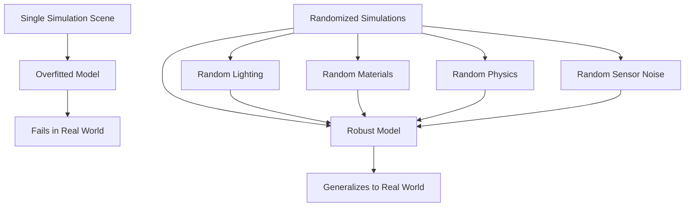
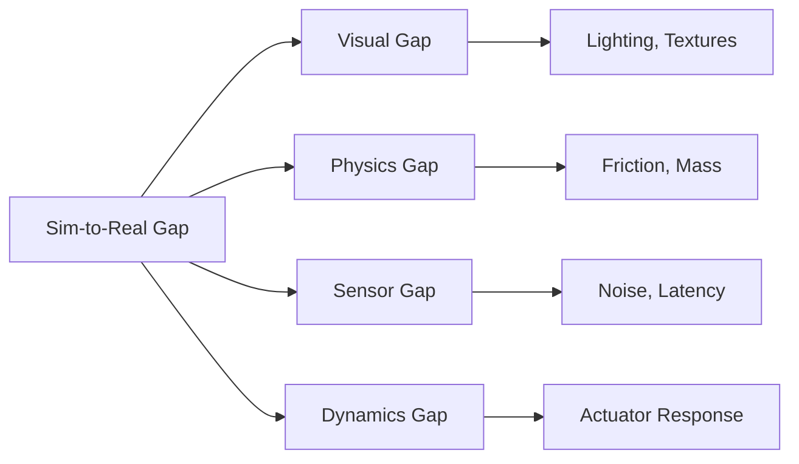
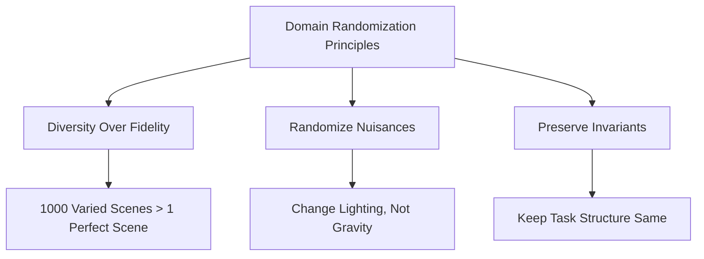
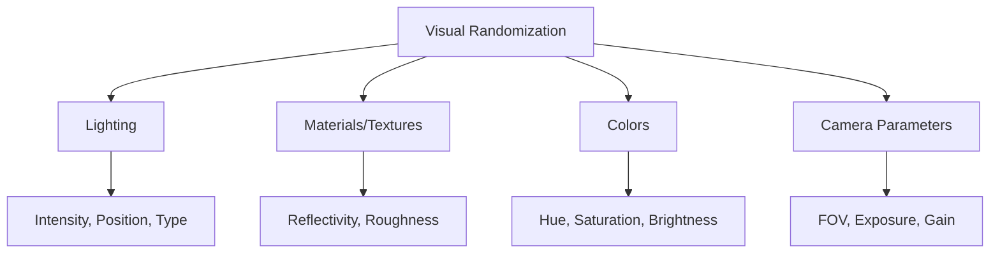
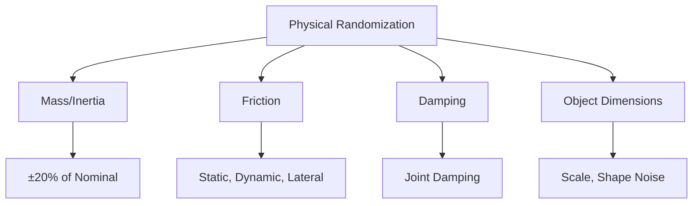
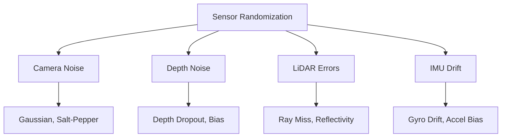
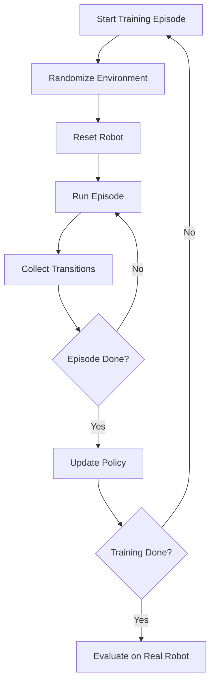
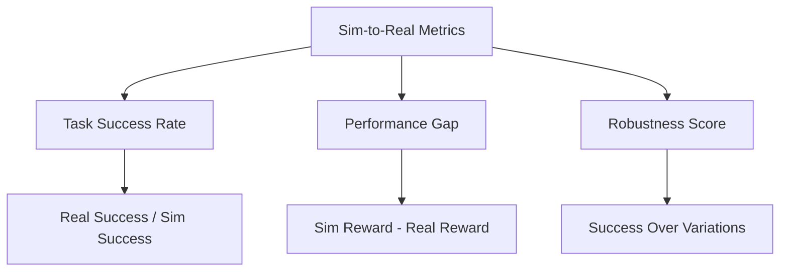
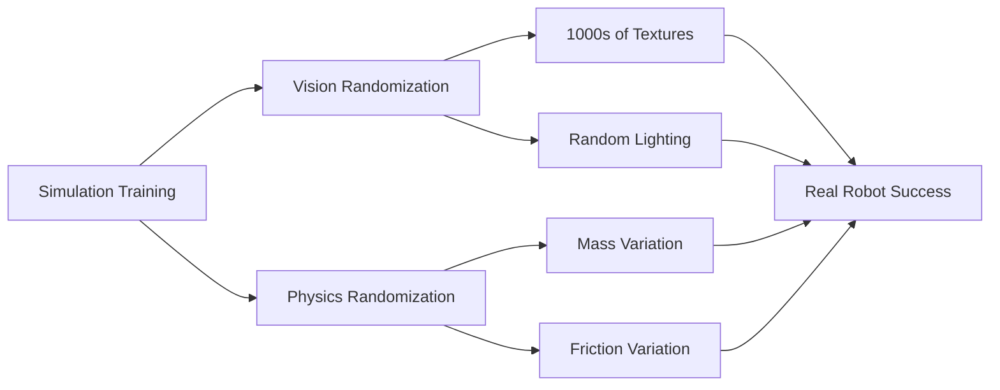

# Chapter 14: Domain Randomization and Sim2Real Transfer

## Learning Objectives

By the end of this chapter, you will:

1. Understand the sim-to-real gap and why it's a critical challenge in robotics
2. Learn domain randomization techniques for creating robust AI models
3. Explore visual, physical, and sensor randomization strategies
4. Understand how to implement domain randomization in Isaac Sim
5. Learn metrics for evaluating sim-to-real transfer success
6. Explore case studies of successful sim-to-real transfer in humanoid robotics
7. Understand when and how to apply domain randomization effectively

## Prerequisites

Before starting this chapter, you should understand:

- **Digital twin concepts**: Simulation fidelity and purposes (Chapter 8)
- **Isaac Sim fundamentals**: USD, PhysX, rendering pipeline (Chapters 12-13)
- **Machine learning basics**: Training data, overfitting, generalization
- **Reinforcement learning**: Policies, rewards, training loops (helpful)
- **Computer vision**: Image classification, object detection (helpful)
- **Python programming**: For Isaac Sim scripting

Recommended setup:
- Isaac Sim 2023.1+ with Replicator extension
- PyTorch or TensorFlow for training AI models
- NVIDIA GPU (RTX 3000 series or better)

## Introduction

Imagine training a humanoid robot in simulation to pick up a red cube. The robot learns perfectly—99% success rate in Isaac Sim. You deploy the trained model to real hardware and... 10% success rate. The lighting is slightly different, the cube's color is off by 5%, the table surface isn't perfectly flat, and suddenly your AI is useless. This is the **sim-to-real gap**, one of robotics' most frustrating challenges.

The sim-to-real gap exists because:
1. **Simulators simplify reality**: Perfect physics, idealized sensors, no manufacturing tolerances
2. **AI models overfit**: They memorize simulation specifics instead of learning general concepts
3. **Real-world is messy**: Lighting changes, objects vary, surfaces deform, sensors drift

**Domain randomization** solves this by making simulation *more diverse* than reality. Instead of training on one perfect scene, we train on millions of randomized variations:



**The counterintuitive insight**: By training on unrealistic variation, models learn to ignore irrelevant details (exact lighting, specific textures) and focus on task-relevant features (object shape, gripper position, joint angles). The result? Better real-world performance than training on a "realistic" static simulation.

This chapter explores how domain randomization bridges the sim-to-real gap, with practical techniques for visual, physical, and sensor randomization in Isaac Sim.

### The Sim-to-Real Gap: Anatomy of Failure

The gap manifests across multiple dimensions:



**Example failures**:
- **Vision**: Model trained on perfect Gazebo lighting fails under fluorescent office lights
- **Physics**: Grasping policy trained with idealized friction can't grip glossy real objects
- **Sensors**: LiDAR simulation without noise fails when real sensor has 2cm error
- **Dynamics**: Perfectly tuned PID controller in simulation oscillates on real motors

## Core Concepts

### 1. Domain Randomization: Theory and Intuition

Domain randomization applies the **principle of exposure to variation** from machine learning to robotics simulation.

#### Key Principles



**1. Diversity over fidelity**: A model trained on 10,000 varied simulations transfers better than one trained on 1 million samples from a single "photorealistic" environment.

**2. Randomize nuisances, preserve invariants**:
- **Randomize**: Lighting, colors, textures, friction, mass (nuisances—task-irrelevant)
- **Preserve**: Object shapes, gripper kinematics, task goals (invariants—task-relevant)

**3. Cover real-world distribution**: Randomization range should encompass real-world variation:
```
Sim randomization range: [wider than reality]
Real-world variation: [must be subset of sim range]
```

**Example**: If real-world table heights vary 70-80cm, randomize 60-90cm in simulation.

#### Mathematical Intuition

Given task $T$ with environment parameters $\xi$ (lighting, friction, etc.):

**Without randomization**:
- Train policy π on single ξ_sim
- Policy learns π(ξ_sim), which fails when ξ_real ≠ ξ_sim

**With randomization**:
- Train policy π on distribution D(ξ) where ξ ~ U[ξ_min, ξ_max]
- Policy learns to maximize expected reward: E_ξ[R(π, ξ)]
- If ξ_real ∈ [ξ_min, ξ_max], policy generalizes

### 2. Visual Randomization

Visual randomization creates diverse appearance without changing task structure.

#### Randomization Dimensions



**1. Lighting randomization**:
- **Intensity**: 100 lux (dark warehouse) to 10,000 lux (sunlit window)
- **Position**: Ceiling lights, floor lamps, moving shadows
- **Type**: Point lights, spotlights, area lights, HDRI environment maps
- **Color temperature**: 2700K (warm) to 6500K (cool daylight)

```python
# Pseudo-code: Randomizing lighting in Isaac Sim
import random
from omni.isaac.core.utils.prims import create_prim

def randomize_lighting(stage):
    # Remove existing lights
    delete_lights(stage)

    # Random number of lights (1-5)
    num_lights = random.randint(1, 5)

    for i in range(num_lights):
        light_type = random.choice(["SphereLight", "RectLight", "DiskLight"])
        light_prim = create_prim(f"/World/Light_{i}", light_type)

        # Random position
        position = (
            random.uniform(-5, 5),
            random.uniform(2, 5),  # Height
            random.uniform(-5, 5)
        )
        light_prim.GetAttribute("xformOp:translate").Set(position)

        # Random intensity
        intensity = random.uniform(1000, 50000)
        light_prim.GetAttribute("inputs:intensity").Set(intensity)

        # Random color temperature
        temperature = random.uniform(2700, 6500)
        light_prim.GetAttribute("inputs:colorTemperature").Set(temperature)
```

**2. Material randomization**:
- **Albedo (color)**: Randomize RGB channels
- **Metallic**: 0.0 (dielectric) to 1.0 (metal)
- **Roughness**: 0.0 (mirror-smooth) to 1.0 (matte)
- **Textures**: Swap between wood, metal, plastic, fabric

```python
# Pseudo-code: Material randomization
def randomize_materials(object_prim):
    material = create_pbr_material()

    # Random color
    color = (
        random.uniform(0, 1),
        random.uniform(0, 1),
        random.uniform(0, 1)
    )
    material.CreateInput("diffuseColor", Sdf.ValueTypeNames.Color3f).Set(color)

    # Random metallic/roughness
    material.CreateInput("metallic", Sdf.ValueTypeNames.Float).Set(
        random.uniform(0, 1)
    )
    material.CreateInput("roughness", Sdf.ValueTypeNames.Float).Set(
        random.uniform(0.1, 1.0)
    )

    # Apply to object
    bind_material(object_prim, material)
```

**3. Camera randomization**:
- **Intrinsics**: Focal length, field of view
- **Extrinsics**: Position, orientation (within reasonable bounds)
- **Post-processing**: Exposure, gamma, noise

### 3. Physical Randomization

Physical randomization varies dynamics and contact properties.

#### Randomization Dimensions



**1. Mass and inertia**:
- Vary ±20% to account for manufacturing tolerances
- Critical for manipulation (object weight affects grasp stability)

```python
# Pseudo-code: Mass randomization
def randomize_mass(rigid_body_prim):
    nominal_mass = rigid_body_prim.GetAttribute("physics:mass").Get()
    randomized_mass = nominal_mass * random.uniform(0.8, 1.2)
    rigid_body_prim.GetAttribute("physics:mass").Set(randomized_mass)
```

**2. Friction coefficients**:
- **Static friction**: Resistance to starting motion (0.2 to 1.0)
- **Dynamic friction**: Resistance during motion (0.1 to 0.9)
- **Lateral friction**: For wheels/treads

```python
# Pseudo-code: Friction randomization
def randomize_friction(collision_shape):
    static_friction = random.uniform(0.2, 1.0)
    dynamic_friction = random.uniform(0.1, 0.9)

    collision_shape.GetAttribute("physics:staticFriction").Set(static_friction)
    collision_shape.GetAttribute("physics:dynamicFriction").Set(dynamic_friction)
```

**3. Actuator dynamics**:
- **Joint damping**: Resists motion (accounts for real motor friction)
- **Stiffness**: PD controller gains
- **Control delay**: Simulate motor response lag (5-50ms)

```python
# Pseudo-code: Actuator randomization
def randomize_joint_dynamics(joint_prim):
    damping = random.uniform(0.1, 10.0)
    stiffness = random.uniform(100, 10000)

    joint_prim.GetAttribute("drive:damping").Set(damping)
    joint_prim.GetAttribute("drive:stiffness").Set(stiffness)
```

**4. Dimension randomization**:
- Vary object sizes ±5% (cube: 5cm → 4.75-5.25cm)
- Add noise to vertex positions for organic variation

### 4. Sensor Randomization

Simulate real sensor imperfections.



**1. Camera noise**:
```python
# Pseudo-code: Camera noise (applied post-render)
def add_camera_noise(image):
    # Gaussian noise
    noise = np.random.normal(0, 0.02, image.shape)
    noisy_image = np.clip(image + noise, 0, 1)

    # Salt-and-pepper noise (5% of pixels)
    mask = np.random.random(image.shape[:2]) < 0.05
    noisy_image[mask] = np.random.choice([0, 1])

    return noisy_image
```

**2. Depth sensor noise**:
- **Dropout**: 5-10% of pixels return no data (common with IR depth cameras)
- **Bias**: Systematic offset (e.g., +2cm error)
- **Distance-dependent noise**: Farther objects have more error

**3. LiDAR randomization**:
- **Ray misses**: Some rays return no hit (e.g., dark or reflective surfaces)
- **Range error**: ±2cm Gaussian noise
- **Beam divergence**: Widen rays to simulate real laser spread

### 5. Implementing Domain Randomization Workflows

Practical workflow for training with randomization.

#### Training Loop



**Key steps**:
1. **Randomize before each episode**: New lighting, materials, physics parameters
2. **Collect data**: Observations, actions, rewards
3. **Train policy**: Update neural network weights
4. **Evaluate**: Test on real hardware periodically

```python
# Pseudo-code: RL training with domain randomization
class RandomizedHumanoidEnv:
    def reset(self):
        # Randomize environment
        self.randomize_lighting()
        self.randomize_object_materials()
        self.randomize_object_positions()
        self.randomize_physics_parameters()

        # Reset robot to initial state
        self.robot.reset()

        return self.get_observation()

    def step(self, action):
        # Apply action
        self.robot.set_joint_targets(action)
        self.world.step()

        # Get observation and reward
        obs = self.get_observation()
        reward = self.compute_reward()
        done = self.check_termination()

        return obs, reward, done

# Training loop
env = RandomizedHumanoidEnv(num_envs=4096)  # 4096 parallel environments
policy = PPO_Policy()

for iteration in range(10000):
    # Each environment has different randomization
    obs = env.reset()

    for step in range(max_steps):
        actions = policy.predict(obs)
        obs, rewards, dones = env.step(actions)
        policy.store_transition(obs, actions, rewards)

    policy.update()
```

### 6. Measuring Sim-to-Real Transfer Success

Metrics for evaluating transfer effectiveness.



**1. Success rate transfer**:
```
Transfer efficiency = (Real-world success rate) / (Sim success rate)
```
- **Good**: 0.8+ (80% of sim performance maintained)
- **Acceptable**: 0.5-0.8
- **Poor**: &lt;0.5 (indicates insufficient randomization or major gap)

**2. Robustness testing**:
- Test real robot under varied conditions (different lighting, worn objects)
- Measure success variance
- Low variance = good generalization

**3. Sample efficiency**:
- How many real-world trials needed to fine-tune sim-trained policy?
- **Good domain randomization**: &lt;100 real trials for fine-tuning
- **Poor**: >1000 trials (defeats purpose of simulation)

### 7. Case Studies: Domain Randomization in Practice

Real-world examples of successful sim-to-real transfer.

#### OpenAI's Rubik's Cube Solving Hand (2019)



**Randomization applied**:
- **Visual**: Random textures on cube, hand, and background; random lighting
- **Physical**: Cube mass varied ±20%, friction coefficients randomized
- **Dynamics**: Joint damping, actuator gains randomized

**Result**: Dexterous hand solved Rubik's cube in real-world despite never seeing real cube during training.

**Key insight**: Randomizing *everything* except task structure forced policy to learn robust manipulation, not memorize specific cube appearance.

#### Google's Everyday Robots Grasping (2021)

**Randomization**:
- 10,000+ object models with varied shapes
- Random materials (wood, plastic, metal, glass)
- Random bin clutter configurations
- Lighting from 500 to 5000 lux

**Result**: 89% grasp success rate on novel real objects after training purely in simulation.

#### Boston Dynamics' Atlas Parkour

**Approach**: Combined domain randomization with real-world data:
- Randomized terrain friction (ice to rubber)
- Randomized platform heights and gaps
- Randomized actuator response times
- Fine-tuned with limited real-world runs

**Result**: Robust parkour performance across varied surfaces.

## Integration Across Modules

Domain randomization connects simulation to real-world deployment.

### From Previous Modules
- **Digital Twin (Chapter 8)**: Randomization enhances digital twin by creating diverse test scenarios
- **Gazebo/Isaac Physics (Chapters 9, 12)**: Physics randomization accounts for simulator limitations
- **USD (Chapter 13)**: USD variants enable rapid material/texture swapping for randomization
- **Unity (Chapter 11)**: Unity can also apply randomization for training data (though Isaac excels)

### To Future Modules
- **Synthetic Data (Chapter 15)**: Randomization is core to generating diverse training datasets
- **VLA Models (Chapter 16-19)**: VLA models trained on randomized sim data transfer better to real robots
- **Capstone (Chapter 20-22)**: Domain randomization will be essential for sim-trained models to work on real hardware

## Practical Q&A

**Q1: How much randomization is enough?**

**A**: Use the **minimum effective randomization**:
1. **Start narrow**: Randomize only suspected failure modes
2. **Test on real hardware**: Identify remaining gaps
3. **Expand randomization**: Add variation for observed failures
4. **Repeat** until transfer is acceptable

**Too little**: Model overfits, fails on real hardware
**Too much**: Training becomes unstable, policy struggles to learn

**Q2: Should I randomize everything in every episode?**

**A**: Not necessarily. Use **curriculum randomization**:
- **Early training**: Narrow randomization (easier learning)
- **Mid training**: Increase randomization range
- **Late training**: Full randomization for robustness

**Q3: Can domain randomization replace real-world data?**

**A**: Not entirely:
- **Randomization**: Enables sim-to-real transfer
- **Real data**: Fine-tunes for real-world specifics

**Best approach**: Sim-pretrain with randomization → Fine-tune with limited real data (10-1000 samples).

**Q4: How do I randomize for tasks where physics accuracy matters (e.g., bipedal walking)?**

**A**: Constrain randomization to realistic ranges:
- **Don't randomize**: Gravity, robot dimensions (drastically)
- **Do randomize**: Ground friction, joint damping, payload mass, wind forces

**Validation**: Test randomization ranges against real hardware measurements.

**Q5: What if my model fails after randomization?**

**A**: Debugging steps:
1. **Reduce randomization**: Ensure task is learnable without randomization
2. **Visualize**: Render random scenes to check if they're reasonable
3. **Staged randomization**: Add one dimension at a time (lighting → materials → physics)
4. **Increase training time**: More variation requires more samples

**Q6: Can I use domain randomization for vision-only tasks?**

**A**: Yes, it's especially effective:
- **Textures**: Random backgrounds, object materials
- **Lighting**: Time of day, weather conditions
- **Camera**: Position, lens distortion

**Example**: Train object detector on 100,000 randomized renders → deploys to real robot camera.

## Connections to Other Modules

### Part 1 - Foundations
- **Physical AI (Chapter 1)**: Randomization helps embodied AI generalize across physical variations
- **Embodied Intelligence (Chapter 3)**: Sim-to-real transfer validates embodiment hypothesis

### Module 1 - ROS 2
- **ROS Integration (Chapters 4-6)**: Randomized sim environments test ROS nodes' robustness

### Module 2 - Digital Twin
- **Digital Twin Concept (Chapter 8)**: Randomization creates "probabilistic digital twins" covering real-world variation
- **Sensor Simulation (Chapter 10)**: Sensor randomization models real sensor imperfections

### Module 3 - NVIDIA Isaac (Current Module)
- **Isaac Sim (Chapter 12)**: GPU parallelization enables training on thousands of randomized environments
- **USD (Chapter 13)**: USD variants facilitate rapid randomization of materials and objects
- **Synthetic Data (Chapter 15)**: Randomization is the foundation of diverse dataset generation

### Module 4 - VLA
- **VLA Training (Chapter 17)**: Domain randomization improves VLA model generalization
- **Vision Transformers (Chapter 18)**: Randomized visual data trains robust vision encoders

### Capstone
- **Project Integration (Chapter 21)**: Randomization strategies will be critical for transferring capstone project to hardware

## Summary

Domain randomization is the bridge between simulation and reality, enabling AI models trained in synthetic environments to perform robustly on real robots. By exposing models to diverse variations during training, we force them to learn task-relevant features and ignore simulation artifacts.

**Key takeaways**:

1. **Sim-to-real gap**: Models overfit to simulation specifics (lighting, textures, physics) and fail on real hardware
2. **Randomization principle**: Train on diverse variation → learn robust, generalizable policies
3. **Visual randomization**: Lighting, materials, colors, camera parameters (for vision tasks)
4. **Physical randomization**: Mass, friction, damping, dimensions (for manipulation/locomotion)
5. **Sensor randomization**: Noise, dropout, bias (for perception pipelines)
6. **Workflow**: Randomize before each training episode, train at scale, evaluate on real hardware
7. **Measurement**: Success rate transfer, performance gap, robustness under variation

**Best practices**:
- Start with minimal randomization, expand based on real-world failures
- Use curriculum randomization (narrow → wide) for stable training
- Combine sim-to-real transfer with limited real-world fine-tuning
- Validate randomization ranges against real hardware measurements

**Domain randomization + GPU simulation** (Isaac Sim) = The modern path to deployable robotics AI. As we move to synthetic data generation (Chapter 15), you'll see how randomization scales to create massive labeled datasets for training perception models.

## References

1. Tobin, J., Fong, R., Ray, A., Schneider, J., Zaremba, W., & Abbeel, P. (2017). *Domain Randomization for Transferring Deep Neural Networks from Simulation to the Real World*. IEEE/RSJ International Conference on Intelligent Robots and Systems (IROS).
2. OpenAI, Akkaya, I., Andrychowicz, M., et al. (2019). *Solving Rubik's Cube with a Robot Hand*. arXiv preprint arXiv:1910.07113.
3. Peng, X. B., Andrychowicz, M., Zaremba, W., & Abbeel, P. (2018). *Sim-to-Real Transfer of Robotic Control with Dynamics Randomization*. IEEE International Conference on Robotics and Automation (ICRA).
4. Muratore, F., Treede, F., Gienger, M., & Peters, J. (2021). *Domain Randomization for Simulation-Based Policy Optimization with Transferability Assessment*. Conference on Robot Learning (CoRL).
5. Sadeghi, F., & Levine, S. (2017). *CAD2RL: Real Single-Image Flight Without a Single Real Image*. Robotics: Science and Systems (RSS).
6. Google Research. (2021). *Learning Dexterous Manipulation from Pixels*. Google AI Blog.
7. Chebotar, Y., Handa, A., Makoviychuk, V., et al. (2019). *Closing the Sim-to-Real Loop: Adapting Simulation Randomization with Real World Experience*. IEEE International Conference on Robotics and Automation (ICRA).
8. NVIDIA. (2024). *Domain Randomization in Isaac Sim*. NVIDIA Developer Documentation. https://docs.omniverse.nvidia.com/isaacsim/latest/

