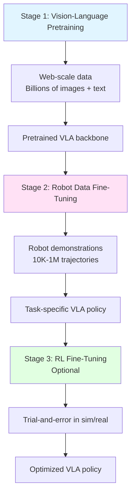
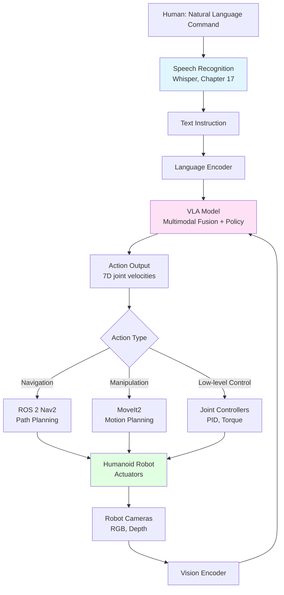

# Chapter 16: What is VLA? (Vision + Language + Action)

## Learning Objectives

By the end of this chapter, you will:

1. Understand the Vision-Language-Action (VLA) paradigm and its significance for humanoid robotics
2. Learn how VLA models integrate perception, natural language understanding, and robot control
3. Explore the architectural components of VLA systems
4. Understand the advantages of VLA over traditional robot control approaches
5. Learn about real-world VLA applications in humanoid robotics
6. Understand how VLA models are trained and deployed
7. Explore the challenges and limitations of current VLA systems

## Prerequisites

Before starting this chapter, you should understand:

- **Physical AI fundamentals**: Perception-action loops and embodiment (Chapter 1)
- **ROS 2 communication**: Topics, services, and actions for robot control (Chapters 4-6)
- **Sensor simulation**: Understanding robot perception inputs (Chapter 10)
- **Basic machine learning concepts**: Neural networks, training, and inference
- **Natural language processing basics**: Tokenization, embeddings, and language models (helpful but not required)

Recommended background:
- Familiarity with transformer architectures (attention mechanism)
- Basic understanding of computer vision (object detection, segmentation)
- Exposure to large language models (LLMs) like GPT, Claude, or LLaMA

## Introduction: Why This Matters

Imagine asking a humanoid robot: *"Can you bring me the red mug from the kitchen counter?"* The robot must:
1. **See** the environment (Vision) - identify the kitchen, locate the counter, detect the red mug
2. **Understand** your request (Language) - parse the command, identify the object, understand spatial relationships
3. **Act** on the command (Action) - navigate to the kitchen, grasp the mug, bring it to you

Traditionally, building such a system required separate components: a computer vision model for object detection, a natural language parser for understanding commands, a motion planner for navigation, and a grasping controller for manipulation. Each component was trained independently, often leading to brittle systems that struggled with novel situations or ambiguous instructions.

**Vision-Language-Action (VLA) models** represent a paradigm shift: they are **end-to-end neural networks** that directly map sensory inputs (images, video) and natural language instructions to robot control actions. VLA models **learn the entire perception-cognition-action pipeline jointly**, enabling more robust and generalizable robot behaviors.

This chapter introduces the VLA paradigm, its architecture, training approaches, and how it's transforming humanoid robotics from scripted behaviors to intelligent, language-guided agents.

### The Promise of VLA for Humanoid Robots

VLA models enable humanoid robots to:
- **Understand natural language commands**: No need for rigid command templates or programming
- **Generalize to novel objects and scenarios**: Learn from diverse data, not just task-specific datasets
- **Handle ambiguity and context**: Leverage language understanding to clarify instructions
- **Learn from multimodal data**: Combine vision, language, and action data from the internet and real-world demonstrations
- **Adapt quickly**: Fine-tune on new tasks with minimal additional data

```mermaid
graph LR
    A[Human Instruction<br/>"Bring me the red mug"] --> B[Vision Encoder]
    C[Camera Image<br/>Kitchen Scene] --> B
    B --> D[VLA Model<br/>Transformer]
    D --> E[Action Decoder]
    E --> F[Robot Actions<br/>Navigate, Grasp, Deliver]

    style B fill:#e1f5ff
    style D fill:#ffe1f5
    style E fill:#e1ffe1
```

## What is VLA? Architecture and Components

A Vision-Language-Action model is a **multimodal transformer** that takes visual observations and language instructions as inputs and outputs robot control actions (e.g., joint velocities, gripper commands, navigation goals).

### Core Components

**1. Vision Encoder**
- Processes image or video frames from robot cameras
- Extracts visual features (objects, spatial relationships, affordances)
- Often uses pretrained vision models (CLIP, ResNet, Vision Transformer)
- Output: Visual token embeddings representing the scene

**2. Language Encoder**
- Processes natural language instructions or descriptions
- Tokenizes text and embeds it into a high-dimensional space
- Often uses pretrained language models (BERT, T5, GPT)
- Output: Language token embeddings representing the instruction

**3. Multimodal Fusion**
- Combines vision and language embeddings
- Uses cross-attention mechanisms to align language concepts with visual entities
- Example: "red mug" (language) → highlight red cylindrical object (vision)
- Enables grounding of language in visual perception

**4. Policy Network (Action Decoder)**
- Maps fused embeddings to robot actions
- Outputs low-level control (joint velocities) or high-level plans (waypoints)
- Trained to predict actions that accomplish the language-specified goal
- May use autoregressive decoding for multi-step action sequences

```mermaid
graph TD
    A[RGB Image 224x224x3] --> B[Vision Encoder<br/>ViT or CNN]
    C[Text Instruction<br/>"Pick up the red block"] --> D[Language Encoder<br/>BERT or T5]

    B --> E[Visual Tokens<br/>196 x 768]
    D --> F[Language Tokens<br/>20 x 768]

    E --> G[Cross-Attention<br/>Multimodal Fusion]
    F --> G

    G --> H[Transformer Decoder<br/>Policy Network]
    H --> I[Action Tokens<br/>7D joint velocities]
    I --> J[Robot Executes Action]

    style B fill:#e1f5ff
    style D fill:#ffe1f5
    style G fill:#fff5e1
    style H fill:#e1ffe1
```

### VLA Model Architecture Variants

Different VLA models use different architectural choices:

**RT-1 (Robotics Transformer 1)**:
- Vision: EfficientNet-B3 for image encoding
- Language: Universal Sentence Encoder for text
- Policy: Transformer decoder with FiLM (Feature-wise Linear Modulation) for conditioning
- Output: Discretized 7D actions (arm movement + gripper)

**RT-2 (Robotics Transformer 2)**:
- Vision: Vision Transformer (ViT)
- Language: PaLM-E or Gemini language model
- Policy: Leverages web-scale vision-language pretraining
- Output: Tokenized actions that can be decoded to continuous controls

**OpenVLA**:
- Open-source VLA model based on LLaMA architecture
- Vision: CLIP encoder
- Language: LLaMA-2 7B as the base model
- Policy: Fine-tuned on robot demonstration datasets
- Output: Continuous 7D actions

**Key architectural insight**: VLA models treat actions as **tokens** in the same way language models treat words. This enables joint training on language and action data, and allows the model to "think" about actions using the same reasoning mechanisms it uses for language.

## How VLA Models Learn

VLA models are trained in multiple stages, leveraging both large-scale pretraining and task-specific fine-tuning.

### Stage 1: Vision-Language Pretraining

**Goal**: Learn general visual and language understanding from internet-scale data

**Data sources**:
- Image-caption pairs (e.g., LAION-5B, Conceptual Captions)
- Video-text pairs (e.g., YouTube videos with subtitles)
- Web pages with images and text

**Training objective**: Contrastive learning (e.g., CLIP) or masked language modeling (e.g., BERT)
- Vision encoder learns to represent objects, scenes, spatial relationships
- Language encoder learns semantic meaning, grammar, reasoning

**Why this matters**: Pretrained models already understand concepts like "red," "mug," "pick up," and "left side" before seeing any robot data. This **zero-shot transfer** enables faster learning on robot tasks.

### Stage 2: Robot Data Fine-Tuning

**Goal**: Learn to map vision-language understanding to robot actions

**Data sources**:
- Teleoperated demonstrations (human controls robot while cameras record)
- Scripted policies (traditional robot controllers generate demonstrations)
- Sim-to-real transfer (train in simulation, fine-tune on real robot)

**Data format**:
```
Episode 1:
  - Image frame t=0: [RGB array 224x224x3]
  - Instruction: "Pick up the blue cube"
  - Action t=0: [x, y, z, roll, pitch, yaw, gripper] = [0.1, 0.0, 0.0, 0.0, 0.0, 0.0, 0.0]
  - Image frame t=1: [RGB array 224x224x3]
  - Action t=1: [0.1, 0.0, 0.0, 0.0, 0.0, 0.0, 0.0]
  ... (50 timesteps until task completion)
```

**Training objective**: Behavior cloning (supervised learning)
- Input: (Image, Instruction)
- Output: Action distribution
- Loss: Mean squared error (MSE) for continuous actions, cross-entropy for discretized actions

**Data efficiency challenge**: Robot data is expensive (requires real hardware, safety, human operators). VLA models need **10,000 to 1,000,000** demonstrations for robust performance, compared to billions of text tokens for LLMs.

### Stage 3: Reinforcement Learning (Optional)

**Goal**: Improve policy beyond demonstrations through trial-and-error

**Approach**:
- Deploy VLA policy in simulation or real world
- Collect rollouts and compute rewards (task success/failure)
- Update policy to maximize expected reward

**Challenges**:
- Sample inefficiency: RL requires many more trials than behavior cloning
- Sim-to-real gap: Policies trained in simulation may not transfer to real robots
- Safety: Robot must explore safely without damaging itself or environment

**Hybrid approach**: Many VLA systems use behavior cloning as initialization, then fine-tune with RL for specific high-value tasks (e.g., grasping challenging objects).



## VLA vs. Traditional Robot Control

How does VLA compare to traditional approaches?

| Aspect | Traditional Robot Control | VLA Models |
|--------|---------------------------|------------|
| **Programming** | Explicit code for each task (if-then rules) | Learned from demonstrations |
| **Perception** | Separate object detection, pose estimation | End-to-end vision processing |
| **Language** | Fixed command templates (e.g., "PICK OBJECT_1") | Natural language understanding |
| **Generalization** | Task-specific; poor on novel objects | Better generalization via pretraining |
| **Data requirements** | Hand-crafted rules or 100s of demos per task | 10,000s demos shared across tasks |
| **Explainability** | High (you wrote the code) | Low (black-box neural network) |
| **Robustness** | Brittle to edge cases | More robust to variations |
| **Computational cost** | Low (classical algorithms) | High (transformer inference) |

**When to use VLA**:
- Tasks requiring natural language interaction (human-robot collaboration)
- Environments with high object diversity (home, warehouse)
- Scenarios requiring generalization to novel objects
- When you have access to large-scale robot demonstration datasets

**When to use traditional control**:
- Safety-critical tasks (VLA not yet provably safe)
- Tasks with hard real-time constraints (&lt;10ms control loop)
- Environments where interpretability is required (medical, aerospace)
- When you have limited data but strong domain knowledge

## Real-World VLA Applications

VLA models are being deployed in various robotics domains:

### 1. Robotic Manipulation (Google DeepMind RT-1, RT-2)
- **Task**: Pick and place objects in office and home environments
- **Language commands**: "Put the apple in the bowl," "Move the blue block to the left"
- **Performance**: 97% success on 700+ tasks (RT-2 with web-scale pretraining)
- **Key insight**: Web-scale vision-language pretraining enables zero-shot generalization to novel objects

### 2. Mobile Manipulation (Google PaLM-SayCan)
- **Task**: Long-horizon tasks requiring navigation + manipulation
- **Language commands**: "I spilled my drink, can you help?" → Plan: [Navigate to closet, pick up sponge, navigate to spill, wipe]
- **Architecture**: LLM (PaLM) for task planning + VLA policy for low-level control
- **Key insight**: Combining LLMs (reasoning) with VLA (embodied skills) enables complex task execution

### 3. Humanoid Whole-Body Control (1X Technologies)
- **Task**: Full-body control for humanoid robots (standing, walking, manipulation)
- **Language commands**: "Walk to the table and pick up the wrench"
- **Challenges**: High-dimensional action space (30+ DOF), balance constraints
- **Key insight**: VLA models can learn hierarchical policies (high-level walking goals + low-level balance)

### 4. Surgical Robotics (Verb Surgical, Intuitive Surgical)
- **Task**: Assist surgeons with instrument control and tissue manipulation
- **Language commands**: "Retract the tissue," "Increase magnification"
- **Constraints**: Safety, precision (sub-millimeter), latency (&lt;50ms)
- **Key insight**: VLA models with uncertainty quantification (Bayesian neural networks) for safe operation

## Challenges and Limitations

VLA models are promising but face significant challenges:

### 1. Data Scarcity
- **Problem**: Robot data is expensive to collect (requires hardware, human operators, safety oversight)
- **Scale**: VLA models need 100,000s of demonstrations vs. billions of text tokens for LLMs
- **Solutions**: Sim-to-real transfer, data augmentation, leveraging web data for vision-language pretraining

### 2. Sim-to-Real Gap
- **Problem**: Policies trained in simulation may not transfer to real robots
- **Causes**: Physics inaccuracies, sensor noise, visual domain shift (simulated vs. real images)
- **Solutions**: Domain randomization (Chapter 14), photorealistic rendering (Isaac Sim), real-world fine-tuning

### 3. Safety and Robustness
- **Problem**: VLA models can produce unsafe actions (collisions, hardware damage, harming humans)
- **Causes**: Out-of-distribution inputs, adversarial perturbations, rare failure modes
- **Solutions**: Safety shields (separate module that overrides unsafe actions), uncertainty quantification, formal verification

### 4. Interpretability
- **Problem**: VLA models are black boxes - hard to debug why a failure occurred
- **Example**: Robot drops object → Is it a perception failure (didn't see object slipping) or policy failure (wrong grasp)?
- **Solutions**: Attention visualization, saliency maps, intermediate reasoning tokens

### 5. Computational Cost
- **Problem**: Transformer inference is slow (10-100ms per action on GPU)
- **Constraint**: Real-time control requires &lt;10ms loop for dynamic tasks (balancing, catching)
- **Solutions**: Model distillation (smaller models), quantization, specialized hardware (TPUs)

### 6. Long-Horizon Reasoning
- **Problem**: VLA models struggle with multi-step tasks requiring planning
- **Example**: "Clean the kitchen" → Requires subgoal decomposition (pick up dishes, wipe counter, etc.)
- **Solutions**: Hierarchical policies (LLM planner + VLA executor, as in PaLM-SayCan), reinforcement learning with reward shaping

## Integration: VLA in the Humanoid Robot Stack

How do VLA models fit into the full humanoid robot architecture?



**Integration points**:
1. **Speech input** (Chapter 17): Whisper converts voice commands to text for VLA model
2. **Vision preprocessing**: ROS 2 image topics provide camera feeds to VLA encoder
3. **Action execution**: VLA outputs are sent to ROS 2 controllers (MoveIt2 for arms, Nav2 for navigation)
4. **Feedback loop**: Robot state and camera observations update VLA inputs at 10-30 Hz

## Questions and Answers

**Q1: Can VLA models work without language instructions?**

Yes! VLA models can operate in two modes:
- **Language-conditioned**: Takes both vision and language inputs (e.g., "pick up the red mug")
- **Vision-only**: Takes only vision inputs and performs a learned default behavior (e.g., grasp the most salient object)

The language component provides **task specification** (what to do), while vision provides **grounding** (where things are). Without language, the model must infer intent from visual context alone.

**Q2: How do VLA models handle ambiguous instructions?**

VLA models leverage language understanding to disambiguate instructions:
- **Contextual reasoning**: "Bring me that" → Model uses visual saliency and spatial context to infer "that" refers to the nearest object the human is pointing at
- **Commonsense knowledge**: "Put the fruit in the fridge" → Model knows apples and oranges are fruits (from pretraining)
- **Clarification (future work)**: VLA models could be extended to ask questions ("Which cup do you mean - the blue one or the red one?")

**Q3: Are VLA models better than separate vision + language + control modules?**

It depends:
- **Advantages of end-to-end VLA**: Avoids cascading errors (e.g., object detection failure doesn't break the pipeline), learns cross-modal associations (e.g., "red" in language grounds to red pixels in vision)
- **Advantages of modular systems**: Easier to debug (you can test each module independently), can swap components (upgrade object detector without retraining everything), more interpretable

Current best practice: **Hybrid approach**. Use pretrained vision and language models as encoders (modularity), but fine-tune end-to-end on robot data (joint optimization).

**Q4: Can VLA models generalize to completely novel objects they've never seen?**

Partially. VLA models exhibit **zero-shot generalization** when:
- The object shares visual or semantic features with training data (e.g., model trained on mugs generalizes to a novel mug design)
- The instruction references object properties the model understands (e.g., "pick up the soft object" → model learned "soft" from web data)

However, VLA models **struggle with truly novel objects** that violate training distribution:
- Example: Trained on rigid objects, fails on deformable objects (cloth, rope)
- Example: Trained in indoor environments, fails outdoors (different lighting, backgrounds)

Solution: **Continual learning** - periodically update VLA model with new demonstration data.

**Q5: How do VLA models handle multi-step tasks?**

VLA models have limited long-horizon reasoning. Two approaches:
1. **Temporal extension**: VLA model outputs action sequences (next 10 actions) instead of single actions. Transformer decoder autoregressively predicts future actions.
2. **Hierarchical composition**: LLM generates high-level plan (sequence of subgoals), VLA model executes each subgoal. Example (Chapter 17): LLM says ["navigate_to_kitchen", "grasp_mug", "pour_water"], VLA executes each skill.

Most effective VLA systems use approach #2 (LLM planner + VLA executor).

## Connections to Other Modules

- **Chapter 1 (Physical AI)**: VLA models embody the perception-cognition-action loop in a single neural network
- **Chapter 3 (Embodied Intelligence)**: VLA models learn grounded representations by experiencing the world through robot sensors and actuators
- **Chapter 5 (ROS 2 Communication)**: VLA models subscribe to ROS 2 image topics and publish action commands
- **Chapter 10 (Sensor Simulation)**: VLA models are often pretrained in simulation before real-world deployment
- **Chapter 14 (Domain Randomization)**: Sim-to-real transfer techniques improve VLA generalization to real environments
- **Chapter 17 (Whisper)**: Speech recognition converts voice commands to text instructions for VLA models
- **Chapter 18 (LLM Planning)**: LLMs decompose complex tasks into subgoals executed by VLA policies

## Summary

Vision-Language-Action (VLA) models represent a paradigm shift in robot control: instead of programming explicit rules or training separate perception, language, and control modules, VLA models learn **end-to-end mappings from sensory inputs and natural language instructions to robot actions**.

**Key takeaways**:
1. **Architecture**: VLA models use multimodal transformers that fuse vision and language embeddings, then decode them into robot actions
2. **Training**: VLA models leverage vision-language pretraining on web-scale data, then fine-tune on robot demonstrations
3. **Advantages**: Natural language interaction, generalization to novel objects, shared learning across tasks
4. **Challenges**: Data scarcity, sim-to-real gap, safety, interpretability, computational cost
5. **Applications**: Robotic manipulation, mobile manipulation, humanoid whole-body control, surgical robotics
6. **Integration**: VLA models fit into the ROS 2 stack as high-level policies that command lower-level controllers

As VLA models continue to scale (larger models, more data, better architectures), they promise to make humanoid robots more capable, flexible, and accessible to non-expert users through natural language interaction.

The next chapters explore how to integrate VLA models with speech recognition (Chapter 17), task planning with LLMs (Chapter 18), and build a complete autonomous humanoid system (Chapter 19).

## References

1. Brohan, A., Brown, N., Carbajal, J., et al. (2023). RT-1: Robotics Transformer for Real-World Control at Scale. *Robotics: Science and Systems (RSS)*.

2. Brohan, A., Brown, N., Carbajal, J., et al. (2023). RT-2: Vision-Language-Action Models Transfer Web Knowledge to Robotic Control. *Conference on Robot Learning (CoRL)*.

3. Ahn, M., Brohan, A., Brown, N., et al. (2022). Do As I Can, Not As I Say: Grounding Language in Robotic Affordances. *Conference on Robot Learning (CoRL)* (PaLM-SayCan).

4. Radosavovic, I., Xiao, T., James, S., et al. (2023). Real-World Robot Learning with Masked Visual Pre-training. *Conference on Robot Learning (CoRL)*.

5. Kim, G., Kim, T., Moon, J., et al. (2024). OpenVLA: An Open-Source Vision-Language-Action Model. *arXiv preprint arXiv:2406.09246*.

6. Padalkar, A., Pooley, A., Jain, A., et al. (2023). Open X-Embodiment: Robotic Learning Datasets and RT-X Models. *arXiv preprint arXiv:2310.08864*.

7. Driess, D., Xia, F., Sajjadi, M. S., et al. (2023). PaLM-E: An Embodied Multimodal Language Model. *International Conference on Machine Learning (ICML)*.

8. Shah, D., Osiński, B., Levine, S., et al. (2023). LM-Nav: Robotic Navigation with Large Pre-Trained Models of Language, Vision, and Action. *Conference on Robot Learning (CoRL)*.

9. Shridhar, M., Manuelli, L., & Fox, D. (2022). CLIPort: What and Where Pathways for Robotic Manipulation. *Conference on Robot Learning (CoRL)*.

10. Jang, E., Irpan, A., Khansari, M., et al. (2022). BC-Z: Zero-Shot Task Generalization with Robotic Imitation Learning. *Conference on Robot Learning (CoRL)*.
