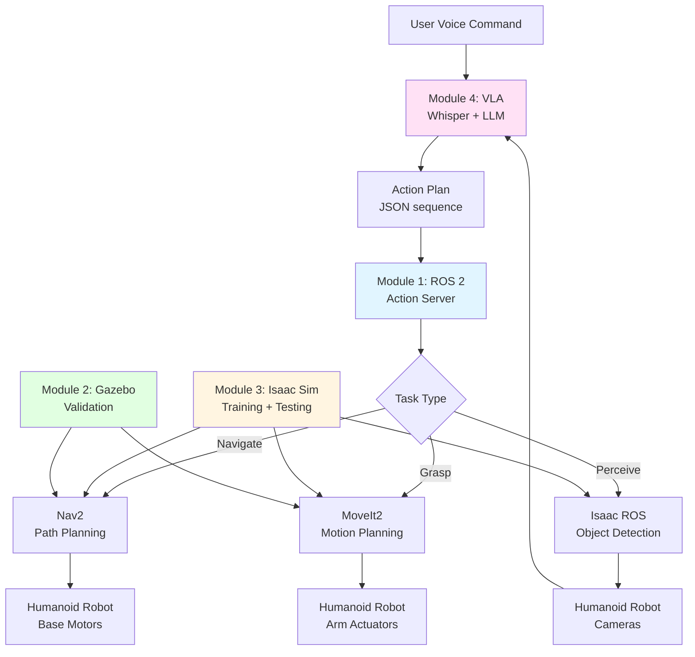
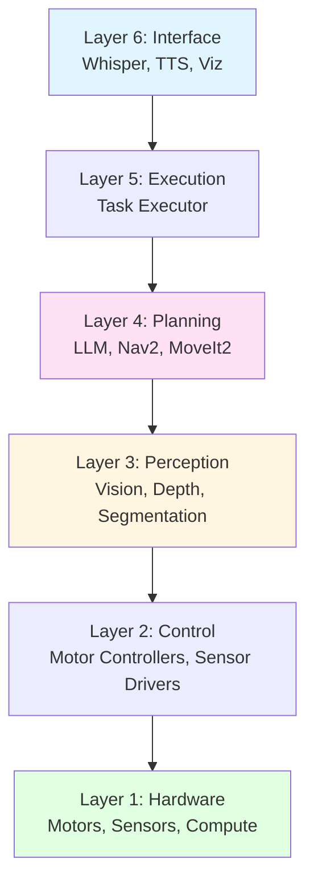
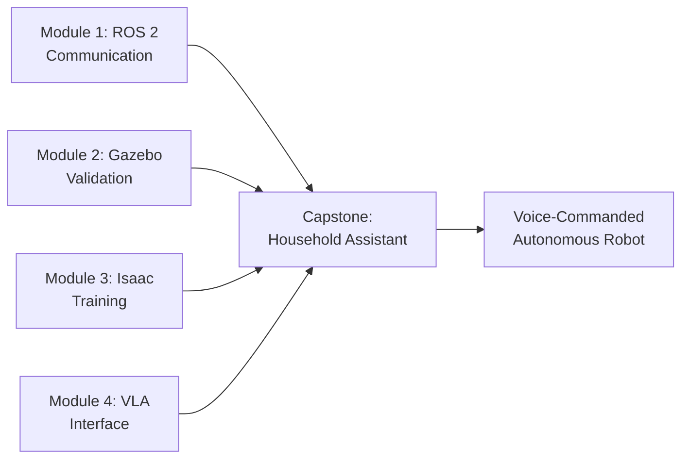

# Chapter 19: Capstone Implementation - The Autonomous Humanoid

## Learning Objectives

By the end of this chapter, you will:

1. Understand how to integrate all four modules (ROS 2, Digital Twin, Isaac, VLA) into a unified system
2. Learn the architecture of a complete autonomous humanoid robot
3. Explore a real-world implementation: voice-commanded household assistant
4. Understand system integration patterns (launch files, parameter passing, error handling)
5. Learn deployment strategies (simulation-first, sim-to-real transfer, production)
6. Explore monitoring, debugging, and maintenance of autonomous humanoid systems
7. Understand the challenges and future directions for humanoid robotics

## Prerequisites

Before starting this chapter, you should understand:

- **Module 1 (ROS 2)**: Topics, services, actions, nodes, URDF (Chapters 4-7)
- **Module 2 (Digital Twin)**: Gazebo physics, sensor simulation, Unity visualization (Chapters 8-11)
- **Module 3 (Isaac)**: Isaac Sim, synthetic data, domain randomization (Chapters 12-15)
- **Module 4 (VLA)**: Vision-language-action models, Whisper ASR, LLM planning (Chapters 16-18)

Recommended skills:
- Python and C++ programming
- ROS 2 launch files and parameter management
- Docker containerization (helpful for deployment)
- System integration and debugging

## Introduction: Why This Matters

Throughout this book, you've learned the components of humanoid robotics:
- **Module 1**: The nervous system (ROS 2 communication)
- **Module 2**: The training ground (Digital Twin simulation)
- **Module 3**: The AI brain (NVIDIA Isaac perception and planning)
- **Module 4**: The language interface (VLA for natural language control)

This chapter brings it all together. You'll build a **fully autonomous humanoid robot** that can:
1. **Listen** to voice commands ("Bring me a glass of water")
2. **Understand** natural language and plan actions (LLM task planning)
3. **See** the environment (camera-based perception)
4. **Navigate** to locations (mobile base control)
5. **Manipulate** objects (arm control and grasping)
6. **Learn** from simulation (sim-to-real transfer from Isaac Sim)
7. **Adapt** to new environments (domain randomization, continual learning)



### Capstone Scenario: Household Assistant Robot

**Task**: The humanoid robot assists with household chores via voice commands

**Sample interactions**:
1. User: *"Bring me a glass of water from the kitchen"*
   - Robot navigates to kitchen, detects glass, grasps it, fills with water, returns to user

2. User: *"Set the table for dinner"*
   - Robot plans multi-step task: get plates → get forks → get knives → arrange on table

3. User: *"Clean up the living room"*
   - Robot detects objects out of place, grasps each one, places in appropriate location

## System Architecture

A complete autonomous humanoid system consists of multiple layers:

### Layer 1: Hardware Layer

**Components**:
- **Mobile base**: Differential drive or omni-directional wheels (navigation)
- **Torso**: Rigid body connecting base to arms and head
- **Arms (2x)**: 7 DOF manipulators (shoulder, elbow, wrist joints)
- **Grippers (2x)**: Parallel jaw or anthropomorphic hands
- **Head**: Pan-tilt mechanism with cameras and microphone array
- **Sensors**:
  - RGB-D cameras (perception)
  - LiDAR (navigation and obstacle avoidance)
  - IMU (balance and orientation)
  - Force/torque sensors (grasping feedback)
- **Compute**: Onboard GPU for perception, CPU for control

**Example platforms**:
- TIAGo (PAL Robotics)
- Fetch Robot (Fetch Robotics)
- PR2 (Willow Garage, discontinued but widely used in research)
- Custom humanoid (e.g., using Dynamixel servos + Jetson Xavier)

### Layer 2: Low-Level Control Layer

**Responsibilities**: Joint-level control and sensor drivers

**ROS 2 nodes**:
```yaml
- joint_state_publisher: Publishes current joint positions/velocities
- motor_controllers: PID controllers for each joint
- sensor_drivers:
  - camera_driver: Publishes RGB-D images
  - lidar_driver: Publishes LaserScan messages
  - imu_driver: Publishes IMU data
```

**Topics**:
- `/joint_states` (sensor_msgs/JointState)
- `/camera/image_raw` (sensor_msgs/Image)
- `/scan` (sensor_msgs/LaserScan)
- `/imu` (sensor_msgs/Imu)

### Layer 3: Perception Layer

**Responsibilities**: Environment understanding

**ROS 2 nodes**:
```yaml
- object_detector: Detects objects in camera images (Isaac ROS or custom)
- depth_processor: Processes RGB-D to generate point clouds
- segmentation_node: Semantic segmentation for scene understanding
- pose_estimator: Estimates 6D poses of detected objects
```

**Topics**:
- `/detected_objects` (vision_msgs/Detection3DArray)
- `/point_cloud` (sensor_msgs/PointCloud2)
- `/semantic_map` (nav_msgs/OccupancyGrid)

### Layer 4: Planning Layer

**Responsibilities**: High-level task planning and motion planning

**ROS 2 nodes**:
```yaml
- llm_planner: Converts language commands to action sequences (Chapter 18)
- nav2_planner: Path planning for navigation (Nav2 stack)
- moveit2_planner: Arm motion planning (MoveIt2)
- grasp_planner: Computes grasp poses for objects
```

**Services and Actions**:
- `/plan_task` (custom_interfaces/PlanTask service)
- `/navigate_to_pose` (nav2_msgs/NavigateToPose action)
- `/move_arm` (moveit_msgs/MoveGroup action)

### Layer 5: Execution Layer

**Responsibilities**: Execute plans and monitor task progress

**ROS 2 node**:
```yaml
- task_executor: Orchestrates action execution
- failure_recovery: Handles execution failures and triggers replanning
```

**State machine** (using BehaviorTree or SMACH):
```
IDLE → LISTENING → PLANNING → EXECUTING → [SUCCESS | FAILURE] → IDLE
```

### Layer 6: Interface Layer

**Responsibilities**: Human-robot interaction

**ROS 2 nodes**:
```yaml
- whisper_node: Speech recognition (Chapter 17)
- tts_node: Text-to-speech feedback to user
- visualization_node: Publishes markers for RViz/Unity
```

**Topics**:
- `/speech/transcription` (std_msgs/String)
- `/robot/speech_output` (std_msgs/String)
- `/robot/status` (custom_interfaces/RobotStatus)



## Implementation: Household Assistant Robot

Let's implement the capstone scenario step-by-step.

### Step 1: System Setup and Launch Files

**Directory structure**:
```
humanoid_assistant/
├── config/
│   ├── robot_params.yaml
│   ├── nav2_params.yaml
│   └── moveit_config.yaml
├── launch/
│   ├── robot_bringup.launch.py
│   ├── perception.launch.py
│   ├── planning.launch.py
│   └── full_system.launch.py
├── src/
│   ├── task_executor_node.py
│   ├── llm_planner_node.py
│   ├── whisper_node.py
│   └── object_detector_node.py
└── package.xml
```

**Main launch file** (`full_system.launch.py`):
```python
from launch import LaunchDescription
from launch.actions import IncludeLaunchDescription
from launch_ros.actions import Node
from launch.launch_description_sources import PythonLaunchDescriptionSource

def generate_launch_description():
    return LaunchDescription([
        # Layer 2: Hardware drivers
        IncludeLaunchDescription(
            PythonLaunchDescriptionSource([robot_driver_launch])
        ),

        # Layer 3: Perception
        Node(
            package='isaac_ros_dnn_inference',
            executable='object_detector_node',
            name='object_detector',
            parameters=[{'model_path': '/models/detectnet_v2.onnx'}]
        ),

        # Layer 4: Planning
        IncludeLaunchDescription(
            PythonLaunchDescriptionSource([nav2_launch])
        ),
        IncludeLaunchDescription(
            PythonLaunchDescriptionSource([moveit2_launch])
        ),
        Node(
            package='humanoid_assistant',
            executable='llm_planner_node',
            name='llm_planner',
            parameters=[{'openai_api_key': os.environ.get('OPENAI_API_KEY')}]
        ),

        # Layer 5: Execution
        Node(
            package='humanoid_assistant',
            executable='task_executor_node',
            name='task_executor'
        ),

        # Layer 6: Interface
        Node(
            package='humanoid_assistant',
            executable='whisper_node',
            name='whisper_asr',
            parameters=[{'model_size': 'small'}]
        ),
        Node(
            package='humanoid_assistant',
            executable='tts_node',
            name='text_to_speech'
        ),

        # Visualization
        Node(
            package='rviz2',
            executable='rviz2',
            arguments=['-d', rviz_config_file]
        ),
    ])
```

### Step 2: Task Executor Node

The **Task Executor** orchestrates the entire system:

```python
#!/usr/bin/env python3
import rclpy
from rclpy.node import Node
from rclpy.action import ActionClient
from std_msgs.msg import String
from nav2_msgs.action import NavigateToPose
from moveit_msgs.action import MoveGroup
from custom_interfaces.msg import ActionPlan, ActionStep
import json

class TaskExecutorNode(Node):
    def __init__(self):
        super().__init__('task_executor')

        # Subscribers
        self.plan_sub = self.create_subscription(
            ActionPlan, '/robot/action_plan', self.plan_callback, 10
        )

        # Action clients
        self.nav_client = ActionClient(self, NavigateToPose, '/navigate_to_pose')
        self.move_arm_client = ActionClient(self, MoveGroup, '/move_arm')

        # Service clients
        self.detect_objects_client = self.create_client(
            DetectObjects, '/detect_objects'
        )

        # Publishers
        self.status_pub = self.create_publisher(String, '/robot/status', 10)

        # State
        self.current_plan = None
        self.current_action_idx = 0

        self.get_logger().info('Task Executor ready')

    def plan_callback(self, msg):
        self.get_logger().info(f'Received new plan with {len(msg.steps)} steps')
        self.current_plan = msg
        self.current_action_idx = 0

        # Start executing plan
        self.execute_next_action()

    def execute_next_action(self):
        if self.current_action_idx >= len(self.current_plan.steps):
            self.get_logger().info('Plan execution complete')
            self.publish_status('IDLE')
            return

        action_step = self.current_plan.steps[self.current_action_idx]
        self.get_logger().info(f'Executing action: {action_step.action_type}')

        # Route action to appropriate executor
        if action_step.action_type == 'navigate':
            self.execute_navigate(action_step)
        elif action_step.action_type == 'detect_objects':
            self.execute_detect(action_step)
        elif action_step.action_type == 'grasp':
            self.execute_grasp(action_step)
        elif action_step.action_type == 'release':
            self.execute_release(action_step)
        else:
            self.get_logger().error(f'Unknown action: {action_step.action_type}')
            self.on_action_failed()

    def execute_navigate(self, action_step):
        params = json.loads(action_step.parameters)
        location = params['location']

        # Look up location coordinates (from config or semantic map)
        target_pose = self.get_location_pose(location)

        # Send navigation goal
        goal_msg = NavigateToPose.Goal()
        goal_msg.pose = target_pose

        self.publish_status(f'Navigating to {location}')
        self.nav_client.wait_for_server()
        send_goal_future = self.nav_client.send_goal_async(goal_msg)
        send_goal_future.add_done_callback(self.nav_goal_response_callback)

    def nav_goal_response_callback(self, future):
        goal_handle = future.result()
        if not goal_handle.accepted:
            self.get_logger().error('Navigation goal rejected')
            self.on_action_failed()
            return

        self.get_logger().info('Navigation goal accepted')
        result_future = goal_handle.get_result_async()
        result_future.add_done_callback(self.nav_result_callback)

    def nav_result_callback(self, future):
        result = future.result().result

        if result:  # Success
            self.get_logger().info('Navigation succeeded')
            self.on_action_complete()
        else:
            self.get_logger().error('Navigation failed')
            self.on_action_failed()

    def execute_detect(self, action_step):
        params = json.loads(action_step.parameters)
        query = params['query']

        # Call object detection service
        request = DetectObjects.Request()
        request.query = query

        self.publish_status(f'Detecting: {query}')
        future = self.detect_objects_client.call_async(request)
        future.add_done_callback(self.detect_result_callback)

    def detect_result_callback(self, future):
        response = future.result()

        if len(response.detections) > 0:
            self.get_logger().info(f'Detected {len(response.detections)} objects')
            # Store detection results for next action (e.g., grasp)
            self.detected_objects = response.detections
            self.on_action_complete()
        else:
            self.get_logger().error('No objects detected')
            self.on_action_failed()

    def execute_grasp(self, action_step):
        params = json.loads(action_step.parameters)
        object_id = params['object_id']

        # Look up object pose from detections
        target_object = self.find_object_by_id(object_id)
        if not target_object:
            self.get_logger().error(f'Object {object_id} not found')
            self.on_action_failed()
            return

        # Compute grasp pose
        grasp_pose = self.compute_grasp_pose(target_object)

        # Send arm motion goal (using MoveIt2)
        goal_msg = MoveGroup.Goal()
        goal_msg.request.group_name = 'arm'
        goal_msg.request.goal_constraints = self.create_pose_constraint(grasp_pose)

        self.publish_status(f'Grasping {object_id}')
        self.move_arm_client.wait_for_server()
        send_goal_future = self.move_arm_client.send_goal_async(goal_msg)
        send_goal_future.add_done_callback(self.grasp_goal_response_callback)

    def grasp_goal_response_callback(self, future):
        goal_handle = future.result()
        if not goal_handle.accepted:
            self.get_logger().error('Grasp goal rejected')
            self.on_action_failed()
            return

        result_future = goal_handle.get_result_async()
        result_future.add_done_callback(self.grasp_result_callback)

    def grasp_result_callback(self, future):
        result = future.result().result

        if result.error_code.val == 1:  # SUCCESS
            # Close gripper
            self.close_gripper()
            self.get_logger().info('Grasp succeeded')
            self.on_action_complete()
        else:
            self.get_logger().error('Grasp failed')
            self.on_action_failed()

    def execute_release(self, action_step):
        # Open gripper
        self.open_gripper()
        self.on_action_complete()

    def on_action_complete(self):
        # Move to next action
        self.current_action_idx += 1
        self.execute_next_action()

    def on_action_failed(self):
        self.get_logger().error(f'Action {self.current_action_idx} failed, requesting replan')
        self.publish_status('REPLANNING')
        # Trigger LLM replanning (publish failure info to /execution/failure topic)
        # For now, just abort
        self.current_plan = None

    def publish_status(self, status):
        msg = String()
        msg.data = status
        self.status_pub.publish(msg)

    # Helper methods
    def get_location_pose(self, location):
        # Load from config or semantic map
        LOCATIONS = {
            'kitchen': {'x': 5.0, 'y': 2.0, 'yaw': 0.0},
            'living_room': {'x': 0.0, 'y': 0.0, 'yaw': 1.57},
            'table': {'x': 2.0, 'y': 3.0, 'yaw': 0.0},
        }
        loc = LOCATIONS.get(location, {'x': 0.0, 'y': 0.0, 'yaw': 0.0})
        # Convert to PoseStamped
        # ... (omitted for brevity)
        return pose

    def find_object_by_id(self, object_id):
        for obj in self.detected_objects:
            if obj.id == object_id:
                return obj
        return None

    def compute_grasp_pose(self, target_object):
        # Grasp planning (e.g., using GPD or simple top-down grasp)
        # ... (omitted for brevity)
        return grasp_pose

    def close_gripper(self):
        # Send gripper close command
        pass

    def open_gripper(self):
        # Send gripper open command
        pass

def main(args=None):
    rclpy.init(args=args)
    node = TaskExecutorNode()
    rclpy.spin(node)
    node.destroy_node()
    rclpy.shutdown()

if __name__ == '__main__':
    main()
```

### Step 3: End-to-End Workflow

**User interaction**:
```
User: "Bring me a glass of water from the kitchen"
  ↓
[Whisper Node] → Transcribes speech to text
  ↓
[LLM Planner Node] → Generates action plan:
  [
    {"action": "navigate", "params": {"location": "kitchen"}},
    {"action": "detect_objects", "params": {"query": "glass"}},
    {"action": "grasp", "params": {"object_id": "glass_0"}},
    {"action": "navigate", "params": {"location": "sink"}},
    {"action": "activate_faucet", "params": {"duration": 3}},
    {"action": "navigate", "params": {"location": "user"}},
    {"action": "handover", "params": {}}
  ]
  ↓
[Task Executor Node] → Executes each action sequentially
  ↓
[Robot] → Navigates, grasps, fills glass, delivers to user
  ↓
[TTS Node] → "Here is your water"
```

## Simulation-First Development

Before deploying to real hardware, develop and test in simulation:

### Phase 1: Gazebo Validation

**Purpose**: Validate basic motion planning and control

```bash
# Launch Gazebo simulation
ros2 launch humanoid_assistant gazebo_sim.launch.py

# Test navigation
ros2 action send_goal /navigate_to_pose nav2_msgs/action/NavigateToPose \
  "{pose: {header: {frame_id: 'map'}, pose: {position: {x: 5.0, y: 2.0}}}}"

# Test arm motion
ros2 action send_goal /move_arm moveit_msgs/action/MoveGroup \
  "{request: {group_name: 'arm'}}"
```

**Benefits**: Fast iteration, free, no hardware damage risk

**Limitations**: Physics gaps (friction, contact dynamics), sensor noise not realistic

### Phase 2: Isaac Sim Training

**Purpose**: Train perception models and VLA policies

```python
# Train object detector on synthetic data
from omni.isaac.syntheticdata import SyntheticDataHelper

sd_helper = SyntheticDataHelper()
sd_helper.initialize(backend="pytorch")

# Capture 10,000 annotated images
for i in range(10000):
    sd_helper.get_groundtruth(['rgb', 'bounding_box_2d_tight'])
    # Save to training dataset

# Train detector
train_object_detector(dataset_path='./synthetic_data', epochs=50)
```

**Domain randomization** (Chapter 14):
```python
# Randomize lighting, object textures, camera pose
randomize_lighting(min_intensity=50, max_intensity=150)
randomize_textures(object_list=["glass", "mug", "plate"])
randomize_camera_pose(position_range=0.5)  # ±0.5m
```

**Benefits**: Photorealistic rendering, domain randomization, GPU-accelerated parallel training

### Phase 3: Sim-to-Real Transfer

**Approach 1: Direct transfer**
- Train policy in simulation → Deploy to real robot
- Works well if domain randomization is effective

**Approach 2: Fine-tuning**
- Train in simulation → Collect 100-1000 real-world samples → Fine-tune
- More robust, requires real hardware

**Approach 3: Hybrid (SayCan approach)**
- Use LLM for high-level planning (doesn't require sim-to-real transfer)
- Use pre-trained VLA for low-level execution (trained on large-scale robot datasets)

## Monitoring and Debugging

### RViz Visualization

```bash
ros2 launch humanoid_assistant rviz_monitor.launch.py
```

**Visualizations**:
- Robot model (URDF) with joint states
- Camera feed and detected bounding boxes
- Planned path (Nav2)
- Planned arm trajectory (MoveIt2)
- TF tree (coordinate frame transformations)

### ROS 2 Diagnostics

```python
from diagnostic_msgs.msg import DiagnosticArray, DiagnosticStatus

class DiagnosticsPublisher(Node):
    def __init__(self):
        super().__init__('diagnostics_publisher')
        self.diag_pub = self.create_publisher(DiagnosticArray, '/diagnostics', 10)
        self.timer = self.create_timer(1.0, self.publish_diagnostics)

    def publish_diagnostics(self):
        diag_array = DiagnosticArray()
        diag_array.header.stamp = self.get_clock().now().to_msg()

        # Check battery level
        battery_status = DiagnosticStatus()
        battery_status.name = "Battery"
        battery_level = self.get_battery_level()
        if battery_level < 20:
            battery_status.level = DiagnosticStatus.WARN
            battery_status.message = f"Low battery: {battery_level}%"
        else:
            battery_status.level = DiagnosticStatus.OK
            battery_status.message = f"Battery: {battery_level}%"
        diag_array.status.append(battery_status)

        # Check camera connection
        camera_status = DiagnosticStatus()
        camera_status.name = "Camera"
        if self.is_camera_connected():
            camera_status.level = DiagnosticStatus.OK
            camera_status.message = "Camera online"
        else:
            camera_status.level = DiagnosticStatus.ERROR
            camera_status.message = "Camera offline"
        diag_array.status.append(camera_status)

        self.diag_pub.publish(diag_array)
```

### Logging and Recording

```bash
# Record all topics to ROS bag (for debugging later)
ros2 bag record -a

# Playback bag file
ros2 bag play humanoid_session_2024-01-15.bag

# Analyze failure cases
ros2 bag info humanoid_session_2024-01-15.bag
```

## Deployment Strategies

### Option 1: Onboard Compute

**Hardware**: NVIDIA Jetson AGX Orin (64GB, 275 TOPS)

**Pros**: Low latency, no network dependency, privacy
**Cons**: Limited compute, power consumption, heat

**Deployment**:
```bash
# Build Docker image
docker build -t humanoid_assistant:v1.0 .

# Run on Jetson
docker run --runtime nvidia --network host \
  -v /dev:/dev --privileged \
  humanoid_assistant:v1.0
```

### Option 2: Offboard Compute

**Architecture**: Robot runs lightweight nodes, heavy processing (LLM, perception) on remote GPU server

**Pros**: More compute power, easier to update models
**Cons**: Network latency, requires WiFi/5G

**Setup**:
```yaml
# Robot (Jetson)
- motor_controllers
- sensor_drivers
- task_executor

# Server (Workstation with RTX 4090)
- llm_planner
- whisper_node
- object_detector
- isaac_ros_perception
```

**Communication**: ROS 2 over DDS (UDP multicast or TCP)

### Option 3: Hybrid

**Approach**: Critical real-time components onboard, non-critical offboard

```yaml
# Onboard (low latency required)
- motor_controllers (<10ms)
- obstacle_avoidance (<100ms)

# Offboard (latency-tolerant)
- llm_planner (1-3s acceptable)
- object_detector (100-500ms acceptable)
- whisper_node (500ms acceptable)
```

## Challenges and Future Directions

### Current Limitations

**1. Generalization**
- VLA models struggle with objects significantly different from training data
- Solution: Continual learning, web-scale pretraining (RT-2, OpenVLA)

**2. Long-Horizon Tasks**
- Current models handle ~10-20 step tasks; struggle beyond that
- Solution: Hierarchical planning (LLM + VLA), memory mechanisms

**3. Safety**
- LLMs occasionally generate unsafe plans
- Solution: Formal verification, safety shields, human-in-the-loop for critical tasks

**4. Robustness**
- Systems fail when encountering unexpected scenarios
- Solution: Better failure detection, replanning strategies, diverse training data

**5. Computational Cost**
- Running Whisper + GPT-4 + VLA requires expensive hardware
- Solution: Model distillation, quantization, efficient architectures

### Future Research Directions

**1. Foundation Models for Robotics**
- Train single large model on diverse robot data (manipulation, navigation, locomotion)
- Example: RT-X (Open X-Embodiment), Google's cross-robot learning initiative

**2. Whole-Body Humanoid Control**
- Current work focuses on mobile manipulation; full humanoid locomotion harder
- Future: VLA models for bipedal walking, whole-body coordination

**3. Human-Robot Collaboration**
- Robots that work alongside humans, understanding social cues and intentions
- Future: Multimodal models that process gaze, gestures, tone of voice

**4. Continual Learning**
- Robots that learn from every interaction, improving over time
- Future: Online learning algorithms that update models during deployment

**5. Sim-to-Real at Scale**
- Better simulation fidelity (soft bodies, liquids, deformable objects)
- Future: Photorealistic simulators (e.g., NVIDIA Isaac Sim 3.0) with learned physics

## Integration: Tying All Modules Together

This capstone demonstrates how all four modules interconnect:

| Module | Contribution to Capstone |
|--------|--------------------------|
| **Module 1: ROS 2** | Communication backbone (topics, services, actions) |
| **Module 2: Gazebo** | Initial validation and controller tuning |
| **Module 3: Isaac Sim** | Perception model training, domain randomization |
| **Module 4: VLA** | Natural language interface, LLM planning, VLA execution |



## Questions and Answers

**Q1: How long does it take to build a system like this?**

**Timeline** (single developer with existing robot hardware):
- Week 1-2: Set up ROS 2, sensor drivers, basic teleoperation
- Week 3-4: Integrate Gazebo, tune controllers
- Week 5-8: Train perception models in Isaac Sim, domain randomization
- Week 9-10: Integrate Whisper and LLM planner
- Week 11-12: System integration, debugging, testing
- **Total: ~3 months for MVP**

With a team and re-using existing components (Nav2, MoveIt2, Isaac ROS), can be reduced to 4-6 weeks.

**Q2: What if the robot encounters an unexpected failure?**

**Failure recovery strategies**:
1. **Retry**: Attempt action again (e.g., if grasp fails, try different grasp pose)
2. **Replan**: Ask LLM to generate new plan given failure reason
3. **Escalate**: Ask human for help (via TTS: "I can't find the glass. Can you help?")
4. **Safe halt**: If failure is critical, stop and wait for human intervention

**Q3: How do I deploy updates without taking the robot offline?**

**Rolling updates**:
- Use Docker containers for each component
- Update containers one at a time
- ROS 2 supports dynamic node discovery, so new nodes can join seamlessly

**Canary deployment**:
- Deploy updated model to 10% of robots first
- Monitor performance metrics
- If successful, roll out to remaining 90%

**Q4: Can I use this architecture for non-humanoid robots?**

Yes! The architecture is modular:
- **For mobile manipulators** (no legs): Remove bipedal locomotion, keep mobile base + arms
- **For drones**: Replace Nav2 with 3D path planner, remove manipulation
- **For industrial arms**: Remove navigation, focus on manipulation pipeline

**Q5: How do I handle multi-user scenarios?**

**Strategies**:
- **Speaker identification**: Use speaker diarization (who is speaking?)
- **Priority system**: Designated users have higher priority
- **Turn-taking**: Robot asks "Let me finish this task first, then I'll help you"
- **Multi-tasking** (advanced): Interleave tasks from different users

## Connections to Other Modules

This capstone integrates all 18 previous chapters:
- **Chapters 1-3 (Foundations)**: Conceptual framework for Physical AI and embodiment
- **Chapters 4-7 (ROS 2)**: Communication backbone and robot modeling
- **Chapters 8-11 (Digital Twin)**: Simulation for testing and visualization
- **Chapters 12-15 (Isaac)**: Perception training and sim-to-real transfer
- **Chapters 16-18 (VLA)**: Language-grounded control and LLM planning

## Summary

This capstone chapter demonstrated how to integrate all modules into a **fully autonomous humanoid robot** capable of voice-commanded household assistance.

**Key takeaways**:
1. **Layered architecture**: Hardware → Control → Perception → Planning → Execution → Interface
2. **Simulation-first development**: Gazebo for validation → Isaac Sim for training → Real hardware deployment
3. **System integration**: ROS 2 launch files, parameter management, inter-node communication
4. **Monitoring**: RViz visualization, diagnostics, logging, ROS bags for debugging
5. **Deployment**: Onboard vs. offboard compute, Docker containerization, rolling updates
6. **Challenges**: Generalization, long-horizon tasks, safety, robustness, computational cost
7. **Future**: Foundation models, whole-body control, human-robot collaboration, continual learning

You now have the knowledge to build a complete autonomous humanoid robot system. The journey from conceptual understanding (Chapter 1) to a working household assistant (Chapter 19) demonstrates the power of combining **hardware**, **simulation**, **AI models**, and **integration frameworks** (ROS 2).

The future of humanoid robotics is **language-driven embodied intelligence**: robots that understand natural language, see the world, plan actions, and learn from experience. This book equipped you with the tools to build that future.

## References

1. Ahn, M., Brohan, A., Brown, N., et al. (2022). Do As I Can, Not As I Say: Grounding Language in Robotic Affordances. *Conference on Robot Learning (CoRL)* (SayCan - end-to-end integration).

2. Brohan, A., Brown, N., Carbajal, J., et al. (2023). RT-2: Vision-Language-Action Models Transfer Web Knowledge to Robotic Control. *Conference on Robot Learning (CoRL)*.

3. Padalkar, A., Pooley, A., Jain, A., et al. (2023). Open X-Embodiment: Robotic Learning Datasets and RT-X Models. *arXiv preprint arXiv:2310.08864* (Cross-robot learning).

4. Macenski, S., Martín, F., White, R., & Clavero, J. G. (2020). The Marathon 2: A Navigation System. *IEEE/RSJ International Conference on Intelligent Robots and Systems (IROS)* (Nav2 for ROS 2).

5. Coleman, D., Sucan, I., Chitta, S., & Correll, N. (2014). Reducing the Barrier to Entry of Complex Robotic Software: a MoveIt! Case Study. *Journal of Software Engineering for Robotics*.

6. Driess, D., Xia, F., Sajjadi, M. S., et al. (2023). PaLM-E: An Embodied Multimodal Language Model. *International Conference on Machine Learning (ICML)*.

7. Raibert, M., Blankespoor, K., Nelson, G., & Playter, R. (2008). BigDog, the Rough-Terrain Quadruped Robot. *IFAC Proceedings Volumes* (Hardware platform example).

8. Quigley, M., Conley, K., Gerkey, B., et al. (2009). ROS: an open-source Robot Operating System. *ICRA Workshop on Open Source Software*.

9. Wake, N., Kanehira, A., Sasabuchi, K., et al. (2023). ChatGPT Empowered Long-Step Robot Control in Various Environments. *arXiv preprint arXiv:2304.03893* (LLM-based task execution).

10. Tobin, J., Fong, R., Ray, A., et al. (2017). Domain Randomization for Transferring Deep Neural Networks from Simulation to the Real World. *IEEE/RSJ International Conference on Intelligent Robots and Systems (IROS)*.
