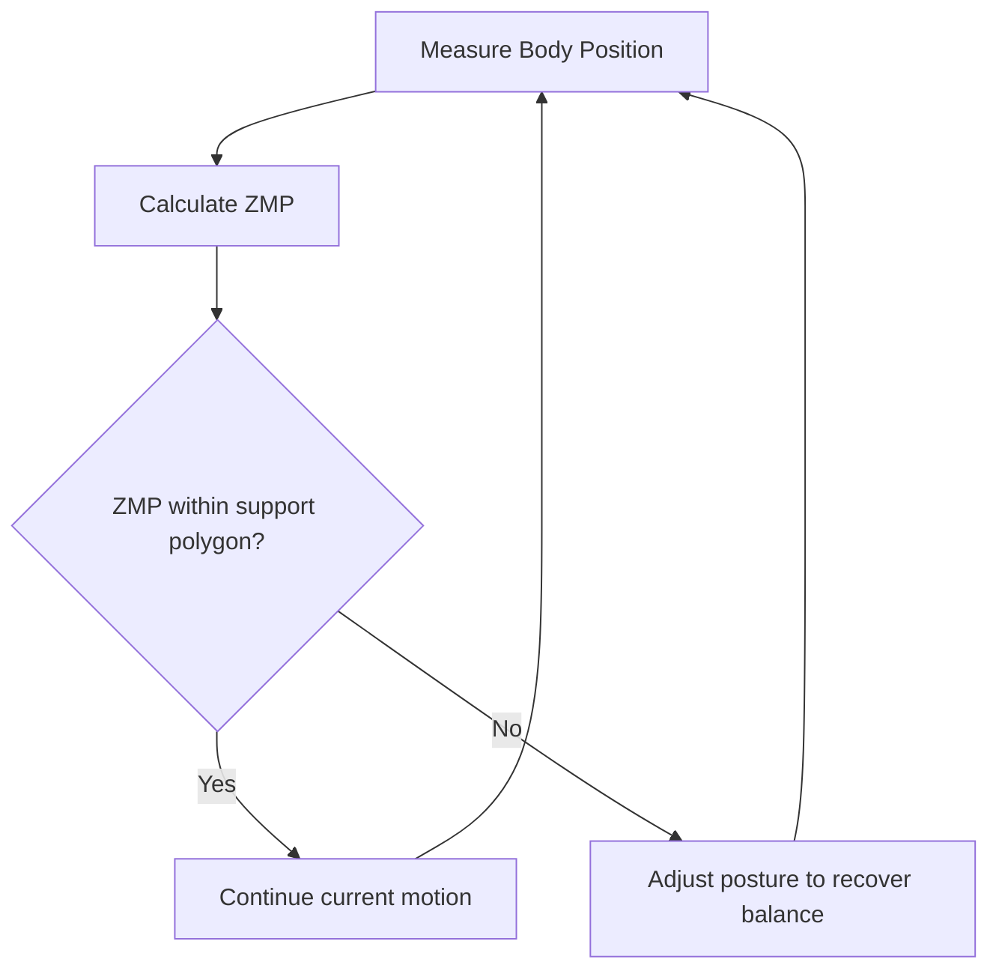
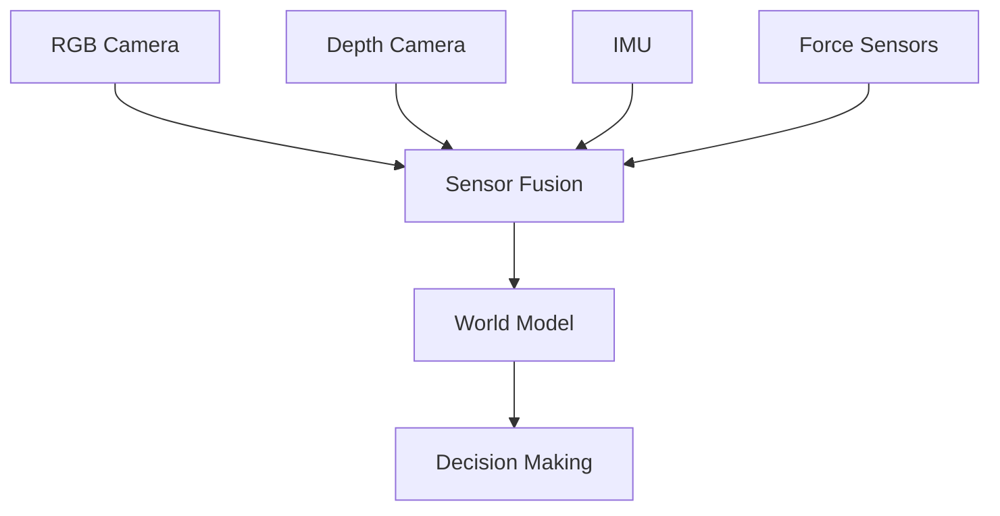

# Chapter 2: Understanding Humanoid Robots

## Learning Objectives

By the end of this chapter, you will be able to:

- Define what makes a robot "humanoid" and identify key humanoid characteristics
- Explain the advantages and disadvantages of humanoid form factors
- Describe the major subsystems of a humanoid robot (locomotion, manipulation, perception, cognition)
- Identify real-world humanoid robots and their applications
- Understand the engineering trade-offs in humanoid robot design
- Explain why humanoid robots are uniquely suited for human-centric environments

## Prerequisites

- Chapter 1: What is Physical AI? (understanding of Physical AI concepts)
- Basic awareness of robots from popular culture or news
- No technical background required

## Introduction: Why This Matters

Imagine a future where robots work alongside humans in hospitals, homes, and offices. These robots need to navigate stairs, open doors, use human tools, and interact naturally with people. What form should they take?

You might think a wheeled robot would be more efficient—and you'd be right for many tasks. But here's the challenge: our world is designed for humans. Doorknobs are at human hand-height. Stairs are sized for human legs. Tools are shaped for human hands. To operate in this human-centric world without requiring expensive modifications to buildings and infrastructure, robots need a human-like form.

This is the fundamental insight behind **humanoid robots**: by mimicking the human body's form and capabilities, robots can use existing infrastructure, tools, and spaces designed for people.

In this chapter, we'll explore what defines a humanoid robot, why engineers choose this challenging form factor, and how humanoid robots are already beginning to transform industries from manufacturing to healthcare.

## What is a Humanoid Robot?

### Defining "Humanoid"

A **humanoid robot** is a robot designed with a body structure that resembles the human form. While there's no strict definition, most humanoid robots share these characteristics:

**Core Humanoid Features:**

1. **Bipedal Locomotion**: Two legs for walking and standing
2. **Torso**: Central body structure connecting head, arms, and legs
3. **Head**: Contains primary sensors (cameras, microphones) at human eye-level
4. **Two Arms**: For manipulation and tool use
5. **Hands/Grippers**: End-effectors capable of grasping objects

**Optional Features:**
- Human-like facial features or expressions
- Fingers for dexterous manipulation
- Skin-like covering
- Voice and speech capabilities

### The Spectrum of Humanoid Design

Not all humanoid robots look identical. They exist on a spectrum from minimally humanoid to highly anthropomorphic:


**1. Minimal Humanoid** (e.g., Boston Dynamics Atlas)
- Focus: Functional capabilities (walking, manipulation)
- Appearance: Clearly mechanical, industrial design
- Use case: Research, industrial tasks, dangerous environments

**2. Functional Humanoid** (e.g., Tesla Optimus, Agility Robotics Digit)
- Focus: Practical work in human environments
- Appearance: Simplified human proportions, minimal aesthetics
- Use case: Warehouses, factories, delivery

**3. Social Humanoid** (e.g., SoftBank Pepper, Honda ASIMO)
- Focus: Human interaction and communication
- Appearance: Friendly, approachable design with expressive features
- Use case: Customer service, education, healthcare

**4. Android** (e.g., Engineered Arts Ameca)
- Focus: Human-like appearance and behavior
- Appearance: Realistic human features, skin-like surfaces
- Use case: Research, entertainment, uncanny valley studies

### Humanoid vs. Other Robot Types

Let's compare humanoid robots to other common robot forms:

| Robot Type | Mobility | Manipulation | Environment Compatibility | Example |
|-----------|----------|--------------|--------------------------|---------|
| **Humanoid** | Bipedal walking | Two arms, hands | High (human spaces) | Boston Dynamics Atlas |
| **Wheeled Robot** | Rolling | Varies | Medium (flat surfaces) | Amazon Kiva |
| **Quadruped** | Four-legged walking | Limited or none | High (rough terrain) | Boston Dynamics Spot |
| **Drone** | Flying | None typically | Low (open air only) | DJI Phantom |
| **Industrial Arm** | Fixed position | Single arm | Low (fixed workspace) | KUKA KR series |
| **Tracked Robot** | Tank-like treads | Varies | High (rough terrain) | iRobot PackBot |

**Key Insight**: Humanoid form is optimized for environments designed for humans, not for raw efficiency.

## Why Build Humanoid Robots?

Given the engineering complexity of bipedal walking and dual-arm manipulation, why do researchers and companies invest billions in humanoid robots? Let's explore the compelling reasons:

### 1. Infrastructure Compatibility

**The Problem**: Redesigning human infrastructure is expensive and slow.

**The Solution**: Humanoid robots can use existing:
- Stairs and elevators
- Doorknobs and handles
- Standard tools (hammers, screwdrivers, phones)
- Workspaces designed for human dimensions
- Vehicles designed for human passengers

**Example**: A humanoid robot can navigate a multi-story office building using existing stairs and elevators, while a wheeled robot would require expensive ramp installations or dedicated robot elevators.

**Economic Impact**: It's estimated that retrofitting a single building for non-humanoid robots costs $50,000-$500,000. Humanoid robots eliminate this cost.

### 2. Tool Reusability

Humans have created millions of tools over centuries: hammers, scissors, keyboards, steering wheels, medical instruments. Humanoid robots with human-like hands can use these tools without redesign.

**Example**: A surgical humanoid can use existing surgical instruments designed for human hands, rather than requiring expensive custom robotic tools.

### 3. Natural Human Interaction

Humans are psychologically wired to interact with human-like forms. Humanoid robots benefit from:

**Social Acceptance**:
- Easier to predict behavior (arm reaching = about to grab something)
- More comfortable for elderly and children
- Nonverbal communication through gestures and posture

**Intuitive Collaboration**:
- Can point and gesture to communicate
- Can work side-by-side at human-height workbenches
- Can respond to human body language

**Research Finding**: Studies show that 78% of elderly patients prefer humanoid robots over other forms for assistance tasks (Fong et al., 2023).

### 4. Versatility and Generalization

A humanoid robot is a **general-purpose platform**:

**Single Platform, Multiple Tasks**:
- Morning: Stock warehouse shelves
- Afternoon: Deliver packages
- Evening: Clean office spaces
- Night: Patrol and monitor security

**Contrast with specialized robots**:
- Vacuuming robot: Only vacuums
- Warehouse robot: Only moves inventory
- Security robot: Only patrols

**Economic Advantage**: One humanoid robot can replace multiple specialized robots, reducing total cost of ownership.

### 5. Learning from Human Demonstrations

Humanoid robots can learn by watching humans:

**Imitation Learning**:
1. Human demonstrates a task (e.g., folding laundry)
2. Humanoid robot's cameras record the demonstration
3. AI translates human movements to robot movements
4. Robot practices and refines the skill

**Why humanoid form helps**: Similar body structure means human movements map more directly to robot movements.

**Example**: A humanoid robot can learn to use a coffee machine by watching a human use it, while a robotic arm would need the task completely reprogrammed.

## Major Subsystems of a Humanoid Robot

Let's explore the key systems that make humanoid robots work:

### 1. Locomotion System (Legs and Balance)

**Challenge**: Bipedal walking is one of the hardest problems in robotics.

**Components**:
- **Hip joints** (3 degrees of freedom): Forward/back, side-to-side, rotation
- **Knee joints** (1 degree of freedom): Bending
- **Ankle joints** (2 degrees of freedom): Up/down, side-to-side tilt
- **Foot sensors**: Pressure sensors to detect contact with ground

**How it Works**:
```
1. Sense current pose and ground contact
2. Compute desired next pose
3. Calculate joint angles needed
4. Send commands to motors
5. Monitor for balance
6. Adjust continuously (100+ times per second)
```

**Balance Control**:
Humanoid robots use concepts like the **Zero Moment Point (ZMP)** to maintain balance:



**Real-World Performance**:
- Walking speed: 0.5-2.5 m/s (humans: 1.4 m/s average)
- Stair climbing: Yes (most modern humanoids)
- Rough terrain: Limited (active research area)

### 2. Manipulation System (Arms and Hands)

**Components**:
- **Shoulder** (3 DoF): Allows arm to reach in all directions
- **Elbow** (1 DoF): Bending motion
- **Wrist** (2-3 DoF): Rotation and tilting
- **Hand/Gripper**: 2 to 20+ degrees of freedom

**Types of Hands**:

**Simple Gripper** (2-finger, 1 DoF):
- Pros: Simple, reliable, strong
- Cons: Limited dexterity
- Use: Industrial manipulation, package handling

**Anthropomorphic Hand** (5 fingers, 15-20 DoF):
- Pros: Human-like dexterity, can use human tools
- Cons: Complex, expensive, fragile
- Use: Research, delicate manipulation

**Hybrid Design** (3 fingers, 6-9 DoF):
- Pros: Balance of dexterity and reliability
- Cons: Can't perform all human hand tasks
- Use: Most commercial humanoid robots

**Manipulation Pipeline**:
```
1. Visual perception: Identify object and its pose
2. Grasp planning: Determine where/how to grasp
3. Motion planning: Calculate collision-free path
4. Execution: Move arm and close gripper
5. Feedback: Monitor force sensors to adjust grip
```

### 3. Perception System (Sensors)

Humanoid robots perceive their environment through multiple sensor types:

**Visual Sensors**:
- **RGB Cameras** (2-4): Color vision for object recognition
- **Depth Cameras** (1-2): 3D understanding of space
- **LiDAR** (optional): Precise distance measurements

**Proprioceptive Sensors** (internal state):
- **Joint encoders**: Track exact position of each joint
- **IMU**: Measure orientation and acceleration of torso
- **Force-torque sensors**: Measure forces on joints and hands

**Tactile Sensors**:
- **Pressure sensors** in fingertips: Detect contact and grip force
- **Skin sensors** (advanced): Detect touch across body surface

**Audio Sensors**:
- **Microphone array** (2-4): Voice input and sound localization

**Sensor Fusion**:
Humanoid robots combine data from multiple sensors to build a coherent understanding of their environment:



### 4. Cognitive System (AI and Control)

**Layers of Control**:

**High-Level Planning** (AI/Machine Learning):
- Task understanding from natural language
- Object recognition and scene understanding
- Long-term planning and scheduling
- Learning from experience

**Mid-Level Control** (Motion Planning):
- Path planning for navigation
- Grasp planning for manipulation
- Collision avoidance
- Multi-step action sequencing

**Low-Level Control** (Real-Time Controllers):
- Balance control (run at 200-1000 Hz)
- Joint position/velocity control
- Force control for manipulation
- Reflex-like emergency responses

**Example Control Hierarchy**:
```
High: "Bring me the red cup from the kitchen"
  ↓
Mid: Navigate to kitchen → Locate red cup → Grasp cup → Return to user
  ↓
Low: Step with left foot → Shift weight → Lift right foot → ...
```

### 5. Power and Actuation System

**Power Sources**:
- **Battery packs** (most common): 1-4 hours of operation
- **Tethered power** (research robots): Unlimited operation, restricts mobility
- **Future**: Fuel cells, wireless charging

**Actuators** (motors that move joints):

**Electric Motors**:
- Pros: Precise control, quiet, efficient
- Cons: High-torque motors are heavy
- Use: Most humanoid robots

**Hydraulic Actuators**:
- Pros: Very high strength-to-weight ratio
- Cons: Noisy, messy (fluid leaks), complex
- Use: Boston Dynamics Atlas

**Pneumatic Actuators**:
- Pros: Compliant (soft), safe for human interaction
- Cons: Less precise, requires air supply
- Use: Some research humanoids

## Real-World Humanoid Robots

Let's survey some notable humanoid robots and their capabilities:

### Boston Dynamics Atlas (2013-present)

**Specifications**:
- Height: 1.5 m (5 ft)
- Weight: 89 kg (196 lb)
- Actuators: Hydraulic
- Power: Tethered or battery (1 hour)

**Capabilities**:
- Parkour and backflips
- Running (2.5 m/s)
- Object manipulation
- Rough terrain navigation

**Status**: Research platform, not commercially available

**Significance**: Demonstrates state-of-the-art dynamic locomotion and agility

### Tesla Optimus (2022-present)

**Specifications**:
- Height: 1.73 m (5'8")
- Weight: 73 kg (161 lb)
- Actuators: Electric (28 actuators)
- Power: Battery (2.3 kWh, ~4 hours)

**Capabilities**:
- Walking and object manipulation
- Industrial task execution
- Learning from human demonstration
- Designed for mass production

**Status**: In development, planned 2025 deployment

**Significance**: First humanoid designed for mass production ($20,000-30,000 target price)

### Agility Robotics Digit (2019-present)

**Specifications**:
- Height: 1.6 m (5'3")
- Weight: 65 kg (143 lb)
- Actuators: Electric
- Power: Battery (2-4 hours)

**Capabilities**:
- Package delivery
- Warehouse manipulation
- Stair climbing
- Fall recovery

**Status**: Commercially available, deployed by Amazon

**Significance**: First humanoid in real-world commercial deployment

### SoftBank Pepper (2014-present)

**Specifications**:
- Height: 1.2 m (4 ft)
- Weight: 28 kg (62 lb)
- Actuators: Electric (20 DoF)
- Power: Battery (12 hours)

**Capabilities**:
- Social interaction and conversation
- Emotion recognition
- Information kiosk services
- Educational assistance

**Status**: Over 30,000 units deployed worldwide

**Significance**: Most widely deployed social humanoid robot

### Honda ASIMO (2000-2018, retired)

**Specifications**:
- Height: 1.3 m (4'3")
- Weight: 48 kg (106 lb)
- Actuators: Electric (57 DoF)
- Power: Battery (1 hour)

**Capabilities**:
- Running (9 km/h)
- Stair climbing
- Object manipulation
- Sign language

**Status**: Research program concluded 2018

**Significance**: Pioneered many humanoid robotics techniques still used today

## Engineering Trade-Offs in Humanoid Design

Designing a humanoid robot involves navigating complex trade-offs:

### 1. Complexity vs. Capability

**More Degrees of Freedom = More Capability BUT More Complexity**

- ASIMO (57 DoF): Highly capable but extremely complex and expensive
- Digit (20 DoF): Simpler, more reliable, but less dexterous
- Pepper (20 DoF, wheeled base): Even simpler, but can't climb stairs

**Design Decision**: Match complexity to application requirements. Warehouse robots don't need finger dexterity; surgical robots do.

### 2. Speed vs. Safety

**Faster Movement = More Productivity BUT Higher Danger**

- Industrial robots: Fast but caged for safety
- Collaborative humanoids: Slower with force-limited actuators for safety

**Solution**: Many humanoids use **compliant actuators** that limit force, preventing injury during accidental collisions.

### 3. Battery Life vs. Weight

**Larger Battery = Longer Runtime BUT Heavier Robot**

- Heavy robot → More energy needed for movement → Shorter runtime
- This creates a challenging optimization problem

**Current Solutions**:
- Efficient motors and transmissions
- Lightweight materials (carbon fiber, titanium)
- Energy-efficient walking gaits
- Hot-swappable battery packs

### 4. Cost vs. Capability

**High-End Components = Better Performance BUT Higher Cost**

Cost breakdown of typical humanoid robot:
- High-torque motors: $50,000-$200,000
- Sensors (cameras, LiDAR, etc.): $20,000-$100,000
- Computing hardware: $10,000-$50,000
- Structural components: $20,000-$80,000
- Assembly and testing: $100,000-$300,000

**Total**: $200,000 - $730,000 per unit (current generation)

**Future Trajectory**: Tesla aims for $20,000-$30,000 through mass production and vertical integration.

### 5. Anthropomorphism vs. Function

**Human-Like Appearance = Better Social Acceptance BUT Uncanny Valley Risk**

The **uncanny valley** hypothesis suggests that as robots become more human-like, they become more appealing—until they become *too* human-like but not perfect, creating discomfort.


**Design Strategies**:
- Social humanoids (Pepper): Stop before uncanny valley with cartoon-like features
- Research androids (Ameca): Push through uncanny valley toward realism
- Industrial humanoids (Digit): Avoid issue by maintaining clearly robotic appearance

## Challenges in Humanoid Robotics

Despite remarkable progress, humanoid robots still face significant challenges:

### 1. Bipedal Locomotion Robustness

**Current State**: Humanoids can walk on flat surfaces and stairs, but struggle with:
- Unpredictable terrain (gravel, mud, ice)
- Moving platforms (trains, boats)
- Obstacles requiring dynamic adaptation
- Energy efficiency (use 10-20x more energy than humans per distance)

**Active Research**: Reinforcement learning for adaptive gaits, improved actuator efficiency, better balance algorithms.

### 2. Dexterous Manipulation

**Current State**: Humanoids can grasp and move objects, but struggle with:
- Fine motor skills (threading a needle, tying shoelaces)
- Adapting to object deformation (handling cloth, food)
- Tool use requiring high precision
- Robust grasping of widely varying objects

**Active Research**: Learning from human demonstrations, tactile sensing, model-free manipulation.

### 3. Real-Time Perception and Decision Making

**Current State**: Humanoids can recognize objects and navigate, but struggle with:
- Real-time scene understanding in cluttered environments
- Handling occluded or partially visible objects
- Generalizing to novel objects not seen in training
- Operating in dynamic environments with moving people

**Active Research**: Transformer-based vision models, multi-modal perception, sim-to-real transfer.

### 4. Long-Term Autonomy

**Current State**: Most humanoids require human oversight and frequent recharging:
- Battery life: 1-4 hours of active use
- Fault recovery: Often requires human intervention
- Task learning: Still relies heavily on programming or demonstration

**Active Research**: Self-supervised learning, improved energy storage, autonomous fault recovery.

### 5. Cost and Manufacturing

**Current State**: Humanoid robots cost $200,000-$700,000, limiting deployment.

**Path Forward**:
- Mass production (Tesla's approach)
- Standardized platforms and components
- Simpler designs optimized for specific use cases
- Improved manufacturing techniques

## Integration: Humanoid Robots as Physical AI

Humanoid robots represent the most sophisticated form of Physical AI we explored in Chapter 1:

**Perception**: Multi-modal sensing through cameras, LiDAR, microphones, force sensors, and IMUs creates rich environmental understanding.

**Cognition**: Layered AI systems—from high-level language understanding to low-level balance control—enable complex decision-making.

**Action**: Bipedal locomotion and dual-arm manipulation allow humanoids to interact with the physical world in ways no other robot form can match.

**Embodiment**: The human-like form is not just aesthetic—it's fundamental to how these robots perceive, learn, and interact with human-designed spaces.

As you continue through this book, you'll learn how to design and control these complex systems:
- **Module 1**: ROS 2 communication framework for coordinating humanoid subsystems
- **Module 2**: Simulation environments for testing humanoid behaviors safely
- **Module 3**: NVIDIA Isaac for perception and learning
- **Module 4**: Vision-Language-Action models for natural language control

## Questions and Answers

**Q: If wheeled robots are more efficient, why aren't they used instead of humanoids?**

A: Wheeled robots *are* used where appropriate—warehouses with flat floors, delivery on sidewalks, etc. But wheeled robots can't climb stairs, navigate narrow spaces, or use human tools. For environments designed for humans, humanoid form is often necessary. The choice depends on the application.

**Q: Why is bipedal walking so difficult for robots when toddlers learn it?**

A: Human bipedal walking benefits from millions of years of evolution: specialized muscle architecture, sophisticated neural feedback systems, and physical structures optimized for balance. Toddlers have biological sensors and actuators far more advanced than current robotics. Additionally, humans learn through years of trial and error—robots must learn faster to be practical.

**Q: Can humanoid robots hurt people?**

A: Yes, which is why safety is critical. Modern collaborative humanoids use force-limited actuators, redundant sensors, emergency stop systems, and collision detection. They're designed to work safely around humans by limiting speed and force. Industrial robots are typically caged because they operate faster and with more force. Safety standards like ISO 13482 govern humanoid robot design.

**Q: Why do some humanoids have faces while others don't?**

A: Faces serve social humanoids that interact with people—expressions aid communication and create emotional connection. Industrial humanoids often skip faces to reduce cost and complexity. The decision depends on whether the robot's primary task involves human interaction.

**Q: Will humanoid robots take human jobs?**

A: Humanoid robots are likely to automate some tasks currently done by humans (repetitive warehouse work, dangerous jobs), but they also create new jobs (robot maintenance, programming, oversight). Historically, automation has shifted employment rather than eliminating it. The key is ensuring workers can transition to new roles through training and education.

**Q: How long until humanoid robots are common in homes?**

A: Current predictions suggest 5-15 years for widespread home deployment, depending on cost reduction and capability improvements. Early adopters might see limited-capability home humanoids by 2028-2030, with mass adoption requiring costs below $20,000 and reliable performance on diverse household tasks.

## Connections to Other Modules

- **Chapter 1** provided the Physical AI foundation—humanoids are the most complex embodiment of these principles
- **Chapter 3** will explore why embodied intelligence in humanoid form advances AI research
- **Module 1 (ROS 2)** will show how humanoid subsystems (perception, planning, control) communicate and coordinate
- **Module 2 (Digital Twin)** will teach you to simulate humanoid physics, balance, and manipulation
- **Module 3 (NVIDIA Isaac)** will demonstrate perception and learning systems that power humanoid intelligence
- **Module 4 (VLA)** will show how humanoids understand and execute natural language commands

## Summary

Humanoid robots represent a bold engineering choice: accepting complexity and inefficiency in exchange for versatility and human-environment compatibility. The key takeaways:

1. **Humanoid Definition**: Robots with bipedal locomotion, torso, head, arms, and hands that mimic human form and capabilities
2. **Motivation**: Designed to operate in human-centric environments using human tools and infrastructure without modification
3. **Four Major Subsystems**: Locomotion (walking/balance), Manipulation (arms/hands), Perception (sensors), Cognition (AI/control)
4. **Real-World Examples**: Atlas (research agility), Optimus (mass production), Digit (commercial deployment), Pepper (social interaction)
5. **Engineering Trade-Offs**: Complexity vs. capability, speed vs. safety, battery vs. weight, cost vs. performance
6. **Key Challenges**: Robust locomotion, dexterous manipulation, real-time perception, long-term autonomy, cost reduction

Humanoid robots are no longer science fiction. They're entering warehouses, hospitals, and research labs today. While significant challenges remain, rapid progress in AI, sensors, and manufacturing suggests that versatile, affordable humanoid robots will become increasingly common in the coming decade.

As you continue through this book, you'll gain the technical knowledge to understand, design, and control these remarkable machines—bringing together perception, cognition, and action in human-like form.

## References

1. Hirai, K., et al. (1998). "The development of Honda humanoid robot." *IEEE International Conference on Robotics and Automation*, 1321-1326.
   - Foundational paper on ASIMO and humanoid robot development

2. Pratt, J., & Pratt, G. (1998). "Intuitive control of a planar bipedal walking robot." *IEEE International Conference on Robotics and Automation*, 2014-2021.
   - Key concepts in bipedal balance and control

3. Sakagami, Y., et al. (2002). "The intelligent ASIMO: System overview and integration." *IEEE/RSJ International Conference on Intelligent Robots and Systems*, 2478-2483.
   - Comprehensive overview of humanoid robot systems integration

4. Hurst, J. (2022). "Digit: A General-Purpose Bipedal Robot for Logistics." *IEEE Robotics and Automation Magazine*, 29(3), 12-23.
   - Commercial humanoid robot design and deployment

5. Boston Dynamics. (2024). "Atlas Technical Specifications." https://www.bostondynamics.com/atlas
   - State-of-the-art dynamic humanoid capabilities

6. Tesla. (2024). "Optimus: Tesla Bot Platform." https://www.tesla.com/AI
   - Mass-production humanoid robot design philosophy

7. Mori, M. (1970/2012). "The Uncanny Valley." *IEEE Robotics & Automation Magazine*, 19(2), 98-100.
   - Classic paper on human perception of humanoid robots

8. Khatib, O., et al. (2016). "Ocean One: A Robotic Avatar for Oceanic Discovery." *IEEE Robotics & Automation Magazine*, 23(4), 20-29.
   - Advanced humanoid manipulation and teleoperation

9. Sentis, L. (2021). "Humanoid Robots: Past, Present, and Future." *Annual Review of Control, Robotics, and Autonomous Systems*, 4, 417-441.
   - Comprehensive review of humanoid robotics field

---

**Next Chapter**: Chapter 3 will explore why embodied intelligence matters—not just for practical robotics applications, but for advancing our understanding of intelligence itself.
