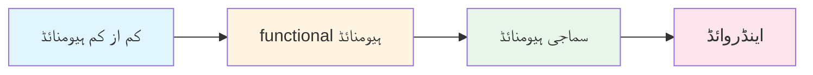
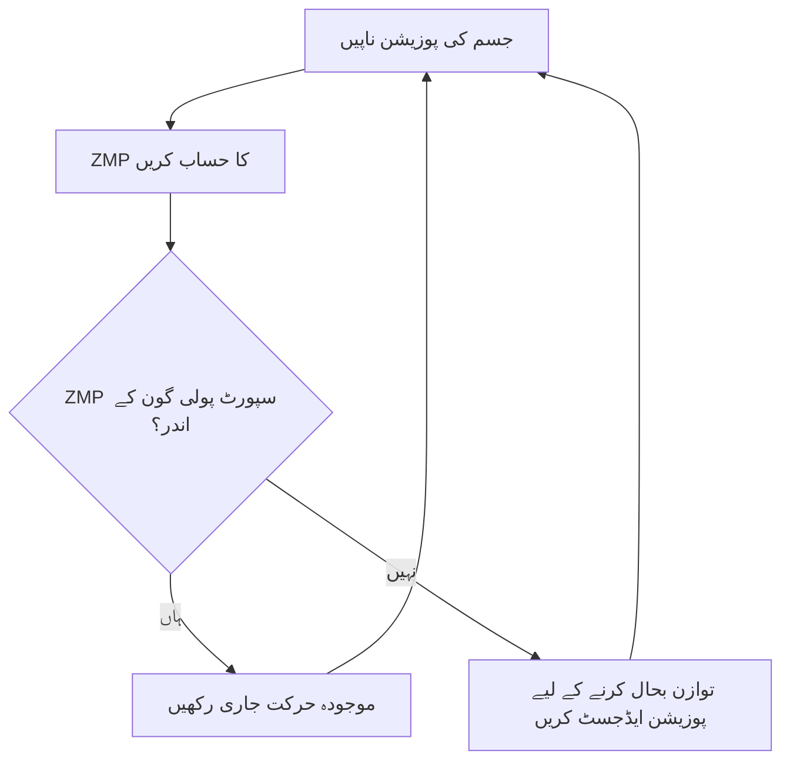
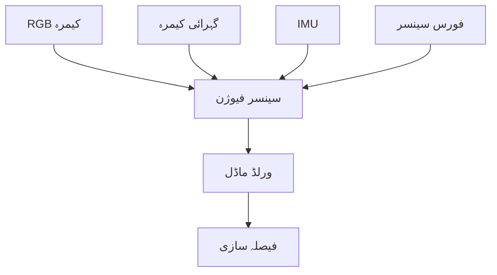
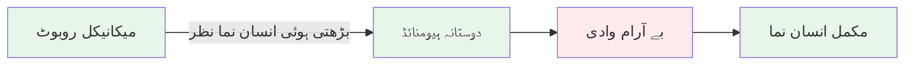

# باب 2: ہیومنائڈ روبوٹس کو سمجھنا

## سیکھنے کے اہداف

اس باب کے اختتام تک، آپ کے اہل ہو جائے گا:

- یہ وضاحت کریں کہ روبوٹ کو "ہیومنائڈ" کیا بناتا ہے اور کلیدی ہیومنائڈ خصوصیات کی شناخت کریں
- ہیومنائڈ فارم فیکٹر کے فوائد اور نقصانات کی وضاحت کریں
- ہیومنائڈ روبوٹ کے اہم ذیلی نظام (لوکوموشن، مینیپولیشن، ادراک، کوگنیشن) کی وضاحت کریں
- حقیقی دنیا کے ہیومنائڈ روبوٹس اور ان کے اطلاقیے کی شناخت کریں
- ہیومنائڈ روبوٹ ڈیزائن میں انجینئرنگ ٹریڈ آف کو سمجھیں
- یہ سمجھیں کہ ہیومنائڈ روبوٹس انسانوں کے مطابق ماحول کے لیے منفرد طور پر کیوں مناسب ہیں

## ضروریات

- باب 1: فزیکل AI کیا ہے؟ (فزیکل AI کے تصورات کی سمجھ)
- مقبول ثقافت یا خبروں سے روبوٹس کے بارے میں بنیادی آگاہی
- کوئی تکنیکی پس منظر درکار نہیں ہے

## تعارف: یہ کیوں اہم ہے

تصور کریں ایک مستقبل جہاں روبوٹس اسپتالوں، گھروں، اور دفاتر میں انسانوں کے ساتھ کام کرتے ہیں۔ ان روبوٹس کو سیڑھیاں چڑھنی، دروازے کھولنے، انسانی اوزار استعمال کرنے، اور لوگوں کے ساتھ قدرتی طور پر بات چیت کرنے کی ضرورت ہوگی۔ ان کی شکل کیا ہونی چاہیے؟

آپ سوچ سکتے ہیں کہ ایک چکر والے روبوٹ زیادہ کارآمد ہوگا - اور بہت سے کاموں کے لیے آپ درست ہوں گے۔ لیکن یہاں چیلنج ہے: ہماری دنیا انسانوں کے لیے ڈیزائن کی گئی ہے۔ دروازے کے ہینڈل انسانی ہاتھ کی اونچائی پر ہیں۔ سیڑھیاں انسانی پاؤں کے حساب سے ماپی گئی ہیں۔ اوزار انسانی ہاتھوں کے شکل میں ڈیزائن کیے گئے ہیں۔ عمارتوں اور بنیادی ڈھانچے میں مہنگے تبدیلیوں کی ضرورت کے بغیر اس انسانوں کے مرکز دنیا میں کام کرنے کے لیے، روبوٹس کو انسانوں کی طرح شکل کی ضرورت ہوتی ہے۔

یہ ہی **ہیومنائڈ روبوٹس** کے پیچھے بنیادی بصیرت ہے: انسانی جسم کی شکل اور صلاحیات کو نقل کر کے، روبوٹس موجودہ بنیادی ڈھانچے، اوزار، اور جگہوں کو استعمال کر سکتے ہیں جو لوگوں کے لیے ڈیزائن کیے گئے ہیں۔

اس باب میں، ہم یہ تلاش کریں گے کہ ہیومنائڈ روبوٹ کیا ہے، انجینئرز اس چیلنجنگ فارم فیکٹر کو کیوں چنتے ہیں، اور ہیومنائڈ روبوٹس کیسے صنعتوں کو مینوفیکچرنگ سے لے کر ہیلتھ کیئر تک تبدیل کرنا شروع کر رہے ہیں۔

## ہیومنائڈ روبوٹ کیا ہے؟

### "ہیومنائڈ" کی وضاحت

ایک **ہیومنائڈ روبوٹ** ایک روبوٹ ہے جس کا جسمانی ڈھانچہ انسانی شکل سے ملتا جلتا ہے۔ جبکہ کوئی سخت تعریف نہیں ہے، زیادہ تر ہیومنائڈ روبوٹس ان خصوصیات کو شیئر کرتے ہیں:

**کلیدی ہیومنائڈ خصوصیات:**

1. **دو پائوں والی نقل و حمل**: چلنے اور کھڑے ہونے کے لیے دو ٹانگیں
2. **ٹورسو**: سر، بازوؤں، اور ٹانگوں کو جوڑنے والا مرکزی جسمانی ڈھانچہ
3. **سر**: انسانی آنکھ کی سطح پر بنیادی سینسرز (کیمرے، مائیکروفون) کے ساتھ
4. **دو بازو**: ہاتھوں اور اوزار استعمال کرنے کے لیے
5. **ہاتھ/گریبرز**: چیزوں کو تھامنے کے قابل اینڈ ایفیکٹرز

**اختیاری خصوصیات:**
- انسانی طرز کی چہرے کی خصوصیات یا اظہار
- ہاتھوں کے لیے انگلیاں
- جلد جیسی چادر
- آواز اور گفتگو کی صلاحیتیں

### ہیومنائڈ ڈیزائن کا پیمانہ

تمام ہیومنائڈ روبوٹس ایک جیسے نہیں دکھتے۔ وہ کم از کم ہیومنائڈ سے لے کر انتہائی انسان نما تک ایک پیمانے پر موجود ہیں:



**1. کم از کم ہیومنائڈ** (مثلاً بوسٹن ڈائنیمکس ایٹلس)
- توجہ: عملی صلاحیات (چلنا، مینیپولیشن)
- ظہور: صاف طور پر میکانی، صنعتی ڈیزائن
- استعمال کا مقصد: تحقیق، صنعتی کام، خطرناک ماحول

**2. عملی ہیومنائڈ** (مثلاً ٹیسلا آپٹیمس، ایگلٹی روبوٹکس ڈیجیٹ)
- توجہ: انسانوں کے ماحول میں عملی کام
- ظہور: سادہ انسانی تناسب، کم از کم حسن
- استعمال کا مقصد: ویئر ہاؤس، فیکٹری، ڈلیوری

**3. سماجی ہیومنائڈ** (مثلاً سافٹ بینک پیپر، ہونڈا ایسیمو)
- توجہ: انسانی بات چیت اور مواصلات
- ظہور: دوستانہ، قابل قبول ڈیزائن جس میں اظہار کی خصوصیات
- استعمال کا مقصد: گاہک خدمت، تعلیم، صحت کی دیکھ بھال

**4. اینڈروائڈ** (مثلاً انجنئرڈ آرٹس ایمیسیا)
- توجہ: انسان نما ظہور اور سلوک
- ظہور: حقیقی انسانی خصوصیات، جلد جیسی سطحیں
- استعمال کا مقصد: تحقیق، تفریح، بے آرام وادی کے مطالعات

### ہیومنائڈ بمقابلہ دیگر روبوٹ اقسام

چلو ہم ہیومنائڈ روبوٹس کو دیگر عام روبوٹ اقسام کے ساتھ موازنہ کریں:

| روبوٹ کی قسم | نقل و حمل | مینیپولیشن | ماحول کی مطابقت | مثال |
|-----------|----------|--------------|--------------------------|---------|
| **ہیومنائڈ** | دو پائوں چلنا | دو بازو، ہاتھ | زیادہ (انسانی جگہیں) | بوسٹن ڈائنیمکس ایٹلس |
| **چکر والے روبوٹ** | رولنگ | مختلف | درمیانہ (چپٹی سطحیں) | ایمازون کیوا |
| **چار پائوں** | چار ٹانگوں والی چال | محدود یا کوئی نہیں | زیادہ (ROUGH زمین) | بوسٹن ڈائنیمکس سپاٹ |
| **ڈرون** | اڑنا | عام طور پر کوئی نہیں | کم (صرف کھلی فضا) | DJI فینٹم |
| **صنعتی بازو** | مقررہ پوزیشن | واحد بازو | کم (مقررہ ورک سپیس) | KUKA KR سیریز |
| **ٹریک والے روبوٹ** | ٹینک جیسے ٹریڈ | مختلف | زیادہ (ROUGH زمین) | iRobot PackBot |

**اہم بصیرت**: ہیومنائڈ شکل انسانوں کے لیے ڈیزائن کیے گئے ماحول کے لیے بہترین ہے، نہ کہ صرف کارکردگی کے لیے۔

## ہیومنائڈ روبوٹس کیوں بنائیں؟

دو پائوں چلنے اور ڈبل آرم مینیپولیشن کی انجینئرنگ کی پیچیدگی کو دیکھتے ہوئے، تحقیق کار اور کمپنیاں بلینوں کو ہیومنائڈ روبوٹس میں کیوں لگاتی ہیں؟ چلو ہم سمجھتے ہیں:

### 1. بنیادی ڈھانچہ کی مطابقت

**مسئلہ**: انسانوں کے بنیادی ڈھانچہ کو دوبارہ ڈیزائن کرنا مہنگا اور سست ہے۔

**حل**: ہیومنائڈ روبوٹس موجودہ کو استعمال کر سکتے ہیں:
- سیڑھیاں اور ایلیویٹر
- دروازے کے ہینڈل
- معیاری اوزار (ہیمر، سکرو ڈرائیور، فون)
- انسانی ابعاد کے لیے ڈیزائن کردہ کام کی جگہ
- انسانی مسافروں کے لیے ڈیزائن کردہ گاڑیاں

**مثال**: ایک ہیومنائڈ روبوٹ موجودہ سیڑھیوں اور ایلیویٹروں کا استعمال کر کے ایک کئی کہانیوں والی دفتری عمارت میں نقل و حمل کر سکتا ہے، جبکہ ایک چکر والے روبوٹ کو مہنگے ریمپ انسٹالیشن یا مخصوص روبوٹ ایلیویٹروں کی ضرورت ہوگی۔

**اقتصادی اثر**: تخمینہ ہے کہ غیر ہیومنائڈ روبوٹس کے لیے ایک عمارت کو دوبارہ تعمیر کرنا $50,000-$500,000 کا خرچہ ہے۔ ہیومنائڈ روبوٹس یہ خرچہ ختم کر دیتے ہیں۔

### 2. اوزار کا دوبارہ استعمال

انسانوں نے صدیوں میں ملیوں اوزار تخلیق کیے ہیں: ہیمر، کینچی، کی بورڈ، سٹیرنگ وہیل، طبی اوزار۔ ہیومنائڈ روبوٹس جن کے پاس انسانوں جیسے ہاتھ ہیں وہ ان اوزار کو بغیر دوبارہ ڈیزائن کے استعمال کر سکتے ہیں۔

**مثال**: ایک سرجریکل ہیومنائڈ موجودہ سرجریکل اوزار استعمال کر سکتا ہے جو انسانی ہاتھوں کے لیے ڈیزائن کیے گئے ہیں، بجائے مہنگے کسٹم روبوٹک اوزار کی ضرورت کے۔

### 3. قدرتی انسانی بات چیت

انسانوں کو انسان نما شکلوں کے ساتھ بات چیت کرنے کے لیے نفسیاتی طور پر ڈیزائن کیا گیا ہے۔ ہیومنائڈ روبوٹس فائدہ اٹھاتے ہیں:

**سماجی قبولیت**:
- سلوک کی پیش گوئی کرنا آسان (ہاتھ بڑھانا = کچھ لینے کا ارادہ)
- بزرگ اور بچوں کے لیے زیادہ آرام دہ
- ہاتھ کے اشاروں اور پوسچر کے ذریعے غیر زبانی مواصلات

**قابل فہم تعاون**:
- اشارہ کر سکتے ہیں اور مواصلات کے لیے اشارے کر سکتے ہیں
- انسان کی اونچائی والی کام کی میز پر ساتھ ساتھ کام کر سکتے ہیں
- انسانی جسم کی زبان کا جواب دے سکتے ہیں

**تحقیق کا نتیجہ**: مطالعات دکھاتے ہیں کہ 78% بزرگ مریض مدد کے کاموں کے لیے دیگر شکلوں کے مقابلے میں ہیومنائڈ روبوٹس کو ترجیح دیتے ہیں (فونگ وغیرہ، 2023)۔

### 4. تنوع اور جامعیت

ہیومنائڈ روبوٹ ایک **جنرل پرپز پلیٹ فارم** ہے:

**ایک پلیٹ فارم، متعدد کام**:
- صبح: ویئر ہاؤس کی الماریوں کو اسٹاک کریں
- دوپہر: پیکجز ڈلیور کریں
- شام: دفتری جگہیں صاف کریں
- رات: پیٹرول اور سیکورٹی کی نگرانی کریں

**مخصوص روبوٹس کے مقابلے میں**:
- ویکیومنگ روبوٹ: صرف ویکیوم
- ویئر ہاؤس روبوٹ: صرف انوینٹری منتقل کریں
- سیکورٹی روبوٹ: صرف پیٹرول

**اقتصادی فائدہ**: ایک ہیومنائڈ روبوٹ متعدد مخصوص روبوٹس کی جگہ لے سکتا ہے، کل مالکانہ لاگت کو کم کر سکتا ہے۔

### 5. انسانی مظاہروں سے سیکھنا

ہیومنائڈ روبوٹس انسانوں کو دیکھ کر سیکھ سکتے ہیں:

**نقالی کا سیکھنا**:
1. انسان ایک کام کا مظاہرہ کرتا ہے (مثلاً کپڑے سلائی)
2. ہیومنائڈ روبوٹ کے کیمرے مظاہرہ کو ریکارڈ کرتے ہیں
3. AI انسانی حرکات کو روبوٹ کی حرکات میں ترجمہ کرتا ہے
4. روبوٹ مشق کرتا ہے اور مہارت کو بہتر بناتا ہے

**کیوں ہیومنائڈ شکل مدد کرتی ہے**: مماثل جسمانی ڈھانچہ کا مطلب ہے کہ انسانی حرکات براہ راست روبوٹ کی حرکات میں نقشہ کرتی ہیں۔

**مثال**: ایک ہیومنائڈ روبوٹ کو انسان کو قہوہ کی مشین استعمال کرتے دیکھ کر سیکھ سکتا ہے، جبکہ ایک روبوٹک بازو کو کام مکمل طور پر دوبارہ پروگرام کرنے کی ضرورت ہوگی۔

## ہیومنائڈ روبوٹ کے اہم ذیلی نظام

چلو ہم ان کلیدی نظاموں کو تلاش کرتے ہیں جو ہیومنائڈ روبوٹس کو کام کرتے ہیں:

### 1. نقل و حمل کا نظام (ٹانگیں اور توازن)

**چیلنج**: دو پائوں چلنا روبوٹکس میں سب سے مشکل مسائل میں سے ایک ہے۔

**ابعاد**:
- **کمر کے جوڑ** (3 ڈگری آزادی): آگے/پیچھے، طرفین، گھمائیں
- **گھٹنے کے جوڑ** (1 ڈگری آزادی): جھکنا
- **اڑیل کے جوڑ** (2 ڈگری آزادی): اوپر/نیچے، طرفین کا جھکاؤ
- **پاؤں کے سینسر**: زمین کے ساتھ رابطہ کا پتہ لگانے کے لیے دباؤ کے سینسر

**کام کیسے کرتا ہے**:
```
1. موجودہ پوزیشن اور زمین کے رابطہ کا ادراک کریں
2. اگلی پوزیشن کا مطلوبہ حساب کریں
3. ضروری جوڑ کے زاویے کا حساب کریں
4. موتیوں کو کمانڈز بھیجیں
5. توازن کے لیے نگرانی کریں
6. جاری طور پر ایڈجسٹ کریں (فی سیکنڈ 100+ بار)
```

**توازن کنٹرول**:
ہیومنائڈ روبوٹس توازن برقرار رکھنے کے لیے **Zero Moment Point (ZMP)** جیسے تصورات کا استعمال کرتے ہیں:



**حقیقی دنیا کی کارکردگی**:
- چلنے کی رفتار: 0.5-2.5 میٹر/سیکنڈ (انسان: 1.4 میٹر/سیکنڈ اوسط)
- سیڑھی چڑھنا: ہاں (زیادہ تر جدید ہیومنائڈ)
- rough زمین: محدود (فعال تحقیق کا علاقہ)

### 2. مینیپولیشن کا نظام (بازو اور ہاتھ)

**ابعاد**:
- **کندھا** (3 DoF): ہاتھ کو تمام سمت میں پہنچنے کی اجازت دیتا ہے
- **کوہنی** (1 DoF): جھکاؤ کی حرکت
- **کلائی** (2-3 DoF): گھمائیں اور جھکاؤ
- **ہاتھ/گریپر**: 2 سے 20+ ڈگری آزادی

**ہاتھوں کی اقسام**:

**سادہ گریپر** (2-انگلی، 1 DoF):
- فوائد: سادہ، قابل اعتماد، مضبوط
- نقصانات: محدود ہاتھ داری
- استعمال: صنعتی مینیپولیشن، پیکج ہینڈلنگ

**انسان نما ہاتھ** (5 انگلیاں، 15-20 DoF):
- فوائد: انسان جیسی ہاتھ داری، انسانی اوزار استعمال کر سکتے ہیں
- نقصانات: پیچیدہ، مہنگا، نازک
- استعمال: تحقیق، نازک مینیپولیشن

**ہائبرڈ ڈیزائن** (3 انگلیاں، 6-9 DoF):
- فوائد: ہاتھ داری اور قابل اعتمادی کا توازن
- نقصانات: تمام انسانی ہاتھ کے کام نہیں کر سکتے
- استعمال: زیادہ تر کمرشل ہیومنائڈ روبوٹس

**مینیپولیشن پائپ لائن**:
```
1. بصری ادراک: چیز کی شناخت اور اس کا پوزیشن
2. گریپ کی منصوبہ بندی: تعین کریں کہ کہا/کیسے تھامنا ہے
3. حرکت کی منصوبہ بندی: ٹکر سے بچنے والے راستے کا حساب
4. عمل: بازو کو حرکت دیں اور گریپر بند کریں
5. فیڈ بیک: گریپ کو ایڈجسٹ کرنے کے لیے فورس سینسر کی نگرانی کریں
```

### 3. ادراک کا نظام (سینسر)

ہیومنائڈ روبوٹس متعدد سینسر کی اقسام کے ذریعے اپنے ماحول کا ادراک کرتے ہیں:

**بصری سینسر**:
- **RGB کیمرے** (2-4): چیزوں کی پہچان کے لیے رنگین وژن
- **گہرائی کے کیمرے** (1-2): جگہ کی 3D سمجھ
- **LiDAR** (اختیاری): درست فاصلہ کی پیمائش

**پروپریوسیپٹو سینسر** (اندرونی حالت):
- **جوڑ انکوڈرز**: ہر جوڑ کی بالکل پوزیشن ٹریک کریں
- **IMU**: ٹورسو کی جہت اور ایکسلریشن کو ناپیں
- **فورس-ٹورک سینسر**: جوڑ اور ہاتھوں پر لگنے والی قوتوں کو ناپیں

**چھوٹ کے سینسر**:
- **دباو کے سینسر** انگلیوں کے سرے میں: رابطہ اور گریپ کی قوت کا پتہ لگائیں
- **جلد کے سینسر** (اعلی درجے کا): جسم کی سطح پر چھوٹ کا پتہ لگائیں

**آڈیو سینسر**:
- **مائیکروفون ایرے** (2-4): آواز کا ان پٹ اور آواز کی مقامیت

**سینسر فیوژن**:
ہیومنائڈ روبوٹس متعدد سینسرز سے ڈیٹا کو جوڑ کر اپنے ماحول کی ایک مربوط سمجھ بنا سکتے ہیں:



### 4. کوگنیٹو سسٹم (AI اور کنٹرول)

**کنٹرول کی پرتیں**:

**اعلیٰ سطح کی منصوبہ بندی** (AI/مشین لرننگ):
- قدرتی زبان سے کام کی سمجھ
- چیزوں کی پہچان اور منظر کی سمجھ
- طویل مدتی منصوبہ بندی اور شیڈولنگ
- تجربے سے سیکھنا

**مڈل لیول کنٹرول** (موشن پلاننگ):
- نیویگیشن کے لیے راستہ کی منصوبہ بندی
- مینیپولیشن کے لیے گریپ کی منصوبہ بندی
- ٹکر سے بچنا
- متعدد اسٹیپ ایکشن کی ترتیب

**کم سطح کا کنٹرول** (ریل ٹائم کنٹرولرز):
- توازن کنٹرول (200-1000 Hz پر چلتا ہے)
- جوڑ کی پوزیشن/رفتار کنٹرول
- مینیپولیشن کے لیے فورس کنٹرول
- ریفلیکس جیسے ہنگامی جوابات

**مثال کنٹرول سلسلہ**:
```
اعلیٰ: "میرے لیے کچن سے لال کپ لائیں"
  ↓
مڈل: کچن میں نیویگیٹ کریں → لال کپ کو تلاش کریں → کپ تھامیں → صارف کے پاس واپس جائیں
  ↓
کم: بائیں پاؤں کے ساتھ قدم → وزن منتقل کریں → دائیں پاؤں اٹھائیں → ...
```

### 5. پاور اور ایکٹوایشن سسٹم

**پاور ذرائع**:
- **بیٹری پیک** (زیادہ تر عام): 1-4 گھنٹے کا کام
- **ٹیتھرڈ پاور** (تحقیقی روبوٹس): لامحدود کام، موبائل کو محدود کرتا ہے
- **مستقبل**: فیول سیلز، وائرلیس چارجنگ

**ایکٹوایٹرز** (موٹر جو جوڑ حرکت میں لاتے ہیں):

**الیکٹرک موٹر**:
- فوائد: درست کنٹرول، خاموش، کارآمد
- نقصانات: زیادہ ٹارک موٹر بھاری ہوتے ہیں
- استعمال: زیادہ تر ہیومنائڈ روبوٹس

**ہائیڈرولک ایکٹوایٹرز**:
- فوائد: بہت زیادہ طاقت-وزن کا تناسب
- نقصانات: شور، گندہ (Fluid leaks)، پیچیدہ
- استعمال: بوسٹن ڈائنیمکس ایٹلس

**پنومیٹک ایکٹوایٹرز**:
- فوائد: مطیع (نرم)، انسانی بات چیت کے لیے محفوظ
- نقصانات: کم درست، ہوا کی فراہمی کی ضرورت
- استعمال: کچھ تحقیقی ہیومنائڈ

## حقیقی دنیا کے ہیومنائڈ روبوٹس

چلو ہم کچھ قابل ذکر ہیومنائڈ روبوٹس اور ان کی صلاحیات کا جائزہ لیتے ہیں:

### بوسٹن ڈائنیمکس ایٹلس (2013-موجودہ)

**سپیسیفکیشن**:
- اونچائی: 1.5 میٹر (5 فٹ)
- وزن: 89 کلو (196 پونڈ)
- ایکٹوایٹرز: ہائیڈرولک
- پاور: ٹیتھرڈ یا بیٹری (1 گھنٹہ)

**صلاحیات**:
- پارکور اور بیک فلپس
- دوڑنا (2.5 میٹر/سیکنڈ)
- چیز کی مینیپولیشن
- rough زمین نیویگیشن

**حیثیت**: تحقیقی پلیٹ فارم، تجارتی طور پر دستیاب نہیں

**اہمیت**: بے مثال ڈائنامک نقل و حمل اور چابک دستی کا مظاہرہ کرتا ہے

### ٹیسلا آپٹیمس (2022-موجودہ)

**سپیسیفکیشن**:
- اونچائی: 1.73 میٹر (5'8")
- وزن: 73 کلو (161 پونڈ)
- ایکٹوایٹرز: الیکٹرک (28 ایکٹوایٹرز)
- پاور: بیٹری (2.3 kWh، ~4 گھنٹے)

**صلاحیات**:
- چلنا اور چیز کی مینیپولیشن
- صنعتی کام کی انجام دہی
- انسانی مظاہرے سے سیکھنا
- ماس پروڈکشن کے لیے ڈیزائن کیا گیا

**حیثیت**: ترقی میں، 2025 کا منصوبہ

**اہمیت**: ماس پروڈکشن کے لیے ڈیزائن کردہ پہلا ہیومنائڈ ($20,000-30,000 ہدف قیمت)

### ایگلٹی روبوٹکس ڈیجیٹ (2019-موجودہ)

**سپیسیفکیشن**:
- اونچائی: 1.6 میٹر (5'3")
- وزن: 65 کلو (143 پونڈ)
- ایکٹوایٹرز: الیکٹرک
- پاور: بیٹری (2-4 گھنٹے)

**صلاحیات**:
- پیکج ڈلیوری
- ویئر ہاؤس مینیپولیشن
- سیڑھی چڑھنا
- گرنے سے بحالی

**حیثیت**: تجارتی طور پر دستیاب، ایمازون کے ذریعے نافذ

**اہمیت**: حقیقی دنیا کے تجارتی نفاذ میں پہلا ہیومنائڈ

### سافٹ بینک پیپر (2014-موجودہ)

**سپیسیفکیشن**:
- اونچائی: 1.2 میٹر (4 فٹ)
- وزن: 28 کلو (62 پونڈ)
- ایکٹوایٹرز: الیکٹرک (20 DoF)
- پاور: بیٹری (12 گھنٹے)

**صلاحیات**:
- سماجی بات چیت اور گفتگو
- جذبات کی پہچان
- معلومات کی کiosk خدمات
- تعلیمی مدد

**حیثیت**: دنیا بھر میں 30,000 سے زیادہ یونٹس نافذ

**اہمیت**: سب سے زیادہ نافذ سماجی ہیومنائڈ روبوٹ

### ہونڈا ایسیمو (2000-2018، ریٹائر)

**سپیسیفکیشن**:
- اونچائی: 1.3 میٹر (4'3")
- وزن: 48 کلو (106 پونڈ)
- ایکٹوایٹرز: الیکٹرک (57 DoF)
- پاور: بیٹری (1 گھنٹہ)

**صلاحیات**:
- دوڑنا (9 کلومیٹر/گھنٹہ)
- سیڑھی چڑھنا
- چیز کی مینیپولیشن
- اشاروں کی زبان

**حیثیت**: تحقیقی پروگرام 2018 میں ختم

**اہمیت**: آج بھی استعمال ہونے والی کئی ہیومنائڈ روبوٹکس کی تکنیکوں کا راستہ دکھایا

## ہیومنائڈ ڈیزائن میں انجینئرنگ ٹریڈ آف

ہیومنائڈ روبوٹ کا ڈیزائن کرنا پیچیدہ ٹریڈ آف کو نیوگیٹ کرنا شامل ہے:

### 1. پیچیدگی بمقابلہ صلاحیت

**زیادہ ڈگری آزادی = زیادہ صلاحیت لیکن زیادہ پیچیدگی**

- ایسیمو (57 DoF): انتہائی صلاحیت لیکن انتہائی پیچیدہ اور مہنگا
- ڈیجیٹ (20 DoF): سادہ، زیادہ قابل اعتماد، لیکن کم ہاتھ دار
- پیپر (20 DoF، چکر والی بنیاد): اور بھی سادہ، لیکن سیڑھیاں چڑھ نہیں سکتے

**ڈیزائن کا فیصلہ**: درخواست کی ضروریات کے مطابق پیچیدگی ملا کریں۔ ویئر ہاؤس روبوٹس کو انگلیوں کی ہاتھ داری کی ضرورت نہیں ہے؛ سرجریکل روبوٹس کو ہے۔

### 2. رفتار بمقابلہ حفاظت

**تیز حرکت = زیادہ پیداواریت لیکن زیادہ خطرہ**

- صنعتی روبوٹس: تیز لیکن محفوظ کے لیے بار میں
- تعاونی ہیومنائڈ: فورس لمیٹڈ ایکٹوایٹرز کے ساتھ سست برائے حفاظت

**حل**: بہت سے ہیومنائڈ **مطیع ایکٹوایٹرز** استعمال کرتے ہیں جو قوت کو محدود کرتے ہیں، تصادم کے دوران زخم لگنے سے بچاتے ہیں۔

### 3. بیٹری کی زندگی بمقابلہ وزن

**بڑی بیٹری = طویل رن ٹائم لیکن بھاری روبوٹ**

- بھاری روبوٹ → حرکت کے لیے زیادہ توانائی کی ضرورت → چھوٹا رن ٹائم
- یہ ایک چیلنجنگ آپٹیمائزن مسئلہ پیدا کرتا ہے

**موجودہ حل**:
- کارآمد موٹر اور ٹرانسمیشن
- ہلکے مواد (کاربن فائبر، ٹائٹینیم)
- توانائی کارآمد چلنے کے گیٹس
- ہاٹ سویپیبل بیٹری پیک

### 4. قیمت بمقابلہ صلاحیت

**اعلی درجے کے اجزاء = بہتر کارکردگی لیکن زیادہ قیمت**

 typical ہیومنائڈ روبوٹ کی قیمت کا خلاصہ:
- زیادہ ٹارک موٹر: $50,000-$200,000
- سینسر (کیمرے، LiDAR، وغیرہ): $20,000-$100,000
- کمپیوٹنگ ہارڈویئر: $10,000-$50,000
- سٹرکچرل اجزاء: $20,000-$80,000
- ایسیمبلی اور ٹیسٹنگ: $100,000-$300,000

**کل**: $200,000 - $730,000 فی یونٹ (موجودہ نسل)

**مستقبل کا رجحان**: ٹیسلا ماس پروڈکشن اور عمودی انضمام کے ذریعے $20,000-$30,000 کا نشانہ رکھتا ہے۔

### 5. انسان نما بمقابلہ فنکشن

**انسان نما ظہور = بہتر سماجی قبولیت لیکن بے آرام وادی کا خطرہ**

**بے آرام وادی** کے تصور سے یہ تجویز ہے کہ جیسے جیسے روبوٹس انسان نما ہوتے جاتے ہیں، ویسے ویسے وہ زیادہ دلچسپ ہوتے جاتے ہیں - جب تک وہ *بہت* انسان نما ہو جاتے ہیں لیکن مکمل نہیں، ناگواری پیدا کرتے ہیں۔



**ڈیزائن کی حکمت عملیاں**:
- سماجی ہیومنائڈ (پیپر): کارٹون نما خصوصیات کے ساتھ بے آرام وادی سے پہلے رک جائیں
- تحقیقی اینڈروائڈ (امیسیا): حقیقت پسندی کی طرف بڑھتے ہوئے بے آرام وادی کو دھکیلیں
- صنعتی ہیومنائڈ (ڈیجیٹ): صاف طور پر روبوٹ نظر کو برقرار رکھ کر مسئلہ سے بچیں

## ہیومنائڈ روبوٹکس میں چیلنج

ناقابل یقین ترقی کے باوجود، ہیومنائڈ روبوٹس اب بھی قابل ذکر چیلنجوں کا سامنا کرتے ہیں:

### 1. دو پائوں والی نقل و حمل کی مضبوطی

**موجودہ حالت**: ہیومنائڈ سیدھی سطحوں اور سیڑھیوں پر چل سکتے ہیں، لیکن ان کو دشواری ہے:
- غیر متوقع زمین (گریول، کیچل، برف)
- متحرک پلیٹ فارم (ٹرین، کشتی)
- متحرک ماحول میں ڈائنامک ایڈاپٹیشن کی ضرورت
- توانائی کی کارآمدی (فی فاصلہ انسانوں کے مقابلے میں 10-20x زیادہ توانائی استعمال کریں)

**فعال تحقیق**: ایڈاپٹیو گیٹس کے لیے مضبوط لرننگ، بہتر ایکٹوایٹر کارآمدی، بہتر توازن الگورتھم۔

### 2. ہاتھ دار مینیپولیشن

**موجودہ حالت**: ہیومنائڈ چیزیں تھام سکتے ہیں اور چل سکتے ہیں، لیکن ان کو دشواری ہے:
- باریک موٹر کے مہارتوں (ایک سوئی میں دھاگا ڈالنا، جوتے کے لیس باندھنا)
- چیز کی تشکیل کو ایڈاپٹ کرنا (کپڑا، کھانا سنبھالنا)
- زیادہ درستی کی ضرورت والے اوزار کا استعمال
- مختلف چیزوں کو مضبوط طور پر تھامنا

**فعال تحقیق**: انسانی مظاہرے سے سیکھنا، چھوٹ کا ادراک، ماڈل فری مینیپولیشن۔

### 3. ریل ٹائم ادراک اور فیصلہ سازی

**موجودہ حالت**: ہیومنائڈ چیزیں پہچان سکتے ہیں اور نیویگیٹ کر سکتے ہیں، لیکن ان کو دشواری ہے:
- الجھے ہوئے ماحول میں ریل ٹائم منظر کی سمجھ
- مسخ یا جزوی طور پر قابل نظر چیزوں کو ہینڈل کرنا
- تربیت میں نہ دیکھی گئی نئی چیزوں کو جنرلائز کرنا
- متحرک ماحول میں چلنے والے لوگوں کے ساتھ کام کرنا

**فعال تحقیق**: ٹرانسفارمر-بیسڈ وژن ماڈلز، ملٹی-موڈل ادراک، سم ٹو ریئل ٹرانسفر۔

### 4. طویل مدتی خود مختاری

**موجودہ حالت**: زیادہ تر ہیومنائڈ انسانی نگرانی کی ضرورت رکھتے ہیں اور اکثر ریچارجنگ کی ضرورت ہوتی ہے:
- بیٹری کی زندگی: 1-4 گھنٹے فعال استعمال
- خرابی سے بحالی: اکثر انسانی مداخلت کی ضرورت ہوتی ہے
- کام سیکھنا: اب بھی پروگرامنگ یا مظاہرے پر انحصار کرتا ہے

**فعال تحقیق**: خود سپروائزڈ لرننگ، بہتر توانائی اسٹوریج، خود مختار خرابی کی بحالی۔

### 5. قیمت اور تیاری

**موجودہ حالت**: ہیومنائڈ روبوٹس کی قیمت $200,000-$700,000 ہے، نفاذ کو محدود کر رہا ہے۔

**آگے کا راستہ**:
- ماس پروڈکشن (ٹیسلا کا نقطہ نظر)
- معیاری پلیٹ فارم اور اجزاء
- مخصوص استعمال کے کیسز کے لیے بہتر ڈیزائن
- بہتر تیاری کی تکنیکیں

## انضمام: ہیومنائڈ روبوٹس کے طور پر فزیکل AI

ہیومنائڈ روبوٹس ہم نے باب 1 میں جو فزیکل AI تلاش کیا تھا اس کی سب سے جامع شکل کی نمائندگی کرتے ہیں:

**ادراک**: کیمرے، LiDAR، مائیکروفون، فورس سینسر، اور IMU کے ذریعے ملٹی-موڈل سینسنگ غنی ماحولیاتی سمجھ بنا دیتی ہے۔

**کوگنیشن**: اعلیٰ سطحی زبانی سمجھ سے لے کر کم سطحی توازن کنٹرول تک AI سسٹم کی پرتیں پیچیدہ فیصلہ سازی کو فعال کرتی ہیں۔

**ایکشن**: دو پائوں والی نقل و حمل اور ڈبل آرم مینیپولیشن ہیومنائڈ کو اسی طرح سے مادی دنیا کے ساتھ بات چیت کرنے کی اجازت دیتی ہے جیسے کوئی دوسری روبوٹ شکل نہیں کر سکتی۔

**جسماں داری**: انسان نما شکل صرف حسن نہیں ہے - یہ بنیادی طور پر اس بات کو شکل دیتی ہے کہ یہ روبوٹس انسانوں کے ڈیزائن کردہ جگہوں کو کیسے محسوس، سیکھ، اور بات چیت کرتے ہیں۔

جیسے آپ یہ کتاب جاری رکھیں گے، آپ سیکھیں گے کہ ان پیچیدہ نظاموں کو ڈیزائن اور کنٹرول کیسے کریں:
- **ماڈیول 1**: ROS 2 کے ذریعے ہیومنائڈ ذیلی نظاموں کے مواصلات کا چارٹر
- **ماڈیول 2**: ہیومنائڈ کے سلوک کو محفوظ طریقے سے ٹیسٹ کرنے کے لیے شبیہہ ماحول
- **ماڈیول 3**: ادراک اور سیکھنے کے لیے NVIDIA Isaac
- **ماڈیول 4**: قدرتی زبان کے کنٹرول کے لیے وژن-زبان-ایکشن ماڈلز

## سوالات اور جوابات

**س: اگر چکر والے روبوٹس زیادہ کارآمد ہیں، تو انسان نما کے بجائے ان کا استعمال کیوں نہیں کیا جاتا؟**

ج: چکر والے روبوٹس *استعمال* کیے جاتے ہیں جہاں مناسب ہو - ویئر ہاؤس میں چپٹی سطحوں پر، فٹ sidewalks پر ڈلیوری، وغیرہ۔ لیکن چکر والے روبوٹس سیڑھیاں چڑھ نہیں سکتے، تنگ جگہوں میں نیویگیٹ نہیں کر سکتے، یا انسانی اوزار استعمال نہیں کر سکتے۔ انسانوں کے لیے ڈیزائن کیے گئے ماحول کے لیے، ہیومنائڈ شکل اکثر ضروری ہوتی ہے۔ انتخاب درخواست پر منحصر ہے۔

**س: ٹوڈلرز اسے سیکھ سکتے ہیں، تو روبوٹس کے لیے دو پائوں چلنا اتنا مشکل کیوں ہے؟**

ج: انسانی دو پائوں چلنا میں لاکھوں سال کی ترقی کا فائدہ ہے: مخصوص عضلاتی ڈھانچہ، جامع تکنیکی فیڈ بیک نظام، اور توازن کے لیے بہترین ڈھانچہ۔ ٹوڈلرز کے پاس موجودہ روبوٹکس سے کہیں زیادہ اعلی درجے کے حیاتیاتی سینسر اور ایکٹوایٹرز ہیں۔ علاوہ ازیں، انسان سالوں کے تجربے اور غلطی سے سیکھتے ہیں - روبوٹس کو عملی ہونے کے لیے تیزی سے سیکھنا ہوتا ہے۔

**س: کیا ہیومنائڈ روبوٹس انسانوں کو نقصان پہنچا سکتے ہیں؟**

ج: ہاں، جس کی وجہ سے حفاظت ناگزیر ہے۔ جدید تعاونی ہیومنائڈ فورس لمیٹڈ ایکٹوایٹرز، دہرے سینسر، ایمرجنسی اسٹاپ سسٹم، اور ٹکر کا پتہ لگانے کا استعمال کرتے ہیں۔ وہ انسانوں کے گرد محفوظ طریقے سے کام کرنے کے لیے ڈیزائن کیے گئے ہیں کہ رفتار اور قوت کو محدود کریں۔ صنعتی روبوٹس کو عام طور پر بار میں رکھا جاتا ہے کیونکہ وہ تیزی سے اور زیادہ قوت کے ساتھ کام کرتے ہیں۔ ISO 13482 جیسے حفاظت کے معیارات ہیومنائڈ روبوٹ کے ڈیزائن کا حکم دیتے ہیں۔

**س: کچھ ہیومنائڈ کے چہرے کیوں ہیں جبکہ دیگروں کے نہیں؟**

ج: چہرے ان سماجی ہیومنائڈ کے لیے خدمت کرتے ہیں جو انسانوں کے ساتھ بات چیت کرتے ہیں - اظہار مواصلات میں مدد کرتے ہیں اور جذباتی رابطہ پیدا کرتے ہیں۔ صنعتی ہیومنائڈ اکثر قیمت اور پیچیدگی کو کم کرنے کے لیے چہرے کو چھوڑ دیتے ہیں۔ فیصلہ یہ ہے کہ کیا روبوٹ کا بنیادی کام انسانی بات چیت میں شامل ہے۔

**س: کیا ہیومنائڈ روبوٹس انسانوں کے نوکریاں لے لیں گے؟**

ج: ہیومنائڈ روبوٹس کسی حد تک وہ کام ختم کر سکتے ہیں جو اب انسان کرتے ہیں (دہراتا ویئر ہاؤس کا کام، خطرناک کام)، لیکن وہ نئی نوکریاں بھی پیدا کرتے ہیں (روبوٹ کی دیکھ بھال، پروگرامنگ، نگرانی)۔ تاریخی طور پر، خودکاری نے ملازمت کو ختم کرنے کے بجائے منتقل کیا ہے۔ کلید یہ ہے کہ کارکنوں کو تربیت اور تعلیم کے ذریعے نئے کاموں میں منتقل ہونے کی اجازت دی جائے۔

**س: گھروں میں ہیومنائڈ روبوٹس عام ہونے میں کتنا وقت لگے گا؟**

ج: موجودہ پیش گوئیوں میں 5-15 سال گھروں میں وسیع پیمانے پر نفاذ کے لیے، قیمت میں کمی اور صلاحیات میں بہتری پر منحصر ہے۔ ابتدائی ایڈاپٹرز 2028-2030 تک محدود صلاحیات والے گھریلو ہیومنائڈ دیکھ سکتے ہیں، جبکہ وسیع پیمانے پر نفاذ $20,000 سے کم قیمت اور مختلف گھریلو کاموں پر قابل اعتماد کارکردگی کی ضرورت ہوگی۔

## دیگر ماڈیولز سے ربط

- **باب 1** نے فزیکل AI کی بنیاد فراہم کی - ہیومنائڈ ان اصولوں کی سب سے جامع نمائندگی ہیں
- **باب 3** ہم اس بات کو تلاش کریں گے کہ ہیومنائڈ شکل میں جسماں دار ذہانت AI کی تحقیق کو کیسے بڑھاتی ہے
- **ماڈیول 1 (ROS 2)** آپ کو دکھائے گا کہ ہیومنائڈ ذیلی نظام (ادراک، منصوبہ بندی، کنٹرول) کیسے بات چیت اور مطابقت کرتے ہیں
- **ماڈیول 2 (ڈیجیٹل ٹوئن)** آپ کو ہیومنائڈ فزکس، توازن، اور مینیپولیشن کی شبیہہ بنانے کے طریقے سکھائے گا
- **ماڈیول 3 (NVIDIA Isaac)** وہ ادراک اور سیکھنے کے نظام دکھائے گا جو ہیومنائڈ ذہانت کو طاقت دیتے ہیں
- **ماڈیول 4 (VLA)** دکھائے گا کہ ہیومنائڈ قدرتی زبان کے حکم کو کیسے سمجھتے ہیں اور انجام دیتے ہیں

## خلاصہ

ہیومنائڈ روبوٹس ایک جرأت مند انجینئرنگ کا انتخاب کا نمائندہ ہیں: کارکردگی اور ناقص کو قبول کرنا اور بدلے میں تنوع اور انسان-ماحول مطابقت کے لیے۔ کلیدی نکات:

1. **ہیومنائڈ کی تعریف**: ایسے روبوٹ جن میں دو پائوں والی نقل و حمل، ٹورسو، سر، بازو، اور ہاتھ ہوتے ہیں جو انسانی شکل اور صلاحیات کو نقل کرتے ہیں
2. ** motivations**: انسانوں کے مطابق ماحول میں کام کرنے کے لیے ڈیزائن کیا گیا ہے جو انسانی اوزار اور بنیادی ڈھانچہ کو تبدیل کیے بغیر استعمال کرتا ہے
3. **چار اہم ذیلی نظام**: نقل و حمل (چلنا/توازن)، مینیپولیشن (بازو/ہاتھ)، ادراک (سینسر)، کوگنیشن (AI/کنٹرول)
4. **حقیقی دنیا کی مثالیں**: ایٹلس (تحقیقی چابک دستی)، آپٹیمس (ماس پروڈکشن)، ڈیجیٹ (تجارتی نفاذ)، پیپر (سماجی بات چیت)
5. **انجینئرنگ ٹریڈ آف**: پیچیدگی بمقابلہ صلاحیت، رفتار بمقابلہ حفاظت، بیٹری بمقابلہ وزن، قیمت بمقابلہ کارکردگی
6. **کلیدی چیلنج**: مضبوط نقل و حمل، ہاتھ دار مینیپولیشن، ریل ٹائم ادراک، طویل مدتی خود مختاری، قیمت کم کرنا

ہیومنائڈ روبوٹس اب سائنس فکشن نہیں ہیں۔ وہ آج ویئر ہاؤس، اسپتال، اور تحقیقی لیب میں داخل ہو رہے ہیں۔ جبکہ قابل ذکر چیلنج باقی ہیں، AI، سینسر، اور تیاری میں تیز ترقی کا اشارہ ہے کہ متعدد، سستی ہیومنائڈ روبوٹس جلد ہماری روزمرہ کی زندگی کا حصہ بن جائیں گے۔