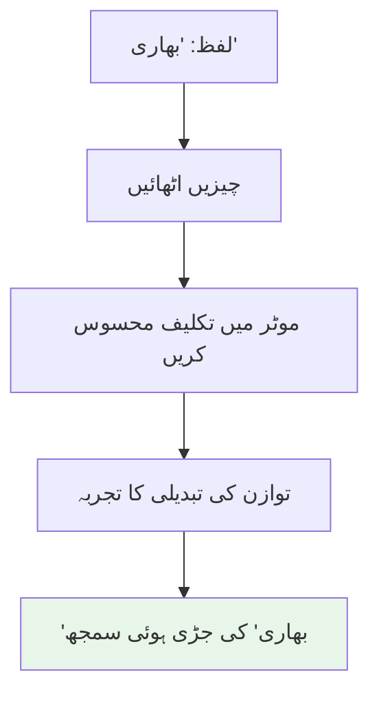

# باب 3: جسماں دار ذہانت کیوں اہم ہے

## سیکھنے کے اہداف

اس باب کے اختتام تک، آپ کے اہل ہو جائے گا:

- ذہانت کے لیے جسماں کے نظریاتی اہمیت کی وضاحت کریں
- یہ بیان کریں کہ جسمانی بات چیت کیسے سیکھنے اور سمجھ کو شکل دیتی ہے
- بے جسم AI نظاموں کی حدود کی شناخت کریں
- جامع AI کو بڑھانے میں جسماں داری کا کردار سمجھیں
- یہ سمجھیں کہ ہیومنائڈ روبوٹس روبوٹکس سے باہر AI تحقیق میں کیسے شراکت کرتے ہیں
- معاشرے کے لیے جسماں دار ذہانت کے حقیقی دنیا کے فوائد کی وضاحت کریں

## ضروریات

- باب 1: فزیکل AI کیا ہے؟ (فزیکل AI کے تصورات کی سمجھ)
- باب 2: ہیومنائڈ روبوٹس کو سمجھنا (ہیومنائڈ نظام کا علم)
- AI صلاحیات کا بنیادی آگاہی (زبان کے ماڈل، تصویر کی پہچان)

## تعارف: یہ کیوں اہم ہے

تصور کریں دو AI نظام جو "بھاری" چیزوں کے بارے میں سیکھ رہے ہیں:

**نظام A** (بے جسم AI): لاکھوں تصاویر اور متن کی وضاحتوں کا تجزیہ کرتا ہے۔ یہ زبانی ا associations اور بصری خصوصیات کی بنیاد پر یہ سیکھتا ہے کہ ڈمبل، سنگ فیل اور ہاتھی "بھاری" ہیں۔

**نظام B** (روبوٹ میں جسماں دار AI): مختلف وزن والی چیزیں اٹھانے کی کوشش کرتا ہے۔ یہ ضروری قوت کا براہ راست تجربہ کرتا ہے، اس کے موتیوں کو تکلیف محسوس ہوتی ہے، توازن کو ایڈجسٹ کرنا ہوتا ہے۔ یہ جسمانی بات چیت کے ذریعے "بھاری" کو سیکھتا ہے۔

کون سا نظام واقعی *سمجھتا* ہے کہ بھاری کیا ہے؟

یہ سوال AI کے سب سے گہرے چیلنجوں میں سے ایک کے دل میں بیٹھا ہے: **کیا حقیقی ذہانت جسم کے بغیر موجود ہو سکتی ہے؟**

بہت سے AI تحقیق کاروں کا یقین ہے کہ جواب نہیں ہے - کہ ذہانت بنیادی طور پر ذہن، جسم، اور ماحول کے تفاعل سے پیدا ہوتی ہے۔ یہ **جسماں دار ذہانت** کا بنیادی بصیرت ہے، اور یہی وجہ ہے کہ ہیومنائڈ روبوٹس عملی اطلاقوں سے کہیں زیادہ اہم ہیں۔

اس باب میں، ہم تلاش کریں گے کہ جسمانی جسماں داری AI کو بڑھانے کے لیے کیوں اہم ہے، یہ سیکھنے اور سمجھ کو کیسے شکل دیتی ہے، اور مستقبل کے مصنوعی ذہانت کے لیے اس کا کیا مطلب ہے۔

## جسماں داری کا تصور

### جسماں داری کا تصور کیا ہے؟

**جسماں داری کا تصور** یہ تجویز کرتا ہے کہ ذہانت محض کمپیوٹیشنل نہیں ہے بلکہ ایجنٹ کے درمیان متحرک تفاعل سے پیدا ہوتی ہے:

1. **جسم** (سینسر اور ایکٹوایٹرز)
2. **دماغ** (پروسیسنگ اور فیصلہ سازی)
3. **ماحول** (مادی دنیا)

**بنیادی دعوی**: ذہین سلوک کو صرف دماغ/کمپیوٹیشن کا مطالعہ کر کے مکمل طور پر سمجھا یا تخلیق نہیں کیا جا سکتا۔ جسم اور ماحول صرف ان پٹس اور آؤٹ پٹس نہیں ہیں - وہ ذہانت کا ا integral حصہ ہیں۔

### تاریخی تناظر

اس خیال کی جڑیں فلسفہ اور کوگنیٹو سائنس میں ہیں:

**ظاہریات** (ایڈمنڈ ہسیرل، موریس میل پونٹی):
- یہ دلیل دی گئی کہ شعور بنیادی طور پر جسماں دار ہے
- ہم دنیا کے *بارے* میں نہیں سوچتے؛ ہم اپنے جسموں کے ذریعے دنیا *میں* ہیں

**ماحولیاتی نفسیات** (جیمز گبسن):
- "افورڈینسز" کے تصور کو متعارف کرایا - اشیاء کے ذریعے پیش کردہ ایکشن کی ممکنہ صورتیں
- ایک کرسی "بیٹھنے" کی پیش کش کرتی ہے کیونکہ آپ کے جسم اور کرسی کے ڈھانچے کے درمیان تعلق کی وجہ سے
- ذہانت افروڈینسز کو سمجھنے اور ان پر کارروائی کرنے کے بارے میں ہے، نہ کہ اندرونی ماڈلز بنانے کے بارے میں

**روبوٹکس** (روڈنی بروکس، 1980-1990):
- کلاسیکل AI کے علامتی استدلال پر مرکوز ہونے کو چیلنج دیا
- یہ ظاہر کیا کہ ذہین سلوک جسم-ماحول کے تفاعل سے پیدا ہو سکتا ہے
- مشہور دعوی: "Representation کے بغیر ذہانت"

### خیالی تجربہ: ٹینک میں دماغ

تصور کریں ایک انسانی دماغ جو ایک ٹینک میں ہے، جو براہ راست نیورل اسٹیمولیشن کے ذریعے عام انسان کے برابر تمام حسی سگنل وصول کرتا ہے۔ کیا یہ اسی قسم کی ذہانت تیار کرے گا جیسا کہ جسماں دار انسان؟

**جسماں داری کے نظریہ کار دلیل**: نہیں، کیونکہ:
- دماغ اپنے نظریات کو عمل کے ذریعے ٹیسٹ نہیں کر سکتا
- یہ اپنے فیصلوں کے نتائج کا تجربہ نہیں کر سکتا
- یہ جسمانی بات چیت کے ذریعے سیکھ نہیں سکتا
- یہ سیکھنے کو شکل دینے والے جسم-ماحول کے فیڈ بیک لوپ سے محروم ہے

**یہ اشارہ کرتا ہے**: جسماں داری محض مفید نہیں ہے - یہ کچھ قسم کی ذہانت کے لیے ضروری ہو سکتی ہے۔

## کیسے جسماں داری ذہانت کو شکل دیتی ہے

چلو ہم مخصوص طریقے تلاش کریں کہ جسمانی جسماں داری سیکھنے، سمجھ، اور ذہانت کو کیسے متاثر کرتی ہے:

### 1. جڑی ہوئی سیکھ (حقیقت سے علامتوں کو جوڑنا)

**علامت جوڑنے کا مسئلہ** (جان سرل، 1980):

علامتیں (الفاظ، تصورات) حقیقی دنیا کے معنوں سے کیسے جڑتی ہیں؟

**مثال**: ایک زبانی ماڈل "سیب" کے الفاظ کو ہیرا پھیرا کر سکتا ہے - یہ جانتا ہے کہ سیب پھل ہیں، وہ لال یا ہرا ہو سکتے ہیں، وہ درختوں پر اگ سکتے ہیں۔ لیکن کیا یہ "سیب" کو اسی طرح سمجھتا ہے جیسا کہ آپ سمجھتے ہیں جب آپ ایک کو تھام لیتے ہیں، اس کا وزن محسوس کرتے ہیں، اس کی خوشبو لیتے ہیں، اس میں کاٹتے ہیں؟

**جسماں دار حل**:

جسمانی بات چیت امدادی تصورات کو حسی-موٹر تجربے میں جوڑتی ہے:



**تحقیق کی مثال**: اشیاء کو ہتھیلی، دھکیل، ہلا کر سیکھنے والے روبوٹس اسی طرح کی تعمیری سیکھنے والے روبوٹس کے مقابلے میں بہتر جنرلائزیشن حاصل کرتے ہیں (Bohg et al., 2014).

### 2. عمل کے ذریعے سیکھ (فعال ادراک)

**غیر فعال بمقابلہ فعال سیکھ**:

**غیر فعال**: مشاہدہ کریں اور معلومات کو سرکھیں
- ایک کیمرہ کمرے کی تصاویر کیپچر کرتا ہے
- دی گئی نظر کے نقطہ نظر تک محدود
- ابہام کو حل نہیں کر سکتا

**فعال**: حکمت عملی کے عمل کے ذریعے معلومات جمع کریں
- ایک روبوٹ متعدد زاویوں سے چیز دیکھنے کے لیے حرکت کرتا ہے
- چھپی ہوئی خصوصیات کو ظاہر کرنے کے لیے چیزوں کو ہتھیلی سکتا ہے
- مفید معلومات فراہم کرنے والے اعمال سیکھ سکتا ہے

**مثال - چیز کی پہچان**:

ایک کافی کے کپ کی شناخت کرنے کی کوشش کرتے ہوئے ایک روبوٹ:
1. اوپر سے گول شکل دیکھتا ہے (پلیٹ، کپ، یا کٹورا ہو سکتا ہے)
2. **عمل کرتا ہے**: کیمرہ کو سائیڈ ویو کے لیے منتقل کریں
3. ہینڈل دیکھتا ہے (پلیٹ اور کٹورا کو ختم کر دیتا ہے)
4. **عمل کرتا ہے**: ہینڈل کو تھامنے کی کوشش کریں
5. گریپ کامیابی کی تصدیق کریں (زیادہ یقین کہ یہ ایک کپ ہے)

**اہم بصیرت**: ذہانت محض مشاہدے کے ذریعے نہیں، بلکہ دنیا میں **فعال تجربے** کے ذریعے ترقی کرتی ہے۔

### 3. ایفروڈینس سیکھ (ایکشن کی ممکنہ صورتیں سمجھنا)

**افروڈینسز** وہ ایکشن کی ممکنہ صورتیں ہیں جو اشیاء پیش کرتی ہیں جو اشیاء کی خصوصیات اور ایجنٹ کی صلاحیات کے تعلق پر مبنی ہیں۔

**مثالیں**:
- ایک کپ "تھامنے" کی پیش کش کرتا ہے (گریپر والے روبوٹ کے لیے)
- ایک سیڑھی "چڑھنے" کی پیش کش کرتی ہے (دو پائوں والے روبوٹ کے لیے، چکر والے کے لیے نہیں)
- ایک دروازے کا ہینڈل "گھمانے" کی پیش کش کرتا ہے ( articulation والی انگلیوں والے روبوٹ کے لیے)

**یہ کیوں اہم ہے**:

جسماں دار AI ایفروڈینسز کو براہ راست بات چیت کے ذریعے سیکھتا ہے:

```
بے جسم AI:
دروازہ → خصوصیات والی چیز (لکڑی، مستطیل، ہنگ کیا ہوا)

جسماں دار AI:
دروازہ → میں کھول سکتا ہوں ہینڈل کو تھام کر اور کھینچ کر
     → رکاوٹ میں جو میں اس کے اوپر چڑھ نہیں سکتا اگر ہینڈل بہت اوپر ہو
     → سطح جس سے میں ٹکرا سکتا ہوں اگر میں تیزی سے حرکت کروں
```

**تحقیق کا نتیجہ**: بات چیت کے ذریعے ایفروڈینسز سیکھنے والے روبوٹس وہیں کے تصویری خصوصیات پر تربیت پانے والے روبوٹس کے مقابلے میں نئی اشیاء کو جنرلائز کر سکتے ہیں (Jamone et al., 2016).

### 4. نتائج سے سیکھ (سببیت کی سمجھ)

جسماں دار ایجنٹس اپنے اعمال کے نتائج کا تجربہ کرتے ہیں:

**مثال - نازک ہونے کا سیکھنا**:

**بے جسم نقطہ نظر**: لیبل والے ڈیٹا سے سیکھیں کہ "گلاس نازک ہے"
- اسوسی ایشن جانتا ہے لیکن سببی میکنزم نہیں جانتا

**جسماں دار نقطہ نظر**: گلاس کی چیز کو گرائیں اور اس کے ٹوٹنے کو دیکھیں
- سبب (گرانا) اور اثر (ٹوٹنا) کا تجربہ کریں
- سیکھتے ہیں:
  - مادی خصوصیات (نازک ہونا)
  - قوت کے تعلقات (Impact کا شکست کا سبب بننا)
  - نتائج (توڑنے کی غیر قابل تردیدت)

**نتیجہ**: جسمانی سببیت کی گہری، زیادہ منتقل کرنا والی سمجھ۔

### 5. جسماں داری کے ذریعے سماجی ذہانت

انسانی سماجی ذہانت بنیادی طور پر جسماں دار ہے:
- ہم جسم کی زبان، چہرے کے اظہار، اشاروں کو پڑھتے ہیں
- ہم بات چیت کے لیے جسمانی اعمال کا استعمال کرتے ہیں (اشارہ کرنا، سر ہلنا)
- ہم دوسروں کے ارادوں کو ان کی جسمانی حرکات سے پیش گو کرتے ہیں

**سماجی ذہانت کے لیے ہیومنائڈ جسماں داری**:

ہیومنائڈ روبوٹس سیکھ سکتے ہیں سماجی ذہانت کے ذریعے:

**مشترکہ جسماں داری**:
- مماثل جسمانی ڈھانچہ انسانی اعمال کو سمجھنے کے قابل بناتا ہے
- نقل کے ذریعے انسانی مظاہروں سے سیکھ سکتے ہیں
- مانوس اشاروں اور پوزیشن کے ذریعے بات چیت کر سکتے ہیں

**جسمانی بات چیت**:
- ہاتھ ملانا، ہائی فائیو، تعاونی چیز مینیپولیشن
- جسمانی فیڈ بیک کے ذریعے سماجی نارمل سیکھنا

**مثال**: انسانوں کو چیزیں دینے کے لیے ایک ہیومنائڈ روبوٹ کو جسمانی تجربے کے ذریعے بہتری حاصل ہوتی ہے:
1. چیز کو بہت دور تک بڑھائیں → انسان کو تکلیف میں پہنچنا
2. چیز کو بہت قریب بڑھائیں → ذاتی جگہ میں دخل اندازی
3. دہرائی بات چیت کے ذریعے بہترین فاصلہ سیکھیں
4. آرام دہ ہینڈ اوور فاصلے کا جذباتی اندازہ تیار کریں

یہ جگہ-سماجی ذہانت کو بغیر جسماں داری کے سیکھنا مشکل ہے۔

## بے جسم AI کی حدود

یہ سمجھنے کے لیے کہ جسماں داری کیوں اہم ہے، چلو ہم یہ دیکھتے ہیں کہ بے جسم AI کو کیا مشکل ہے:

### 1. جسمانی عام سینس کا تصور

**مسئلہ**: بے جسم AI کو جسمانی قوانین کی ذاتی سمجھ نہیں ہے۔

**ناکامی کی مثالیں**:

**سوال**: "اگر میں ایک گلاس پانی تھام رہا ہوں اور اسے الٹا کر دیتا ہوں، تو کیا ہوتا ہے؟"
- **بے جسم AI**: متن کی تربیت سے درست جواب دے سکتا ہے
- **لیکن**: گریویٹی، مائع کا رویہ، کنٹینر کے فنکشن کو واقعی نہیں سمجھتا

**سوال**: "کیا میں ایک سائیکل کو ایک کافی کے کپ میں ڈال سکتا ہوں؟"
- **بے جسم AI**: ممکنہ طور پر نسبتا سائز کے بارے میں صریح طور پر سوچنے کی ضرورت ہے
- **جسماں دار AI**: "جانتا ہے" تجربے سے کہ بڑی چیزیں چھوٹے کنٹینرز میں نہیں جاتیں

**تحقیق کے نتائج**: بڑے زبانی ماڈل جسمانی تصورات کے کاموں میں ناکام ہوتے ہیں جو جسماں دار ایجنٹس کے لیے آسان ہوتے ہیں (Bisk et al., 2020).

### 2. سببیت بمقابلہ تعلق کی سمجھ

**بے جسم AI** مشاہداتی ڈیٹا سے سیکھتا ہے:
- "A ہمیشہ B کے ساتھ ظاہر ہوتا ہے" → تعلق
- لیکن یہ نہیں جانتا کہ A، B کا سبب ہے، B، A کا سبب ہے، یا دونوں کو C کا سبب ہے

**جسماں دار AI** سببی رشتے کو ٹیسٹ کر سکتا ہے:
- "جب میں A کو دھکیل دیتا ہوں، B حرکت کرتا ہے" → سببیت کا ثبوت
- "جب میں B کو دھکیل دیتا ہوں، A حرکت نہیں کرتا" → سببی سمت قائم کرتا ہے

**مثال**: لائٹ سوئچ کو دھکیلنے سے لائٹس آن ہونا سیکھنا:
- بے جسم: سوئچ کی حالت اور لائٹ کی حالت کے درمیان اسوسی ایشن
- جسماں دار: عمل کے ذریعے سببی میکنزم کا براہ راست تجربہ

### 3. ٹرانسفر لرننگ اور جنرلائزیشن

**چیلنج**: نئی صورتحال میں علم کو لاگو کرنا۔

**بے جسم AI**:
- تربیتی ڈیٹا میں اعداد و شمار کے نمونے سیکھتا ہے
- جب ٹیسٹ کی صورتیں تربیت سے مختلف ہوتی ہیں تو ناکام ہوتا ہے

**جسماں دار AI**:
- بات چیت کے ذریعے بنیادی جسمانی اصول سیکھتا ہے
- نئی صورتوں میں اصولوں کو لاگو کر سکتا ہے

**مثال - دروازے کھولنے کا سیکھنا**:

**بے جسم نقطہ نظر**: 10,000 تصاویر کے دروازے کھولنے پر تربیت یافتہ
- نئی دروازے کی اقسام، ہینڈلز، یا ترتیبات کے ساتھ ناکام ہوتا ہے

**جسماں دار نقطہ نظر**: جسمانی بات چیت کے ذریعے سیکھتا ہے
- اصول دریافت کرتا ہے: "کھینچنا/دھکیلنا دروازے کی حالت کو تبدیل کرتا ہے"، "ہینڈل کو تھامنا ضروری ہے"
- نئے دروازے پر اصولوں کو لاگو کر کے جنرلائز کرتا ہے

### 4. حقیقی وقت کی ایڈاپٹیشن

**بے جسم AI**: ان پٹس کو پروسیس کرتا ہے → آؤٹ پٹس پیدا کرتا ہے
- آؤٹ پٹ درست تھا یا نہیں اس کا کوئی فیڈ بیک نہیں ہے
- ماحولیاتی جواب کے مطابق ایڈجسٹ نہیں کر سکتا

**جسماں دار AI**: جاری فیڈ بیک لوپ
- عمل کرتا ہے → نتیجہ دیکھتا ہے → اگلا عمل ایڈجسٹ کرتا ہے
- تبدیل ہوتی حالات کے لیے حقیقی وقت کی ایڈاپٹیشن

**مثال**: پھسلنے والی چیز کو تھامنا
- بے جسم: ایک بار گریپ کمپیوٹ کرتا ہے، پھسلنے کا کوئی احساس نہیں
- جسماں دار: سینسرز کے ذریعے پھسلن محسوس کرتا ہے، حقیقی وقت میں گریپ ایڈجسٹ کرتا ہے

## جسماں داری اور جامع AI کے راستے کے لیے

بہت سے تحقیق کاروں کا یقین ہے کہ **مصنوعی جامع ذہانت (AGI)** کے لیے جسماں داری ضروری ہے - AI جس کے پاس انسانی سطح کی لچک اور سمجھ ہو۔

### موجودہ AI: تنگ اور بے جسم

آج کے سب سے متاثر کن AI نظام (GPT-4، کلاؤڈ، وغیرہ) حیران کن طور پر قابل ہیں لیکن:
- **تنگ**: مخصوص کاموں (زبان، وژن) میں بہترین ہیں لیکن علم کو مختلف ڈومینز میں منتقل کرنے میں ناکام
- **بے جسم**: ڈیٹا سے سیکھتے ہیں، جسمانی دنیا کے ساتھ بات چیت کے ذریعے نہیں
- **ناقابل**: تربیت کے تقسیم سے باہر کی صورتحالوں میں ناکام

### AGI کے لیے جسماں داری کا دلیل

**نظریہ**: انسانی سطح کی جامع ذہانت کی ضرورت ہے:

1. **جڑی ہوئی سمجھ**: حسی-موٹر تجربے میں جڑے ہوئے تصورات
2. **سببیت کا تصور**: جسمانی بات چیت کے ذریعے سیکھا گیا
3. **ٹرانسفر لرننگ**: بنیادی اصولوں کو سمجھنے کے ذریعے فعال، صرف اعداد و شمار کے نمونوں کے بجائے
4. **عام سینس**: جسمانی دنیا کا تجربہ کرنے سے تعمیر کیا گیا
5. **سماجی ذہانت**: دوسروں کے ساتھ جسمانی بات چیت کے ذریعے ترقی یافتہ

**نتیجہ**: AGI کو جسمانی جسماں داری کی ضرورت ہو سکتی ہے، صرف زیادہ طاقتور بے جسم ماڈلز کے بجائے۔

### ترقیاتی روبوٹکس کا نقطہ نظر

کچھ تحقیق کار انسانی نوزائیدہ کی ترقی سے متاثر ہو کر AI تعمیر کرتے ہیں:

**انسانی ترقی**:
1. نوزائیدہ جسمانی کھیل اور تلاش کے ذریعے سیکھتے ہیں
2. ابتدائی سیکھنا بنیادی طور پر جسماں دار ہے (تھامنا، رینگنا، چلنا)
3. امدادی تصورات جسمانی بنیادوں پر تعمیر ہوتے ہیں
4. سماجی سیکھ انسانوں کے ساتھ جسمانی بات چیت کے ذریعے ہوتا ہے

**روبوٹ کی ترقی**:
1. سادہ جسمانی سلوک (پہنچنا، تھامنا) کے ساتھ شروع
2. تلاش کے ذریعے ترقی پذیر پیچیدہ مہارتوں کی تعمیر
3. جسمانی تجربے میں امدادی تصورات کو جوڑنا
4. انسانوں کے ساتھ بات چیت کے ذریعے سماجی مہارتوں کو سیکھنا

**مثال**: iCub ہیومنائڈ روبوٹ پروجیکٹ (اٹالین انسٹی ٹیوٹ آف ٹیکنالوجی):
- ترقیاتی AI تحقیق کے لیے بچے کے سائز کا ہیومنائڈ کے طور پر ڈیزائن کیا گیا
- جسمانی بات چیت اور سماجی ملوثیت کے ذریعے سیکھتا ہے
- یہ ٹیسٹ کرتا ہے کہ کیا انسان نما ذہانت کو انسان نما جسمانی ترقی کی ضرورت ہے

### ملٹی-موڈل انضمام

جسماں داری سینسر ماڈلز کے درمیان انضمام کو فعال کرتی ہے:

**بے جسم نظام**:
- وژن سسٹم (الگ)
- زبانی سسٹم (الگ)
- آڈیو سسٹم (الگ)
- محدود انضمام

**جسماں دار نظام**:
- چیز دیکھیں + نام سنیں + ٹیکسچر چھوئیں + مینیپولیٹ کریں → انضمامی سمجھ
- تمام ماڈلز مشترکہ جسمانی تجربے میں جڑے ہوئے
- قدرتی کراس-موڈل سیکھ ("وہ ہموار، لال، گول چیز کو سیب کہا جاتا ہے")

**تحقیقی رجحان**: وژن-زبان-ایکشن (VLA) ماڈلز ملٹی-موڈل جسمانی AI کے جدید ترین نمائندے ہیں (ہم ماڈیول 4 میں اس کا مطالعہ کریں گے)۔

## جسمانی ذہانت کا حقیقی دنیا کا اثر

نظریاتی اہمیت سے باہر، جسمانی ذہانت کے عملی فوائد ہیں:

### 1. روبوٹکس اطلاقیے

**موجودہ اثر**:
- **ویئر ہاؤس خودکار**: ایمازون، اوکاڈو انوینٹری مینجمنٹ کے لیے جسمانی AI کا استعمال
- **manufacturing**: انسانوں کے ساتھ کام کرنے والے تعاونی روبوٹس
- **صحت کی دیکھ بھال**: سرجریکل روبوٹس، ریہیبیلی ٹیشن اسسٹنٹس، بزرگ دیکھ بھال
- **زراعت**: خودکار harvesters، درست زراعت روبوٹس

**مستقبل کی صلاحیت**:
- **گھریلو روبوٹس**: گھریلو مدد، صفائی، پکانا
- **تلاش اور بچاؤ**: آفت زدہ علاقوں میں نیویگیٹ کرنا
- **خلا کی کھوج**: مریخ، چاند، کمتر پر روبوٹس
- **بنیادی ڈھانچہ کی دیکھ بھال**: پلوں، بجلی کی لائنوں کی تنصیب اور مرمت

### 2. AI تحقیق کو آگے بڑھانا

جسمانی ذہانت کی تحقیق کا ترقی میں اضافہ ہوتا ہے:

**ریفورسمنٹ لرننگ**:
- جسمانی روبوٹس غنی، جڑی ہوئی سیکھنے کے ماحول فراہم کرتے ہیں
- حقیقی دنیا کی پابندیاں نمونہ-کارآمد الگورتھم کی ترقی کو ڈرائیو کرتی ہیں

**ٹرانسفر لرننگ**:
- سم ٹو ریئل تحقیق جنرلائز کرنے کی صلاحیت میں بہتری لاتی ہے
- ملٹی ٹاسک لرننگ جامع مقصد کے روبوٹس کے لیے ضروری ہوتی ہے

**حفاظت اور مضبوطی**:
- جسمانی نتائج محفوظ، زیادہ قابل اعتماد AI کی ترقی کو مجبور کرتے ہیں
- آؤٹ آف ڈسٹری بیوشن کی پہچان ناگزیر ہو جاتی ہے

### 3. سائنسی سمجھ

ہیومنائڈ روبوٹس ذہانت کو سمجھنے کے لیے سائنسی اوزار کے طور پر کام کرتے ہیں:

**فرضیات کی جانچ**:
- ذہانت کے نظریہ کو لاگو کرنے والے روبوٹ کو تعمیر کریں
- دیکھیں کہ کیا متوقع سلوک نمودار ہوتا ہے
- نتائج کی بنیاد پر نظریہ کو بہتر بنائیں

**مثال**: جسمانی کوگنیشن کے نظریات کی جانچ:
- فرضیہ: سمجھ جسم-ماحول کے تفاعل سے نمودار ہوتی ہے
- جانچ: جسمانی بمقابلہ بے جسم نظاموں میں سیکھنے کا موازنہ
- نتیجہ: جسمانی نظام بہتر جنرلائزیشن دکھاتے ہیں (فرضیہ کی حمایت)

### 4. معاشرتی فوائد

**انسانی صلاحیات کو بڑھانا**:
- بزرگ اور معذور کے لیے اسسٹوٹو روبوٹس
- دور دراز کے تعاون کے لیے ٹیلی پریزنس روبوٹس
- زیادہ طاقت کے لیے ایکسو سکیلٹس

**خطرناک اور اکیلے کام**:
- کان کنی، تعمیر، آگ بجھانا
- صفائی، تنصیب، نگرانی
- گہرے سمندر اور خلا کے کام

**تعلیم اور تحقیق**:
- ہیومنائڈ روبوٹس تعلیمی اوزار کے طور پر
- AI، روبوٹکس، انجینئرنگ سیکھنے کے لیے پلیٹ فارم
- یونیورسٹیوں اور کمپنیوں کے لیے تحقیق ٹیسٹ بیڈ

## چیلنج اور حدود

جبکہ جسمانی ذہانت کو بہت سے فوائد فراہم کرتی ہے، اب بھی قابل ذکر چیلنج باقی ہیں:

### 1. ڈیٹا کارآمدی

**مسئلہ**: جسمانی بات چیت ڈیجیٹل ڈیٹا کو پروسیس کرنے کے مقابلے میں سست ہے۔
- ایک زبانی ماڈل گھنٹوں میں بلینوں الفاظ کو پروسیس کر سکتا ہے
- ایک روبوٹ اسی وقت میں ہزاروں بات چیت کر سکتا ہے

**موجودہ تحقیق**:
- پیشگی تربیت کے لیے شبیہہ (سم ٹو ریئل ٹرانسفر)
- انسانی مظاہروں سے سیکھنا
- میٹا-لرننگ نئی مہارتوں کو حاصل کرنے کو تیز کرنے کے لیے

### 2. قیمت اور اسکیل بڑھانا

**مسئلہ**: جسمانی روبوٹس مہنگے ہیں ($200k-$700k) اور حقیقی دنیا کی جانچ کی ضرورت ہوتی ہے۔

**موجودہ حل**:
- شبیہہ ماحول (گیزبو، آئسک سیم)
- کلاؤڈ روبوٹکس (روبوٹ فلیٹ میں مشترکہ سیکھنا)
- معیاری پلیٹ فارم (تعمیر کی لاگت کم کرنا)

### 3. حفاظت اور قابل اعتمادی

**مسئلہ**: جسمانی غلطیاں خطرناک ہو سکتی ہیں۔

**موجودہ نقطہ نظر**:
- حقیقی دنیا میں نفاذ سے پہلے وسیع شبیہہ جانچ
- فورس لمیٹڈ ایکٹوایٹرز
- دہرے حفاظتی نظام
- انسانی نگرانی

### 4. سم ٹو ریئل گیپ

**مسئلہ**: شبیہہ میں سیکھے گئے رویے حقیقت میں ناکام ہو جاتے ہیں۔

**یہ کیوں ہوتا ہے**:
- سیمولیٹر فزکس کو مکمل طور پر ماڈل نہیں کر سکتے (فرکشن، ڈیفورمیشن، وغیرہ)
- سینسر کی شور اور ناکامیاں مکمل طور پر قابو نہیں پاتیں
- غیر متوقع ماحولیاتی متغیرات

**موجودہ تحقیق**:
- ڈومین رینڈمائزیشن (مضبوطی کو حوصلہ افزائی کے لیے سیمیولیشن پیرامیٹر کو مختلف کرنا)
- ریئلٹی گیپ کم کرنا (بہتر سیمیولیشن فزکس)
- براہ راست حقیقی دنیا کا سیکھنا (سیمیولیشن کو مکمل طور پر بائی پاس کرنا)

## انضمام: یہ کتاب میں جسماں داری

جسمانی ذہانت آپ کے سیکھنے کی بنیاد ہے:

**ماڈیول 1: ROS 2 (باب 4-7)**
- سیکھیں کہ جسمانی نظام ادراک، فیصلہ سازی، اور ایکشن کو کیسے مطابقت دیتے ہیں
- جسم-ذہن-ماحول کے انضمام کو فعال کرنے والے سافٹ ویئر کی معماری کو سمجھیں

**ماڈیول 2: ڈیجیٹل ٹوئن (باب 8-11)**
- جسمانی سیکھنے کے لیے ایک اوزار کے طور پر سیمیولیشن کو تلاش کریں
- سمجھیں کہ کیسے فزکس سیمیولیشن روبوٹ کے سلوک کو جڑ دیتا ہے

**ماڈیول 3: NVIDIA Isaac (باب 12-15)**
- وہ ادراک کے نظام دریافت کریں جو سینسر ڈیٹا میں سمجھ کو جڑ دیتے ہیں
- سیکھیں کہ جسمانی AI بات چیت کے ذریعے کیسے تربیت پاتا ہے

**ماڈیول 4: VLA (باب 16-19)**
- دیکھیں کہ کیسے زبانی ماڈلز وژن اور ایکشن کی جگہوں میں جڑ جاتے ہیں
- ملٹی-موڈل جسمانی ذہانت کو سمجھیں

**کیپسٹون (باب 20-22)**
- ایک مکمل جسمانی AI سسٹم میں تمام اجزاء کو مطابقت دیں
- ایک ہیومنائڈ تعمیر کریں جو ادراک، سوچ، اور عمل کرتا ہے

## سوالات اور جوابات

**س: اگر جسماں داری اتنی اہم ہے، تو بے جسم AI نظام جیسے چیٹ جی پی ٹی اتنا قابل کیوں ہے؟**

ج: زبانی ماڈلز یہ ثابت کرتے ہیں کہ ڈیٹا میں نمونہ شناسی سے کافی ذہانت نمودار ہو سکتی ہے۔ تاہم، ان میں جسمانی جڑ، سببی سمجھ، اور حقیقی دنیا کی بات چیت کی صلاحیات نہیں ہے۔ وہ زبانی کاموں میں بہترین ہیں لیکن جسمانی تصورات، سببیت، اور حقیقی دنیا کے تجربے کی ضرورت والے کاموں میں ناکام ہوتے ہیں۔ جسمانی اور بے جسم AI مکمل طور پر متبادل نقطہ نظر کی نمائندگی کر سکتے ہیں - زبانی ماڈلز تصورات فراہم کرتے ہیں، جسمانی نظام جڑ فراہم کرتے ہیں۔

**س: کیا ہم بے جسم AI کو زیادہ ڈیٹا نہیں دے سکتے کہ وہی سمجھ حاصل کر سکے؟**

ج: کچھ دلیل دیتے ہیں کہ ہاں (اسکیلنگ نظریہ)، لیکن دوسروں کا یقین ہے کہ جسماں داری بنیادی طور پر مختلف قسم کی سمجھ فراہم کرتی ہے جو غیر فعال ڈیٹا میں نہیں پکڑی جا سکتی۔ فیصلہ ابھی باقی ہے، اور یہ تحقیق کا ایک فعال علاقہ ہے۔ موجودہ ثبوت سے پتہ چلتا ہے کہ صرف ڈیٹا جسمانی تصورات، سببیت، یا جنرلائزیشن چیلنج کو مکمل طور پر حل نہیں کر سکتا۔

**س: کیا ایک شبیہہ جسم (فزکس سیمیولیشن میں) جسماں داری کے لیے کافی ہے؟**

ج: سیمیولیشن جسماں داری کے بہت سے فوائد فراہم کرتا ہے (ایکشن-ادراک لوپس، سببی سیکھ، ایفروڈینسز)، لیکن محدودیتوں کے ساتھ۔ سم ٹو ریئل گیپ ظاہر کرتا ہے کہ سیمیولیٹڈ جسماں داری حقیقی دنیا کی پیچیدگی کو مکمل طور پر قبضہ نہیں کر سکتی۔ بہترین نقطہ نظر: ابتدائی سیکھنے کے لیے سیمیولیٹ کریں، پھر حقیقی دنیا کے تجربے کے ساتھ فائن ٹیون کریں۔

**س: کیا تمام AI نظاموں کو جسماں داری کی ضرورت ہے؟**

ج: نہیں۔ صرف معلوماتی کاموں (زبانی ترجمہ، ڈیٹا تجزیات، مواد کی سفارش) کے لیے، بے جسم AI اچھا کام کرتا ہے۔ جسماں داری کو وہ کاموں میں زیادہ ضرورت ہوتی ہے جن میں جسمانی بات چیت، سببیت کا تصور، یا جسمانی دنیا کے ساتھ انضمام کی ضرورت ہو۔

**س: کیا مجازی حقیقت جسمانی روبوٹس کے بغیر جسماں داری فراہم کر سکتی ہے؟**

ج: VR کچھ جسماں داری کے فوائد فراہم کر سکتی ہے (حسی-موٹر جڑ، جگہ کی سمجھ، بات چیت)، خاص طور پر تربیت اور سیمیولیشن کے لیے۔ تاہم، جسمانی حقیقت میں پیچیدگیاں شامل ہیں (فرکشن، چیز کی تشکیل، سینسر کی شور) جو VR مکمل طور پر نقل نہیں کر سکتی۔ VR ایک قیمتی اوزار ہے لیکن ممکنہ طور پر جسمانی جسماں داری کا مکمل متبادل نہیں ہے۔

## دیگر ماڈیولز سے ربط

- **باب 1-2** نے فزیکل AI اور ہیومنائڈ روبوٹس متعارف کرائے - یہ باب ان کی گہری نظریاتی اہمیت کی وضاحت کرتا ہے
- **ماڈیول 1 (ROS 2)** جسمانی ذہانت کو لاگو کرنے کے لیے سافٹ ویئر فریم ورک فراہم کرتا ہے
- **ماڈیول 2 (ڈیجیٹل ٹوئن)** جسمانی AI کو ترقی دینے کے لیے ایک اوزار کے طور پر سیمیولیشن کو تلاش کرتا ہے
- **ماڈیول 3 (Isaac)** یہ دکھاتا ہے کہ جسمانی AI ادراک اور بات چیت کے ذریعے کیسے سیکھتا ہے
- **ماڈیول 4 (VLA)** جدید ترین ملٹی-موڈل جسمانی ذہانت کو دکھاتا ہے جو زبان کو وژن اور ایکشن میں جڑ دیتا ہے

## خلاصہ

جسمانی ذہانت صرف روبوٹکس کے لیے عملی نقطہ نظر سے زیادہ کچھ ہے - یہ ذہانت کی نوعیت کے بارے میں ایک بنیادی بصیرت ہے۔ کلیدی نکات:

1. **جسماں داری کا نظریہ**: ذہانت جسم، ذہن، اور ماحول کے تفاعل سے نمودار ہوتی ہے - صرف کمپیوٹیشن سے نہیں
2. **جڑ**: جسمانی جسماں داری امدادی تصورات کو حسی-موٹر تجربے میں جوڑتی ہے
3. **فعال سیکھ**: ذہانت صرف غیر فعال مشاہدہ کے بجائے عمل اور تجربہ کے ذریعے ترقی کرتی ہے
4. **ایفروڈینسز**: جسمانی AI ایکشن کی ممکنہ صورتیں سیکھتا ہے جو جسم-ماحول کے تعلقات پر مبنی ہیں
5. **سببیت**: جسمانی بات چیت سبب-اثر کے تعلقات کو سیکھنے کو فعال کرتی ہے
6. **بے جسم AI کی حدود**: جسمانی عام سینس، سببیت، ٹرانسفر لرننگ، اور حقیقی وقت کی ایڈاپٹیشن میں ناکام
7. **AGI کا راستہ**: جسماں داری انسانی سطح کی جامع ذہانت کے لیے ضروری ہو سکتی ہے
8. **عملی اثر**: روبوٹکس کو پہلے ہی تبدیل کر رہی ہے، AI تحقیق کو آگے بڑھا رہی ہے، اور سائنسی بصیرت فراہم کر رہی ہے

چاہے جسماں داری تمام قسم کی ذہانت کے لیے سختی سے *ضروری* ہو یا نہ ہو، یہ بحث ہے۔ لیکن یہ واضح ہے کہ جسمانی بات چیت وہ سمجھ، سیکھ، اور صلاحیت فراہم کرتی ہے جو بے جسم نقطہ نظر کے ذریعے حاصل کرنا مشکل یا ناممکن ہے۔

جب آپ یہ کتاب جاری رکھیں گے، تو جسمانی ذہانت کے اصولوں کو ذہن میں رکھیں۔ آپ صرف روبوٹس کو پروگرام کر رہے نہیں ہیں - آپ AI نظام تخلیق کر رہے ہیں جو جسمانی تجربے کے ذریعے دنیا کو سمجھتے ہیں، جیسا کہ ہم کرتے ہیں۔

## حوالہ جات

1. Brooks, R. A. (1991). "Representation کے بغیر ذہانت." *مصنوعی ذہانت*, 47(1-3), 139-159.
   - جسمانی ذہانت اور برتاؤ-مبنی روبوٹکس کے بارے میں بنیادی مقالہ

2. Pfeifer, R., & Bongard, J. (2006). *ذہانت کو سمجھنے کا ایک نیا نقطہ نظر: جسم کس طرح ہمیں سوچنے کا طریقہ دیتا ہے*. MIT پریس.
   - جسمانی نظریہ کی جامع تلاش

3. Gibson, J. J. (1979). *بصری ادراک کا ماحولیاتی نقطہ نظر*. ہووٹن مففلم.
   - ایفروڈینسز اور ماحولیاتی نفسیات کے بارے میں بنیادی کام

4. Clark, A. (1999). "ایک جسمانی کوگنیٹو سائنس؟" *کوگنیٹو سائنس میں رجحانات*, 3(9), 345-351.
   - کوگنیٹو سائنس میں جسمانی ذہانت کا جائزہ

5. Bisk, Y., et al. (2020). "تجربہ زبان کو جڑ دیتا ہے." *قدرتی زبان کے عمل میں تجرباتی طریقے کی کانفرنس*.
   - یہ ثبوت کہ زبان کی سمجھ کو جسمانی تجربہ سے فائدہ ہوتا ہے

6. Bohg, J., et al. (2014). "ڈیٹا-ڈریون گریپ سینتھیسس - ایک جائزہ." *IEEE ٹرانزیکشنز آن روبوٹکس*, 30(2), 289-309.
   - کیسے جسمانی سیکھ مینیپولیشن کو بہتر بناتی ہے

7. Jamone, L., et al. (2016). "نفسیات، نیوروسائنس، اور روبوٹکس میں ایفروڈینسز: ایک جائزہ." *IEEE ٹرانزیکشنز آن کوگنیٹو اور ترقیاتی سسٹم*, 10(1), 4-25.
   - روبوٹکس میں ایفروڈینس لرننگ کا جامع جائزہ

8. Cangelosi, A., & Schlesinger, M. (2015). *ترقیاتی روبوٹکس: بچوں سے روبوٹس تک*. MIT پریس.
   - جسمانی AI کے لیے ترقیاتی نقطہ نظر

9. Metta, G., et al. (2010). "iCub ہیومنائڈ روبوٹ: کوگنیٹو ترقی کی تحقیق میں ایک کھلے نظام کا پلیٹ فارم." *نیورل نیٹ ورکس*, 23(8-9), 1125-1134.
   - جسمانی کوگنیشن تحقیق کے لیے ایک بڑا ہیومنائڈ پلیٹ فارم

10. Smith, L., & Gasser, M. (2005). "جسمانی کوگنیشن کی ترقی: بچوں سے چھ سبق." *مصنوعی زندگی*, 11(1-2), 13-29.
    - جسمانی AI کے لیے انسانی ترقی سے بصیرت

---

**پارٹ 1 کا اختتام: بنیادیں**

آپ نے اب فزیکل AI، ہیومنائڈ روبوٹس، اور جسمانی ذہانت کی بنیادی سمجھ مکمل کر لی ہے۔