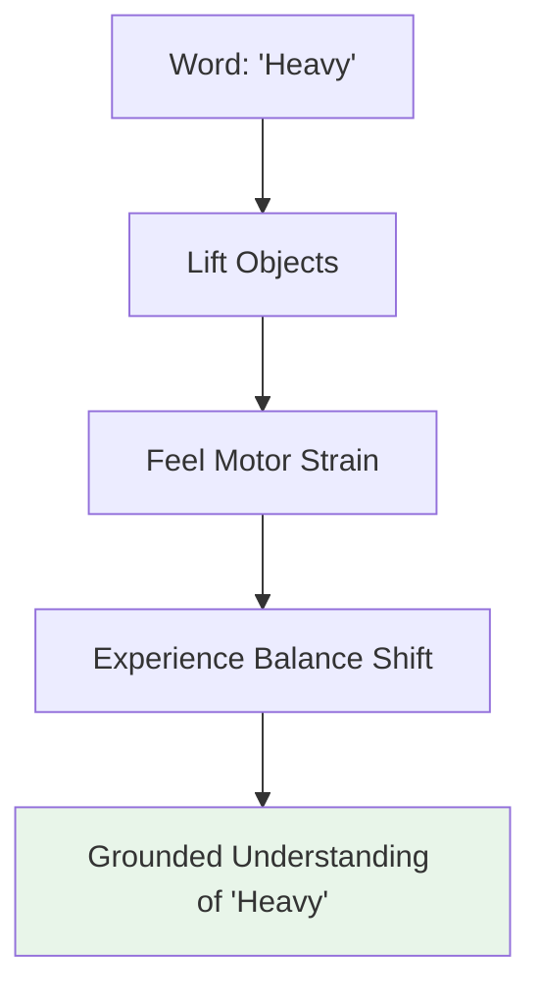

# Chapter 3: Why Embodied Intelligence Matters

## Learning Objectives

By the end of this chapter, you will be able to:

- Explain the theoretical importance of embodiment for intelligence
- Describe how physical interaction shapes learning and understanding
- Identify limitations of disembodied AI systems
- Understand the role of embodiment in advancing general AI
- Explain how humanoid robots contribute to AI research beyond robotics
- Describe real-world benefits of embodied intelligence for society

## Prerequisites

- Chapter 1: What is Physical AI? (understanding of Physical AI concepts)
- Chapter 2: Understanding Humanoid Robots (knowledge of humanoid systems)
- Basic awareness of AI capabilities (language models, image recognition)

## Introduction: Why This Matters

Imagine two AI systems learning about "heavy" objects:

**System A** (Disembodied AI): Analyzes millions of images and text descriptions. It learns that dumbbells, anvils, and elephants are "heavy" based on linguistic associations and visual features.

**System B** (Embodied AI in a Robot): Attempts to lift objects with varying weights. It directly experiences the force required, feels its motors strain, must adjust its balance. It learns "heavy" through physical interaction.

Which system truly *understands* heaviness?

This question sits at the heart of one of AI's deepest challenges: **Can true intelligence exist without a body?**

Many AI researchers believe the answer is no—that intelligence fundamentally arises from the interaction between mind, body, and environment. This is the core insight of **embodied intelligence**, and it's why humanoid robots matter far beyond their practical applications.

In this chapter, we'll explore why physical embodiment is crucial for advancing AI, how it shapes learning and understanding, and what this means for the future of artificial intelligence.

## The Embodiment Hypothesis

### What is the Embodiment Hypothesis?

The **embodiment hypothesis** proposes that intelligence is not purely computational but emerges from the dynamic interaction between an agent's:

1. **Body** (sensors and actuators)
2. **Brain** (processing and decision-making)
3. **Environment** (the physical world)

**Core Claim**: Intelligent behavior cannot be fully understood or created by studying the brain/computation alone. The body and environment are not just inputs and outputs—they are integral to intelligence itself.

### Historical Context

This idea has roots in philosophy and cognitive science:

**Phenomenology** (Edmund Husserl, Maurice Merleau-Ponty):
- Argued that consciousness is fundamentally embodied
- We don't just think *about* the world; we are *in* the world through our bodies

**Ecological Psychology** (James Gibson):
- Introduced concept of "affordances"—action possibilities offered by objects
- A chair "affords" sitting because of the relationship between your body and the chair's structure
- Intelligence is about perceiving and acting on affordances, not building internal models

**Robotics** (Rodney Brooks, 1980s-1990s):
- Challenged classical AI's focus on symbolic reasoning
- Demonstrated that intelligent behavior could emerge from simple body-environment interactions
- Famous claim: "Intelligence without representation"

### The Thought Experiment: Brains in Vats

Imagine a human brain in a vat, receiving all the same sensory signals as a normal human through direct neural stimulation. Would it develop the same intelligence as an embodied human?

**Embodiment theorists argue**: No, because:
- The brain can't test hypotheses through action
- It can't experience consequences of its decisions
- It can't learn through physical interaction
- It lacks the body-environment feedback loop that shapes learning

**This suggests**: Embodiment isn't just useful—it may be necessary for certain kinds of intelligence.

## How Embodiment Shapes Intelligence

Let's explore specific ways that physical embodiment influences learning, understanding, and intelligence:

### 1. Grounded Learning (Connecting Symbols to Reality)

**The Symbol Grounding Problem** (John Searle, 1980):

How do symbols (words, concepts) connect to their real-world meanings?

**Example**: A language model can manipulate the word "apple"—it knows apples are fruits, they can be red or green, they grow on trees. But does it understand "apple" the way you do when you hold one, feel its weight, smell it, bite into it?

**Embodied Solution**:

Physical interaction grounds abstract concepts in sensory-motor experience:



**Research Example**: Robots that learn object categories through manipulation (grasping, pushing, shaking) achieve better generalization than those learning from vision alone (Bohg et al., 2014).

### 2. Learning Through Action (Active Perception)

**Passive vs. Active Learning**:

**Passive**: Observe and absorb information
- A camera captures images of a room
- Limited to viewpoint it's given
- Can't resolve ambiguities

**Active**: Gather information through strategic action
- A robot moves to see object from multiple angles
- Can manipulate objects to reveal hidden features
- Learns what actions provide useful information

**Example—Object Recognition**:

A robot trying to identify a coffee mug:
1. Sees circular shape from above (could be plate, mug, or bowl)
2. **Takes action**: Moves camera to side view
3. Sees handle (eliminates plate and bowl)
4. **Takes action**: Attempts to grasp handle
5. Confirms grasp success (high confidence it's a mug)

**Key Insight**: Intelligence develops not just through observation, but through **active experimentation** in the world.

### 3. Affordance Learning (Understanding Action Possibilities)

**Affordances** are action possibilities that objects offer based on the relationship between object properties and agent capabilities.

**Examples**:
- A cup "affords" grasping (to a robot with a gripper)
- A staircase "affords" climbing (to a bipedal robot, not a wheeled one)
- A door handle "affords" turning (to a robot with articulated fingers)

**Why This Matters**:

Embodied AI learns affordances directly through interaction:

```
DISEMBODIED AI:
Door → Object with properties (wood, rectangular, hinged)

EMBODIED AI:
Door → Obstacle I can open by grasping handle and pulling
     → Barrier I must navigate around if handle is too high
     → Surface I might collide with if I move too quickly
```

**Research Finding**: Robots that learn affordances through interaction can generalize to novel objects better than those trained on visual features alone (Jamone et al., 2016).

### 4. Learning from Consequences (Causal Understanding)

Embodied agents experience the consequences of their actions:

**Example—Learning Fragility**:

**Disembodied approach**: Learn from labeled data that "glass is fragile"
- Knows the association but not the causal mechanism

**Embodied approach**: Drop glass object and observe it shatter
- Experiences cause (dropping) and effect (breaking)
- Learns about:
  - Material properties (brittleness)
  - Force relationships (impact causes fracture)
  - Consequences (irreversibility of breaking)

**Result**: Deeper, more transferable understanding of physical causality.

### 5. Social Intelligence Through Embodiment

Human social intelligence is deeply embodied:
- We read body language, facial expressions, gestures
- We use physical actions to communicate (pointing, nodding)
- We predict others' intentions from their physical movements

**Humanoid Embodiment for Social Intelligence**:

Humanoid robots can develop social intelligence through:

**Shared Embodiment**:
- Similar body structure enables understanding of human actions
- Can learn from human demonstrations through imitation
- Can communicate through familiar gestures and postures

**Physical Interaction**:
- Handshakes, high-fives, collaborative object manipulation
- Learning social norms through physical feedback

**Example**: A humanoid robot learning to hand objects to humans improves through embodied experience:
1. Extends object too far → Human reaches uncomfortably
2. Extends object too close → Invades personal space
3. Learns optimal distance through repeated interaction
4. Develops intuitive sense of comfortable handover distance

This spatial-social intelligence is difficult to learn without embodiment.

## Limitations of Disembodied AI

To understand why embodiment matters, let's examine what disembodied AI struggles with:

### 1. Physical Commonsense Reasoning

**The Problem**: Disembodied AI lacks intuitive understanding of physical laws.

**Examples of Failures**:

**Question**: "If I'm holding a glass of water and turn it upside down, what happens?"
- **Disembodied AI**: May give correct answer from text training
- **But**: Doesn't truly understand gravity, liquid behavior, container function

**Question**: "Can I put a bicycle in a coffee cup?"
- **Disembodied AI**: Might need to explicitly reason about relative sizes
- **Embodied AI**: "Knows" from experience that large objects don't fit in small containers

**Research Findings**: Large language models struggle with physical reasoning tasks that are trivial for embodied agents (Bisk et al., 2020).

### 2. Understanding Causality vs. Correlation

**Disembodied AI** learns from observational data:
- "A always appears with B" → Correlation
- But doesn't know if A causes B, B causes A, or both are caused by C

**Embodied AI** can test causal relationships:
- "When I push A, B moves" → Evidence of causation
- "When I push B, A doesn't move" → Establishes causal direction

**Example**: Learning that flipping a light switch causes lights to turn on:
- Disembodied: Association between switch state and light state
- Embodied: Direct experience of causal mechanism through action

### 3. Transfer Learning and Generalization

**The Challenge**: Applying knowledge to novel situations.

**Disembodied AI**:
- Learns statistical patterns in training data
- Struggles when test situations differ from training

**Embodied AI**:
- Learns underlying physical principles through interaction
- Can apply principles to new situations

**Example—Learning to Open Doors**:

**Disembodied approach**: Trained on 10,000 images of door-opening
- Fails with novel door types, handles, or configurations

**Embodied approach**: Learns through physical interaction
- Discovers principles: "pull/push changes door state," "handle must be grasped"
- Generalizes to novel doors by applying discovered principles

### 4. Real-Time Adaptation

**Disembodied AI**: Processes inputs → Produces outputs
- No feedback on whether output was correct
- Can't adjust based on environmental response

**Embodied AI**: Continuous feedback loop
- Takes action → Observes result → Adjusts next action
- Real-time adaptation to changing conditions

**Example**: Grasping a slipping object
- Disembodied: Computes grasp once, no awareness of slipping
- Embodied: Feels slip through sensors, adjusts grip in real-time

## Embodiment and the Path to General AI

Many researchers believe embodiment is essential for **Artificial General Intelligence (AGI)**—AI with human-level flexibility and understanding.

### Current AI: Narrow and Disembodied

Today's most impressive AI systems (GPT-4, Claude, etc.) are remarkably capable but:
- **Narrow**: Excel at specific tasks (language, vision) but can't transfer knowledge across domains
- **Disembodied**: Learn from data, not from interaction with the physical world
- **Brittle**: Struggle with situations outside their training distribution

### The Embodiment Argument for AGI

**Hypothesis**: Human-level general intelligence requires:

1. **Grounded Understanding**: Concepts grounded in sensory-motor experience
2. **Causal Reasoning**: Learned through physical interaction
3. **Transfer Learning**: Enabled by understanding underlying principles, not just statistical patterns
4. **Common Sense**: Built from experiencing the physical world
5. **Social Intelligence**: Developed through embodied interaction with others

**Implication**: AGI may require physical embodiment, not just more powerful disembodied models.

### The Developmental Robotics Approach

Some researchers are building AI inspired by human infant development:

**Human Development**:
1. Infants learn through physical play and exploration
2. Early learning is deeply embodied (grasping, crawling, walking)
3. Abstract concepts build on embodied foundations
4. Social learning occurs through physical interaction

**Robot Development**:
1. Start with simple embodied behaviors (reaching, grasping)
2. Build progressively complex skills through exploration
3. Ground abstract concepts in physical experience
4. Learn social skills through interaction with humans

**Example**: The iCub humanoid robot project (Italian Institute of Technology):
- Designed as child-sized humanoid for developmental AI research
- Learns through physical interaction and social engagement
- Tests whether human-like intelligence requires human-like embodied development

### Multi-Modal Integration

Embodiment enables integration across sensory modalities:

**Disembodied Systems**:
- Vision system (separate)
- Language system (separate)
- Audio system (separate)
- Limited integration

**Embodied Systems**:
- See object + hear name + touch texture + manipulate → Integrated understanding
- All modalities grounded in shared physical experience
- Natural cross-modal learning ("that smooth, red, round thing is called an apple")

**Research Trend**: Vision-Language-Action (VLA) models represent the cutting edge of multi-modal embodied AI (we'll explore this in Module 4).

## Real-World Impact of Embodied Intelligence

Beyond theoretical importance, embodied intelligence has practical benefits:

### 1. Robotics Applications

**Current Impact**:
- **Warehouse automation**: Amazon, Ocado using embodied AI for inventory management
- **Manufacturing**: Collaborative robots working alongside humans
- **Healthcare**: Surgical robots, rehabilitation assistants, eldercare
- **Agriculture**: Autonomous harvesters, precision farming robots

**Future Potential**:
- **Domestic robots**: Household assistance, cleaning, cooking
- **Search and rescue**: Navigating disaster zones
- **Space exploration**: Robots on Mars, Moon, asteroids
- **Infrastructure maintenance**: Inspection and repair of bridges, power lines

### 2. Advancing AI Research

Embodied intelligence research drives progress in:

**Reinforcement Learning**:
- Physical robots provide rich, grounded learning environments
- Real-world constraints drive development of sample-efficient algorithms

**Transfer Learning**:
- Sim-to-real research improves ability to generalize
- Multi-task learning becomes essential for general-purpose robots

**Safety and Robustness**:
- Physical consequences force development of safer, more reliable AI
- Out-of-distribution detection becomes critical

### 3. Scientific Understanding

Humanoid robots serve as scientific tools for understanding intelligence:

**Hypothesis Testing**:
- Build a robot implementing a theory of intelligence
- Observe if predicted behaviors emerge
- Refine theory based on results

**Example**: Testing embodied cognition theories:
- Hypothesis: Understanding emerges from body-environment interaction
- Test: Compare learning in embodied vs. disembodied systems
- Result: Embodied systems show better generalization (supporting hypothesis)

### 4. Societal Benefits

**Augmenting Human Capabilities**:
- Assistive robots for elderly and disabled
- Telepresence robots for remote collaboration
- Exoskeletons for enhanced strength

**Dangerous and Dull Work**:
- Mining, construction, firefighting
- Cleaning, inspection, monitoring
- Deep-sea and space operations

**Education and Research**:
- Humanoid robots as educational tools
- Platforms for teaching AI, robotics, engineering
- Research testbeds for universities and companies

## Challenges and Limitations

While embodied intelligence offers many advantages, significant challenges remain:

### 1. Data Efficiency

**Problem**: Physical interaction is slow compared to processing digital data.
- A language model can process billions of words in hours
- A robot might execute thousands of interactions in the same time

**Current Research**:
- Simulation for pre-training (sim-to-real transfer)
- Learning from human demonstrations
- Meta-learning to accelerate acquisition of new skills

### 2. Cost and Scalability

**Problem**: Physical robots are expensive ($200k-$700k) and require real-world testing.

**Current Solutions**:
- Simulation environments (Gazebo, Isaac Sim)
- Cloud robotics (shared learning across robot fleet)
- Standardized platforms (reducing development costs)

### 3. Safety and Reliability

**Problem**: Physical mistakes can be dangerous.

**Current Approaches**:
- Extensive simulation testing before real-world deployment
- Force-limited actuators
- Redundant safety systems
- Human oversight

### 4. The Sim-to-Real Gap

**Problem**: Behaviors learned in simulation often fail in reality.

**Why It Happens**:
- Simulators can't perfectly model physics (friction, deformation, etc.)
- Sensor noise and failures not fully captured
- Unexpected environmental variations

**Current Research**:
- Domain randomization (varying simulation parameters to encourage robustness)
- Reality gap minimization (better simulation physics)
- Direct real-world learning (bypassing simulation entirely)

## Integration: Embodiment Throughout This Book

Embodied intelligence is the foundation for everything you'll learn:

**Module 1: ROS 2 (Chapters 4-7)**
- Learn how embodied systems coordinate perception, decision-making, and action
- Understand the software architecture enabling body-mind-environment integration

**Module 2: Digital Twin (Chapters 8-11)**
- Explore simulation as a tool for embodied learning
- Understand how physics simulation grounds robot behavior

**Module 3: NVIDIA Isaac (Chapters 12-15)**
- Discover perception systems that ground understanding in sensor data
- Learn how embodied AI trains through interaction

**Module 4: VLA (Chapters 16-19)**
- See how language models ground in visual and action spaces
- Understand multi-modal embodied intelligence

**Capstone (Chapters 20-22)**
- Integrate all components into a complete embodied AI system
- Build a humanoid that perceives, thinks, and acts

## Questions and Answers

**Q: If embodiment is so important, why are disembodied AI systems like ChatGPT so capable?**

A: Language models demonstrate that significant intelligence can emerge from pattern recognition in data. However, they lack physical grounding, causal understanding, and real-world interaction capabilities. They excel at language-based tasks but struggle with physical reasoning, causality, and tasks requiring real-world experience. Embodied and disembodied AI may represent complementary approaches—language models provide reasoning, embodied systems provide grounding.

**Q: Can't we just give disembodied AI more data to achieve the same understanding?**

A: Some argue yes (the "scaling hypothesis"), but others believe embodiment provides fundamentally different kinds of understanding that can't be captured in passive data. The jury is still out, and this is an active area of research. Current evidence suggests data alone doesn't fully solve physical reasoning, causality, or generalization challenges.

**Q: Is a simulated body (in a physics simulation) enough for embodiment?**

A: Simulation provides many embodiment benefits (action-perception loops, causal learning, affordances), but with limitations. The sim-to-real gap shows that simulated embodiment doesn't fully capture real-world complexity. Ideal approach: simulate for initial learning, then fine-tune with real-world experience.

**Q: Do all AI systems need embodiment?**

A: No. For purely informational tasks (language translation, data analysis, content recommendation), disembodied AI works well. Embodiment matters most for tasks requiring physical interaction, causal reasoning, or integration with the physical world.

**Q: Could virtual reality provide embodiment without physical robots?**

A: VR can provide some embodiment benefits (sensory-motor grounding, spatial understanding, interaction), especially for training and simulation. However, physical reality includes complexities (friction, object deformation, sensor noise) that VR can't fully replicate. VR is a valuable tool but likely not a complete substitute for physical embodiment.

## Connections to Other Modules

- **Chapters 1-2** introduced Physical AI and humanoid robots—this chapter explains their deeper theoretical importance
- **Module 1 (ROS 2)** provides the software framework for implementing embodied intelligence
- **Module 2 (Digital Twin)** explores simulation as a tool for developing embodied AI before physical deployment
- **Module 3 (Isaac)** demonstrates how embodied AI learns through perception and interaction
- **Module 4 (VLA)** showcases cutting-edge multi-modal embodied intelligence that grounds language in vision and action

## Summary

Embodied intelligence represents more than a practical approach to robotics—it's a fundamental insight about the nature of intelligence itself. The key takeaways:

1. **Embodiment Hypothesis**: Intelligence arises from interaction between body, mind, and environment—not from computation alone
2. **Grounding**: Physical embodiment grounds abstract concepts in sensory-motor experience
3. **Active Learning**: Intelligence develops through action and experimentation, not just passive observation
4. **Affordances**: Embodied AI learns what actions are possible based on body-environment relationships
5. **Causality**: Physical interaction enables learning cause-and-effect relationships
6. **Limitations of Disembodied AI**: Struggles with physical commonsense, causality, transfer learning, and real-time adaptation
7. **Path to AGI**: Embodiment may be necessary for human-level general intelligence
8. **Practical Impact**: Already transforming robotics, advancing AI research, and providing scientific insights

Whether or not embodiment is strictly *necessary* for all forms of intelligence remains debated. But it's clear that physical interaction provides forms of understanding, learning, and capability that are difficult or impossible to achieve through disembodied approaches alone.

As you continue through this book, keep the principles of embodied intelligence in mind. You're not just learning to program robots—you're learning to create AI systems that understand the world through physical experience, much like we do.

## References

1. Brooks, R. A. (1991). "Intelligence without representation." *Artificial Intelligence*, 47(1-3), 139-159.
   - Foundational paper on embodied intelligence and behavior-based robotics

2. Pfeifer, R., & Bongard, J. (2006). *How the Body Shapes the Way We Think: A New View of Intelligence*. MIT Press.
   - Comprehensive exploration of embodiment hypothesis

3. Gibson, J. J. (1979). *The Ecological Approach to Visual Perception*. Houghton Mifflin.
   - Foundational work on affordances and ecological psychology

4. Clark, A. (1999). "An embodied cognitive science?" *Trends in Cognitive Sciences*, 3(9), 345-351.
   - Overview of embodied cognition in cognitive science

5. Bisk, Y., et al. (2020). "Experience Grounds Language." *Conference on Empirical Methods in Natural Language Processing*.
   - Evidence that language understanding benefits from embodied experience

6. Bohg, J., et al. (2014). "Data-Driven Grasp Synthesis—A Survey." *IEEE Transactions on Robotics*, 30(2), 289-309.
   - How embodied learning improves manipulation

7. Jamone, L., et al. (2016). "Affordances in psychology, neuroscience, and robotics: a survey." *IEEE Transactions on Cognitive and Developmental Systems*, 10(1), 4-25.
   - Comprehensive survey of affordance learning in robotics

8. Cangelosi, A., & Schlesinger, M. (2015). *Developmental Robotics: From Babies to Robots*. MIT Press.
   - Developmental approach to embodied AI

9. Metta, G., et al. (2010). "The iCub humanoid robot: An open-systems platform for research in cognitive development." *Neural Networks*, 23(8-9), 1125-1134.
   - Major humanoid platform for embodied cognition research

10. Smith, L., & Gasser, M. (2005). "The development of embodied cognition: Six lessons from babies." *Artificial Life*, 11(1-2), 13-29.
    - Insights from human development for embodied AI

---

**End of Part 1: Foundations**

You've now completed the foundational understanding of Physical AI, humanoid robots, and embodied intelligence. You understand:
- What Physical AI is and how it differs from traditional AI
- Why humanoid robots are designed with human-like bodies
- Why physical embodiment matters for intelligence

**Next**: Part 2 begins with Module 1, where you'll learn about ROS 2—the middleware that enables humanoid robots to coordinate their sensors, AI models, and actuators into coherent embodied intelligence.
