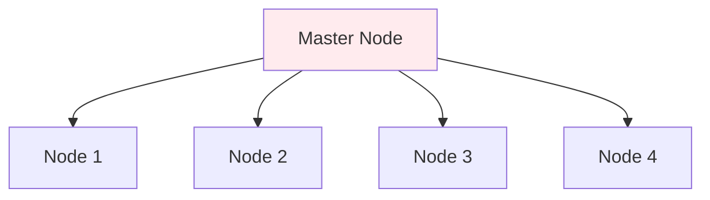
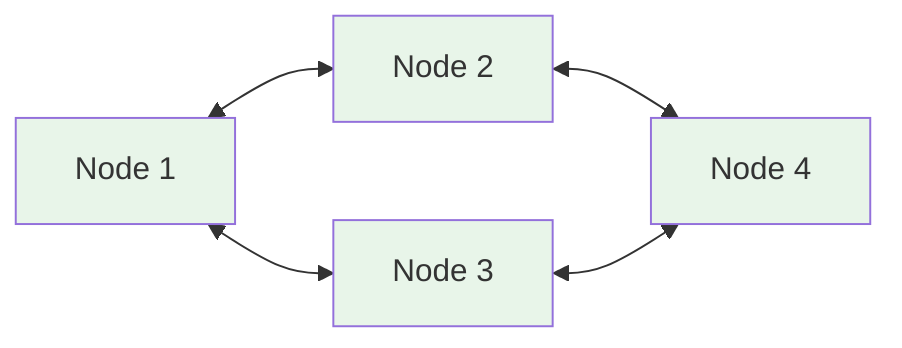
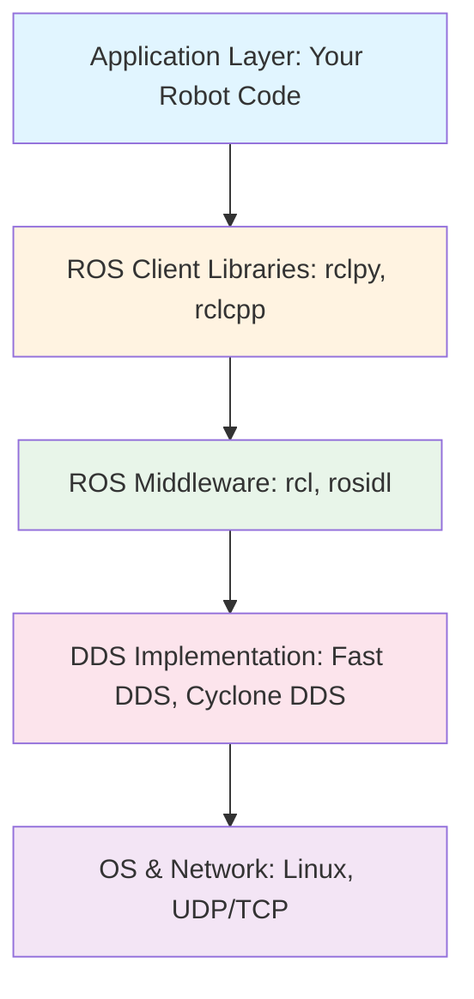
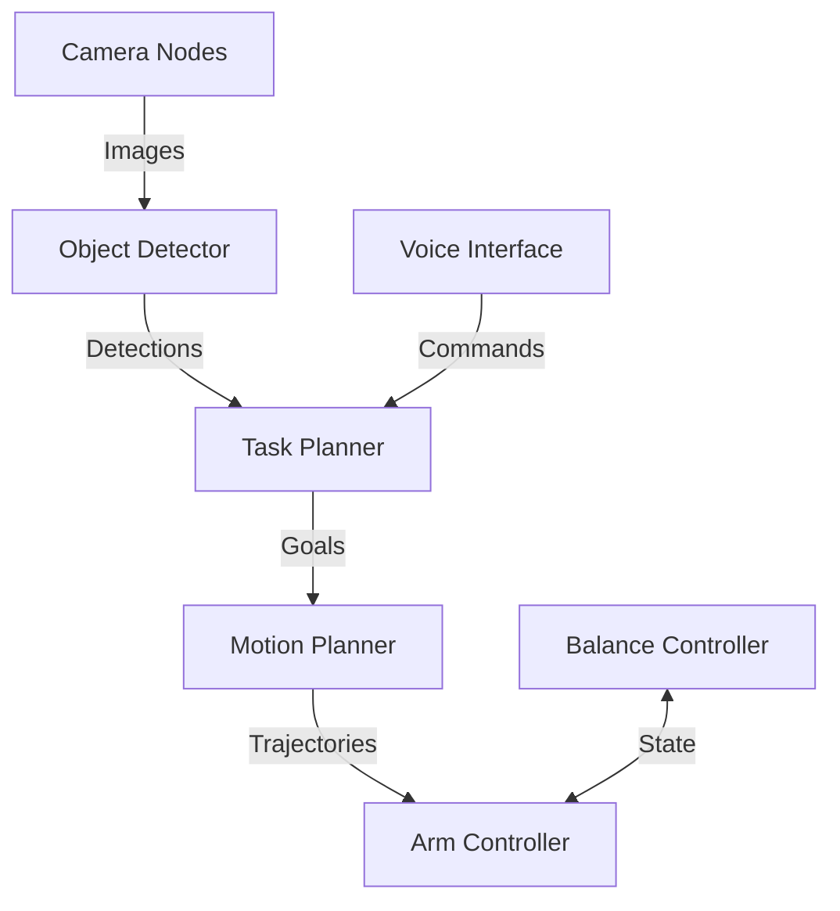

# Chapter 4: Introduction to ROS 2 for Humanoid Robots

## Learning Objectives

By the end of this chapter, you will be able to:

- Explain what ROS 2 is and why it's essential for humanoid robotics
- Describe the core philosophy and architecture of ROS 2
- Understand the difference between ROS 1 and ROS 2
- Identify the major components of a ROS 2 system
- Explain how ROS 2 enables communication between robot subsystems
- Understand the role of middleware in complex robot systems
- Describe real-world applications of ROS 2 in humanoid robots

## Prerequisites

- Chapter 1: What is Physical AI? (understanding perception-action loops)
- Chapter 2: Understanding Humanoid Robots (knowledge of humanoid subsystems)
- Basic understanding of computer programs and processes
- No programming experience required for this conceptual chapter

## Introduction: Why This Matters

Imagine a humanoid robot performing a simple task: picking up a cup from a table.

This seemingly simple action requires coordination between:
- **Vision system**: Detecting the cup and estimating its position
- **Motion planning**: Calculating a collision-free path for the arm
- **Balance controller**: Adjusting torso and legs to maintain stability
- **Grasp controller**: Positioning fingers and applying appropriate grip force
- **Decision maker**: Sequencing the sub-tasks and handling errors

Each of these components might involve different software programs, running at different rates, processing different types of data. How do they communicate? How do they coordinate? How do you prevent them from interfering with each other?

This is where **ROS 2** (Robot Operating System 2) comes in.

ROS 2 is not an operating system like Windows or Linux. Instead, it's a **middleware framework**—a set of software tools and standards that enable different robot components to communicate, coordinate, and collaborate. Think of it as the "nervous system" of the robot, connecting sensors, controllers, and actuators into a cohesive intelligent system.

In this chapter, we'll explore what ROS 2 is, why it's become the de facto standard for robotics research and development, and how it enables the complex coordination required for humanoid robots.

## What is ROS 2?

### Defining ROS 2

**ROS 2** (Robot Operating System 2) is an open-source middleware framework for robot software development. It provides:

1. **Communication Infrastructure**: Standardized ways for programs to exchange data
2. **Development Tools**: Libraries and utilities for common robotics tasks
3. **Package Ecosystem**: Thousands of pre-built components for robotics
4. **Hardware Abstraction**: Uniform interfaces for sensors, actuators, and algorithms

**Key Insight**: ROS 2 lets you focus on robot behavior (what the robot does) rather than plumbing (how components communicate).

### What ROS 2 is NOT

It's important to clarify misconceptions:

**NOT an Operating System**:
- ROS 2 runs *on top of* an OS (typically Ubuntu Linux)
- Doesn't manage hardware resources like a traditional OS
- Instead, it's middleware that sits between your application code and the OS

**NOT a Programming Language**:
- You write code in Python or C++
- ROS 2 provides libraries for these languages

**NOT a Simulation Environment**:
- Though ROS 2 integrates with simulators (Gazebo, Isaac Sim)
- ROS 2 itself handles communication, not physics simulation

**NOT Required for Robotics**:
- You *could* build a robot without ROS 2
- But you'd have to rebuild all the infrastructure ROS 2 provides

**Analogy**: ROS 2 is to robotics what frameworks like React or Django are to web development—not strictly necessary, but they solve common problems and accelerate development.

### Brief History: ROS 1 to ROS 2

**ROS 1** (2007-2020):
- Created at Stanford University (Willow Garage)
- Became the dominant framework for academic robotics research
- Used by thousands of robots worldwide
- But had fundamental limitations for commercial/industrial use

**Why ROS 2 Was Needed**:

ROS 1 limitations:
- **No real-time support**: Couldn't guarantee timing requirements
- **Centralized master node**: Single point of failure
- **Limited security**: No authentication or encryption
- **Python 2 dependency**: Python 2 reached end-of-life in 2020
- **Single-machine focus**: Multi-robot systems were difficult

**ROS 2** (2017-present):
- Complete rewrite addressing ROS 1 limitations
- Real-time capable
- No central master (fully distributed)
- Built-in security
- Multiple language support (Python 3, C++, others)
- Production-ready for commercial robotics

**Migration Status (2024)**:
- Most new projects use ROS 2
- ROS 1 reached end-of-life in 2025
- ROS 2 is the current and future standard

## Core Philosophy of ROS 2

ROS 2 is built on several key principles that shape how you design robot software:

### 1. Modularity and Reusability

**Philosophy**: Break robot functionality into small, independent, reusable modules.

**Example—Vision System**:

Instead of one monolithic program:
```
[Monolithic Vision System]
├── Camera driver
├── Image processing
├── Object detection
├── Pose estimation
└── Visualization
```

ROS 2 encourages separate modules:
```
[Camera Driver] → [Image Processor] → [Object Detector] → [Pose Estimator]
                           ↓
                   [Visualizer]
```

**Benefits**:
- Swap camera types without changing detection code
- Reuse object detector in different robots
- Test each component independently
- Multiple teams can work on different modules simultaneously

### 2. Language Agnosticism

**Philosophy**: Performance-critical code in C++, high-level logic in Python—all working together seamlessly.

**Example—Humanoid Control**:

```
Balance Controller (C++) ← → Motion Planner (Python) ← → Task Planner (Python)
         ↕                            ↕                         ↕
    Joint Controllers (C++)      Vision System (Python)   Voice Interface (Python)
```

- C++ for real-time balance control (needs speed)
- Python for task planning (needs flexibility)
- They communicate through ROS 2 regardless of language

### 3. Distributed System Architecture

**Philosophy**: No single point of failure, support for multi-robot systems.

**ROS 1 Architecture** (Centralized):

Problem: If Master fails, entire system fails.

**ROS 2 Architecture** (Distributed):

Advantage: No single point of failure, nodes discover each other automatically.

### 4. Platform Independence

**Philosophy**: Write once, run on various hardware and operating systems.

**Supported Platforms**:
- **OS**: Ubuntu, Windows, macOS, RTOS (real-time OS)
- **Architecture**: x86, ARM, embedded systems
- **Deployment**: Laptop, embedded computer (Jetson), cloud servers

**Example**: Develop humanoid control on laptop → Test in simulation → Deploy to robot's onboard computer (ARM-based) with no code changes.

### 5. Community-Driven Ecosystem

**Philosophy**: Open-source, collaborative development, shared components.

**ROS 2 Ecosystem**:
- **20,000+** packages available
- **Major contributors**: NASA, BMW, Amazon, Bosch, Open Robotics
- **Commercial support**: Several companies offer ROS 2 consulting and services

## ROS 2 Architecture: The Big Picture

Let's explore how ROS 2 is structured from concept to implementation:

### Layers of ROS 2



Let's examine each layer:

### Layer 1: DDS (Data Distribution Service)

**What is DDS?**
- Industry-standard middleware for real-time systems
- Used in aerospace, defense, automotive, finance
- Provides reliable, real-time communication
- Handles node discovery, data serialization, transport

**Why ROS 2 Uses DDS**:
- Battle-tested in safety-critical systems
- Real-time capable
- Quality-of-Service (QoS) guarantees
- No central broker needed

**Available DDS Implementations**:
- **Fast DDS** (default): eProsima's implementation
- **Cyclone DDS**: Eclipse Foundation's implementation
- **Connext DDS**: RTI's commercial implementation

**Transparency**: You don't typically interact with DDS directly—ROS 2 handles it.

### Layer 2: ROS Middleware (rmw)

**Purpose**: Abstraction layer over DDS

**Benefits**:
- Swap DDS implementations without changing code
- Provides ROS-specific features on top of DDS
- Handles type support and code generation

### Layer 3: ROS Client Libraries

**rclcpp** (C++ Client Library):
- For performance-critical code
- Direct access to all ROS 2 features
- Real-time capable

**rclpy** (Python Client Library):
- For rapid development and high-level logic
- More accessible for beginners
- Extensive standard library ecosystem

**Other Libraries**:
- **rclnodejs**: JavaScript/Node.js
- **rclada**: Ada
- **rclrust**: Rust

### Layer 4: Application Code

**Your robot software**:
- Uses client libraries to create nodes
- Publishes sensor data, subscribes to commands
- Implements robot-specific logic

## Core Concepts in ROS 2

ROS 2 organizes robot software using several key abstractions:

### 1. Nodes

**Definition**: A node is an independent process that performs a specific computation.

**Examples**:
- Camera driver node: Reads images from camera hardware
- Object detector node: Identifies objects in images
- Motion planner node: Calculates arm trajectories
- Balance controller node: Maintains humanoid stability

**Node Characteristics**:
- Runs as separate OS process
- Can be written in different languages
- Communicates with other nodes via ROS 2 mechanisms
- Can be started, stopped, and restarted independently

**Design Guideline**: Each node should have a single, well-defined purpose.

**Good Example**:
```
✓ One node for camera driver
✓ Separate node for image processing
✓ Another node for object detection
```

**Bad Example**:
```
✗ One mega-node doing camera, processing, detection, planning, control
```

### 2. Communication Patterns

ROS 2 provides three primary communication mechanisms:

**Topics** (Publish-Subscribe):
- Continuous data streams
- One-to-many communication
- Example: Camera publishes images to "/camera/image" topic

**Services** (Request-Response):
- Synchronous, one-time queries
- One-to-one communication
- Example: "Is object X present in scene?" → Yes/No

**Actions** (Goal-Feedback-Result):
- Long-running tasks with feedback
- Can be preempted/canceled
- Example: "Navigate to location X" with progress updates

We'll explore each in detail in Chapter 5.

### 3. Messages, Services, and Actions

**Messages**: Data structures for topics
```python
# Example: Pose message
position:
  x: 1.5
  y: 2.3
  z: 0.8
orientation:
  x: 0.0
  y: 0.0
  z: 0.0
  w: 1.0
```

**Service Definitions**: Request + Response
```python
# Example: AddTwoInts service
Request:
  int64 a
  int64 b
Response:
  int64 sum
```

**Action Definitions**: Goal + Feedback + Result
```python
# Example: Navigate action
Goal:
  target_pose
Feedback:
  current_pose
  distance_remaining
Result:
  success
  final_pose
```

### 4. Packages

**Definition**: A package is a directory containing related nodes, libraries, configuration files, and documentation.

**Package Structure**:
```
my_humanoid_package/
├── CMakeLists.txt or setup.py  # Build configuration
├── package.xml                 # Package metadata
├── src/                        # Source code
│   ├── camera_node.py
│   └── detector_node.py
├── launch/                     # Launch files
│   └── humanoid.launch.py
├── config/                     # Configuration files
│   └── params.yaml
└── README.md                   # Documentation
```

**Benefits**:
- Organize related functionality
- Easy to share and reuse
- Version control friendly
- Standard build system integration

### 5. Workspaces

**Definition**: A workspace is a directory where you build and develop multiple packages.

**Typical Workspace Structure**:
```
ros2_ws/
├── src/                        # Source packages
│   ├── package_1/
│   ├── package_2/
│   └── package_3/
├── build/                      # Build artifacts (generated)
├── install/                    # Installed packages (generated)
└── log/                        # Build logs (generated)
```

**Workflow**:
1. Create workspace
2. Clone/create packages in `src/`
3. Build: `colcon build`
4. Source: `source install/setup.bash`
5. Run nodes

## How ROS 2 Enables Humanoid Robotics

Let's see how ROS 2 specifically addresses humanoid robot challenges:

### Challenge 1: Coordinating Multiple Subsystems

**Humanoid Components**:
- Vision (2-4 cameras)
- Balance control
- Motion planning
- Manipulation control
- Voice interface
- Decision making

**Without ROS 2**:
You'd need to manually implement:
- Inter-process communication
- Data serialization
- Synchronization mechanisms
- Error handling
- Discovery (which components are running?)

**With ROS 2**:
- Each component is a node
- They discover each other automatically
- Communication happens through topics/services/actions
- Standard message types ensure compatibility

**Example Architecture**:


### Challenge 2: Real-Time Performance

**Requirement**: Balance control must run at 200-1000 Hz (every 1-5 ms).

**ROS 2 Solution**:
- **Quality of Service (QoS) policies**: Specify reliability, latency, and throughput requirements
- **Real-time executor**: Guarantees timing for critical control loops
- **Priority-based scheduling**: Critical nodes get CPU priority

**Example QoS Configuration**:
```python
# Balance controller needs real-time, reliable data
qos_profile = QoSProfile(
    reliability=ReliabilityPolicy.RELIABLE,
    history=HistoryPolicy.KEEP_LAST,
    depth=1,  # Only most recent value matters
    deadline=Duration(seconds=0.01)  # Must receive within 10ms
)
```

### Challenge 3: Sensor Fusion and Synchronization

**Challenge**: Combine data from multiple sensors captured at different times.

**Example**: Grasp planning needs:
- RGB image (from camera at time T)
- Depth data (from depth sensor at time T)
- Robot pose (from joint encoders at time T)

**ROS 2 Solution**:
- **Message filters**: Synchronize messages from multiple topics
- **Timestamp-based matching**: Align data by capture time
- **Approximate time sync**: Handle sensors with slightly different rates

**Pseudocode**:
```python
# Synchronize RGB and depth images
from message_filters import ApproximateTimeSynchronizer

rgb_sub = Subscriber('/camera/rgb')
depth_sub = Subscriber('/camera/depth')

sync = ApproximateTimeSynchronizer(
    [rgb_sub, depth_sub],
    queue_size=10,
    slop=0.1  # Allow 100ms time difference
)
sync.registerCallback(process_synchronized_images)
```

### Challenge 4: Modular Development and Testing

**Scenario**: Multiple teams developing different subsystems.

**Without ROS 2**:
- Teams interfere with each other
- Difficult to test components independently
- Integration is painful

**With ROS 2**:
- **Standard interfaces**: Teams agree on message types
- **Independent development**: Each team develops their nodes
- **Mock nodes**: Create fake sensor nodes for testing
- **Launch files**: Easily configure which nodes to run
- **Bag files**: Record sensor data, replay for testing

**Example Workflow**:
1. Vision team develops object detector
   - Uses recorded camera data (bag file) for testing
2. Planning team develops motion planner
   - Uses fake object detector outputting test data
3. Integration:
   - Replace fake nodes with real ones
   - Test full system

### Challenge 5: Debugging and Visualization

**ROS 2 Tools**:

**ros2 topic echo**: Print messages in real-time
```bash
ros2 topic echo /camera/image
```

**ros2 node list**: See all running nodes
```bash
ros2 node list
# Output:
# /camera_driver
# /object_detector
# /motion_planner
```

**rqt_graph**: Visualize node connections
```bash
rqt_graph
```

**RViz2**: 3D visualization of robot state and sensor data
- See robot model in real-time
- Visualize camera images, point clouds
- Display planned trajectories

**Foxglove Studio**: Web-based visualization and debugging
- Record and playback data
- Custom layouts and panels
- Collaborative debugging

## ROS 2 in Real-World Humanoid Robots

Let's examine how major humanoid robot projects use ROS 2:

### NASA Valkyrie

**Application**: Humanoid robot for space exploration

**ROS 2 Usage**:
- Locomotion controllers
- Manipulation planning
- Perception pipelines
- Teleoperation interface

**Benefits**:
- Modular design allows swapping algorithms
- Standard interfaces enable collaboration between NASA centers
- Simulation-to-hardware transfer simplified

### TIAGo (PAL Robotics)

**Application**: Service robot for research and industry

**ROS 2 Usage**:
- Complete ROS 2-based navigation stack
- Manipulation control
- Human-robot interaction

**Benefits**:
- Researchers can extend functionality without modifying core system
- Large ecosystem of compatible packages
- Simulation integration (Gazebo)

### Boston Dynamics Spot (Unofficial ROS 2 Driver)

**Application**: Quadruped robot with ROS 2 community support

**ROS 2 Usage** (via community driver):
- High-level control through ROS 2 topics
- Integration with navigation and perception stacks
- Multi-robot coordination

**Benefits**:
- Extends Spot's capabilities beyond factory software
- Enables academic research
- Demonstrates ROS 2's flexibility

### Agility Robotics Digit

**Application**: Bipedal delivery robot

**ROS 2 Integration**:
- Custom ROS 2 interface for third-party developers
- Sensor data publishing
- Task-level control

**Benefits**:
- Customers can customize behavior
- Integration with existing ROS 2 workflows
- Rapid development of applications

## Integration: ROS 2 as the Humanoid Nervous System

ROS 2 serves as the "nervous system" of a humanoid robot:

**Sensory Nerves** (Topics from sensors):
- Camera images
- Joint angles
- Force/torque measurements
- IMU data (orientation, acceleration)

**Motor Nerves** (Topics to actuators):
- Joint position commands
- Velocity commands
- Torque commands

**Brain** (Processing nodes):
- Perception (object detection, SLAM)
- Planning (motion, task, path)
- Control (balance, manipulation)

**Coordination** (ROS 2 infrastructure):
- Ensures messages arrive on time
- Synchronizes related data
- Routes information to correct destinations
- Handles failures gracefully

Just as your nervous system coordinates your body's subsystems without conscious thought, ROS 2 coordinates robot subsystems, allowing developers to focus on high-level intelligence rather than low-level communication details.

## Questions and Answers

**Q: Do I need to learn ROS 2 to build a humanoid robot?**

A: Not strictly required, but highly recommended. You could build custom communication infrastructure, but ROS 2 provides years of engineering effort solving common problems. Most academic and commercial humanoid robots use ROS 2 or similar middleware.

**Q: Is ROS 2 only for Linux?**

A: No. While Linux (Ubuntu) is most common, ROS 2 officially supports Windows and macOS. It can also run on embedded systems and real-time operating systems (RTOS). However, the ecosystem and tooling is most mature on Ubuntu.

**Q: Can ROS 2 handle real-time requirements?**

A: Yes. ROS 2 was designed with real-time in mind, unlike ROS 1. With proper configuration (real-time OS, QoS settings, real-time executor), ROS 2 can meet hard real-time requirements for control loops.

**Q: Is ROS 2 production-ready for commercial robots?**

A: Yes. ROS 2 is used in commercial products (e.g., Amazon warehouse robots, BMW assembly lines). Companies like Canonical, Microsoft, and Amazon actively support ROS 2 development. Security features and long-term support (LTS) releases make it viable for production.

**Q: How steep is the ROS 2 learning curve?**

A: Moderate. Basic concepts (nodes, topics) can be learned in days. Mastering advanced features (actions, lifecycle nodes, real-time executors) takes weeks to months. Python background makes learning easier; C++ background helps for performance-critical code.

**Q: Can I use ROS 2 with non-ROS sensors/actuators?**

A: Yes. You write a driver node that interfaces with the hardware (using manufacturer's SDK or low-level interfaces) and publishes/subscribes to ROS 2 topics. Thousands of driver packages exist for common sensors (cameras, LiDAR, IMUs, etc.).

## Connections to Other Modules

- **Chapter 5** will dive deep into ROS 2 communication mechanisms: topics, services, and actions
- **Chapter 6** will show how to connect Python AI agents to ROS 2 using rclpy
- **Chapter 7** will introduce URDF, ROS 2's format for defining robot structure
- **Module 2 (Digital Twin)** will show how ROS 2 integrates with Gazebo simulation
- **Module 3 (Isaac)** will demonstrate ROS 2 integration with NVIDIA Isaac Sim
- **Module 4 (VLA)** will use ROS 2 to connect language models to robot actions

## Summary

ROS 2 is the foundational middleware for modern robotics, providing the communication infrastructure, tools, and ecosystem needed for complex systems like humanoid robots. The key takeaways:

1. **Middleware Framework**: ROS 2 sits between application code and OS, handling communication and coordination
2. **Evolution from ROS 1**: Addresses limitations with real-time support, distributed architecture, and security
3. **Core Philosophy**: Modularity, language agnosticism, distributed systems, platform independence, community ecosystem
4. **Layered Architecture**: DDS foundation → ROS middleware → Client libraries → Application code
5. **Key Concepts**: Nodes (independent processes), communication patterns (topics/services/actions), packages, workspaces
6. **Humanoid Benefits**: Coordinates subsystems, real-time performance, sensor fusion, modular development, debugging tools
7. **Production Ready**: Used in NASA, commercial companies, research institutions worldwide

ROS 2 is not just a technical tool—it's the foundation that makes modern humanoid robotics practical. By providing standard interfaces and reliable communication, it allows developers to focus on innovation rather than infrastructure.

As you continue through this module, you'll learn to use ROS 2's communication mechanisms, connect AI agents to robot systems, and define robot models—building toward a complete understanding of the humanoid robot's nervous system.

## References

1. Macenski, S., et al. (2022). "Robot Operating System 2: Design, Architecture, and Uses In The Wild." *Science Robotics*, 7(66).
   - Comprehensive overview of ROS 2 design and architecture

2. Maruyama, Y., et al. (2016). "Exploring the performance of ROS2." *IEEE International Conference on Embedded and Real-Time Computing Systems and Applications*, 415-424.
   - Performance analysis of ROS 2 vs ROS 1

3. Open Robotics. (2024). "ROS 2 Documentation." https://docs.ros.org/
   - Official ROS 2 documentation and tutorials

4. Puck, L., et al. (2020). "Real-time control and autonomy for a humanoid robot using ROS 2." *IEEE-RAS International Conference on Humanoid Robots*.
   - Case study of ROS 2 in humanoid robotics

5. Object Management Group. (2015). "Data Distribution Service (DDS) Version 1.4."
   - Official DDS specification underlying ROS 2

6. eProsima. (2024). "Fast DDS Documentation." https://fast-dds.docs.eprosima.com/
   - Documentation for default ROS 2 DDS implementation

7. Gutiérrez, C., et al. (2018). "Towards a distributed and real-time framework for robots: Evaluation of ROS 2.0 communications for real-time robotic applications." *arXiv preprint arXiv:1809.02595*.
   - Real-time capabilities analysis

8. Thomas, D., et al. (2014). "Quality of service policies for ROS 2." *ROSCon*.
   - QoS design in ROS 2

9. Robotics, P. A. L. (2024). "TIAGo Robot Documentation." http://wiki.ros.org/Robots/TIAGo
   - Commercial humanoid robot using ROS 2

---

**Next Chapter**: Chapter 5 will explore the three primary communication patterns in ROS 2—topics, services, and actions—showing you exactly how humanoid subsystems exchange information and coordinate actions.
