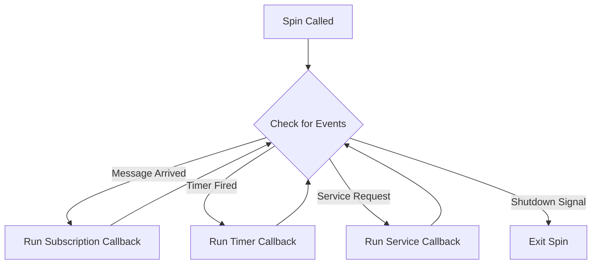
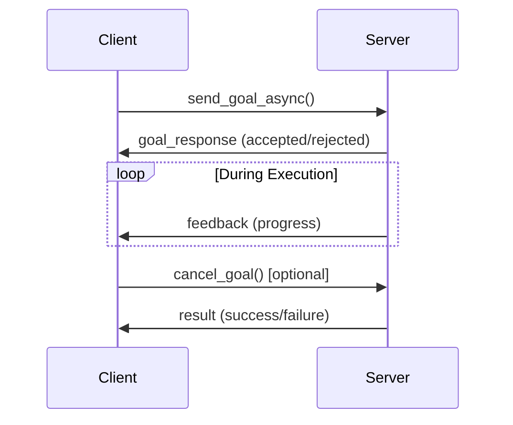
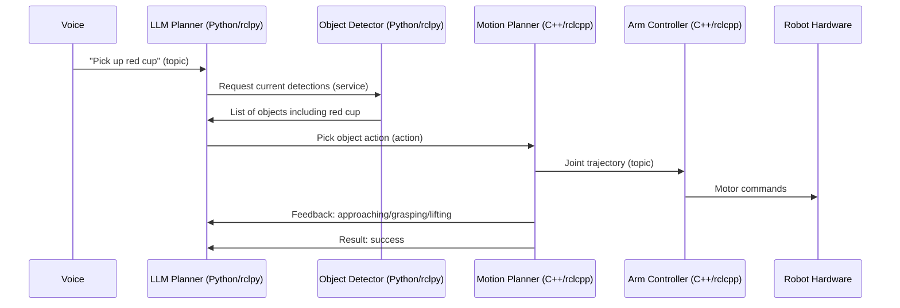

# Chapter 6: Bridging Python Agents to ROS Using rclpy

## Learning Objectives

By the end of this chapter, you will be able to:

- Understand how Python AI agents connect to ROS 2 using rclpy
- Explain the conceptual flow for creating publishers, subscribers, service clients/servers, and action clients
- Describe how to structure a ROS 2 Python node
- Understand the execution model (spinning, callbacks, timers)
- Explain how AI decision-making integrates with ROS 2 communication
- Identify best practices for integrating Python AI code with ROS 2
- Understand the workflow from AI model output to robot action

## Prerequisites

- Chapter 4: Introduction to ROS 2 (ROS 2 architecture and philosophy)
- Chapter 5: Nodes, Topics, Services, and Actions (communication patterns)
- Basic Python familiarity (functions, classes, loops) helpful but not required
- Understanding of AI/ML at a high level (e.g., "neural network takes input, produces output")

## Introduction: Why This Matters

Imagine you've trained a powerful AI model that can identify objects in images. Now you want this AI to control a humanoid robot: when it sees a cup, the robot should grasp it. How do you connect the AI model's decisions to the robot's motors?

This is where **rclpy** (ROS Client Library for Python) becomes essential. It's the bridge between:

- **AI world**: Neural networks, decision trees, language models (Python-based)
- **Robot world**: Sensors, actuators, control systems (ROS 2-based)

Python has become the dominant language for AI/ML development thanks to libraries like TensorFlow, PyTorch, scikit-learn, and Transformers. Meanwhile, ROS 2 provides the infrastructure for robot control. **rclpy** connects these two worlds, enabling:

```
AI Model (PyTorch) → rclpy → ROS 2 → Robot Hardware
```

In this chapter, we'll explore how to use rclpy to create ROS 2 nodes in Python, publish sensor data to AI models, subscribe to AI outputs, and command robot actions—all while maintaining clean separation between AI logic and robot infrastructure.

## What is rclpy?

### Definition

**rclpy** (ROS Client Library for Python) is the Python API for ROS 2. It provides:

1. **Python Classes**: For creating nodes, publishers, subscribers, services, actions
2. **Data Structures**: Python representations of ROS 2 messages
3. **Execution Model**: Tools for managing callback execution and timing
4. **Utilities**: Logging, parameter handling, time management

**Key Insight**: rclpy handles all the complex middleware details (DDS, serialization, discovery), letting you focus on your application logic in clean Python code.

### rclpy vs. rclcpp

ROS 2 provides client libraries for multiple languages:

| Feature | rclpy (Python) | rclcpp (C++) |
|---------|----------------|--------------|
| **Performance** | Moderate | High |
| **Development Speed** | Fast | Slower |
| **Memory Usage** | Higher | Lower |
| **Typical Use** | AI/ML, high-level logic | Real-time control, low-level drivers |
| **Ease of Learning** | Easier | More complex |
| **Ecosystem** | AI/ML libraries (PyTorch, NumPy) | Performance libraries |

**Common Pattern in Humanoid Robots**:
- **Python (rclpy)**: Object detection, task planning, voice processing
- **C++ (rclcpp)**: Balance control, motor drivers, sensor drivers
- **Both working together**: Language interoperability through ROS 2 messages

### Installation and Setup (Conceptual)

While this chapter is conceptual, understanding the setup workflow helps:

**Installation Steps** (Ubuntu Linux):
```bash
# 1. Install ROS 2 (Humble, Iron, or Rolling)
# Follow: https://docs.ros.org/

# 2. rclpy comes with ROS 2 installation
# Verify:
python3 -c "import rclpy; print('rclpy ready!')"

# 3. Create workspace
mkdir -p ~/ros2_ws/src
cd ~/ros2_ws

# 4. Build workspace
colcon build

# 5. Source setup
source ~/ros2_ws/install/setup.bash
```

**Package Structure**:
```
my_robot_package/
├── package.xml              # Package metadata
├── setup.py                 # Python package config
├── my_robot_package/        # Python module
│   ├── __init__.py
│   ├── object_detector.py   # Node 1
│   ├── task_planner.py      # Node 2
│   └── utils.py             # Shared utilities
└── README.md
```

## Core rclpy Concepts

Before diving into code patterns, let's understand key concepts:

### 1. Node Initialization and Shutdown

**Lifecycle of an rclpy Program**:

```
1. Initialize rclpy library
2. Create node instance
3. Do work (publish, subscribe, process callbacks)
4. Spin (process callbacks continuously)
5. Shutdown node
6. Shutdown rclpy library
```

**Conceptual Flow**:
```python
# Initialize ROS 2 Python library
rclpy.init()

# Create a node
node = rclpy.create_node('my_node_name')

# Set up publishers, subscribers, etc.
# ... (we'll cover this next)

# Spin: process callbacks until shutdown
rclpy.spin(node)

# Clean up
node.destroy_node()
rclpy.shutdown()
```

**What is "spinning"?**
- Spinning means: "Check for incoming messages, call callbacks, repeat"
- Without spinning, your node won't receive messages or execute callbacks
- Think of it as the main event loop

### 2. Object-Oriented Node Structure

**Modern Best Practice**: Create nodes as Python classes inheriting from `Node`

**Conceptual Structure**:
```python
class MyRobotNode(Node):
    def __init__(self):
        super().__init__('my_robot_node')

        # Create publishers
        self.setup_publishers()

        # Create subscribers
        self.setup_subscribers()

        # Create timers
        self.setup_timers()

    def setup_publishers(self):
        # Define what this node publishes
        pass

    def setup_subscribers(self):
        # Define what this node subscribes to
        pass

    def setup_timers(self):
        # Define periodic callbacks
        pass
```

**Benefits**:
- Clean organization
- Easy to manage node state
- Standard Python OOP patterns
- Testable (can mock ROS 2 components)

### 3. Callbacks and Execution

**Callback**: A function that runs when an event occurs (message received, timer fires, etc.)

**Types of Callbacks in rclpy**:

1. **Subscription Callback**: Runs when message arrives on subscribed topic
2. **Timer Callback**: Runs periodically (e.g., every 100ms)
3. **Service Callback**: Runs when service request received
4. **Action Callbacks**: Goal callback, feedback callback, result callback

**Execution Model**:


**Important**: Callbacks should be quick. Long-running computations should be done in separate threads.

## Pattern 1: Publishing with rclpy

Let's see how an AI agent publishes its decisions to ROS 2 topics.

### Scenario: Object Detector Publishing Detections

**Goal**: Vision AI detects objects in camera images, publishes results.

**Conceptual Code Structure**:

```python
class ObjectDetectorNode(Node):
    def __init__(self):
        super().__init__('object_detector')

        # Publisher: send detection results
        self.detection_publisher = self.create_publisher(
            DetectionArray,           # Message type
            '/object_detections',     # Topic name
            qos_profile=10            # Queue size
        )

        # Subscriber: receive camera images
        self.image_subscriber = self.create_subscription(
            Image,                    # Message type
            '/camera/image',          # Topic name
            self.image_callback,      # Callback function
            qos_profile=10
        )

        # AI model (conceptual)
        self.ai_model = load_detection_model()

    def image_callback(self, image_msg):
        """Called when image arrives"""

        # Convert ROS image to format AI model expects
        image_array = convert_ros_to_numpy(image_msg)

        # Run AI inference
        detections = self.ai_model.detect(image_array)

        # Convert AI output to ROS message
        detection_msg = create_detection_message(detections)

        # Publish to ROS topic
        self.detection_publisher.publish(detection_msg)

        # Log for debugging
        self.get_logger().info(
            f'Published {len(detections)} detections'
        )
```

**Data Flow**:
```
Camera → /camera/image → image_callback → AI Model →
  Detection Results → /object_detections → Other Nodes
```

### Key Components Explained

**create_publisher()**:
- Creates a publisher object
- Specifies message type (must match topic's type)
- Specifies topic name
- QoS profile (how many messages to buffer)

**create_subscription()**:
- Creates a subscriber object
- Specifies callback function to run on message arrival
- Callback receives message as parameter

**publish()**:
- Sends message to topic
- Non-blocking (returns immediately)
- Message queued for delivery via DDS

**Logging**:
- `self.get_logger().info()` / `.warn()` / `.error()`
- Integrated with ROS 2 logging system
- Can be viewed with `ros2 topic echo /rosout`

### Message Conversion: The Bridge

AI models work with NumPy arrays, PyTorch tensors, or similar. ROS 2 uses custom message types. **Conversion is essential**:

**Image Conversion Example** (conceptual):
```python
def convert_ros_to_numpy(ros_image_msg):
    """Convert ROS Image message to NumPy array"""

    # Extract data from ROS message
    height = ros_image_msg.height
    width = ros_image_msg.width
    encoding = ros_image_msg.encoding  # e.g., 'rgb8'
    data = ros_image_msg.data

    # Reshape to image array
    image_array = np.frombuffer(data, dtype=np.uint8)
    image_array = image_array.reshape(height, width, 3)

    return image_array

def convert_detections_to_ros(detections):
    """Convert AI detections to ROS message"""

    detection_array_msg = DetectionArray()

    for det in detections:
        detection_msg = Detection()
        detection_msg.class_id = det['class']
        detection_msg.confidence = det['score']
        detection_msg.bbox.x = det['box'][0]
        detection_msg.bbox.y = det['box'][1]
        detection_msg.bbox.width = det['box'][2]
        detection_msg.bbox.height = det['box'][3]

        detection_array_msg.detections.append(detection_msg)

    return detection_array_msg
```

**Common Conversion Libraries**:
- **cv_bridge**: ROS ↔ OpenCV (images)
- **sensor_msgs_py**: ROS ↔ NumPy (point clouds, images)
- Custom converters for your specific AI models

## Pattern 2: Subscribing with rclpy

Now let's see how a Python node receives data from ROS 2 topics.

### Scenario: Task Planner Receiving Voice Commands

**Goal**: Receive voice commands from speech recognition node, make decisions.

**Conceptual Code Structure**:

```python
class TaskPlannerNode(Node):
    def __init__(self):
        super().__init__('task_planner')

        # Subscribe to voice commands
        self.voice_subscriber = self.create_subscription(
            String,
            '/voice_command',
            self.voice_command_callback,
            qos_profile=10
        )

        # Subscribe to object detections
        self.detection_subscriber = self.create_subscription(
            DetectionArray,
            '/object_detections',
            self.detection_callback,
            qos_profile=10
        )

        # State management
        self.current_command = None
        self.detected_objects = []
        self.llm_planner = load_language_model()

    def voice_command_callback(self, msg):
        """Process voice commands"""
        command_text = msg.data
        self.get_logger().info(f'Received command: {command_text}')

        # Store for decision making
        self.current_command = command_text

        # Trigger decision making
        self.make_decision()

    def detection_callback(self, msg):
        """Process object detections"""
        self.detected_objects = msg.detections
        self.get_logger().info(
            f'Received {len(self.detected_objects)} detections'
        )

        # Might trigger replanning
        if self.current_command is not None:
            self.make_decision()

    def make_decision(self):
        """AI decision making"""
        if self.current_command is None:
            return

        # Use LLM to generate plan
        prompt = f"""
        Command: {self.current_command}
        Available objects: {self.detected_objects}
        Generate robot action plan.
        """

        plan = self.llm_planner.generate(prompt)

        # Execute plan (next section covers this)
        self.execute_plan(plan)
```

**Key Pattern**: Node maintains state (current_command, detected_objects) updated by callbacks.

### Callback Best Practices

**DO**:
✓ Keep callbacks short and fast
✓ Store data in instance variables for later processing
✓ Use logging for debugging
✓ Handle message fields that might be missing/invalid

**DON'T**:
✗ Do heavy computation in callbacks (blocks other callbacks)
✗ Call blocking functions (network I/O, file I/O)
✗ Assume message fields are always valid
✗ Modify message objects (they're read-only)

**Better Pattern for Heavy Computation**:
```python
import threading

class HeavyComputationNode(Node):
    def __init__(self):
        super().__init__('heavy_computation')

        self.subscriber = self.create_subscription(
            Image, '/camera/image',
            self.image_callback, 10
        )

        self.processing_queue = queue.Queue()
        self.worker_thread = threading.Thread(
            target=self.process_images
        )
        self.worker_thread.start()

    def image_callback(self, msg):
        """Fast: just queue the message"""
        self.processing_queue.put(msg)

    def process_images(self):
        """Slow: runs in separate thread"""
        while rclpy.ok():
            msg = self.processing_queue.get()
            # Heavy AI computation here
            result = self.expensive_ai_model(msg)
            # Publish result
            self.publisher.publish(result)
```

## Pattern 3: Using Timers

Sometimes you need periodic execution independent of message arrival.

### Scenario: Periodic Status Publishing

**Goal**: Publish robot status every second.

**Conceptual Code Structure**:

```python
class StatusPublisherNode(Node):
    def __init__(self):
        super().__init__('status_publisher')

        # Publisher
        self.status_publisher = self.create_publisher(
            RobotStatus, '/robot_status', 10
        )

        # Timer: call callback every 1.0 seconds
        self.timer = self.create_timer(
            timer_period_sec=1.0,
            callback=self.timer_callback
        )

        # State
        self.battery_level = 100.0
        self.mode = 'IDLE'

    def timer_callback(self):
        """Called every second"""

        # Create status message
        status_msg = RobotStatus()
        status_msg.battery_percent = self.battery_level
        status_msg.operating_mode = self.mode
        status_msg.timestamp = self.get_clock().now().to_msg()

        # Publish
        self.status_publisher.publish(status_msg)

        self.get_logger().debug('Published status')

        # Simulate battery drain
        self.battery_level -= 0.1
```

**Use Cases for Timers**:
- Periodic status publishing
- Watchdog timers (check if critical nodes are alive)
- Periodic sensor polling (for sensors without event-driven APIs)
- Animation/visualization updates
- Periodic AI model inference on latest data

## Pattern 4: Calling Services

Now let's see how Python AI agents can query information via services.

### Scenario: Checking if Object is Reachable

**Goal**: Before attempting to grasp, check if object is within reach.

**Conceptual Code Structure**:

```python
class ManipulationPlannerNode(Node):
    def __init__(self):
        super().__init__('manipulation_planner')

        # Service client: check reachability
        self.reachability_client = self.create_client(
            CheckReachability,              # Service type
            '/arm/check_reachability'       # Service name
        )

        # Wait for service to be available
        while not self.reachability_client.wait_for_service(
            timeout_sec=1.0
        ):
            self.get_logger().info(
                'Waiting for reachability service...'
            )

    def plan_grasp(self, object_pose):
        """Plan grasp if object is reachable"""

        # Check reachability first
        if self.is_reachable(object_pose):
            self.get_logger().info('Object reachable, planning grasp')
            return self.compute_grasp(object_pose)
        else:
            self.get_logger().warn('Object not reachable')
            return None

    def is_reachable(self, pose):
        """Call service to check reachability"""

        # Create request
        request = CheckReachability.Request()
        request.target_pose = pose

        # Call service (blocking)
        future = self.reachability_client.call_async(request)

        # Wait for response
        rclpy.spin_until_future_complete(self, future)

        # Get result
        response = future.result()

        if response is None:
            self.get_logger().error('Service call failed')
            return False

        return response.is_reachable
```

**Key Components**:

**create_client()**:
- Creates service client
- Specifies service type and name
- Non-blocking (returns immediately)

**wait_for_service()**:
- Checks if service server is available
- Blocks until available or timeout
- Good practice: wait before calling

**call_async()**:
- Asynchronous service call
- Returns a "future" (promise of eventual result)
- Non-blocking

**spin_until_future_complete()**:
- Spins until future has result
- Blocks but processes other callbacks while waiting

### Alternative: Synchronous Service Call

For simpler code when blocking is acceptable:

```python
def is_reachable_sync(self, pose):
    """Synchronous service call"""

    request = CheckReachability.Request()
    request.target_pose = pose

    # Blocking call with timeout
    try:
        response = self.reachability_client.call(
            request,
            timeout_sec=2.0
        )
        return response.is_reachable
    except Exception as e:
        self.get_logger().error(f'Service call failed: {e}')
        return False
```

**Trade-off**:
- **Async**: More complex, but doesn't block node
- **Sync**: Simpler, but blocks all callbacks during call

## Pattern 5: Providing Services

Python nodes can also act as service servers, responding to requests.

### Scenario: Object Recognition Service

**Goal**: Other nodes can request object classification on demand.

**Conceptual Code Structure**:

```python
class ObjectRecognitionService(Node):
    def __init__(self):
        super().__init__('object_recognition_service')

        # Service server
        self.recognition_service = self.create_service(
            RecognizeObject,               # Service type
            '/vision/recognize_object',    # Service name
            self.recognize_callback        # Callback function
        )

        # AI model
        self.classifier = load_classification_model()

        self.get_logger().info('Recognition service ready')

    def recognize_callback(self, request, response):
        """Handle recognition requests"""

        # Extract image from request
        image = convert_ros_to_numpy(request.image)

        # Run AI classification
        class_id, confidence = self.classifier.predict(image)

        # Populate response
        response.class_name = get_class_name(class_id)
        response.confidence = confidence
        response.success = (confidence > 0.8)

        # Log
        self.get_logger().info(
            f'Recognized: {response.class_name} '
            f'({confidence:.2f})'
        )

        return response
```

**Callback Signature**:
```python
def service_callback(self, request, response):
    # Process request
    # Fill response fields
    return response
```

**Key Points**:
- Callback receives request and response objects
- Modify response object fields
- Return response object
- Callback should complete quickly (< 1 second ideally)

## Pattern 6: Action Clients

Actions enable long-running tasks with feedback—perfect for AI-controlled behaviors.

### Scenario: Autonomous Navigation

**Goal**: Command robot to navigate to target location, receive progress updates.

**Conceptual Code Structure**:

```python
from action_msgs.msg import GoalStatus

class NavigationClient(Node):
    def __init__(self):
        super().__init__('navigation_client')

        # Action client
        self.nav_action_client = ActionClient(
            self,
            NavigateToPose,              # Action type
            '/navigate_to_pose'          # Action name
        )

        self.get_logger().info('Waiting for navigation action server')
        self.nav_action_client.wait_for_server()

    def navigate_to(self, target_pose):
        """Send navigation goal"""

        # Create goal
        goal_msg = NavigateToPose.Goal()
        goal_msg.pose = target_pose

        # Send goal with callbacks
        send_goal_future = self.nav_action_client.send_goal_async(
            goal_msg,
            feedback_callback=self.feedback_callback
        )

        # Register callback for when goal is accepted
        send_goal_future.add_done_callback(
            self.goal_response_callback
        )

    def goal_response_callback(self, future):
        """Called when server accepts/rejects goal"""

        goal_handle = future.result()

        if not goal_handle.accepted:
            self.get_logger().warn('Goal rejected')
            return

        self.get_logger().info('Goal accepted, navigating...')

        # Register callback for result
        result_future = goal_handle.get_result_async()
        result_future.add_done_callback(self.result_callback)

    def feedback_callback(self, feedback_msg):
        """Called periodically with progress updates"""

        feedback = feedback_msg.feedback

        self.get_logger().info(
            f'Distance remaining: {feedback.distance_remaining:.2f}m, '
            f'ETA: {feedback.estimated_time_remaining:.1f}s'
        )

        # Could update UI, replan if stuck, etc.

    def result_callback(self, future):
        """Called when action completes"""

        result = future.result().result
        status = future.result().status

        if status == GoalStatus.STATUS_SUCCEEDED:
            self.get_logger().info(
                f'Navigation succeeded! '
                f'Final pose: {result.final_pose}'
            )
        elif status == GoalStatus.STATUS_ABORTED:
            self.get_logger().error('Navigation aborted')
        elif status == GoalStatus.STATUS_CANCELED:
            self.get_logger().warn('Navigation canceled')
```

**Action Workflow**:


**Three Callback Types**:

1. **Goal Response Callback**: Goal accepted or rejected?
2. **Feedback Callback**: Periodic progress updates
3. **Result Callback**: Final outcome

**Canceling Actions**:
```python
# Cancel ongoing action
goal_handle.cancel_goal_async()
```

## Integrating AI Models with ROS 2

Now let's see complete patterns for AI integration.

### Pattern A: Vision AI Pipeline

**Components**:
1. Camera driver (publishes images)
2. Object detector (AI model)
3. Task planner (uses detections)

**Object Detector Node**:
```python
import torch
from torchvision.models.detection import fasterrcnn_resnet50_fpn

class ObjectDetectorNode(Node):
    def __init__(self):
        super().__init__('object_detector')

        # Load AI model
        self.model = fasterrcnn_resnet50_fpn(pretrained=True)
        self.model.eval()  # Inference mode
        self.device = torch.device('cuda' if torch.cuda.is_available() else 'cpu')
        self.model.to(self.device)

        # ROS 2 interfaces
        self.image_sub = self.create_subscription(
            Image, '/camera/image', self.detect_objects, 10
        )
        self.detection_pub = self.create_publisher(
            DetectionArray, '/detections', 10
        )

    def detect_objects(self, image_msg):
        """Run object detection on image"""

        # Convert ROS → PyTorch tensor
        image_np = convert_ros_to_numpy(image_msg)
        image_tensor = torch.from_numpy(image_np).permute(2, 0, 1)
        image_tensor = image_tensor.float() / 255.0
        image_tensor = image_tensor.unsqueeze(0).to(self.device)

        # Run inference
        with torch.no_grad():
            predictions = self.model(image_tensor)

        # Convert PyTorch → ROS message
        detection_msg = self.convert_predictions(predictions[0])

        # Publish
        self.detection_pub.publish(detection_msg)

    def convert_predictions(self, pred):
        """Convert model output to ROS message"""
        detection_array = DetectionArray()

        for i in range(len(pred['boxes'])):
            det = Detection()
            det.class_id = int(pred['labels'][i])
            det.confidence = float(pred['scores'][i])

            box = pred['boxes'][i].cpu().numpy()
            det.bbox.x = int(box[0])
            det.bbox.y = int(box[1])
            det.bbox.width = int(box[2] - box[0])
            det.bbox.height = int(box[3] - box[1])

            detection_array.detections.append(det)

        return detection_array
```

**Key Integration Points**:
- AI model loaded once in `__init__()`
- Inference runs in callback (fast, typically 10-50ms)
- Input: ROS message → NumPy/Tensor
- Output: Tensor → ROS message

### Pattern B: Language Model Decision Making

**Components**:
1. Voice interface (publishes commands)
2. LLM planner (generates action plans)
3. Execution nodes (carry out plans)

**LLM Planner Node**:
```python
from transformers import pipeline

class LLMPlannerNode(Node):
    def __init__(self):
        super().__init__('llm_planner')

        # Load language model
        self.llm = pipeline(
            'text-generation',
            model='gpt2',  # Conceptual example
            device=0 if torch.cuda.is_available() else -1
        )

        # ROS interfaces
        self.command_sub = self.create_subscription(
            String, '/voice_command',
            self.process_command, 10
        )

        self.plan_pub = self.create_publisher(
            TaskPlan, '/task_plan', 10
        )

        # State
        self.world_state = {}

    def process_command(self, msg):
        """Generate plan from natural language command"""

        command = msg.data

        # Create prompt with context
        prompt = self.create_prompt(command, self.world_state)

        # Generate plan with LLM
        response = self.llm(
            prompt,
            max_length=100,
            num_return_sequences=1
        )[0]['generated_text']

        # Parse LLM output into structured plan
        plan = self.parse_llm_output(response)

        # Publish plan
        plan_msg = TaskPlan()
        plan_msg.steps = plan
        self.plan_pub.publish(plan_msg)

        self.get_logger().info(f'Generated plan: {plan}')

    def create_prompt(self, command, world_state):
        """Format prompt for LLM"""
        return f"""
        You are a robot task planner.

        Command: {command}

        Current world state:
        - Objects visible: {world_state.get('objects', [])}
        - Robot location: {world_state.get('location', 'unknown')}
        - Battery: {world_state.get('battery', 0)}%

        Generate a step-by-step plan to execute the command.
        Format: numbered list of actions.
        """

    def parse_llm_output(self, llm_response):
        """Convert LLM text to structured actions"""
        # Parse LLM's numbered list into action steps
        # (Implementation depends on LLM output format)
        steps = []
        # ... parsing logic ...
        return steps
```

**Pattern**:
- LLM provides high-level reasoning
- Output is parsed into structured actions
- Actions sent to execution layer via topics/actions
- World state maintained by subscribing to sensor topics

### Pattern C: Reinforcement Learning Agent

**Components**:
1. Environment sensors (state observation)
2. RL agent (policy network)
3. Action executors

**RL Agent Node**:
```python
import numpy as np

class RLAgentNode(Node):
    def __init__(self):
        super().__init__('rl_agent')

        # Load trained policy
        self.policy_network = load_policy_model('policy.pth')

        # State observation
        self.state_sub = self.create_subscription(
            RobotState, '/robot_state',
            self.state_callback, 10
        )

        # Action output
        self.action_pub = self.create_publisher(
            RobotAction, '/rl_action', 10
        )

        # Current state
        self.current_state = None

        # Timer for policy execution
        self.timer = self.create_timer(0.1, self.execute_policy)  # 10 Hz

    def state_callback(self, msg):
        """Update state observation"""
        self.current_state = self.msg_to_state_vector(msg)

    def execute_policy(self):
        """Run policy to select action"""
        if self.current_state is None:
            return

        # Query policy network
        action = self.policy_network.get_action(self.current_state)

        # Convert to ROS action message
        action_msg = self.action_to_msg(action)

        # Publish
        self.action_pub.publish(action_msg)

    def msg_to_state_vector(self, msg):
        """Convert ROS message to RL state representation"""
        state = np.array([
            msg.joint_positions,
            msg.joint_velocities,
            msg.imu_orientation,
            msg.foot_contacts
        ]).flatten()
        return state

    def action_to_msg(self, action):
        """Convert RL action to ROS message"""
        msg = RobotAction()
        msg.joint_torques = action.tolist()
        return msg
```

**Pattern**:
- State observation via subscriptions
- Policy execution via timer (fixed frequency)
- Actions published as commands
- Suitable for continuous control (walking, balance)

## Best Practices for AI-ROS Integration

### 1. Separate AI Logic from ROS Plumbing

**Bad**:
```python
# AI logic mixed with ROS details
def image_callback(self, msg):
    image = self.bridge.imgmsg_to_cv2(msg)
    resized = cv2.resize(image, (224, 224))
    normalized = resized / 255.0
    tensor = torch.from_numpy(normalized).permute(2, 0, 1)
    output = self.model(tensor.unsqueeze(0))
    result_msg = Detection()
    result_msg.class_id = int(torch.argmax(output))
    self.pub.publish(result_msg)
```

**Good**:
```python
# Separate concerns
def image_callback(self, msg):
    """ROS interface"""
    image = self.convert_ros_image(msg)
    result = self.run_inference(image)
    self.publish_result(result)

def run_inference(self, image):
    """Pure AI logic - no ROS dependencies"""
    preprocessed = self.preprocess(image)
    output = self.model(preprocessed)
    return self.postprocess(output)
```

**Benefits**:
- Easier to test AI code independently
- Can swap ROS interface without touching AI logic
- Clearer code organization

### 2. Handle Message Timing and Synchronization

**Challenge**: Sensors publish at different rates, timestamps may not align.

**Solution**: Use message filters for synchronization

```python
from message_filters import ApproximateTimeSynchronizer, Subscriber

class SensorFusionNode(Node):
    def __init__(self):
        super().__init__('sensor_fusion')

        # Subscribers with message filters
        rgb_sub = Subscriber(self, Image, '/camera/rgb')
        depth_sub = Subscriber(self, Image, '/camera/depth')

        # Synchronize messages
        sync = ApproximateTimeSynchronizer(
            [rgb_sub, depth_sub],
            queue_size=10,
            slop=0.1  # 100ms tolerance
        )
        sync.registerCallback(self.fusion_callback)

    def fusion_callback(self, rgb_msg, depth_msg):
        """Receives synchronized RGB and depth"""
        # Both messages captured at approximately same time
        rgb_image = convert_ros_to_numpy(rgb_msg)
        depth_image = convert_ros_to_numpy(depth_msg)

        # Fuse data for AI processing
        fused = self.fusion_model(rgb_image, depth_image)
        # ...
```

### 3. Manage AI Model Lifecycle

**Initialization**:
```python
def __init__(self):
    super().__init__('ai_node')

    # Load model once
    self.get_logger().info('Loading AI model...')
    self.model = self.load_model()
    self.get_logger().info('Model loaded successfully')

    # Warm-up inference (first run is often slow)
    dummy_input = self.create_dummy_input()
    _ = self.model(dummy_input)
    self.get_logger().info('Model warmed up')
```

**Resource Management**:
```python
def __del__(self):
    """Clean up AI resources"""
    if hasattr(self, 'model'):
        del self.model
        torch.cuda.empty_cache()  # Free GPU memory
```

### 4. Monitor Performance

**Log Inference Time**:
```python
import time

def run_inference(self, image):
    start_time = time.time()

    result = self.model(image)

    inference_time = (time.time() - start_time) * 1000  # ms
    self.get_logger().debug(f'Inference time: {inference_time:.1f}ms')

    # Warn if too slow
    if inference_time > 100:  # 100ms threshold
        self.get_logger().warn(
            f'Slow inference: {inference_time:.1f}ms'
        )

    return result
```

**Publish Diagnostics**:
```python
# Publish performance metrics
diag_msg = DiagnosticStatus()
diag_msg.name = 'object_detector'
diag_msg.level = DiagnosticStatus.OK
diag_msg.message = f'Inference: {inference_time:.1f}ms'
diag_msg.values.append(
    KeyValue(key='fps', value=str(1000 / inference_time))
)
```

### 5. Graceful Degradation

**Handle Model Failures**:
```python
def run_inference(self, image):
    try:
        result = self.model(image)
        return result
    except Exception as e:
        self.get_logger().error(f'Inference failed: {e}')
        # Return safe default
        return self.get_default_result()

def get_default_result(self):
    """Fallback when AI fails"""
    # Empty detections, neutral action, etc.
    return DetectionArray()
```

## Integration: From AI to Robot Action

Let's trace a complete flow from AI decision to robot movement:

**Scenario**: "Pick up the red cup"

**Step-by-Step Flow**:



**Code Integration Points**:

1. **Voice → LLM** (Python subscriber):
   ```python
   def voice_callback(self, msg):
       self.current_command = msg.data
       self.plan_task()
   ```

2. **LLM → Vision** (Python service client):
   ```python
   def get_objects(self):
       request = GetObjects.Request()
       response = self.vision_client.call(request)
       return response.objects
   ```

3. **LLM → Planner** (Python action client):
   ```python
   goal = PickObject.Goal()
   goal.object_id = 'red_cup'
   self.action_client.send_goal_async(goal, feedback_callback=self.update_progress)
   ```

4. **Planner → Control** (C++ publisher, but conceptually):
   - Motion planner publishes trajectory
   - Control subscribes and executes

**Result**: Natural language command → AI understanding → Robot action, all coordinated through ROS 2 and rclpy.

## Questions and Answers

**Q: Do I need to learn C++ to use ROS 2?**

A: Not necessarily. Python (rclpy) is sufficient for high-level AI logic, task planning, and perception. However, learning C++ (rclcpp) is beneficial for performance-critical components (real-time control, sensor drivers).

**Q: Can Python handle real-time control?**

A: Python has limitations for hard real-time (< 1ms deadlines) due to garbage collection and interpreter overhead. Use Python for soft real-time (10-100ms acceptable) and C++ for hard real-time.

**Q: How do I debug rclpy nodes?**

A: Several approaches:
- **Logging**: Use `self.get_logger().info()` liberally
- **ros2 topic echo**: View messages in terminal
- **rqt_graph**: Visualize node connections
- **Python debugger**: Use `pdb` or IDE debugger
- **Unit tests**: Test nodes with mock ROS components

**Q: Can I use ROS 2 with Google Colab or Jupyter notebooks?**

A: Challenging. ROS 2 expects long-running nodes, not interactive cells. Better approach: develop nodes as .py files, test locally, train models in Colab/Jupyter, then load trained models in ROS 2 nodes.

**Q: What about ROS 2 and Docker?**

A: Excellent combination! Docker containers for:
- Consistent development environment
- Deployment to robots
- Separating AI environment (CUDA, PyTorch) from ROS environment
- Multi-container setups (one container per subsystem)

**Q: How do I handle different ROS 2 message versions?**

A: ROS 2 uses interfaces (message/service/action definitions) that can evolve. Best practices:
- Pin interface package versions in package.xml
- Use message version checks
- Design for backward compatibility

## Connections to Other Modules

- **Chapter 5** introduced topics, services, actions—this chapter showed how to use them with rclpy
- **Chapter 7** will introduce URDF and robot state publisher (Python tools)
- **Module 2** will use rclpy to interface with Gazebo simulation
- **Module 3** will demonstrate Isaac ROS packages (many written with rclpy)
- **Module 4** will show VLA models integrated via rclpy action clients

## Summary

rclpy is the bridge connecting Python AI to ROS 2 robot systems. The key takeaways:

1. **rclpy Purpose**: Python API for creating ROS 2 nodes, enabling AI/ML integration
2. **Node Structure**: Class-based nodes inheriting from `Node`, with clear separation of concerns
3. **Publishing**: AI outputs → ROS messages → Topics
4. **Subscribing**: ROS messages → Callbacks → AI inputs
5. **Services**: Request-response for queries and configuration
6. **Actions**: Goal-feedback-result for long-running AI-controlled behaviors
7. **Message Conversion**: Bridge between ROS types and NumPy/PyTorch tensors
8. **Best Practices**: Separate AI logic from ROS plumbing, handle timing, monitor performance, graceful degradation
9. **Integration Patterns**: Vision pipelines, LLM planners, RL agents—all connected via rclpy

With rclpy, you can leverage Python's rich AI/ML ecosystem (PyTorch, TensorFlow, Transformers, scikit-learn) while seamlessly integrating with ROS 2's robot control infrastructure. This combination enables sophisticated AI-driven behaviors in humanoid robots.

In the next chapter, we'll explore URDF—how to define the physical structure of your humanoid robot so that ROS 2 can reason about its kinematics and dynamics.

## References

1. Open Robotics. (2024). "rclpy API Documentation." https://docs.ros.org/en/rolling/p/rclpy/
   - Official rclpy API reference

2. Macenski, S., et al. (2022). "Robot Operating System 2: Design, Architecture, and Uses In The Wild." *Science Robotics*, 7(66).
   - ROS 2 architecture including Python client library

3. Paszke, A., et al. (2019). "PyTorch: An Imperative Style, High-Performance Deep Learning Library." *NeurIPS*.
   - PyTorch integration with robotics applications

4. Abadi, M., et al. (2016). "TensorFlow: A System for Large-Scale Machine Learning." *OSDI*.
   - TensorFlow in robotic systems

5. Wolf, J., et al. (2020). "Transformers for Vision-Based Robotics." *IEEE Robotics and Automation Letters*.
   - Modern AI models in robotics via Python

6. Open Robotics. (2024). "ROS 2 Python Examples." https://github.com/ros2/examples/tree/rolling/rclpy
   - Official example code for rclpy patterns

7. Quigley, M., et al. (2009). "ROS: An Open-Source Robot Operating System." *ICRA Workshop*.
   - Original ROS design influencing rclpy architecture

8. Browning, B., et al. (2021). "Integrating Deep Learning with ROS." *ROSCon*.
   - Best practices for AI-ROS integration

---

**Next Chapter**: Chapter 7 will introduce URDF (Unified Robot Description Format), showing how to define your humanoid robot's physical structure, joints, and sensors in a format that ROS 2 can understand and visualize.
