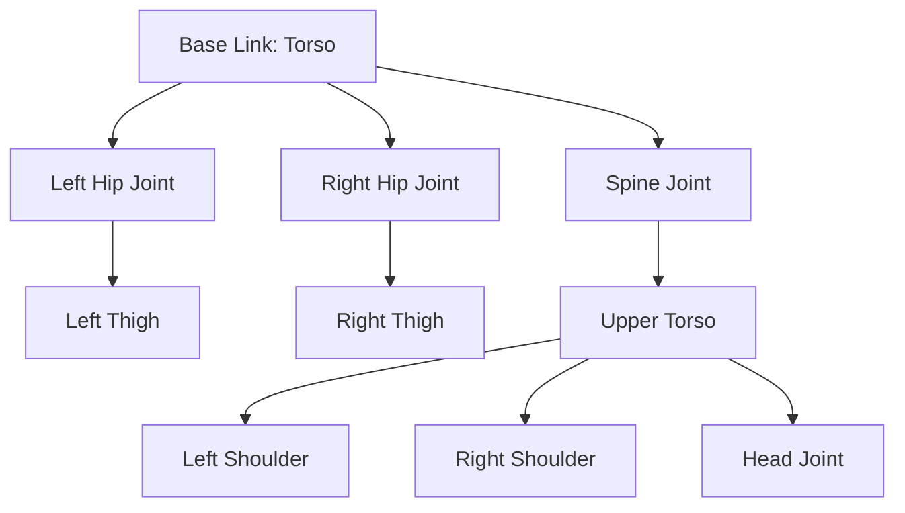
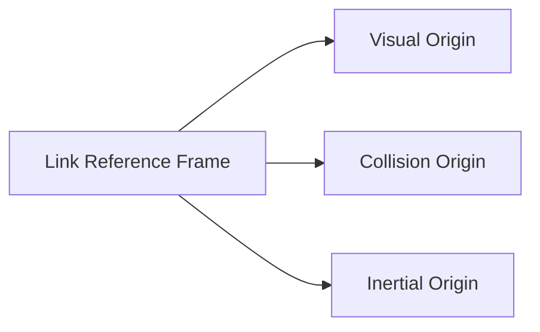
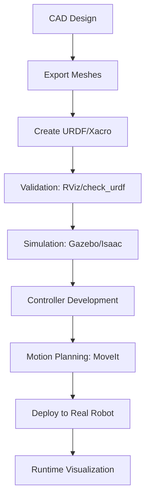

# Chapter 7: URDF: Modeling a Humanoid in Software

## Learning Objectives

By the end of this chapter, you will be able to:

- Explain what URDF is and why it's essential for robot software
- Understand the structure of URDF files (links and joints)
- Describe how URDF defines robot kinematics and geometry
- Explain how ROS 2 uses URDF for visualization and control
- Understand the relationship between physical robot and URDF model
- Identify best practices for creating maintainable URDF files
- Explain how URDF enables simulation and motion planning

## Prerequisites

- Chapter 4: Introduction to ROS 2 (ROS 2 architecture)
- Chapter 2: Understanding Humanoid Robots (robot subsystems)
- Basic understanding of 3D coordinates and rotations
- Familiarity with XML structure helpful but not required

## Introduction: Why This Matters

Imagine you're writing software to control a humanoid robot's arm. To plan a motion from Point A to Point B, you need to answer questions like:

- How long is the upper arm? The forearm?
- Where is the elbow joint? The wrist joint?
- What are the joint angle limits (can't bend elbow backward)?
- Where are the cameras mounted? Their field of view?
- What's the shape of the hand for collision checking?

You could hard-code these values in your motion planning software:
```python
UPPER_ARM_LENGTH = 0.3  # meters
FOREARM_LENGTH = 0.25
ELBOW_POSITION = [0, 0, 0.3]
# ... hundreds more constants
```

But this approach has problems:
- Different robots require different code
- Visualization tools can't display the robot
- Simulation needs separate model definitions
- No standardization across tools

**URDF (Unified Robot Description Format)** solves this by providing a standard, declarative way to describe robot structure. One URDF file can be used by:

- Motion planning (kinematics)
- Visualization (RViz)
- Simulation (Gazebo, Isaac Sim)
- Control systems
- Collision checking

In this chapter, we'll explore how URDF represents humanoid robots in software, enabling all these tools to work together seamlessly.

## What is URDF?

### Definition

**URDF** (Unified Robot Description Format) is an XML-based format for describing:

1. **Mechanical Structure**: Links (rigid bodies) and joints (connections)
2. **Geometry**: Visual appearance and collision shapes
3. **Physical Properties**: Mass, inertia, friction
4. **Sensors**: Cameras, LiDAR, IMUs
5. **Kinematic Chain**: Parent-child relationships forming a tree structure

**Key Insight**: URDF is a **declarative description**, not imperative code. You describe *what* the robot is, not *how* to control it.

### URDF Structure Overview

A URDF file consists of two primary elements:

**Links** (Rigid Bodies):
- Physical components that don't deform
- Have mass, inertia, geometry
- Examples: torso, upper arm, forearm, hand, thigh, shin, foot

**Joints** (Connections):
- Connect two links (parent and child)
- Define motion constraints
- Types: fixed, revolute (hinge), prismatic (sliding), continuous

**Tree Structure**:


## URDF Components: Links

### Link Definition

A **link** represents a rigid body part of the robot.

**Conceptual Structure**:
```xml
<link name="upper_arm_left">
  <!-- Visual: how it looks (for display) -->
  <visual>
    <geometry>
      <cylinder length="0.3" radius="0.05"/>
    </geometry>
    <origin xyz="0 0 0.15" rpy="0 0 0"/>
    <material name="grey"/>
  </visual>

  <!-- Collision: simplified shape (for collision checking) -->
  <collision>
    <geometry>
      <cylinder length="0.3" radius="0.06"/>  <!-- Slightly larger -->
    </geometry>
    <origin xyz="0 0 0.15" rpy="0 0 0"/>
  </collision>

  <!-- Inertial: physical properties -->
  <inertial>
    <mass value="2.5"/>  <!-- kg -->
    <origin xyz="0 0 0.15" rpy="0 0 0"/>
    <inertia ixx="0.01" ixy="0" ixz="0" iyy="0.01" iyz="0" izz="0.002"/>
  </inertial>
</link>
```

### Link Components Explained

**Visual Geometry**:
- Defines appearance for visualization (RViz, Gazebo UI)
- Can use primitive shapes (box, cylinder, sphere) or mesh files (STL, DAE)
- `origin`: Position and orientation relative to link's reference frame
- `material`: Color or texture

**Collision Geometry**:
- Simplified shapes for fast collision detection
- Often simpler than visual (e.g., cylinders instead of detailed meshes)
- Slightly larger than visual for safety margins
- Critical for motion planning and simulation

**Inertial Properties**:
- `mass`: Link mass in kilograms
- `inertia`: 3x3 inertia tensor (resistance to rotation)
- Required for physics simulation
- Can be computed from CAD software or estimated

**Coordinate Frames**:


Each link has a reference frame, and visual/collision/inertial can be offset from it.

## URDF Components: Joints

### Joint Definition

A **joint** connects two links and defines their relative motion.

**Conceptual Structure**:
```xml
<joint name="elbow_left" type="revolute">
  <!-- Parent link -->
  <parent link="upper_arm_left"/>

  <!-- Child link -->
  <child link="forearm_left"/>

  <!-- Joint origin (where joint is located on parent) -->
  <origin xyz="0 0 0.3" rpy="0 0 0"/>

  <!-- Axis of rotation -->
  <axis xyz="0 1 0"/>  <!-- Y-axis (pitch) -->

  <!-- Joint limits -->
  <limit lower="-2.0" upper="0.0" effort="100" velocity="2.0"/>

  <!-- Dynamics -->
  <dynamics damping="0.7" friction="0.0"/>
</joint>
```

### Joint Types

**1. Fixed Joint**:
- No movement
- Rigidly connects two links
- Example: Camera mounted on head

```xml
<joint name="camera_mount" type="fixed">
  <parent link="head"/>
  <child link="camera"/>
  <origin xyz="0.05 0 0.1" rpy="0 0 0"/>
</joint>
```

**2. Revolute Joint** (Hinge):
- Rotation around one axis
- Has angle limits
- Example: Elbow, knee, shoulder pitch

```xml
<joint name="knee_right" type="revolute">
  <parent link="thigh_right"/>
  <child link="shin_right"/>
  <origin xyz="0 0 -0.4" rpy="0 0 0"/>
  <axis xyz="0 1 0"/>
  <limit lower="0.0" upper="2.5" effort="200" velocity="3.0"/>
</joint>
```

**3. Continuous Joint**:
- Rotation around one axis
- No angle limits (can rotate 360°)
- Example: Wheel axles

**4. Prismatic Joint** (Sliding):
- Linear motion along one axis
- Has position limits
- Example: Telescoping antenna, elevator mechanism

**5. Planar Joint**:
- Motion in a 2D plane
- Rarely used in humanoids

**6. Floating Joint**:
- Unconstrained 6-DOF motion
- Used for mobile bases or free-floating objects

### Joint Parameters

**Axis**:
- Direction of motion (rotation or translation)
- Specified as unit vector: `<axis xyz="0 1 0"/>`
- X=1,0,0 (roll), Y=0,1,0 (pitch), Z=0,0,1 (yaw)

**Limits**:
- `lower`: Minimum joint value (rad or m)
- `upper`: Maximum joint value
- `effort`: Maximum force/torque (N or Nm)
- `velocity`: Maximum speed (rad/s or m/s)

**Dynamics**:
- `damping`: Velocity-dependent resistance
- `friction`: Position-dependent resistance
- Used in physics simulation

## Humanoid URDF Example: Simplified Arm

Let's build a simplified humanoid arm step by step.

### Step 1: Base Link (Torso)

```xml
<robot name="humanoid_arm">
  <!-- Root link -->
  <link name="torso">
    <visual>
      <geometry>
        <box size="0.3 0.5 0.6"/>  <!-- width, depth, height -->
      </geometry>
      <material name="blue">
        <color rgba="0 0 1 1"/>
      </material>
    </visual>

    <collision>
      <geometry>
        <box size="0.3 0.5 0.6"/>
      </geometry>
    </collision>

    <inertial>
      <mass value="30.0"/>
      <inertia ixx="1.0" ixy="0" ixz="0" iyy="1.0" iyz="0" izz="0.5"/>
    </inertial>
  </link>
```

### Step 2: Shoulder Joint

```xml
  <!-- Shoulder joint (pitch - up/down) -->
  <joint name="shoulder_pitch" type="revolute">
    <parent link="torso"/>
    <child link="upper_arm"/>
    <origin xyz="0 -0.25 0.2" rpy="0 0 0"/>  <!-- Side of torso -->
    <axis xyz="0 1 0"/>  <!-- Pitch axis -->
    <limit lower="-1.57" upper="3.14" effort="100" velocity="2.0"/>
  </joint>
```

### Step 3: Upper Arm Link

```xml
  <link name="upper_arm">
    <visual>
      <geometry>
        <cylinder length="0.3" radius="0.05"/>
      </geometry>
      <origin xyz="0 0 -0.15" rpy="0 0 0"/>  <!-- Center at joint -->
      <material name="grey">
        <color rgba="0.7 0.7 0.7 1"/>
      </material>
    </visual>

    <collision>
      <geometry>
        <cylinder length="0.3" radius="0.06"/>
      </geometry>
      <origin xyz="0 0 -0.15" rpy="0 0 0"/>
    </collision>

    <inertial>
      <mass value="2.5"/>
      <origin xyz="0 0 -0.15" rpy="0 0 0"/>
      <inertia ixx="0.02" ixy="0" ixz="0" iyy="0.02" iyz="0" izz="0.001"/>
    </inertial>
  </link>
```

### Step 4: Elbow Joint

```xml
  <joint name="elbow" type="revolute">
    <parent link="upper_arm"/>
    <child link="forearm"/>
    <origin xyz="0 0 -0.3" rpy="0 0 0"/>  <!-- End of upper arm -->
    <axis xyz="0 1 0"/>
    <limit lower="0.0" upper="2.5" effort="80" velocity="2.0"/>
  </joint>
```

### Step 5: Forearm and Hand

```xml
  <link name="forearm">
    <!-- Similar structure to upper_arm, length=0.25m -->
  </link>

  <joint name="wrist" type="revolute">
    <parent link="forearm"/>
    <child link="hand"/>
    <origin xyz="0 0 -0.25" rpy="0 0 0"/>
    <axis xyz="0 1 0"/>
    <limit lower="-1.57" upper="1.57" effort="30" velocity="2.0"/>
  </joint>

  <link name="hand">
    <visual>
      <geometry>
        <box size="0.08 0.15 0.05"/>
      </geometry>
      <material name="grey"/>
    </visual>
    <!-- collision and inertial... -->
  </link>

</robot>
```

### Complete Kinematic Chain

```
Torso (base) → shoulder_pitch → Upper Arm → elbow → Forearm → wrist → Hand
```

**Degrees of Freedom**: 3 (shoulder pitch, elbow, wrist)

**Forward Kinematics**: Given joint angles, compute hand position:
```
shoulder_pitch = 45° (π/4 rad)
elbow = 90° (π/2 rad)
wrist = 0°

→ Hand position in world coordinates
```

## Advanced URDF Features

### Macros with Xacro

**Problem**: URDF is verbose and repetitive (e.g., left and right arms are nearly identical).

**Solution**: **Xacro** (XML Macros) extends URDF with:
- Variables
- Mathematical expressions
- Macros (reusable templates)
- Conditional statements
- File inclusion

**Xacro Example**:
```xml
<robot xmlns:xacro="http://www.ros.org/wiki/xacro">
  <!-- Define properties -->
  <xacro:property name="arm_length" value="0.3"/>
  <xacro:property name="arm_mass" value="2.5"/>

  <!-- Define macro for arm -->
  <xacro:macro name="arm" params="prefix">
    <link name="${prefix}_upper_arm">
      <visual>
        <geometry>
          <cylinder length="${arm_length}" radius="0.05"/>
        </geometry>
      </visual>
      <inertial>
        <mass value="${arm_mass}"/>
        <!-- ... -->
      </inertial>
    </link>

    <joint name="${prefix}_elbow" type="revolute">
      <!-- ... -->
    </joint>

    <!-- forearm, hand... -->
  </xacro:macro>

  <!-- Use macro for both arms -->
  <xacro:arm prefix="left"/>
  <xacro:arm prefix="right"/>
</robot>
```

**Benefits**:
- Define once, use many times
- Easy to adjust parameters
- Maintainable and readable
- Generates full URDF when processed

**Processing Xacro to URDF**:
```bash
xacro robot.urdf.xacro > robot.urdf
```

### Sensors in URDF

URDF can define sensor locations using Gazebo/Isaac Sim plugins.

**Camera Example**:
```xml
<link name="camera_link">
  <visual>
    <geometry>
      <box size="0.02 0.05 0.02"/>
    </geometry>
  </visual>
</link>

<joint name="camera_joint" type="fixed">
  <parent link="head"/>
  <child link="camera_link"/>
  <origin xyz="0.05 0 0.05" rpy="0 0 0"/>
</joint>

<!-- Gazebo plugin for camera -->
<gazebo reference="camera_link">
  <sensor type="camera" name="head_camera">
    <camera>
      <horizontal_fov>1.047</horizontal_fov>
      <image>
        <width>640</width>
        <height>480</height>
      </image>
    </camera>
    <plugin name="camera_controller" filename="libgazebo_ros_camera.so">
      <ros>
        <namespace>/robot</namespace>
        <argument>image_raw:=camera/image</argument>
      </ros>
    </plugin>
  </sensor>
</gazebo>
```

### Mesh Files for Detailed Geometry

For realistic appearance, use 3D mesh files instead of primitive shapes.

**Using STL/DAE Meshes**:
```xml
<visual>
  <geometry>
    <mesh filename="package://robot_description/meshes/upper_arm.stl" scale="1 1 1"/>
  </geometry>
  <material name="metal">
    <color rgba="0.8 0.8 0.8 1"/>
  </material>
</visual>
```

**File Formats**:
- **STL**: Simple, no color/texture
- **DAE** (Collada): Supports color, texture, materials
- **OBJ**: Widely supported

**Best Practice**:
- Visual geometry: Detailed mesh (DAE for color)
- Collision geometry: Simplified mesh or primitives (faster collision checking)

## How ROS 2 Uses URDF

### Robot State Publisher

The **robot_state_publisher** node is central to URDF usage in ROS 2.

**What it does**:
1. Reads URDF file
2. Subscribes to `/joint_states` topic (current joint positions)
3. Computes forward kinematics (where each link is in 3D space)
4. Publishes transforms to `/tf` topic (transform tree)

**Conceptual Flow**:
```mermaid
graph LR
    A[URDF File] --> B[robot_state_publisher]
    C[/joint_states topic] --> B
    B --> D[/tf topic]
    D --> E[RViz Visualization]
    D --> F[Motion Planners]
    D --> G[Other Nodes]
```

**Why TF (Transform) Tree Matters**:
- Every node can query: "Where is the hand relative to the torso?"
- Transforms update as joints move
- Enables coordinate frame conversions

**Example Query** (conceptual):
```python
# Get transform from torso to hand
transform = tf_buffer.lookup_transform(
    'torso',  # target frame
    'hand',   # source frame
    time=now()
)

# transform contains position and orientation
hand_position = transform.transform.translation
hand_orientation = transform.transform.rotation
```

### RViz Visualization

**RViz** is ROS 2's 3D visualization tool.

**URDF in RViz**:
1. Load URDF via `robot_state_publisher`
2. Add "RobotModel" display in RViz
3. Robot appears in 3D view
4. As joint_states update, robot animates

**Use Cases**:
- Verify URDF correctness (does robot look right?)
- Debug motion planning (visualize planned paths)
- Monitor robot state in real-time
- Develop and test offline

### Motion Planning with MoveIt

**MoveIt** is ROS 2's motion planning framework.

**URDF's Role**:
- Defines kinematic chain for inverse kinematics
- Provides collision geometry for obstacle avoidance
- Specifies joint limits for valid configurations

**Planning Pipeline**:
```
1. URDF → MoveIt computes reachable workspace
2. Goal: "Move hand to position X"
3. MoveIt uses URDF kinematics to find joint angles
4. MoveIt uses URDF collision geometry to check for collisions
5. Returns collision-free trajectory
```

### Simulation (Gazebo, Isaac Sim)

Simulators use URDF to create physics-accurate robot models.

**From URDF to Simulation**:
1. Links → Rigid bodies with mass and inertia
2. Joints → Constraints with limits and dynamics
3. Visual geometry → Rendered appearance
4. Collision geometry → Physics collision detection
5. Sensors → Simulated sensor outputs

**Simulation Benefits**:
- Test before deploying to hardware
- Train RL policies safely
- Rapid iteration
- Dangerous scenarios (e.g., falling) without risk

## Best Practices for URDF Creation

### 1. Coordinate Frame Conventions

**ROS Standard** (REP-103):
- **X**: Forward
- **Y**: Left
- **Z**: Up

**Consistency is Critical**:
- All links should follow same convention
- Simplifies transforms and debugging
- Matches ROS ecosystem expectations

### 2. Naming Conventions

**Clear, Hierarchical Names**:
```
✓ Good:
  - torso
  - upper_arm_left
  - forearm_left
  - hand_left_finger1

✗ Bad:
  - link1
  - link2
  - arm_part
```

**Joint Names Should Indicate**:
- Body part
- Type of motion
- Side (if applicable)

Examples: `shoulder_pitch_left`, `knee_right`, `head_yaw`

### 3. Collision Geometry Simplification

**Visual vs. Collision**:
- Visual: As detailed as needed for appearance
- Collision: As simple as possible for speed

**Example**:
```
Visual: Detailed hand mesh with 5 fingers
Collision: Single box encompassing entire hand
```

**Reason**: Collision checking is computationally expensive. Simple shapes (boxes, cylinders, spheres) are 100x faster than mesh-based collision.

### 4. Accurate Inertial Properties

**Why it Matters**:
- Incorrect inertia causes unrealistic simulation behavior
- Affects balance, stability, dynamics

**How to Get Accurate Values**:
- CAD software (SolidWorks, Fusion 360) can compute mass and inertia
- Estimation tools (e.g., MeshLab for mesh analysis)
- Physical measurements (for real robots)

**Approximation for Simple Shapes**:
```python
# Cylinder inertia (about center)
mass = 2.5  # kg
length = 0.3  # m
radius = 0.05  # m

ixx = iyy = (1/12) * mass * (3 * radius**2 + length**2)
izz = 0.5 * mass * radius**2
```

### 5. Modularity with Xacro

**Organize URDF as Xacro Files**:
```
robot_description/
├── urdf/
│   ├── humanoid.urdf.xacro      # Main file
│   ├── torso.urdf.xacro         # Torso definition
│   ├── arm.urdf.xacro           # Arm macro
│   ├── leg.urdf.xacro           # Leg macro
│   ├── head.urdf.xacro          # Head definition
│   └── materials.xacro          # Color definitions
└── meshes/
    ├── torso.dae
    ├── upper_arm.dae
    └── ...
```

**Main File Includes Others**:
```xml
<robot xmlns:xacro="http://www.ros.org/wiki/xacro" name="humanoid">
  <xacro:include filename="materials.xacro"/>
  <xacro:include filename="torso.urdf.xacro"/>
  <xacro:include filename="arm.urdf.xacro"/>
  <xacro:include filename="leg.urdf.xacro"/>

  <!-- Instantiate components -->
  <xacro:arm prefix="left"/>
  <xacro:arm prefix="right"/>
  <xacro:leg prefix="left"/>
  <xacro:leg prefix="right"/>
</robot>
```

### 6. Validation and Testing

**Check URDF Validity**:
```bash
# Parse and check for errors
check_urdf robot.urdf

# Visualize in RViz
ros2 launch robot_description display.launch.py
```

**Common Errors**:
- Missing required fields
- Invalid joint limits (lower > upper)
- Disconnected links (not part of tree)
- Incorrect parent-child relationships
- Missing mesh files

## Integration: URDF in the Humanoid Pipeline

URDF connects multiple stages of humanoid robot development:

**Design Phase**:
```
CAD Model → Export meshes → Create URDF → Validate in RViz
```

**Simulation Phase**:
```
URDF → Gazebo/Isaac Sim → Test controllers → Validate behaviors
```

**Control Phase**:
```
URDF → robot_state_publisher → /tf tree → Motion planning → Commands
```

**Real Robot Phase**:
```
URDF + Real sensors → /joint_states → robot_state_publisher → Visualization
```

**Complete Pipeline**:


## Questions and Answers

**Q: Can I use URDF for non-ROS applications?**

A: Yes! URDF is an open standard. Parsers exist for Python, C++, and other languages. You can use URDF for custom motion planning, visualization, or game engines.

**Q: What's the difference between URDF and SDF (Simulator Description Format)?**

A: SDF is Gazebo's native format with more features (closed kinematic loops, multiple robots, world description). URDF is simpler and ROS-native. Gazebo can use both, converting URDF internally.

**Q: How do I handle a humanoid with 50+ DOF?**

A: Use Xacro macros extensively. Define reusable components (finger, arm, leg) once, instantiate multiple times. Keep files modular and well-organized.

**Q: Can URDF represent closed kinematic chains (e.g., parallel linkages)?**

A: No, URDF only supports tree structures. For closed chains, use SDF or approximate with additional constraints in simulation.

**Q: How do I update URDF when hardware changes?**

A: If using Xacro with properties, update parameter values. If hardware design is tracked in CAD, re-export meshes and update URDF. Use version control (Git) to track changes.

**Q: What about soft/deformable bodies?**

A: URDF assumes rigid links. For deformable objects (soft grippers, cables), you need simulation-specific extensions (Gazebo plugins) or specialized simulators.

## Connections to Other Modules

- **Chapter 4** introduced ROS 2 architecture—URDF is a key data format
- **Chapter 5** covered topics—robot_state_publisher uses /joint_states and publishes /tf
- **Chapter 6** showed Python nodes—can query transforms from URDF-derived /tf tree
- **Module 2 (Chapters 8-11)** will use URDF extensively in Gazebo simulation
- **Module 3 (Chapters 12-15)** will demonstrate URDF in Isaac Sim for training
- **Capstone** will integrate URDF in complete humanoid system

## Summary

URDF is the standard format for describing robot structure in ROS 2, enabling visualization, simulation, motion planning, and control. The key takeaways:

1. **URDF Purpose**: Declarative XML format describing robot mechanical structure, geometry, and physical properties
2. **Core Components**: Links (rigid bodies) and joints (connections) forming a tree structure
3. **Link Elements**: Visual (appearance), collision (simplified geometry), inertial (mass, inertia)
4. **Joint Types**: Fixed, revolute, continuous, prismatic, planar, floating
5. **Xacro**: XML macros for maintainable, reusable URDF with variables and templates
6. **ROS 2 Integration**: robot_state_publisher converts URDF + joint states → transform tree
7. **Applications**: RViz visualization, MoveIt motion planning, Gazebo/Isaac simulation
8. **Best Practices**: Clear naming, simplified collision geometry, accurate inertia, modularity with Xacro

URDF bridges the gap between physical robot design and software control, providing a single source of truth about robot structure used by all ROS 2 tools. Mastering URDF is essential for humanoid robot development.

With this foundation in ROS 2 (Chapters 4-7), you're ready to move to Module 2, where we'll explore digital twins and physics simulation—bringing your URDF models to life in virtual environments.

## References

1. Open Robotics. (2024). "URDF Tutorials." http://wiki.ros.org/urdf/Tutorials
   - Official URDF documentation and examples

2. Garage, W. (2009). "Unified Robot Description Format (URDF)." http://wiki.ros.org/urdf
   - URDF specification and format details

3. Open Robotics. (2024). "Xacro Documentation." http://wiki.ros.org/xacro
   - XML macros for URDF

4. Open Robotics. (2024). "robot_state_publisher." http://wiki.ros.org/robot_state_publisher
   - Transform broadcasting from URDF

5. Chitta, S., et al. (2012). "MoveIt!: An Introduction." *IEEE Robotics & Automation Magazine*.
   - Motion planning using URDF kinematics

6. Koenig, N., & Howard, A. (2004). "Design and Use Paradigms for Gazebo, An Open-Source Multi-Robot Simulator." *IEEE/RSJ IROS*.
   - Simulation using URDF/SDF

7. Foote, T. (2013). "tf: The Transform Library." *IEEE Conference on Technologies for Practical Robot Applications*.
   - Transform tree derived from URDF

8. Sucan, I. A., & Chitta, S. (2013). "MoveIt!" https://moveit.ros.org/
   - URDF in motion planning context

---

**End of Module 1: The Robotic Nervous System (ROS 2)**

You've now completed Module 1, learning:
- ROS 2 architecture and communication patterns
- Python integration with rclpy
- Robot modeling with URDF

**Next Module**: Module 2 (Digital Twin) will show you how to simulate your URDF-defined humanoid in physics engines like Gazebo, enabling safe testing before hardware deployment.
