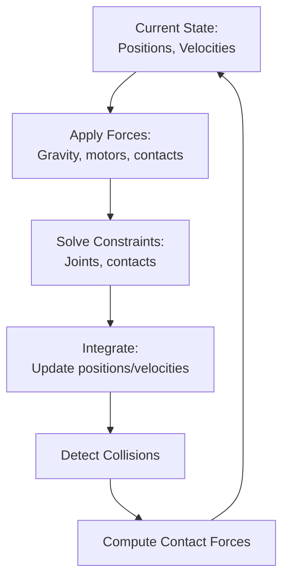
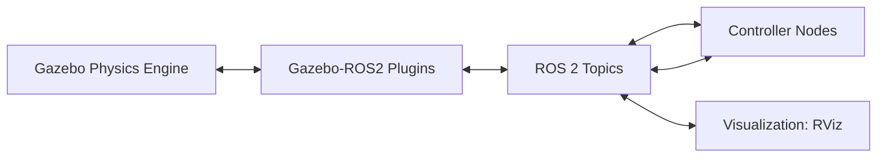

# Chapter 9: Gazebo Simulation: Physics, Collisions, and Balance

## Learning Objectives

By the end of this chapter, you will be able to:

- Understand how physics engines simulate gravity, friction, and collisions
- Explain the role of physics engines in humanoid robot simulation
- Describe how Gazebo simulates bipedal balance and walking
- Understand contact dynamics and ground interaction
- Identify physics parameters that affect simulation accuracy
- Explain the integration loop: physics → sensors → control → actuators
- Understand performance trade-offs in physics simulation

## Prerequisites

- Chapter 7: URDF (robot modeling)
- Chapter 8: What is a Digital Twin (simulation concepts)
- Basic physics understanding (gravity, friction, forces)

## Introduction: Why This Matters

When a humanoid robot stands, walks, or interacts with objects, it must obey the laws of physics:

- **Gravity** pulls it downward
- **Ground contact forces** support its weight
- **Friction** prevents slipping
- **Collisions** with objects create reaction forces
- **Joint torques** produce motion

Simulating these physical interactions accurately is challenging but essential. Without accurate physics, a walking controller that works in simulation will fail catastrophically on hardware—the robot will fall.

In this chapter, we'll explore how Gazebo (and physics engines generally) simulate the physical world, enabling realistic testing of humanoid behaviors before hardware deployment.

## Physics Engine Fundamentals

### What is a Physics Engine?

A **physics engine** is software that simulates physical interactions between objects according to laws of physics.

**Core Responsibilities**:
1. **Rigid Body Dynamics**: Compute how forces and torques affect motion
2. **Collision Detection**: Identify when objects touch or overlap
3. **Collision Response**: Compute forces from contacts
4. **Constraint Solving**: Enforce joint limits, maintain connections
5. **Numerical Integration**: Update positions and velocities over time

### The Physics Simulation Loop



**Time Step** (Δt):
- Simulation advances in discrete steps (typically 1ms = 0.001s)
- Smaller steps = more accurate but slower
- Larger steps = faster but risk instability

**Real-Time Factor**:
- 1.0x = simulation runs at real-world speed
- 10x = simulation runs 10x faster (if hardware allows)
- 0.5x = simulation slower than real-time (complex physics)

### Physics Engines in Gazebo

Gazebo supports multiple physics engines:

**ODE (Open Dynamics Engine)**:
- Default in Gazebo Classic
- Stable, well-tested
- Moderate accuracy
- CPU-based

**Bullet**:
- Fast collision detection
- Good for real-time applications
- Used in games and robotics

**DART (Dynamic Animation and Robotics Toolkit)**:
- High accuracy
- Good contact handling
- Preferred for precise simulations

**Simbody**:
- Biomechanics focus
- Accurate joint modeling

For humanoid robots, **DART** or **Bullet** are often preferred due to better contact dynamics.

## Simulating Gravity and Rigid Body Dynamics

### Gravity

**Conceptual**: Every object experiences downward force proportional to its mass.

```
F_gravity = mass × g
where g = 9.81 m/s² (Earth's gravity)
```

**In Gazebo**:
```xml
<world name="default">
  <gravity>0 0 -9.81</gravity>  <!-- X Y Z -->
</world>
```

**Effect on Humanoid**:
- 50kg robot experiences 490N downward force
- Must be balanced by ground contact forces
- Determines energy cost of movement

### Rigid Body Dynamics

**Newton's Laws**:
```
F = m × a  (Force = mass × acceleration)
τ = I × α  (Torque = inertia × angular acceleration)
```

**Physics Engine's Job**:
1. Sum all forces on each link (gravity, contacts, joint forces)
2. Compute linear and angular accelerations
3. Integrate to get velocities
4. Integrate to get positions

**Example—Falling Arm**:
```
Time t=0: Arm horizontal, velocity = 0
Gravity applies downward torque at center of mass
Physics engine computes angular acceleration
Time t=0.01s: Arm rotates slightly, has angular velocity
Time t=0.02s: Arm rotates more, velocity increases
... continues until arm hits body or ground
```

## Collision Detection and Response

### Collision Detection

**Challenge**: Determine if/where objects touch.

**Approaches**:

**1. Bounding Volume Hierarchy**:
- Approximate complex shapes with simple bounding boxes/spheres
- Quick rejection of non-colliding objects
- Detailed check only for potential collisions

**2. Primitive Shapes**:
- Spheres, boxes, cylinders: Fast analytical tests
- Meshes: Slower, triangle-by-triangle checks

**3. Continuous Collision Detection**:
- Prevent fast-moving objects from "tunneling" through others
- Checks entire path between time steps

**Gazebo's Approach**:
- Uses collision geometry from URDF (Chapter 7)
- Simplified shapes (cylinders, boxes) much faster than meshes
- Checks all pairs of nearby objects each time step

### Collision Response

**When Collision Detected**:

1. **Compute Contact Points**: Where objects touch
2. **Compute Contact Normal**: Direction perpendicular to surface
3. **Compute Penetration Depth**: How much objects overlap
4. **Apply Separation Force**: Push objects apart
5. **Apply Friction**: Resist sliding

**Contact Force Calculation**:
```
Normal force prevents penetration
Friction force resists sliding (depends on friction coefficient)
```

**Example—Foot on Ground**:
```
1. Foot collides with ground plane
2. Contact point: Bottom of foot
3. Normal: Upward (perpendicular to ground)
4. Normal force: Balances gravity (robot weight)
5. Friction: Prevents foot from sliding
```

## Friction and Contact Dynamics

### Friction Models

**Coulomb Friction**:
```
F_friction ≤ μ × F_normal

where μ = coefficient of friction
```

**Two Types**:
- **Static friction** (μ_s): Resists initial motion
- **Kinetic friction** (μ_k): Resists ongoing motion
- Typically μ_s > μ_k (harder to start moving than keep moving)

**In Gazebo (URDF)**:
```xml
<gazebo reference="foot_link">
  <mu1>1.0</mu1>  <!-- Friction coefficient direction 1 -->
  <mu2>1.0</mu2>  <!-- Friction coefficient direction 2 -->
  <kp>10000000.0</kp>  <!-- Stiffness -->
  <kd>1.0</kd>  <!-- Damping -->
</gazebo>
```

**Typical Friction Values**:
- Rubber on concrete: μ ≈ 0.7-1.0
- Metal on metal: μ ≈ 0.15-0.25
- Ice on ice: μ ≈ 0.02-0.05

**Impact on Humanoids**:
- Low friction: Slipping, difficulty walking
- High friction: Stable standing, but may "stick" unexpectedly
- Must match real-world materials for sim-to-real transfer

### Contact Stiffness and Damping

**Spring-Damper Model**:
```
F_contact = kp × penetration_depth + kd × penetration_velocity
```

- **kp (stiffness)**: How hard contact surface resists penetration
- **kd (damping)**: Energy dissipation in contact

**High kp**: Rigid contact (concrete floor)
**Low kp**: Soft contact (foam mat)

**Trade-off**:
- High stiffness → More realistic but requires smaller time steps
- Low stiffness → Faster simulation but less realistic

## Simulating Humanoid Balance

### The Balance Problem

**Humanoid Stability**:
- Bipedal robots are inherently unstable (inverted pendulum)
- Small disturbances can cause falls
- Active control required to maintain balance

**Key Concepts**:

**Center of Mass (CoM)**:
- Weighted average position of all mass
- For standing human/robot, typically in torso

**Center of Pressure (CoP)**:
- Point where ground reaction force acts
- Must be within support polygon for static stability

**Support Polygon**:
- Convex hull of contact points (e.g., area between feet)
- If CoM projection is outside polygon → falling

**Zero Moment Point (ZMP)**:
- Point where net moment (torque) from gravity and inertia is zero
- Used in walking controllers

### Simulating Standing Balance

**Scenario**: Humanoid standing on two feet.

**Physics Simulation**:
```
1. Gravity pulls robot downward (weight distributed across links)
2. Feet in contact with ground
3. Ground exerts upward normal forces at contact points
4. If forces balanced and CoM over support polygon → stable
5. If perturbed → controller must adjust joint torques to recover
```

**Balance Controller** (conceptual):
```python
# Simplified balance control
def balance_control(current_pose, target_pose):
    # Compute error
    com_error = current_CoM - target_CoM

    # PID control
    torque = Kp * com_error + Kd * com_velocity

    # Apply torques to ankle, hip joints
    return ankle_torque, hip_torque
```

**Gazebo's Role**:
- Simulates ground contact forces
- Applies controller's joint torques
- Computes resulting motion
- Determines if robot remains stable or falls

### Simulating Walking

**Walking is Controlled Falling**:
- Shift weight to one foot
- Lift other foot
- Swing leg forward
- Place foot down
- Transfer weight
- Repeat

**Physics Challenges**:
1. **Ground Contact Switching**: Foot contacts appear/disappear
2. **Impact Forces**: Foot strike creates sudden forces
3. **Friction Requirements**: Prevent slipping during push-off
4. **Balance During Single Support**: Unstable phase

**Gazebo Simulation of Walking**:
```
Each time step (1ms):
1. Controller computes desired joint positions/torques
2. Gazebo applies torques to joints
3. Physics engine solves dynamics
4. Updates foot contact forces
5. Checks if robot falling (CoM outside support polygon, IMU data)
6. Renders new robot pose
```

**Stability Metrics**:
- **Fall Detection**: IMU pitch/roll exceeds threshold
- **Foot Contact**: Expected vs. actual contact states
- **CoM Trajectory**: Tracking desired path
- **Energy Consumption**: Total motor torques

## Simulation Parameters and Tuning

### Critical Physics Parameters

**Time Step** (update_rate):
```xml
<physics type="ode">
  <max_step_size>0.001</max_step_size>  <!-- 1ms -->
  <real_time_update_rate>1000</real_time_update_rate>  <!-- 1000 Hz -->
</physics>
```

**Impact**:
- Smaller → More accurate, slower
- Larger → Faster, risk of instability
- For humanoids: 1ms typical, 0.5ms for high accuracy

**Solver Iterations** (iters):
```xml
<ode>
  <solver>
    <type>quick</type>
    <iters>50</iters>  <!-- Constraint solver iterations -->
  </solver>
</ode>
```

**Impact**:
- More iterations → Better constraint satisfaction
- Fewer iterations → Faster but "softer" joints

**Contact Parameters**:
```xml
<contact>
  <ode>
    <max_vel>0.01</max_vel>  <!-- Max contact velocity before penetration -->
    <min_depth>0.001</min_depth>  <!-- Minimum penetration for contact -->
  </ode>
</contact>
```

### Tuning for Humanoid Simulation

**Goal**: Balance accuracy and speed.

**Recommended Settings for Humanoid Walking**:
```xml
<physics type="ode">
  <max_step_size>0.001</max_step_size>
  <real_time_update_rate>1000</real_time_update_rate>
  <real_time_factor>1.0</real_time_factor>
  <ode>
    <solver>
      <type>quick</type>
      <iters>100</iters>  <!-- High for stable contacts -->
    </solver>
    <constraints>
      <cfm>0.0</cfm>  <!-- Constraint force mixing -->
      <erp>0.2</erp>  <!-- Error reduction parameter -->
    </constraints>
  </ode>
</physics>
```

**Friction Tuning**:
```xml
<!-- Foot contacts -->
<gazebo reference="left_foot">
  <mu1>1.0</mu1>
  <mu2>1.0</mu2>
  <kp>10000000.0</kp>
  <kd>1.0</kd>
  <minDepth>0.001</minDepth>
</gazebo>
```

**Debugging Physics Issues**:

**Problem**: Robot falls through floor
- **Cause**: Collision geometry missing or time step too large
- **Fix**: Add collision geometry, reduce time step

**Problem**: Robot jitters/vibrates
- **Cause**: Contact stiffness too high, time step too large
- **Fix**: Reduce kp, reduce time step, increase damping

**Problem**: Joints "soft" (don't hold position)
- **Cause**: Too few solver iterations
- **Fix**: Increase iters to 50-100

## Gazebo-ROS 2 Integration

### How Gazebo Connects to ROS 2



**Gazebo Plugins**:
- Publish simulated sensor data to ROS 2 topics
- Subscribe to control commands from ROS 2 topics
- Bridge between Gazebo and ROS 2 ecosystem

**Example Plugin** (in URDF/SDF):
```xml
<gazebo>
  <plugin name="gazebo_ros2_control" filename="libgazebo_ros2_control.so">
    <robot_param>robot_description</robot_param>
    <parameters>$(find robot_description)/config/controllers.yaml</parameters>
  </plugin>
</gazebo>
```

**Data Flow**:
```
Simulation Step:
1. Gazebo updates physics
2. Sensor plugins read simulated data (joint states, IMU, etc.)
3. Plugins publish to ROS 2 topics
4. Controller nodes receive sensor data
5. Controllers compute and publish commands
6. Actuator plugins receive commands
7. Plugins apply forces/positions to simulated joints
8. Loop repeats
```

### Joint Control in Gazebo

**Position Control**:
```
Controller sends target joint position
Gazebo PID controller computes torque to reach target
Physics applies torque, joint moves toward target
```

**Velocity Control**:
```
Controller sends target joint velocity
Gazebo computes torque for desired velocity
```

**Effort (Torque) Control**:
```
Controller directly specifies joint torque
Gazebo applies torque, resulting motion depends on physics
```

**Configuration** (controllers.yaml):
```yaml
controller_manager:
  ros__parameters:
    update_rate: 100  # Hz

    joint_state_broadcaster:
      type: joint_state_broadcaster/JointStateBroadcaster

    position_controller:
      type: position_controllers/JointTrajectoryController
```

## Performance Optimization

### Real-Time Simulation Challenges

**Goal**: Run at 1.0x real-time (or faster) for efficient testing.

**Bottlenecks**:
1. **Physics computation**: Solving dynamics and contacts
2. **Collision detection**: Checking all geometry pairs
3. **Rendering**: Drawing 3D scene

**Optimization Strategies**:

**1. Simplify Collision Geometry**:
```
Visual: Detailed mesh (10,000 triangles)
Collision: Primitive shapes or simplified mesh (100 triangles)
→ 100x faster collision detection
```

**2. Adjust Update Rates**:
```
Physics: 1000 Hz (1ms steps)
Rendering: 30 Hz (33ms per frame)
Sensor publishing: 10-100 Hz depending on sensor
→ Don't render every physics step
```

**3. Disable Unnecessary Features**:
```xml
<gui>false</gui>  <!-- Run headless if no visualization needed -->
<rendering>
  <shadows>false</shadows>  <!-- Disable expensive rendering -->
</rendering>
```

**4. Use Faster Physics Engines**:
```
ODE: Moderate speed
Bullet: Faster collision detection
DART: Better accuracy, similar speed to ODE
```

**5. Parallelize Multiple Robots**:
```python
# Run 100 simulations in parallel (different processes/containers)
for i in range(100):
    spawn_gazebo_instance(world_name=f"world_{i}", robot_config=configs[i])
```

## Integration: Balance Simulation Workflow

**Development Workflow**:

```
1. Create URDF with mass, inertia, collision geometry
2. Import to Gazebo
3. Tune physics parameters (friction, contact, time step)
4. Develop balance controller (e.g., PID on CoM)
5. Test in simulation:
   - Apply random pushes
   - Measure fall rate
   - Iterate controller
6. Deploy to hardware once sim performance acceptable
```

**Testing Scenarios**:
```python
# Pseudo-code for systematic testing
for push_magnitude in [10, 20, 30, 40, 50]:  # Newtons
    for push_direction in [0, 45, 90, 135, 180, 225, 270, 315]:  # degrees
        for push_timing in [0.5, 1.0, 1.5, 2.0]:  # seconds after start
            result = test_balance(push_mag, push_dir, push_time)
            log_result(result)
```

## Questions and Answers

**Q: Why does my robot fall through the floor?**

A: Check: (1) Collision geometry defined? (2) Time step too large? (3) Gravity enabled? (4) Floor exists in world? (5) Physics engine loaded?

**Q: How accurate is Gazebo physics?**

A: For rigid body dynamics: 90-95% accurate vs. reality. Main differences: simplified friction, idealized contacts. Good enough for controller development, not perfect.

**Q: Can I simulate hydraulic actuators?**

A: Basic support. Gazebo primarily models motors (torque/position control). For detailed hydraulic dynamics, may need custom plugins or specialized simulators.

**Q: How do I speed up simulation?**

A: (1) Simplify collision meshes, (2) increase time step cautiously, (3) reduce solver iterations if acceptable, (4) disable rendering, (5) use faster physics engine.

**Q: What about cloth, ropes, fluids?**

A: Limited support in Gazebo. Specialized simulators handle deformables better (FleX, SOFA, SPHysics).

**Q: Should I use Gazebo Classic or Gazebo Sim (Ignition)?**

A: Gazebo Sim (formerly Ignition) is the future—better performance, modern architecture. Gazebo Classic still widely used and stable. Both ROS 2 compatible.

## Connections to Other Modules

- **Chapter 7 (URDF)** defines robot structure for Gazebo simulation
- **Chapter 8 (Digital Twin)** introduced simulation concepts realized in Gazebo
- **Chapter 10** will add simulated sensors to Gazebo robots
- **Chapter 11** will show Unity for advanced visualization
- **Module 3** will contrast Gazebo with Isaac Sim

## Summary

Gazebo simulates physics to enable realistic testing of humanoid robots before hardware deployment. The key takeaways:

1. **Physics Engines**: Simulate gravity, collisions, friction, joint dynamics
2. **Simulation Loop**: Apply forces → Solve constraints → Integrate → Detect collisions → Repeat
3. **Balance Simulation**: Ground contacts, CoM, support polygon, ZMP concepts
4. **Walking Simulation**: Contact switching, impact forces, friction requirements
5. **Tuning Parameters**: Time step, solver iterations, friction, contact stiffness
6. **ROS 2 Integration**: Plugins bridge Gazebo physics and ROS 2 control/sensing
7. **Performance**: Optimize collision geometry, update rates, rendering for real-time

Gazebo enables safe, fast iteration on balance and walking controllers—testing thousands of scenarios before hardware deployment.

In the next chapter, we'll add simulated sensors (cameras, LiDAR, IMU) to create a complete digital twin.

## References

1. Koenig, N., & Howard, A. (2004). "Design and Use Paradigms for Gazebo, An Open-Source Multi-Robot Simulator." *IEEE/RSJ IROS*.

2. Smith, R. (2006). "Open Dynamics Engine." http://www.ode.org/

3. Coumans, E., & Bai, Y. (2016). "PyBullet, a Python Module for Physics Simulation for Games, Robotics and Machine Learning." http://pybullet.org

4. Lee, J., et al. (2018). "DART: Dynamic Animation and Robotics Toolkit." *Journal of Open Source Software*.

5. Vukobratović, M., & Borovac, B. (2004). "Zero-Moment Point—Thirty Five Years of its Life." *International Journal of Humanoid Robotics*.

6. Open Robotics. (2024). "Gazebo Documentation." https://gazebosim.org/docs

7. Wieber, P. B., et al. (2016). "Modeling and Control of Legged Robots." *Springer Handbook of Robotics*.

---

**Next Chapter**: Chapter 10 will explore sensor simulation—cameras, LiDAR, IMU—completing the digital twin with realistic sensory input for AI and control algorithms.
