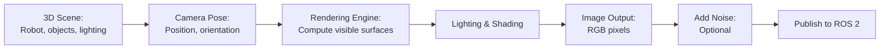
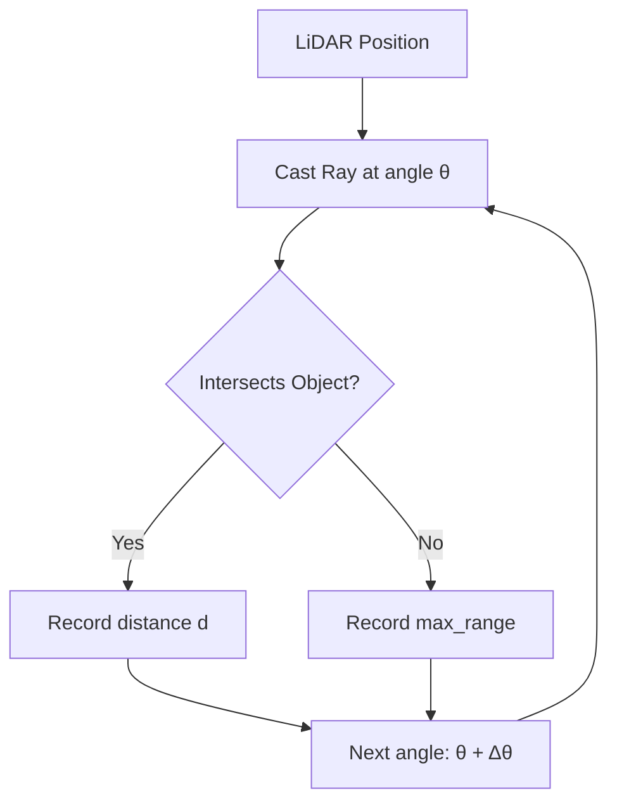
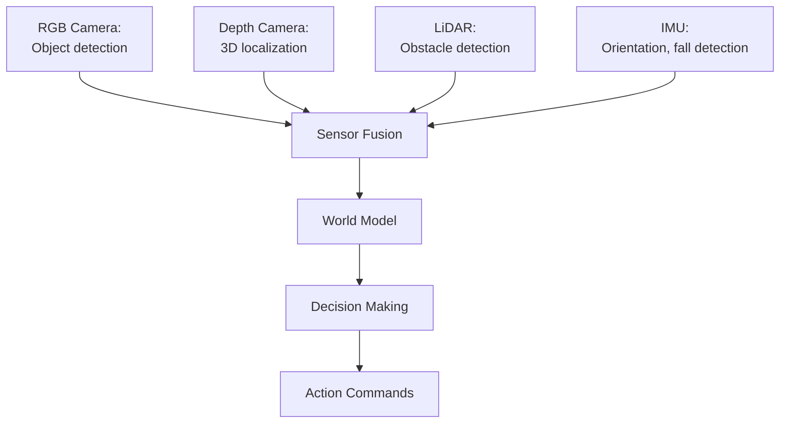

# Chapter 10: Simulating Sensors (LiDAR, Depth, IMU)

## Learning Objectives

By the end of this chapter, you will be able to:

- Understand how camera sensors are simulated in robotics
- Explain LiDAR simulation using ray casting
- Describe IMU simulation and orientation sensing
- Understand depth camera simulation principles
- Explain the trade-offs between sensor realism and simulation speed
- Identify how to add sensors to URDF/Gazebo models
- Understand sensor noise models and why they matter for sim-to-real transfer

## Prerequisites

- Chapter 7: URDF (robot modeling, sensor mounting)
- Chapter 8: Digital Twin concepts
- Chapter 9: Gazebo physics simulation
- Basic understanding of cameras and 3D coordinates

## Introduction: Why This Matters

A humanoid robot relies on sensors to perceive its environment:

- **Cameras**: See objects, people, obstacles
- **Depth cameras**: Measure distances for 3D mapping
- **LiDAR**: Create detailed 3D scans
- **IMU**: Know orientation and detect falls
- **Force sensors**: Feel ground contact and object interactions

When developing perception algorithms (object detection, SLAM, obstacle avoidance), you need sensor data. But collecting real sensor data is:

- **Time-consuming**: Hours to capture enough training examples
- **Expensive**: Requires real hardware
- **Constrained**: Limited scenarios (can't easily test in rain, darkness, etc.)
- **Unlabeled**: Need manual annotation for supervised learning

**Sensor simulation** solves these problems by generating realistic sensor data from virtual environments, enabling:

- Rapid training data generation
- Perfect ground truth labels
- Testing in diverse conditions
- Safe testing of perception in challenging scenarios

In this chapter, we'll explore how Gazebo and other simulators generate sensor data, making digital twins truly complete.

## Camera Simulation

### How Cameras Work (Brief Recap)

**Physical Camera**:
1. Light reflects off objects
2. Lens focuses light onto image sensor
3. Sensor converts light to electrical signals
4. Image processor creates digital image

**Simulated Camera**:
1. 3D scene rendered from camera viewpoint
2. Graphics engine computes pixel colors
3. Image saved as sensor output
4. Published to ROS 2 topic

### Camera Rendering Pipeline



**Rendering Techniques**:

**Rasterization** (Gazebo standard):
- Projects 3D triangles onto 2D image plane
- Fast (30-60 FPS typical)
- Limited realism (simplified lighting)

**Ray Tracing** (Isaac Sim):
- Simulates light paths for photorealism
- Slower but highly realistic
- Better for computer vision training

### Camera Parameters

**Intrinsic Parameters** (camera properties):
```xml
<camera name="head_camera">
  <horizontal_fov>1.047</horizontal_fov>  <!-- 60 degrees -->
  <image>
    <width>640</width>
    <height>480</height>
    <format>R8G8B8</format>  <!-- RGB -->
  </image>
  <clip>
    <near>0.1</near>  <!-- Min distance -->
    <far>100</far>    <!-- Max distance -->
  </clip>
</camera>
```

**Extrinsic Parameters** (camera placement):
```xml
<joint name="camera_joint" type="fixed">
  <parent link="head"/>
  <child link="camera_link"/>
  <origin xyz="0.05 0 0.05" rpy="0 0 0"/>  <!-- Position, orientation -->
</joint>
```

**Field of View (FoV)**:
- Horizontal FoV: How wide the camera sees (e.g., 60°, 90°, 120°)
- Wider FoV = More scene visible, but objects appear smaller
- Typical humanoid: 60-90° horizontal

### Camera Noise and Realism

**Real Cameras Have**:
- **Shot noise**: Random variation in pixel brightness
- **Motion blur**: From camera or object movement
- **Lens distortion**: Straight lines appear curved (fisheye effect)
- **Chromatic aberration**: Color fringing
- **Auto-exposure**: Brightness adjusts to lighting

**Simulated Noise** (Gazebo plugin):
```xml
<plugin name="camera_plugin" filename="libgazebo_ros_camera.so">
  <noise>
    <type>gaussian</type>
    <mean>0.0</mean>
    <stddev>0.007</stddev>  <!-- Noise level -->
  </noise>
</plugin>
```

**Why Add Noise?**
- Models trained on perfect sim images fail on noisy real images
- Noise models bridge sim-to-real gap
- Makes AI algorithms more robust

### Camera Simulation Example (Gazebo)

**URDF Camera Definition**:
```xml
<link name="camera_link">
  <visual>
    <geometry>
      <box size="0.01 0.05 0.01"/>
    </geometry>
  </visual>
</link>

<gazebo reference="camera_link">
  <sensor name="camera" type="camera">
    <update_rate>30.0</update_rate>  <!-- 30 FPS -->
    <camera>
      <horizontal_fov>1.047</horizontal_fov>
      <image>
        <width>640</width>
        <height>480</height>
        <format>R8G8B8</format>
      </image>
      <clip>
        <near>0.1</near>
        <far>50.0</far>
      </clip>
      <noise>
        <type>gaussian</type>
        <mean>0.0</mean>
        <stddev>0.007</stddev>
      </noise>
    </camera>
    <plugin name="camera_controller" filename="libgazebo_ros_camera.so">
      <ros>
        <namespace>/robot</namespace>
        <argument>camera/image_raw:=camera/image</argument>
        <argument>camera/camera_info:=camera/camera_info</argument>
      </ros>
    </plugin>
  </sensor>
</gazebo>
```

**ROS 2 Output**:
```
Topics published:
/robot/camera/image (sensor_msgs/Image): RGB images
/robot/camera/camera_info (sensor_msgs/CameraInfo): Camera parameters
```

**Using in Python**:
```python
class VisionNode(Node):
    def __init__(self):
        super().__init__('vision_node')
        self.subscription = self.create_subscription(
            Image,
            '/robot/camera/image',
            self.image_callback,
            10
        )

    def image_callback(self, msg):
        # Convert ROS image to OpenCV/NumPy
        image = self.bridge.imgmsg_to_cv2(msg, "bgr8")

        # Run object detection
        detections = self.detector.detect(image)
        # ...
```

## Depth Camera Simulation

### Depth Sensing Principles

**Depth Camera**: Measures distance to each pixel.

**Output**: 2D grid where each pixel = distance in meters
```
Example depth image (3x3):
[1.2, 1.3, 1.5]
[1.1, 2.5, 3.0]
[1.0, 1.1, 1.2]
```

**Technologies** (real hardware):
- **Stereo vision**: Two cameras, compute depth from disparity
- **Structured light**: Project pattern, measure distortion (Kinect v1)
- **Time-of-Flight**: Measure light travel time (Kinect v2, RealSense)

**Simulation Approach**:
- Render scene with depth buffer (Z-buffer)
- Depth buffer = distance from camera to each visible surface
- Directly provides depth image

### Depth Camera in Gazebo

**Sensor Definition**:
```xml
<gazebo reference="camera_link">
  <sensor name="depth_camera" type="depth">
    <update_rate>20.0</update_rate>
    <camera>
      <horizontal_fov>1.047</horizontal_fov>
      <image>
        <width>640</width>
        <height>480</height>
      </image>
      <clip>
        <near>0.4</near>
        <far>10.0</far>
      </clip>
    </camera>
    <plugin name="depth_plugin" filename="libgazebo_ros_camera.so">
      <ros>
        <argument>depth/image_raw:=depth/image</argument>
        <argument>depth/points:=depth/points</argument>
      </ros>
    </plugin>
  </sensor>
</gazebo>
```

**ROS 2 Output**:
```
/robot/depth/image (sensor_msgs/Image): Depth image (32FC1 format)
/robot/depth/points (sensor_msgs/PointCloud2): 3D point cloud
```

**Point Cloud**: 3D representation of scene
- Each point has (x, y, z) coordinates
- Can be colored using RGB camera
- Used for 3D reconstruction, SLAM, obstacle detection

### Applications of Depth Data

**Obstacle Avoidance**:
```python
def check_obstacles(depth_image):
    # Find pixels closer than 1 meter
    close_pixels = depth_image < 1.0

    if close_pixels.any():
        # Obstacle detected!
        return "STOP"
    else:
        return "SAFE"
```

**3D Object Localization**:
```python
def locate_object(rgb_image, depth_image, bbox):
    # Get depth at object bounding box
    x, y, w, h = bbox
    object_depth = np.median(depth_image[y:y+h, x:x+w])

    # Camera intrinsics to convert pixel + depth → 3D point
    object_3d_position = pixel_to_3d(x + w/2, y + h/2, object_depth)
    return object_3d_position
```

## LiDAR Simulation

### LiDAR Principles

**LiDAR** (Light Detection and Ranging):
- Laser pulses sent in multiple directions
- Measures time-of-flight to compute distance
- Creates 2D scan (planar) or 3D point cloud

**Types**:
- **2D LiDAR**: Spins in one plane (e.g., Hokuyo, SICK)
- **3D LiDAR**: Spins in 3D (e.g., Velodyne, Ouster)

### Ray Casting for LiDAR Simulation

**Simulation Method**:
1. For each laser angle:
   - Cast ray from LiDAR origin
   - Check intersection with scene geometry
   - Record distance to first intersection
2. Output array of distances (ranges)



**Efficiency**: Ray casting is fast (GPU-accelerated in modern simulators).

### 2D LiDAR in Gazebo

**Sensor Definition**:
```xml
<gazebo reference="base_link">
  <sensor name="lidar" type="ray">
    <pose>0 0 0.1 0 0 0</pose>
    <update_rate>10</update_rate>
    <ray>
      <scan>
        <horizontal>
          <samples>720</samples>  <!-- 720 rays -->
          <resolution>1.0</resolution>
          <min_angle>-1.57</min_angle>  <!-- -90 degrees -->
          <max_angle>1.57</max_angle>   <!-- +90 degrees -->
        </horizontal>
      </scan>
      <range>
        <min>0.1</min>
        <max>30.0</max>
        <resolution>0.01</resolution>
      </range>
      <noise>
        <type>gaussian</type>
        <mean>0.0</mean>
        <stddev>0.01</stddev>
      </noise>
    </ray>
    <plugin name="lidar_plugin" filename="libgazebo_ros_ray_sensor.so">
      <ros>
        <argument>scan:=scan</argument>
      </ros>
    </plugin>
  </sensor>
</gazebo>
```

**ROS 2 Output**:
```
/robot/scan (sensor_msgs/LaserScan)

Fields:
- angle_min, angle_max: Scan range
- angle_increment: Angular resolution
- ranges: Array of distances (in meters)
- intensities: Reflection strength (optional)
```

**Using LiDAR for Obstacle Detection**:
```python
class ObstacleDetector(Node):
    def __init__(self):
        super().__init__('obstacle_detector')
        self.subscription = self.create_subscription(
            LaserScan,
            '/robot/scan',
            self.scan_callback,
            10
        )

    def scan_callback(self, msg):
        # Check for obstacles within 1 meter
        min_distance = min(msg.ranges)

        if min_distance < 1.0:
            self.get_logger().warn(f'Obstacle at {min_distance:.2f}m')
            # Trigger avoidance behavior
```

### 3D LiDAR (Point Cloud)

**Configuration** (3D spinning LiDAR):
```xml
<ray>
  <scan>
    <horizontal>
      <samples>1875</samples>  <!-- Points per ring -->
      <min_angle>-3.14159</min_angle>
      <max_angle>3.14159</max_angle>
    </horizontal>
    <vertical>
      <samples>16</samples>  <!-- 16 vertical rings -->
      <min_angle>-0.2617</min_angle>  <!-- -15 degrees -->
      <max_angle>0.2617</max_angle>   <!-- +15 degrees -->
    </vertical>
  </scan>
  <range>
    <min>0.9</min>
    <max>100.0</max>
  </range>
</ray>
```

**Output**: 3D point cloud (sensor_msgs/PointCloud2)

**Applications**:
- 3D mapping (SLAM)
- Terrain classification
- Object recognition
- Autonomous navigation

## IMU (Inertial Measurement Unit) Simulation

### IMU Fundamentals

**IMU Measures**:
1. **Linear Acceleration** (3-axis accelerometer): x, y, z acceleration in m/s²
2. **Angular Velocity** (3-axis gyroscope): Roll, pitch, yaw rotation rates in rad/s
3. **Orientation** (sometimes): Computed from accelerometer + gyroscope fusion

**Uses in Humanoid Robots**:
- Detect falls (pitch/roll exceeds threshold)
- Estimate orientation for balance control
- Dead reckoning (estimate position from acceleration integration)
- Sensor fusion with vision/LiDAR

### IMU Simulation in Gazebo

**How It's Simulated**:
1. Gazebo physics computes link accelerations and angular velocities
2. IMU plugin reads these values from physics engine
3. Optional: Add noise to match real sensor characteristics
4. Publish to ROS 2 topic

**Sensor Definition**:
```xml
<gazebo reference="base_link">
  <sensor name="imu_sensor" type="imu">
    <always_on>true</always_on>
    <update_rate>100</update_rate>  <!-- 100 Hz typical for IMU -->
    <imu>
      <angular_velocity>
        <x>
          <noise type="gaussian">
            <mean>0.0</mean>
            <stddev>0.009</stddev>
          </noise>
        </x>
        <!-- y, z similar -->
      </angular_velocity>
      <linear_acceleration>
        <x>
          <noise type="gaussian">
            <mean>0.0</mean>
            <stddev>0.017</stddev>
          </noise>
        </x>
        <!-- y, z similar -->
      </linear_acceleration>
    </imu>
    <plugin name="imu_plugin" filename="libgazebo_ros_imu_sensor.so">
      <ros>
        <argument>imu:=imu/data</argument>
      </ros>
    </plugin>
  </sensor>
</gazebo>
```

**ROS 2 Output**:
```
/robot/imu/data (sensor_msgs/Imu)

Fields:
- orientation (quaternion): Estimated orientation
- angular_velocity (x, y, z): Rotation rates
- linear_acceleration (x, y, z): Accelerations
- Covariance matrices: Uncertainty estimates
```

### IMU Data Interpretation

**Detecting Falls**:
```python
def check_fall(imu_msg):
    # Convert quaternion to roll, pitch, yaw
    roll, pitch, yaw = quaternion_to_euler(imu_msg.orientation)

    # Threshold: 30 degrees (~0.52 radians)
    if abs(roll) > 0.52 or abs(pitch) > 0.52:
        return "FALLING"
    else:
        return "STABLE"
```

**Estimating Velocity** (integration):
```python
# WARNING: Prone to drift without sensor fusion
velocity_x += acceleration_x * dt
```

**Challenges**:
- **Drift**: Integration accumulates errors over time
- **Gravity**: Accelerometer measures gravity + motion (must separate)
- **Noise**: Real IMUs are noisy, simulation should model this

## Force/Torque Sensor Simulation

### Use Cases

**In Humanoid Feet**:
- Detect ground contact
- Measure ground reaction forces
- Estimate Center of Pressure (CoP)
- Trigger gait phase transitions

**In Hands**:
- Detect object contact during grasping
- Measure grip force
- Detect slippage

### Gazebo Force Sensor

**Plugin Configuration**:
```xml
<gazebo reference="foot_link">
  <sensor name="foot_contact" type="contact">
    <contact>
      <collision>foot_collision</collision>
    </contact>
    <plugin name="foot_contact_plugin" filename="libgazebo_ros_bumper_sensor.so">
      <ros>
        <argument>contact_state:=foot/contact</argument>
      </ros>
    </plugin>
  </sensor>
</gazebo>
```

**Output**: Contact forces and torques when collision occurs

**Using Contact Sensors**:
```python
def foot_contact_callback(self, msg):
    if len(msg.states) > 0:
        # Foot in contact with ground
        self.in_contact = True
        contact_force = msg.states[0].total_wrench.force.z
        self.get_logger().info(f'Ground force: {contact_force:.1f}N')
    else:
        # Foot in air
        self.in_contact = False
```

## Sensor Noise Models

### Why Model Noise?

**Perfect Sim Sensors**:
```
Simulated camera: Perfect image, no blur, perfect colors
Simulated LiDAR: Exact distances, no outliers
Simulated IMU: Exact accelerations, no drift
```

**Real Sensors**:
```
Real camera: Motion blur, color imbalance, compression artifacts
Real LiDAR: Range errors, false positives, missing returns
Real IMU: Bias drift, temperature sensitivity, noise
```

**Problem**: Algorithms trained on perfect data fail on noisy real data.

**Solution**: Add realistic noise models to simulation.

### Common Noise Types

**Gaussian Noise**:
```
noisy_value = true_value + N(mean=0, stddev=σ)
```

**Example**: Camera pixel noise, IMU noise

**Salt-and-Pepper Noise**:
```
Randomly set some pixels to min (0) or max (255)
```

**Example**: LiDAR outliers, dropped measurements

**Bias and Drift**:
```
noisy_value = true_value + bias + drift * time
```

**Example**: IMU gyroscope drift, temperature-dependent sensor errors

### Applying Noise in Gazebo

**Gaussian Noise Example** (camera):
```xml
<noise>
  <type>gaussian</type>
  <mean>0.0</mean>
  <stddev>0.007</stddev>  <!-- About 2/255 for 8-bit image -->
</noise>
```

**Custom Noise via Plugin**:
```python
# In Python processing node
def add_custom_noise(sensor_data):
    # Gaussian noise
    noise = np.random.normal(0, 0.01, sensor_data.shape)
    noisy_data = sensor_data + noise

    # Dropout (simulate missing data)
    dropout_mask = np.random.random(sensor_data.shape) > 0.05  # 5% dropout
    noisy_data[~dropout_mask] = 0

    return noisy_data
```

## Sensor Simulation Best Practices

### 1. Match Real Sensor Specifications

**Before Simulation**:
- Read real sensor datasheet
- Note: resolution, FoV, range, update rate, noise characteristics

**In Simulation**:
- Match resolution: 640x480 if real camera is 640x480
- Match FoV: 60° if real camera is 60°
- Match update rate: 30 Hz if real sensor is 30 Hz
- Add noise: Use datasheet values for stddev

### 2. Trade-off: Realism vs. Speed

**High Fidelity**:
- Photorealistic rendering
- High resolution (1920x1080+)
- Many LiDAR rays (1000+)
- Complex noise models

**Result**: Slower simulation (< 1x real-time)

**Low Fidelity**:
- Simple rendering
- Low resolution (320x240)
- Fewer LiDAR rays (360)
- No noise

**Result**: Fast simulation (10x+ real-time)

**Recommendation**:
- Development: Low fidelity for fast iteration
- Final validation: High fidelity for realism
- Training data generation: Medium fidelity with domain randomization

### 3. Domain Randomization for Sensors

**Vary Sensor Parameters**:
```python
# Randomize camera exposure
camera.exposure = random.uniform(0.5, 2.0)

# Randomize LiDAR noise
lidar.noise_stddev = random.uniform(0.01, 0.05)

# Randomize IMU bias
imu.gyro_bias = random.normal(0, 0.01, size=3)
```

**Benefit**: Trained models robust to sensor variations.

### 4. Validate Sensor Simulation

**Compare Sim vs. Real**:
1. Place real robot in known scene
2. Run same scene in simulation
3. Compare sensor outputs
4. Adjust sim parameters to match reality

**Example**: Capture same object with real and sim camera, compare histograms.

## Integration: Complete Sensing Pipeline

**Humanoid Perception System**:



**Simulated Workflow**:
```
1. Gazebo physics updates robot and environment
2. Camera plugin renders RGB and depth images
3. LiDAR plugin casts rays, computes ranges
4. IMU plugin reads physics-computed accelerations
5. All sensors publish to ROS 2 topics
6. Perception nodes process sensor data
7. Control nodes issue commands
8. Gazebo applies commands to robot
9. Loop repeats
```

**Example Use Case**: Object Grasping
```
1. Camera sees object (object detection)
2. Depth camera provides 3D position
3. IMU confirms robot is balanced
4. Motion planner uses sensor data to plan reach
5. During grasp, force sensors detect contact
6. All tested safely in simulation before hardware deployment
```

## Questions and Answers

**Q: Can I use real camera images in simulation?**

A: Not directly, but you can project them onto sim objects or use image-based rendering techniques. Typically sim generates images, not consumes them.

**Q: How accurate is simulated LiDAR?**

A: Ray casting is very accurate for range. Main differences vs. real: idealized reflections, no atmospheric effects. Add noise to compensate.

**Q: Can I simulate thermal cameras or other exotic sensors?**

A: Basic support in Gazebo (limited). Isaac Sim has better support for diverse sensors. May need custom plugins for specialized sensors.

**Q: Why does my simulated IMU show no gravity?**

A: Check that gravity is enabled in world file and IMU sensor includes gravity in measurement (some IMUs compensate for gravity, some don't).

**Q: How do I generate training data from simulated cameras?**

A: Save images to disk with labels (from ground truth sim data), or stream to training pipeline. Can generate millions of labeled images automatically.

**Q: What's the best update rate for sensors?**

A: Match real hardware. Typical: Camera 30Hz, LiDAR 10-20Hz, IMU 100-200Hz. Higher rates = more data but slower simulation.

## Connections to Other Modules

- **Chapter 7 (URDF)** defines sensor mounting locations
- **Chapter 9 (Gazebo Physics)** provides environment for sensors to perceive
- **Module 3 (Isaac Sim)** will show advanced sensor simulation (photorealistic cameras, synthetic data)
- **Module 4 (VLA)** will use simulated sensors for vision-language-action training

## Summary

Sensor simulation completes the digital twin, enabling perception algorithm development without hardware. The key takeaways:

1. **Camera Simulation**: Rendering 3D scene from camera viewpoint, with noise models
2. **Depth Cameras**: Z-buffer provides distance to each pixel, generates point clouds
3. **LiDAR Simulation**: Ray casting computes distances, outputs LaserScan or PointCloud2
4. **IMU Simulation**: Physics-computed accelerations and angular velocities, with drift and noise
5. **Force Sensors**: Contact detection and force measurement at collision points
6. **Noise Models**: Essential for sim-to-real transfer—Gaussian, dropout, bias, drift
7. **Best Practices**: Match real specs, trade-off fidelity vs. speed, domain randomization, validate against reality

Simulated sensors enable training of perception models on synthetic data, testing perception pipelines safely, and developing sensor fusion algorithms before hardware deployment.

With physics (Chapter 9) and sensors (Chapter 10), you now have a complete digital twin capable of realistic simulation.

## References

1. Koenig, N., & Howard, A. (2004). "Design and Use Paradigms for Gazebo." *IEEE/RSJ IROS*.

2. Tobin, J., et al. (2017). "Domain Randomization for Transferring Deep Neural Networks from Simulation to the Real World." *IEEE/RSJ IROS*.

3. Mur-Artal, R., & Tardós, J. D. (2017). "ORB-SLAM2: An Open-Source SLAM System for Monocular, Stereo, and RGB-D Cameras." *IEEE Transactions on Robotics*.

4. Hornung, A., et al. (2013). "OctoMap: An Efficient Probabilistic 3D Mapping Framework Based on Octrees." *Autonomous Robots*.

5. Thrun, S., et al. (2005). "Probabilistic Robotics." *MIT Press*.
   - Sensor models for robotics

6. Open Robotics. (2024). "Gazebo Sensor Documentation." https://gazebosim.org/api/sensors/

7. NVIDIA. (2024). "Isaac Sim Sensor Simulation." https://docs.omniverse.nvidia.com/isaacsim/

---

**Chapters 6-10 Complete!**

You've now learned:
- **Module 1 (ROS 2)**: Communication, Python integration, robot modeling
- **Module 2 (Digital Twin)**: Simulation concepts, physics, sensors

**Next**: Module 3 will introduce NVIDIA Isaac Sim and Isaac ROS for advanced perception, navigation, and learning. Module 4 will integrate vision, language, and action for embodied AI.
