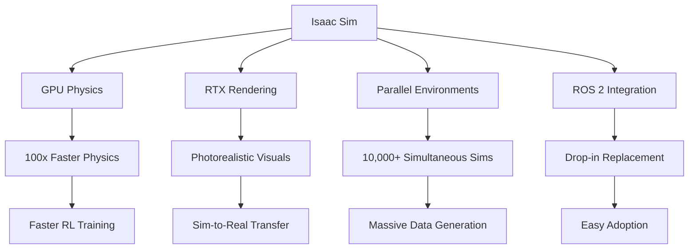
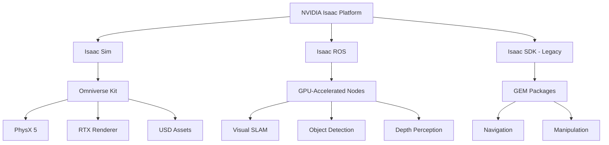
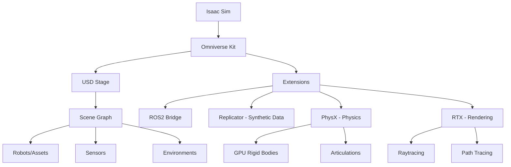
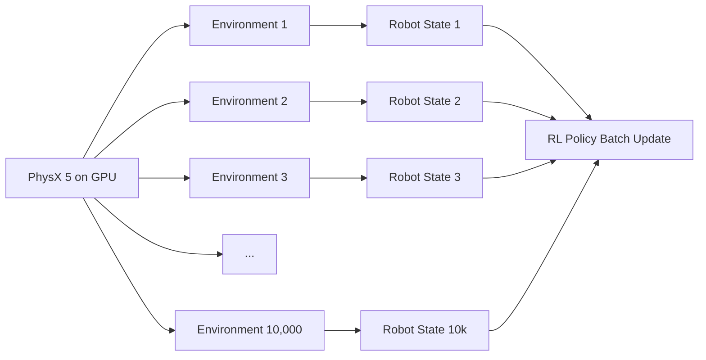
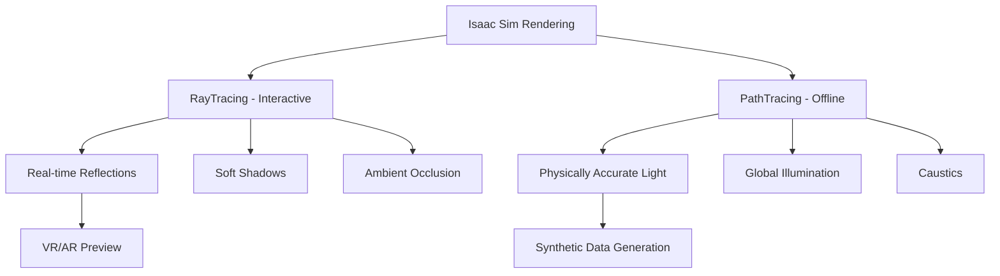
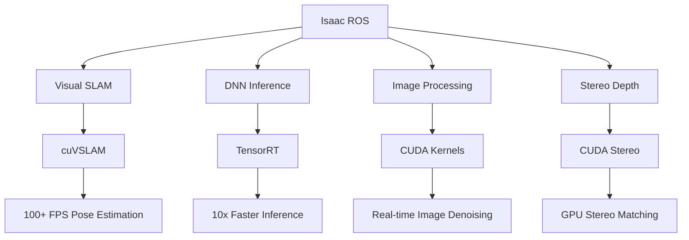

# Chapter 12: Introduction to NVIDIA Isaac Platform

## Learning Objectives

By the end of this chapter, you will:

1. Understand the NVIDIA Isaac platform ecosystem and its components
2. Learn the differences between Isaac Sim, Isaac SDK, and Isaac ROS
3. Explore Isaac Sim's capabilities for photorealistic robotics simulation
4. Understand GPU-accelerated simulation and parallel environments
5. Learn how Isaac integrates with ROS 2 and the broader robotics stack
6. Explore Omniverse as the foundation for Isaac Sim
7. Understand when to use Isaac vs. Gazebo or Unity

## Prerequisites

Before starting this chapter, you should understand:

- **Digital twin concepts**: Simulation purposes and workflows (Chapter 8)
- **Gazebo simulation**: Physics engines and sensor simulation (Chapters 9-10)
- **ROS 2 fundamentals**: Topics, services, nodes (Chapters 4-5)
- **Unity visualization**: Rendering and ROS integration (Chapter 11)
- **Python programming**: For Isaac scripts and ROS nodes
- **Basic GPU concepts**: CUDA, parallel computing (helpful but not required)

Recommended setup:
- NVIDIA GPU (RTX series recommended, 8GB+ VRAM)
- Ubuntu 22.04 or Windows 10/11
- Isaac Sim 2023.1 or newer
- ROS 2 Humble (for Isaac ROS integration)

## Introduction

Imagine training a humanoid robot to fold laundry by running **10,000 parallel simulations simultaneously**, each with randomized lighting, fabric materials, and room layouts, all running on a single workstation. Or consider testing a warehouse robot's navigation algorithm in a **photorealistic digital replica** of the actual facility, complete with accurate physics, LiDAR reflectivity, and even dust particles in the air. These scenarios are enabled by **NVIDIA Isaac**, a comprehensive platform for accelerated robotics development.

Isaac represents a paradigm shift in robotics simulation: instead of running one slow simulation on a CPU, Isaac leverages **GPU parallelization** to run thousands of simulations faster than real-time. This acceleration is critical for modern robotics workflows where AI models require millions of training samples and extensive testing before hardware deployment.

The Isaac platform consists of three main components:
1. **Isaac Sim**: Photorealistic GPU-accelerated simulation built on Omniverse
2. **Isaac ROS**: ROS 2 packages with GPU-accelerated perception and AI
3. **Isaac SDK**: (Legacy) Software development kit for robot applications

This chapter focuses on **Isaac Sim** and its role in the humanoid robotics development pipeline.

### Why NVIDIA Isaac?

Traditional robotics simulators (Gazebo, PyBullet) run on CPUs, limiting simulation speed and parallelization. Isaac Sim, built on NVIDIA Omniverse and leveraging RTX GPUs, offers:



**Key advantages**:
1. **Speed**: GPU-accelerated physics runs 100x faster than CPU simulators for simple scenes
2. **Parallelization**: Train RL agents with thousands of environments on one GPU
3. **Photorealism**: RTX raytracing for domain randomization and synthetic data
4. **USD foundation**: Universal Scene Description format for asset sharing across tools
5. **Ecosystem**: Integrates with ROS 2, PyTorch, TensorFlow, Unity, Unreal

## Core Concepts

### 1. The Isaac Platform Ecosystem

NVIDIA Isaac is not a single tool but an ecosystem of robotics technologies.



**Component breakdown**:

| Component | Purpose | Language | GPU Accelerated |
|-----------|---------|----------|----------------|
| **Isaac Sim** | Photorealistic simulation environment | Python, C++ | Yes (PhysX, RTX) |
| **Isaac ROS** | ROS 2 packages for perception/AI | C++, Python | Yes (CUDA, TensorRT) |
| **Isaac SDK** | Robotics application framework (legacy) | C++, Python | Yes (CUDA) |
| **Omniverse** | Foundation platform for 3D workflows | USD, Python | Yes (RTX) |

**Current focus** (as of 2024): NVIDIA emphasizes **Isaac Sim** and **Isaac ROS**, with Isaac SDK being phased out in favor of ROS 2 integration.

### 2. Isaac Sim Architecture

Isaac Sim is built on **NVIDIA Omniverse**, a platform for collaborative 3D workflows based on Pixar's Universal Scene Description (USD).

#### Layered Architecture



**Key layers**:

1. **USD Stage**: The scene graph holding all simulation assets (robots, environments, lights)
2. **PhysX 5**: NVIDIA's GPU-accelerated physics engine
3. **RTX Renderer**: Real-time raytracing for photorealistic visuals
4. **Extensions**: Modular plugins for ROS, sensors, domain randomization
5. **Python API**: Scripting interface for automation and RL training

#### USD: The Foundation

**Universal Scene Description (USD)** is a file format and API for 3D scene graphs, developed by Pixar.

**Why USD for robotics?**
- **Composability**: Combine multiple USD files (robot + environment + sensors) into one scene
- **Non-destructive editing**: Make changes without modifying original assets
- **Interoperability**: Share assets between Maya, Blender, Unity, Unreal, Isaac Sim
- **Performance**: Optimized for large scenes with millions of primitives

```python
# Pseudo-code: Loading a USD robot into Isaac Sim
from omni.isaac.core import World
from omni.isaac.core.utils.stage import add_reference_to_stage

# Create simulation world
world = World()

# Add robot from USD file
robot_usd_path = "/path/to/humanoid_robot.usd"
robot_prim_path = "/World/Humanoid"
add_reference_to_stage(robot_usd_path, robot_prim_path)

# Robot is now in the scene with physics and visuals
world.reset()
```

### 3. GPU-Accelerated Physics with PhysX 5

Traditional physics engines (ODE, Bullet) run on CPU and simulate one environment at a time. PhysX 5 runs on GPU and can simulate **thousands of environments in parallel**.

#### Parallelization Example



**Performance comparison** (simplified example: cart-pole balancing):

| Simulator | Environments | FPS | GPU Accelerated |
|-----------|-------------|-----|-----------------|
| Gazebo | 1 | 60 | No |
| PyBullet | 1 | 240 | No (CPU vectorized) |
| Isaac Sim | 1 | 120 | Yes |
| Isaac Sim | 1,000 | 12,000 total | Yes (parallelized) |
| Isaac Sim | 10,000 | 60,000 total | Yes (with high-end GPU) |

**Key insight**: For RL training requiring millions of samples, Isaac Sim can reduce training time from **weeks to hours**.

```python
# Pseudo-code: Creating parallel environments in Isaac Sim
from omni.isaac.gym import VecEnvBase

class HumanoidWalkEnv(VecEnvBase):
    def __init__(self, num_envs=4096):
        super().__init__(num_envs=num_envs)

        # Create 4,096 copies of the humanoid environment
        self.create_envs()

    def create_envs(self):
        for i in range(self.num_envs):
            # Each environment is a separate USD prim
            env_prim_path = f"/World/Env_{i}"
            self.create_humanoid_scene(env_prim_path)

    def step(self, actions):
        # Actions is a batch tensor [4096, action_dim]
        # PhysX processes all 4,096 simultaneously on GPU
        self.apply_actions(actions)
        self.world.step()  # GPU physics update

        obs = self.get_observations()  # [4096, obs_dim]
        rewards = self.compute_rewards()  # [4096,]
        dones = self.check_terminations()  # [4096,]

        return obs, rewards, dones
```

### 4. Photorealistic Rendering with RTX

Isaac Sim uses NVIDIA RTX technology for **real-time raytracing** and **path tracing**, producing photorealistic visuals.

#### Rendering Modes



**When to use each mode**:
- **RayTracing**: Interactive visualization, real-time debugging (30-60 FPS)
- **PathTracing**: Final renders, marketing images, high-quality synthetic data (slower)

**Impact on robotics**:
1. **Synthetic data realism**: Train vision models on Isaac-rendered images that closely match real camera output
2. **Lighting simulation**: Accurately simulate how different lighting affects perception
3. **Material properties**: Model reflective, transparent, and translucent surfaces for grasping

```python
# Pseudo-code: Configuring rendering for synthetic data
from omni.isaac.core.utils.viewports import set_camera_view

# Create camera for synthetic data
camera_path = "/World/Camera"
camera = create_camera(camera_path, resolution=(1920, 1080))

# Enable path tracing for photorealism
set_rendering_mode("PathTracing")
set_samples_per_pixel(256)  # Higher = better quality, slower

# Capture annotated image
rgb_data = camera.get_rgb()  # [1080, 1920, 3]
depth_data = camera.get_depth()  # [1080, 1920]
segmentation_data = camera.get_segmentation()  # [1080, 1920] with instance IDs
```

### 5. ROS 2 Integration

Isaac Sim provides a **ROS 2 Bridge** extension that publishes simulation data to ROS topics, making it compatible with existing ROS workflows.

#### Bridge Architecture

```mermaid
graph LR
    A[Isaac Sim] --> B[ROS2 Bridge Extension]
    B --> C[ROS2 Topics]

    B --> D[/joint_states]
    B --> E[/camera/image]
    B --> F[/scan]
    B --> G[/tf]
    B --> H[/clock]

    C --> I[ROS2 Nodes]
    I --> J[MoveIt]
    I --> K[Nav2]
    I --> L[Custom AI Nodes]
```

**Capabilities**:
- **Publishers**: Joint states, transforms, sensor data (camera, LiDAR, IMU)
- **Subscribers**: Joint commands, velocity commands, gripper controls
- **Services**: Spawn models, reset simulation, get entity states
- **Actions**: Long-running tasks like navigation goals

**Workflow**: Develop algorithm in Isaac Sim → Test with ROS 2 → Deploy to hardware with same ROS nodes.

```python
# Pseudo-code: Enabling ROS2 bridge in Isaac Sim
from omni.isaac.core.utils.extensions import enable_extension

# Enable ROS2 bridge
enable_extension("omni.isaac.ros2_bridge")

# Configure clock publishing (for ROS time synchronization)
from omni.isaac.ros2_bridge import ROS2Bridge
bridge = ROS2Bridge()
bridge.publish_clock()

# Robot's joint states automatically published to /joint_states
# Camera images published to /camera/image_raw
# TF tree published to /tf
```

### 6. Isaac Sim vs. Gazebo vs. Unity

Each simulator serves different purposes in the robotics pipeline.

| Feature | Gazebo | Isaac Sim | Unity |
|---------|--------|-----------|-------|
| **Physics engine** | ODE, Bullet, DART | PhysX 5 (GPU) | PhysX (CPU/GPU) |
| **Rendering quality** | Basic | Photorealistic (RTX) | High (HDRP) |
| **GPU acceleration** | No | Yes | Limited |
| **Parallel envs** | No (1 at a time) | Yes (1000s) | Limited |
| **ROS integration** | Native plugins | ROS2 Bridge | ROS-TCP-Connector |
| **Synthetic data** | Basic | Advanced (Replicator) | Moderate |
| **Learning curve** | Moderate | Steep | Moderate |
| **Best for** | Algorithm testing | RL training, synthetic data | Visualization, VR/AR |
| **Cost** | Free (open source) | Free (with restrictions) | Free (with restrictions) |

**Recommended workflow**:
1. **Prototype** in Gazebo (faster iteration, familiar tools)
2. **Scale training** in Isaac Sim (parallel envs, synthetic data)
3. **Visualize/demo** in Unity (stakeholder presentations, teleoperation)

### 7. Isaac ROS: GPU-Accelerated Perception

**Isaac ROS** is a collection of ROS 2 packages with GPU-accelerated perception and AI inference.

#### Key Packages



**Example packages**:
- **isaac_ros_visual_slam**: GPU-accelerated SLAM (100+ FPS vs. 30 FPS CPU)
- **isaac_ros_dnn_inference**: TensorRT-optimized model inference
- **isaac_ros_image_proc**: GPU image rectification, resizing, encoding
- **isaac_ros_depth_segmentation**: Real-time depth and segmentation

**Why GPU acceleration matters**:
- **Latency**: Humanoid robots need real-time perception (&lt;30ms) for balance and manipulation
- **Power efficiency**: GPUs offer better performance-per-watt than CPUs for parallel tasks
- **Scalability**: Run multiple perception pipelines simultaneously (e.g., 4 cameras + LiDAR)

## Integration Across Modules

Isaac Sim and Isaac ROS integrate with the entire course workflow:

### From Previous Modules
- **ROS 2 (Chapters 4-6)**: Isaac's ROS2 Bridge makes it a drop-in replacement for Gazebo
- **URDF (Chapter 7)**: Isaac imports URDF and converts to USD format
- **Digital Twin (Chapter 8)**: Isaac Sim is an advanced digital twin with photorealism
- **Gazebo Physics (Chapter 9)**: Similar concepts (gravity, friction, contacts) but GPU-accelerated
- **Sensor Simulation (Chapter 10)**: Isaac provides more accurate sensor models (RTX lidar, cameras)
- **Unity (Chapter 11)**: Isaac and Unity can share USD assets and be used together

### To Future Modules
- **USD (Chapter 13)**: Isaac's foundation format enables asset sharing and composition
- **Domain Randomization (Chapter 14)**: Isaac's Replicator automates randomization at scale
- **Synthetic Data (Chapter 15)**: Isaac generates millions of labeled images for training
- **VLA Models (Chapter 16-19)**: Isaac provides training data and testing environments
- **Capstone (Chapter 20-22)**: Isaac likely used for initial RL training before hardware deployment

## Practical Q&A

**Q1: Do I need an NVIDIA GPU to use Isaac Sim?**

**A**: Yes, Isaac Sim requires an NVIDIA RTX GPU (2000 series or newer recommended). Minimum specs:
- GPU: RTX 2060 or better (8GB+ VRAM recommended)
- RAM: 32GB+ system RAM
- Storage: 50GB+ for Isaac Sim installation

For cloud users, NVIDIA offers Isaac Sim on AWS and other cloud platforms with GPU instances.

**Q2: Can I use Isaac Sim without learning USD?**

**A**: Yes, for basic use. Isaac provides Python APIs that abstract USD details:

```python
# High-level API (no USD knowledge needed)
from omni.isaac.core.robots import Robot
robot = Robot("/World/Humanoid")
robot.set_joint_positions([0.0, 0.5, -1.0, ...])

# Low-level USD API (for advanced users)
from pxr import Usd, UsdGeom
stage = Usd.Stage.Open("/path/to/scene.usd")
prim = stage.GetPrimAtPath("/World/Humanoid")
```

However, learning USD basics (Chapter 13) unlocks Isaac's full power.

**Q3: How do I convert a Gazebo world to Isaac Sim?**

**A**: Two approaches:
1. **Manual**: Export Gazebo meshes → Import to Blender → Export USD → Load in Isaac
2. **Automated**: Use `omni.isaac.gazebo` extension to parse `.world` files (experimental)

**Caveats**: Physics parameters may need re-tuning due to PhysX differences.

**Q4: Can Isaac Sim run faster than real-time?**

**A**: Yes, for simple scenes. Disable rendering and run physics-only:

```python
# Pseudo-code: Headless mode for fast RL training
world = World(headless=True)  # No rendering
world.set_simulation_dt(1.0 / 240.0)  # 240 Hz physics

# Can achieve 1000x real-time for simple environments
for _ in range(1_000_000):
    world.step()  # GPU physics only
```

**Q5: Is Isaac Sim free?**

**A**: Yes, with restrictions:
- **Free for individuals**: Personal learning, research, non-commercial projects
- **Free for enterprises**: Evaluation (limited time)
- **Paid licenses**: Commercial deployment, extended support

Check NVIDIA's licensing page for current terms.

**Q6: How does Isaac Sim compare to NVIDIA Isaac Gym?**

**A**: Isaac Gym was a preview of GPU-accelerated RL training, now **merged into Isaac Sim**. Use Isaac Sim (2023+) for all new projects.

## Connections to Other Modules

### Part 1 - Foundations
- **Physical AI (Chapter 1)**: Isaac accelerates the perception-action loop with GPU processing
- **Embodied Intelligence (Chapter 3)**: Isaac's photorealism improves sim-to-real transfer for grounded learning

### Module 1 - ROS 2
- **ROS 2 Architecture (Chapter 4)**: Isaac integrates as a standard ROS 2 node via bridge
- **Communication Patterns (Chapter 5)**: Isaac publishes topics, provides services, and accepts actions

### Module 2 - Digital Twin
- **Digital Twin Concept (Chapter 8)**: Isaac Sim is the most advanced digital twin tool in this course
- **Gazebo Physics (Chapter 9)**: Isaac uses similar physics concepts but with GPU acceleration
- **Unity Visualization (Chapter 11)**: Isaac and Unity can work together (Isaac for data, Unity for UI)

### Module 3 - NVIDIA Isaac (Current Module)
- **USD (Chapter 13)**: Foundation of Isaac Sim's asset system
- **Domain Randomization (Chapter 14)**: Isaac's killer feature for robust AI training
- **Synthetic Data (Chapter 15)**: Isaac Replicator generates training datasets

### Module 4 - VLA
- **VLA Models (Chapter 16)**: Isaac provides training environments and data pipelines
- **Vision Transformers (Chapter 18)**: Isaac generates labeled images for ViT training
- **Action Models (Chapter 19)**: Isaac tests learned policies in simulation before hardware

### Capstone
- **Project Architecture (Chapter 20)**: Isaac likely handles RL training and initial testing
- **Integration (Chapter 21)**: Isaac connects to ROS 2, VLA models, and hardware deployment

## Summary

NVIDIA Isaac represents the cutting edge of robotics simulation, leveraging GPU acceleration to enable workflows previously impossible with CPU-based tools. By combining photorealistic rendering (RTX), massively parallel physics (PhysX 5), and seamless ROS 2 integration, Isaac Sim accelerates every stage of humanoid robotics development.

**Key takeaways**:

1. **Isaac Platform ecosystem**: Isaac Sim (simulation), Isaac ROS (perception), Isaac SDK (legacy)
2. **Omniverse foundation**: Built on USD for interoperability and collaboration
3. **GPU physics**: PhysX 5 enables thousands of parallel environments for RL training
4. **Photorealistic rendering**: RTX raytracing for accurate synthetic data generation
5. **ROS 2 integration**: Drop-in replacement for Gazebo with ROS2 Bridge extension
6. **Performance**: 100x faster physics, 10,000+ parallel environments on one GPU
7. **Workflow position**: Use Isaac for large-scale training and synthetic data, Gazebo for prototyping, Unity for visualization

**When to choose Isaac Sim**:
- Reinforcement learning requiring millions of samples
- Synthetic data generation for perception models
- Photorealistic simulation for sim-to-real transfer
- GPU-accelerated development workflows

**When to choose alternatives**:
- **Gazebo**: Quick prototyping, open-source requirement, CPU-only systems
- **Unity**: Primary focus on visualization, VR/AR, or stakeholder demos

As we progress through Module 3, you'll learn how to leverage Isaac's advanced features—USD asset management (Chapter 13), domain randomization (Chapter 14), and synthetic data generation (Chapter 15)—to build robust humanoid AI systems that transfer successfully to hardware.

## References

1. NVIDIA. (2024). *Isaac Sim Documentation*. NVIDIA Developer. https://docs.omniverse.nvidia.com/isaacsim/latest/
2. Makoviychuk, V., Wawrzyniak, L., Guo, Y., Lu, M., Storey, K., Macklin, M., ... & Handa, A. (2021). *Isaac Gym: High Performance GPU-Based Physics Simulation For Robot Learning*. arXiv preprint arXiv:2108.10470.
3. NVIDIA. (2024). *PhysX 5 SDK Documentation*. NVIDIA Developer. https://nvidia-omniverse.github.io/PhysX/physx/5.1.0/
4. Pixar Animation Studios. (2024). *Universal Scene Description (USD)*. https://openusd.org/
5. NVIDIA. (2024). *Isaac ROS Documentation*. NVIDIA Developer. https://nvidia-isaac-ros.github.io/
6. NVIDIA. (2024). *Omniverse Platform Overview*. NVIDIA Omniverse. https://docs.omniverse.nvidia.com/
7. Kerbl, B., Kopanas, G., Leimkühler, T., & Drettakis, G. (2023). *3D Gaussian Splatting for Real-Time Radiance Field Rendering*. ACM Transactions on Graphics, 42(4).
8. NVIDIA. (2023). *RTX Real-Time Rendering Technologies*. NVIDIA Developer. https://developer.nvidia.com/rtx

