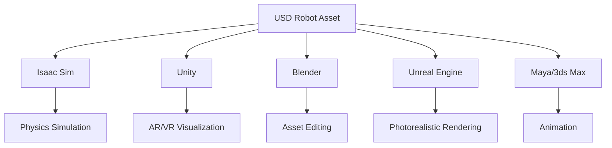
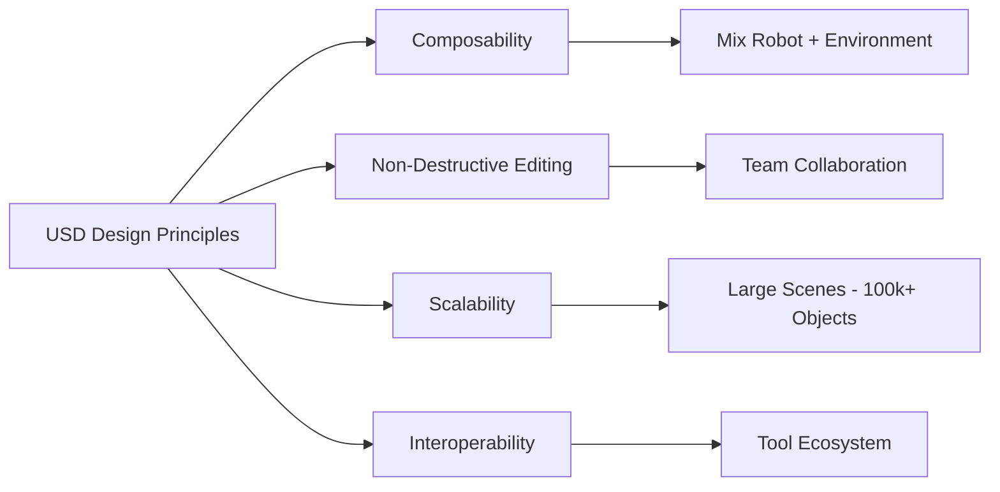
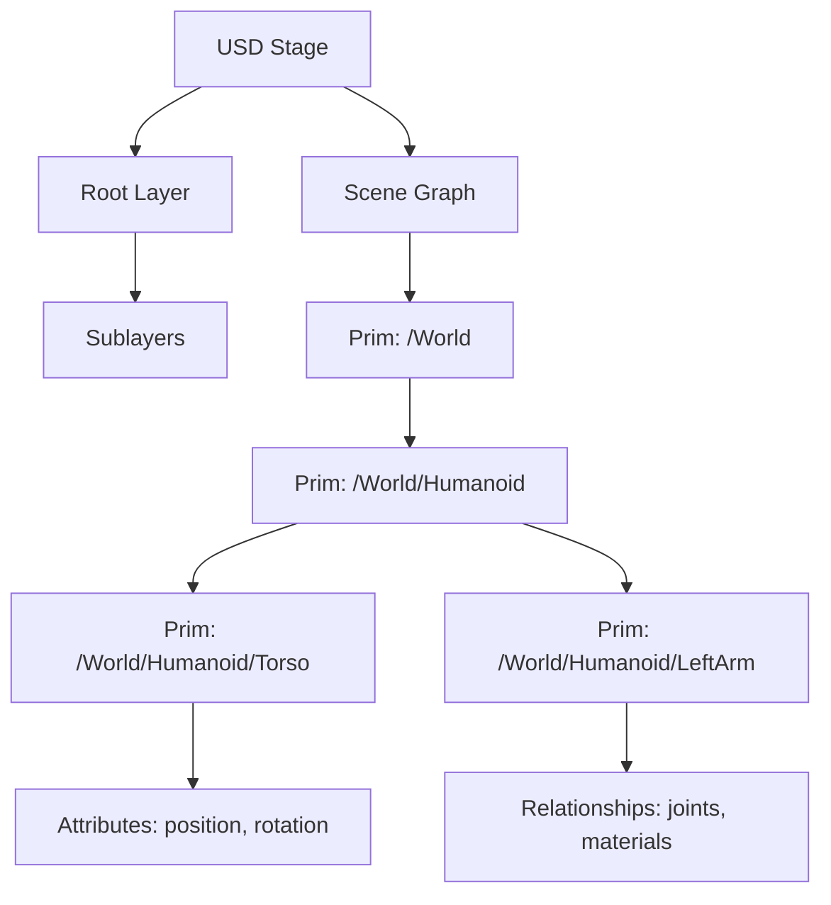
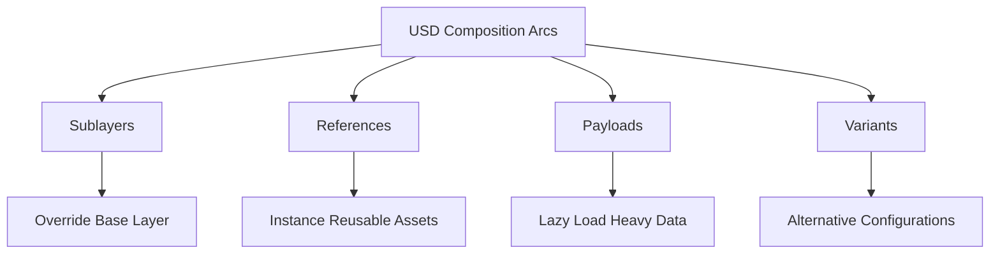
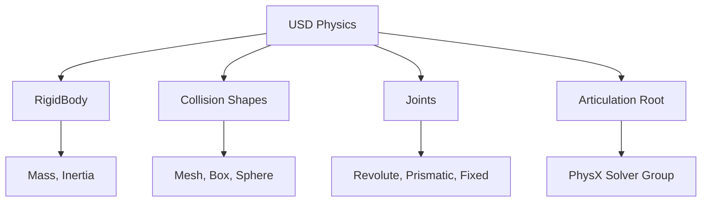
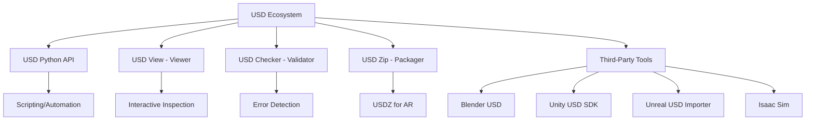

# Chapter 13: USD (Universal Scene Description) for Robotics

## Learning Objectives

By the end of this chapter, you will:

1. Understand Universal Scene Description (USD) and its role in robotics
2. Learn USD's core concepts: prims, stages, layers, and composition
3. Explore how USD enables asset sharing across tools (Isaac, Unity, Blender)
4. Understand USD's advantages over URDF for complex robot modeling
5. Learn to create and modify USD files for robotics applications
6. Explore USD's layer system for non-destructive editing and collaboration
7. Understand how Isaac Sim uses USD as its foundation

## Prerequisites

Before starting this chapter, you should understand:

- **URDF basics**: Links, joints, and robot modeling (Chapter 7)
- **Digital twin concepts**: Asset management and simulation workflows (Chapter 8)
- **Isaac Sim fundamentals**: Platform architecture and capabilities (Chapter 12)
- **3D graphics concepts**: Transforms, meshes, materials, scene graphs
- **Python basics**: For USD scripting (helpful)
- **XML/JSON**: For understanding file formats

Recommended setup:
- USD Python libraries (`pip install usd-core`)
- Isaac Sim 2023.1+ (includes USD tools)
- Blender 3.0+ with USD support
- Text editor for `.usda` files

## Introduction

Imagine working on a humanoid robot where the mechanical team designs in SolidWorks, the simulation team tests in Isaac Sim, the visualization team creates demos in Unity, and the animation team makes marketing videos in Maya—all using the **same robot asset file** without manual conversions or data loss. This interoperability dream is enabled by **Universal Scene Description (USD)**, an open-source file format and API developed by Pixar Animation Studios for managing complex 3D scenes.

While URDF (Unified Robot Description Format) has served the ROS community well for basic robot modeling, it shows limitations when dealing with:
- **Large environments**: Warehouses with thousands of objects
- **Photorealistic materials**: PBR shaders, textures, and lighting
- **Collaboration**: Multiple teams editing the same robot without conflicts
- **Complex assemblies**: Robots with hundreds of parts and variants

USD addresses these challenges by providing a **composable, layered, and scalable** format designed for production-scale 3D content. For robotics, USD enables:



This chapter explores how USD transforms robotics workflows by enabling seamless asset sharing, non-destructive editing, and scalable scene management.

### Why USD for Robotics?

USD's design philosophy aligns perfectly with modern robotics development needs:



**Key advantages over URDF**:

| Feature | URDF | USD |
|---------|------|-----|
| **File format** | XML | Binary (.usdc) or ASCII (.usda) |
| **Scene composition** | Single file or Xacro includes | Multi-layer composition |
| **Materials** | Basic colors | Full PBR shaders |
| **Animation** | Not supported | Time-sampled data |
| **Tool support** | ROS ecosystem only | Maya, Blender, Unity, Unreal, Isaac |
| **Scalability** | Struggles with >100 links | Handles millions of prims |
| **Collaboration** | Merge conflicts | Layer-based non-destructive edits |

**Current industry adoption**:
- **Pixar**: All animated films since 2015
- **Apple**: USDZ for AR Quick Look on iOS
- **NVIDIA**: Omniverse and Isaac Sim foundation
- **Unity/Unreal**: USD import/export support
- **Robotics**: Tesla, Boston Dynamics, NVIDIA Isaac users

## Core Concepts

### 1. USD Fundamentals: Prims, Stages, and Layers

USD organizes 3D scenes using a hierarchical structure similar to file systems.

#### Core Elements



**Key concepts**:

1. **Prim (Primitive)**: The fundamental object in USD (analogous to a GameObject in Unity or a node in a scene graph)
   - Example: `/World/Humanoid/LeftArm/Shoulder`
   - Contains attributes (position, rotation, scale) and relationships (parent joint, material)

2. **Stage**: The runtime container holding the composed scene
   - Loads one or more USD layers
   - Provides API for reading/writing prims

3. **Layer**: A USD file (.usd, .usda, .usdc) containing scene data
   - ASCII `.usda`: Human-readable, good for version control
   - Binary `.usdc`: Compact, faster loading (crate format)
   - Package `.usdz`: Single-file archive with textures (Apple AR)

```python
# Pseudo-code: Creating a simple USD stage
from pxr import Usd, UsdGeom

# Create a new stage (in-memory)
stage = Usd.Stage.CreateNew("robot.usda")

# Define root prim
root = UsdGeom.Xform.Define(stage, "/World")

# Define robot prim
robot = UsdGeom.Xform.Define(stage, "/World/Humanoid")

# Define a link (mesh)
torso = UsdGeom.Mesh.Define(stage, "/World/Humanoid/Torso")
torso.CreatePointsAttr([...])  # Vertex positions
torso.CreateFaceVertexIndicesAttr([...])  # Triangles

# Save to file
stage.GetRootLayer().Save()
```

**Output `.usda` file**:
```usda
#usda 1.0

def Xform "World"
{
    def Xform "Humanoid"
    {
        def Mesh "Torso"
        {
            point3f[] points = [...]
            int[] faceVertexIndices = [...]
        }
    }
}
```

### 2. Composition: The Power of Layers

USD's **composition arcs** allow combining multiple files into a single scene without duplication.

#### Composition Types



**1. Sublayers**: Stack layers with override semantics

```usda
#usda 1.0
(
    subLayers = [
        @base_robot.usda@,
        @customization.usda@
    ]
)
# customization.usda overrides properties from base_robot.usda
```

**Use case**: Base robot design + team-specific modifications (physics team adds collision shapes, animation team adds IK rigs).

**2. References**: Reuse assets across scenes

```usda
#usda 1.0

def Xform "World"
{
    def "Robot1" (
        references = @humanoid_base.usda@</Humanoid>
    )
    {
        # Inherits all properties from humanoid_base.usda
        # Can override specific attributes here
    }

    def "Robot2" (
        references = @humanoid_base.usda@</Humanoid>
    )
    {
        # Second instance with different position/material
    }
}
```

**Use case**: Factory simulation with 100 identical robots—reference the same USD file 100 times instead of duplicating geometry.

**3. Payloads**: Deferred loading for large scenes

```usda
def Xform "Environment" (
    payload = @warehouse.usda@
)
{
    # Warehouse geometry only loaded when needed
}
```

**Use case**: Large environment (warehouse with 10,000 shelves)—load only when camera is near.

**4. Variants**: Alternative configurations in one file

```usda
def Xform "Humanoid" (
    variants = {
        string grippers = "parallel_jaw"
    }
)
{
    variantSet "grippers" = {
        "parallel_jaw" {
            # Parallel jaw gripper geometry
        }
        "suction_cup" {
            # Suction gripper geometry
        }
        "three_finger" {
            # Three-finger gripper geometry
        }
    }
}
```

**Use case**: One robot USD with multiple gripper options—switch at runtime without modifying file.

### 3. USD vs. URDF: A Practical Comparison

Both formats describe robots, but USD offers more flexibility.

#### URDF Example

```xml
<robot name="simple_humanoid">
  <link name="torso">
    <visual>
      <geometry>
        <mesh filename="torso.dae"/>
      </geometry>
      <material name="grey"/>
    </visual>
  </link>

  <joint name="shoulder" type="revolute">
    <parent link="torso"/>
    <child link="upper_arm"/>
    <axis xyz="0 1 0"/>
    <limit lower="-1.57" upper="1.57"/>
  </joint>
</robot>
```

#### Equivalent USD

```usda
#usda 1.0

def Xform "Humanoid"
{
    def Mesh "Torso" (
        references = @torso.usd@
    )
    {
        rel material:binding = </Materials/GreyMetal>
    }

    def PhysicsRevoluteJoint "Shoulder"
    {
        rel physics:body0 = </Humanoid/Torso>
        rel physics:body1 = </Humanoid/UpperArm>
        vector3f physics:axis = (0, 1, 0)
        float physics:lowerLimit = -1.57
        float physics:upperLimit = 1.57
    }
}
```

**Key differences**:
- **USD**: Uses relationships (`rel`) instead of parent/child attributes
- **USD**: Materials are separate assets (reusable)
- **USD**: Can include PBR shaders, animations, and physics in one file
- **URDF**: Simpler for basic robots, but lacks advanced features

**Conversion**: Isaac Sim can import URDF and convert to USD, but not all features translate cleanly.

### 4. Physics Representation in USD

USD includes **PhysicsSchema** for rigid bodies, joints, and collision shapes.

#### Physics Components



**Example**: Humanoid link with physics

```usda
def Xform "UpperArm" (
    prepend apiSchemas = ["PhysicsRigidBodyAPI", "PhysicsMassAPI"]
)
{
    # Physics properties
    float physics:mass = 2.5
    vector3f physics:centerOfMass = (0, 0, 0.15)

    # Collision shape
    def Capsule "CollisionShape" (
        prepend apiSchemas = ["PhysicsCollisionAPI"]
    )
    {
        float radius = 0.05
        float height = 0.3
    }

    # Visual mesh (separate from collision)
    def Mesh "VisualMesh" (
        references = @upper_arm_visual.usd@
    )
    {
    }
}
```

**Advantage over URDF**: Collision and visual geometry can use different levels of detail without hacky workarounds.

### 5. Materials and Shading

USD supports **MaterialX** and **MDL (Material Definition Language)** for photorealistic materials.

#### PBR Material Example

```usda
def Material "RobotMetal"
{
    token outputs:surface.connect = </Materials/RobotMetal/Shader.outputs:surface>

    def Shader "Shader"
    {
        uniform token info:id = "UsdPreviewSurface"
        color3f inputs:diffuseColor = (0.7, 0.7, 0.75)
        float inputs:metallic = 0.9
        float inputs:roughness = 0.3
        normal3f inputs:normal.connect = </Materials/RobotMetal/NormalMap.outputs:rgb>
    }

    def Shader "NormalMap"
    {
        uniform token info:id = "UsdUVTexture"
        asset inputs:file = @textures/metal_normal.png@
    }
}
```

**Result**: Metallic robot surface with normal mapping for fine details (scratches, dents).

**Unity/Unreal**: These materials transfer directly, enabling consistent look across tools.

### 6. Animation and Time-Sampled Data

USD natively supports **time-varying attributes** for animation.

#### Animated Joint Example

```usda
def Xform "Shoulder"
{
    float xformOp:rotateX.timeSamples = {
        0: 0.0,
        24: 45.0,
        48: 90.0,
        72: 45.0,
        96: 0.0
    }
    uniform token[] xformOpOrder = ["xformOp:rotateX"]
}
```

**Result**: Shoulder joint rotates from 0° to 90° and back over 96 frames (4 seconds at 24 FPS).

**Use case**: Pre-recorded robot demonstrations for marketing or training data augmentation.

### 7. USD Tools and Ecosystem

USD's tool ecosystem enables powerful workflows.



**Key tools**:

1. **usdview**: Interactive viewer for inspecting USD files
   ```bash
   usdview humanoid.usda
   ```
   - Explore scene graph, view attributes, scrub animation timeline

2. **usdcat**: Convert between formats
   ```bash
   usdcat robot.usdc -o robot.usda  # Binary to ASCII
   ```

3. **usdedit**: Merge layers
   ```bash
   usdedit --flatten robot.usda flattened.usda  # Collapse all layers into one
   ```

4. **Python API**: Programmatic manipulation
   ```python
   from pxr import Usd, UsdGeom
   stage = Usd.Stage.Open("robot.usda")
   prim = stage.GetPrimAtPath("/World/Humanoid/Shoulder")
   attr = prim.GetAttribute("xformOp:rotateX")
   attr.Set(45.0)  # Set rotation to 45 degrees
   stage.Save()
   ```

## Integration Across Modules

USD connects every part of the robotics pipeline covered in this course.

### From Previous Modules
- **URDF (Chapter 7)**: Isaac Sim imports URDF → converts to USD for richer representation
- **Digital Twin (Chapter 8)**: USD enables multi-tool digital twins (Gazebo for physics, Unity for visuals, same asset)
- **Unity (Chapter 11)**: Unity's USD SDK allows importing Isaac Sim scenes directly
- **Isaac Sim (Chapter 12)**: USD is Isaac's native format for all assets and scenes

### To Future Modules
- **Domain Randomization (Chapter 14)**: USD variants enable quick material/geometry swaps for randomization
- **Synthetic Data (Chapter 15)**: Isaac Replicator manipulates USD layers to generate diverse datasets
- **VLA Models (Chapter 16-19)**: USD assets used for training environments and evaluation scenes
- **Capstone (Chapter 20-22)**: USD likely serves as the asset interchange format between all tools

## Practical Q&A

**Q1: Should I use URDF or USD for my robot?**

**A**: Depends on workflow:
- **URDF**: Simple robots, pure ROS 2 workflow, no need for advanced materials/animation
- **USD**: Multi-tool workflows (Isaac + Unity + Blender), photorealistic rendering, large scenes, team collaboration

**Migration path**: Start with URDF, convert to USD when needed (Isaac Sim handles conversion).

**Q2: How do I convert URDF to USD?**

**A**: Using Isaac Sim's importer:

```python
from omni.isaac.urdf import _urdf
urdf_path = "/path/to/robot.urdf"
usd_path = "/path/to/robot.usd"
_urdf.acquire_urdf_interface().parse_urdf(
    urdf_path, usd_path
)
```

**Caveats**: Materials and advanced features may need manual adjustment.

**Q3: Can I edit USD files by hand?**

**A**: Yes, for `.usda` (ASCII) files:

```bash
nano robot.usda  # Edit in text editor
```

**Best practice**: Use text editor for small tweaks, Python API for complex edits, visual tools (Blender, usdview) for inspecting.

**Q4: How do I version control USD files?**

**A**: Recommendations:
- **Use `.usda` (ASCII)** for files edited by humans (merge-friendly)
- **Use `.usdc` (binary)** for large geometry (better compression, but not merge-friendly)
- **Git LFS**: Store large binary assets externally
- **Layer separation**: Keep team-specific edits in separate sublayers

```
.
├── base_robot.usda          # Version controlled (ASCII)
├── physics_layer.usda        # Physics team edits
├── materials_layer.usda      # Art team edits
└── geometry/                 # Binary meshes (Git LFS)
    ├── torso.usdc
    └── arm.usdc
```

**Q5: Can USD handle procedural generation?**

**A**: Yes, via Python API:

```python
# Pseudo-code: Procedurally generate warehouse shelves
import random
from pxr import Usd, UsdGeom

stage = Usd.Stage.CreateNew("warehouse.usda")
root = UsdGeom.Xform.Define(stage, "/World")

for i in range(1000):  # 1,000 shelves
    shelf_path = f"/World/Shelf_{i}"
    shelf = UsdGeom.Xform.Define(stage, shelf_path)

    # Random position
    pos = (random.uniform(0, 100), 0, random.uniform(0, 100))
    shelf.AddTranslateOp().Set(pos)

    # Reference base shelf model
    shelf.GetPrim().GetReferences().AddReference("@shelf_base.usd@")

stage.Save()
```

**Q6: What's the performance cost of USD composition?**

**A**: Composition has minimal runtime overhead:
- **Stage load time**: Increases with number of layers (but lazy payloads help)
- **Runtime access**: After composition, attribute access is fast (cached)
- **Best practice**: Use payloads for large assets, flatten for deployment if needed

## Connections to Other Modules

### Part 1 - Foundations
- **Physical AI (Chapter 1)**: USD enables sharing embodied AI training environments across tools
- **Humanoid Robots (Chapter 2)**: USD models humanoids with full fidelity (visuals, physics, animation)

### Module 1 - ROS 2
- **URDF (Chapter 7)**: USD extends URDF capabilities with materials, animation, and collaboration features
- **ROS Integration (Chapter 6)**: USD assets used in ROS-connected simulators (Isaac Sim, Unity)

### Module 2 - Digital Twin
- **Digital Twin Concept (Chapter 8)**: USD enables synchronized multi-tool digital twins
- **Unity Visualization (Chapter 11)**: Unity imports USD for consistent visuals with Isaac Sim

### Module 3 - NVIDIA Isaac (Current Module)
- **Isaac Platform (Chapter 12)**: USD is Isaac Sim's foundation format
- **Domain Randomization (Chapter 14)**: USD variants and layers enable randomization at scale
- **Synthetic Data (Chapter 15)**: Replicator manipulates USD scenes to generate training data

### Module 4 - VLA
- **VLA Training (Chapter 17)**: USD environments provide diverse training scenarios
- **Vision Transformers (Chapter 18)**: USD scenes rendered for vision model training

### Capstone
- **Project Architecture (Chapter 20)**: USD likely serves as the central asset format
- **Integration (Chapter 21)**: USD bridges Isaac Sim, Unity, and hardware visualization

## Summary

Universal Scene Description (USD) transforms robotics asset management by enabling seamless interoperability, scalable collaboration, and rich content authoring. As the foundation of NVIDIA Isaac Sim and increasingly adopted across the 3D industry, USD represents the future of how robotics teams will share and manipulate complex robot models and environments.

**Key takeaways**:

1. **USD fundamentals**: Prims (scene objects), stages (runtime containers), layers (files)
2. **Composition power**: Sublayers, references, payloads, and variants enable non-destructive editing and reuse
3. **Beyond URDF**: USD adds materials, animation, and multi-tool support to robot descriptions
4. **Physics schema**: Native representation of rigid bodies, joints, and collision shapes
5. **Material system**: Full PBR shaders with MaterialX/MDL for photorealism
6. **Time-sampled data**: Animation and recorded trajectories stored natively
7. **Tool ecosystem**: Python API, usdview, Blender, Unity, Unreal, Isaac Sim all support USD

**USD's value for robotics**:
- **Interoperability**: One asset format across all tools (Isaac, Unity, Blender, Maya)
- **Collaboration**: Layer-based editing prevents merge conflicts
- **Scalability**: Handle scenes with millions of objects (factories, warehouses)
- **Fidelity**: Photorealistic materials improve sim-to-real transfer

**Adoption path**:
1. Start with URDF for simple ROS projects
2. Convert to USD when using Isaac Sim or multi-tool workflows
3. Leverage USD composition for team collaboration
4. Use variants for robot configuration management

As we move into domain randomization (Chapter 14) and synthetic data generation (Chapter 15), you'll see how USD's flexibility enables rapidly creating diverse training environments—the key to robust Physical AI systems.

## References

1. Pixar Animation Studios. (2024). *Universal Scene Description (USD)*. OpenUSD. https://openusd.org/
2. NVIDIA. (2024). *USD in Omniverse and Isaac Sim*. NVIDIA Developer. https://docs.omniverse.nvidia.com/usd/latest/
3. Pixar Animation Studios. (2016). *USD: Building Asset Pipelines*. SIGGRAPH 2016 Course Notes.
4. Apple. (2024). *USDZ File Format Specification*. Apple Developer. https://developer.apple.com/augmented-reality/quick-look/
5. Burley, B., & Studios, W. D. A. (2012). *Physically-Based Shading at Disney*. ACM SIGGRAPH 2012 Course Notes.
6. NVIDIA. (2024). *MaterialX and MDL in Omniverse*. NVIDIA Developer. https://docs.omniverse.nvidia.com/materials-and-rendering/latest/
7. Autodesk. (2024). *Maya USD Plugin*. Autodesk. https://github.com/Autodesk/maya-usd
8. Unity Technologies. (2024). *USD SDK for Unity*. Unity Manual. https://docs.unity3d.com/Packages/com.unity.formats.usd@latest

