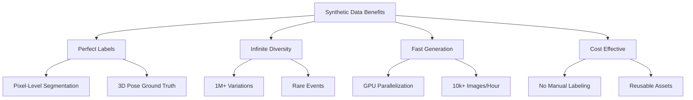
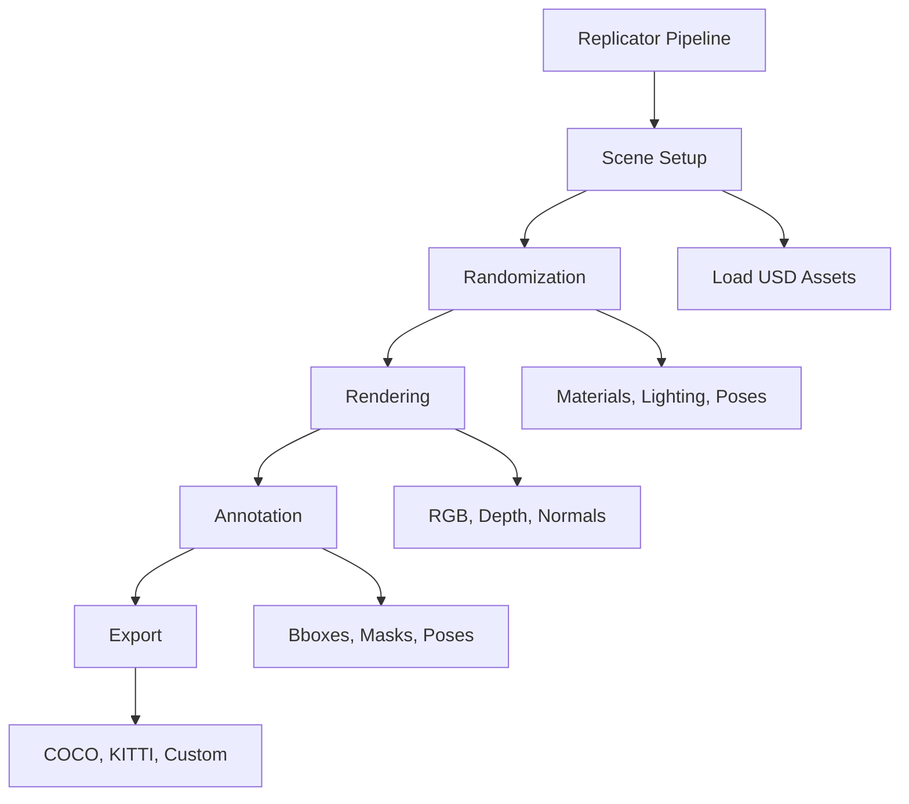
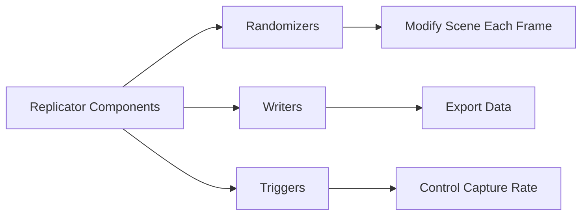
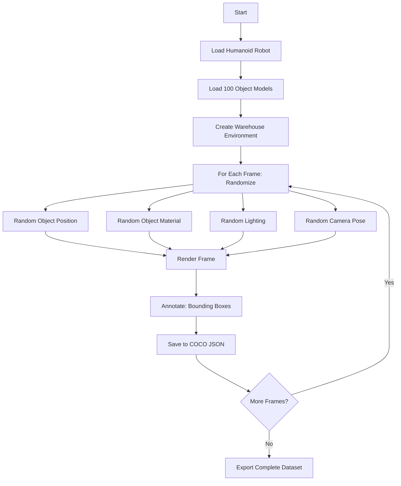
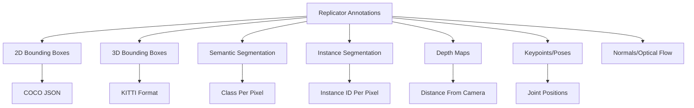
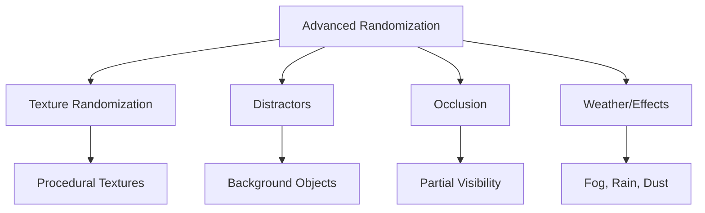
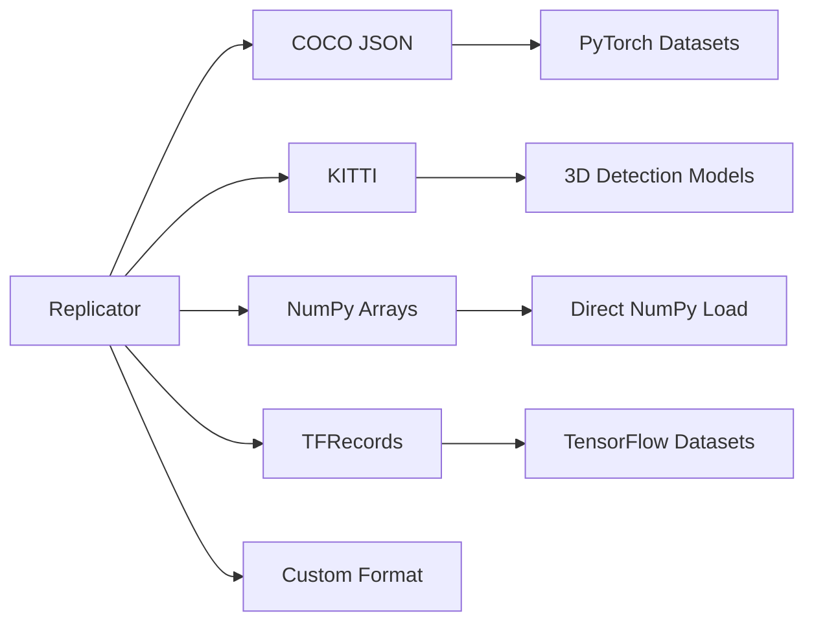
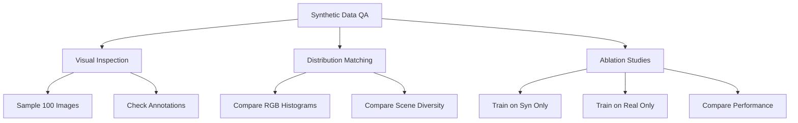

# Chapter 15: Synthetic Data Generation with Replicator

## Learning Objectives

By the end of this chapter, you will:

1. Understand synthetic data and why it's critical for training robotics AI
2. Learn NVIDIA Isaac Sim's Replicator framework for automated data generation
3. Explore techniques for generating labeled datasets (images, depth, segmentation)
4. Understand how to create diverse datasets at scale using randomization
5. Learn to export data in formats compatible with PyTorch and TensorFlow
6. Explore use cases: object detection, semantic segmentation, pose estimation
7. Understand quality metrics and validation strategies for synthetic data

## Prerequisites

Before starting this chapter, you should understand:

- **Isaac Sim fundamentals**: USD, rendering, PhysX (Chapters 12-13)
- **Domain randomization**: Visual, physical, sensor randomization (Chapter 14)
- **Computer vision basics**: Image classification, object detection, segmentation
- **Machine learning workflows**: Training data, validation, overfitting
- **Python programming**: For Replicator scripting
- **Deep learning frameworks**: PyTorch or TensorFlow (helpful)

Recommended setup:
- Isaac Sim 2023.1+ with Replicator extension
- Python 3.8+
- PyTorch or TensorFlow for training models
- NVIDIA GPU with 16GB+ VRAM (for large-scale generation)

## Introduction

Imagine needing 100,000 labeled images of humanoid robots grasping objects to train an object detection model. Manually collecting and labeling this data would take months and cost hundreds of thousands of dollars. Now imagine generating the same dataset—with pixel-perfect labels—overnight on a single workstation. This is the promise of **synthetic data generation**.

Synthetic data is artificially created data that mimics real-world distributions. For robotics, it solves three critical challenges:

1. **Cost**: Real-world data collection is expensive (hardware, labor, labeling)
2. **Scarcity**: Some scenarios are rare (failures, edge cases) or dangerous (collisions)
3. **Labeling**: Ground truth annotations (bounding boxes, segmentation masks, 3D poses) require hours of manual work

**NVIDIA Replicator** is Isaac Sim's framework for automating synthetic data generation at scale. By combining USD's flexibility, domain randomization, and RTX's photorealistic rendering, Replicator can produce millions of diverse, labeled images faster than real-time.

### The Synthetic Data Revolution

Recent breakthroughs demonstrate synthetic data's power:



**Industry adoption**:
- **Tesla**: Synthetic data for Autopilot training (road scenarios)
- **Waymo**: Simulation for self-driving edge cases
- **Amazon**: Grasp detection for warehouse robots
- **NVIDIA**: Trained Isaac ROS perception models entirely on synthetic data

**Key insight**: Synthetic data is not about **replacing** real data, but **augmenting** it. The typical workflow:
1. Generate millions of synthetic samples
2. Pretrain model on synthetic data
3. Fine-tune with limited real data (1,000-10,000 samples)

Result: 90%+ of real-data performance with 10% of the labeling cost.

## Core Concepts

### 1. Synthetic Data Generation Pipeline

Replicator automates the full data generation workflow.

#### Pipeline Architecture



**Pipeline stages**:

1. **Scene setup**: Load robot, objects, environment (USD assets)
2. **Randomization**: Apply domain randomization (Chapter 14 techniques)
3. **Rendering**: Generate RGB images with RTX rendering
4. **Annotation**: Automatically label objects (bounding boxes, segmentation, keypoints)
5. **Export**: Save in standard formats (COCO JSON, numpy arrays, TFRecords)

**Key advantage**: Fully automated—run overnight to generate 100k+ labeled samples.

### 2. Replicator Core Concepts

Replicator provides a Python API for defining data generation workflows.

#### Core Components



**1. Randomizers**: Functions that modify the scene before each render

```python
# Pseudo-code: Simple randomizer
import omni.replicator.core as rep

def randomize_object_color():
    # Select all objects with "Prop" in name
    objects = rep.get.prims(semantics=[("class", "Prop")])

    # Randomize color
    with objects:
        rep.randomizer.color(
            colors=rep.distribution.uniform((0, 0, 0), (1, 1, 1))
        )
```

**2. Writers**: Components that save rendered data

```python
# Pseudo-code: Basic RGB writer
writer = rep.WriterRegistry.get("BasicWriter")
writer.initialize(
    output_dir="/data/rgb_images",
    rgb=True,
    bounding_box_2d_tight=True
)
```

**3. Triggers**: Define when to capture frames

```python
# Pseudo-code: Trigger configuration
rep.orchestrator.run(
    num_frames=1000,  # Generate 1000 samples
    rt_subframes=10   # 10 raytracing samples per frame
)
```

### 3. Building a Synthetic Dataset: Object Detection Example

Let's walk through creating a dataset for detecting grasped objects.

#### Workflow



#### Implementation

```python
# Pseudo-code: Object detection dataset generation
import omni.replicator.core as rep
import random

# 1. Scene Setup
def setup_scene():
    # Load robot
    robot = rep.create.from_usd("/assets/humanoid.usd", semantics=[("class", "robot")])

    # Load environment
    warehouse = rep.create.from_usd("/assets/warehouse.usd")

    # Load object models (100 different objects)
    object_models = [f"/assets/objects/obj_{i}.usd" for i in range(100)]

    # Camera
    camera = rep.create.camera(position=(2, 1.5, 2), look_at=(0, 0.5, 0))

    return robot, object_models, camera

# 2. Randomization Function
def randomize_scene(object_models):
    # Select random object for this frame
    selected_object = random.choice(object_models)
    obj = rep.create.from_usd(selected_object, semantics=[("class", "target_object")])

    # Random object position (on table)
    with obj:
        rep.modify.pose(
            position=rep.distribution.uniform((-0.3, 0.8, -0.2), (0.3, 0.8, 0.2)),
            rotation=rep.distribution.uniform((0, 0, 0), (360, 360, 360))
        )

    # Random object material
    with obj:
        rep.randomizer.color(
            colors=rep.distribution.uniform((0, 0, 0), (1, 1, 1))
        )
        rep.randomizer.texture(
            textures=rep.distribution.choice([
                "/textures/wood.png",
                "/textures/metal.png",
                "/textures/plastic.png"
            ])
        )

    # Random lighting
    lights = rep.get.prims(semantics=[("class", "light")])
    with lights:
        rep.modify.attribute("intensity", rep.distribution.uniform(1000, 50000))

    # Random camera position (around robot)
    camera = rep.get.prims(semantics=[("class", "camera")])[0]
    with camera:
        rep.modify.pose(
            position=rep.distribution.uniform((1, 1, 1), (3, 2, 3)),
            look_at=(0, 0.5, 0)
        )

# 3. Configure Writer (COCO format for object detection)
writer = rep.WriterRegistry.get("COCOWriter")
writer.initialize(
    output_dir="/data/object_detection",
    rgb=True,
    bounding_box_2d_tight=True,  # Tight bounding boxes
    semantic_segmentation=True,   # Segmentation masks
    instance_segmentation=True    # Instance IDs
)

# 4. Register Randomizers
rep.randomizer.register(randomize_scene)

# 5. Run Data Generation
with rep.trigger.on_frame(num_frames=10000):  # 10,000 frames
    randomize_scene(object_models)

rep.orchestrator.run()
```

**Output structure**:
```
/data/object_detection/
├── rgb/
│   ├── 0000.png
│   ├── 0001.png
│   └── ...
├── semantic_segmentation/
│   ├── 0000.png  # Color-coded masks
│   └── ...
├── instance_segmentation/
│   ├── 0000.png  # Instance IDs
│   └── ...
├── bounding_boxes/
│   └── annotations.json  # COCO format
└── metadata.json
```

### 4. Annotation Types

Replicator generates multiple annotation formats automatically.



**1. 2D Bounding Boxes**: Rectangular boxes around objects

```json
// COCO format example
{
  "images": [{"id": 0, "file_name": "0000.png", "width": 1920, "height": 1080}],
  "annotations": [
    {
      "id": 0,
      "image_id": 0,
      "category_id": 1,
      "bbox": [450, 320, 180, 240],  // [x, y, width, height]
      "area": 43200,
      "iscrowd": 0
    }
  ],
  "categories": [{"id": 1, "name": "cup"}, {"id": 2, "name": "bottle"}]
}
```

**2. Semantic Segmentation**: Pixel-level class labels

```python
# Each pixel value = class ID
# Example: segmentation_mask.png
# Pixel [100, 200] = 1 (robot)
# Pixel [500, 300] = 2 (object)
# Pixel [800, 600] = 0 (background)
```

**3. 3D Bounding Boxes**: Oriented boxes in 3D space (for 3D object detection)

```python
# 3D bbox annotation (KITTI-like format)
{
    "label": "cup",
    "position": [0.5, 0.8, 0.2],  # x, y, z center
    "dimensions": [0.08, 0.1, 0.08],  # width, height, depth
    "rotation": [0, 45, 0]  # Roll, pitch, yaw (degrees)
}
```

**4. Keypoints**: Specific points on objects (e.g., robot joints, object corners)

```python
# Humanoid joint keypoints
{
    "keypoints": [
        [960, 540, 1],  # Head: [x, y, visibility]
        [960, 650, 1],  # Torso center
        [850, 720, 1],  # Left shoulder
        [1070, 720, 1], # Right shoulder
        # ... 25 joints total
    ]
}
```

### 5. Advanced Randomization Techniques

Beyond basic randomization, Replicator enables sophisticated data diversity.

#### Techniques



**1. Texture randomization**: Swap textures on all surfaces

```python
# Pseudo-code: Randomize all textures in scene
def randomize_all_textures():
    all_meshes = rep.get.prims(prim_types=["Mesh"])

    for mesh in all_meshes:
        with mesh:
            rep.randomizer.texture(
                texture_list=rep.utils.get_texture_files("/textures/"),
                project_uvw=True  # Auto-generate UVs if missing
            )
```

**2. Distractor objects**: Add irrelevant objects to test model robustness

```python
# Pseudo-code: Add random distractors
def add_distractors(num_distractors=10):
    distractor_models = ["/assets/clutter/item_{}.usd".format(i) for i in range(50)]

    for _ in range(num_distractors):
        distractor = rep.create.from_usd(
            random.choice(distractor_models),
            semantics=[("class", "distractor")]  # Not annotated
        )
        with distractor:
            rep.modify.pose(
                position=rep.distribution.uniform((-2, 0, -2), (2, 2, 2))
            )
```

**3. Occlusion**: Partially hide objects to train robustness

```python
# Pseudo-code: Add occluding panels
def add_occlusions():
    for i in range(5):
        occluder = rep.create.cube(
            semantics=[("class", "occluder")],
            scale=(0.5, 0.5, 0.01)  # Thin panel
        )
        with occluder:
            rep.modify.pose(
                position=rep.distribution.uniform((-1, 0.5, -1), (1, 1.5, 1))
            )
            rep.randomizer.materials(
                materials=["/materials/glass.mdl", "/materials/cardboard.mdl"]
            )
```

**4. Weather effects**: Fog, dust, rain for outdoor scenarios

```python
# Pseudo-code: Add fog post-processing
def add_fog_effect():
    rep.settings.set_render_pathtraced(samples_per_pixel=64)

    # Post-processing fog
    camera = rep.get.camera()
    with camera:
        rep.modify.attribute("fogDensity", rep.distribution.uniform(0.0, 0.3))
        rep.modify.attribute("fogColor", (0.8, 0.8, 0.9))
```

### 6. Data Export and Integration with Training Pipelines

Replicator exports data in formats compatible with popular frameworks.

#### Export Formats



**PyTorch integration**:

```python
# Pseudo-code: Load Replicator data in PyTorch
import torch
from torch.utils.data import Dataset, DataLoader
from PIL import Image
import json

class ReplicatorDataset(Dataset):
    def __init__(self, data_dir):
        self.data_dir = data_dir
        self.rgb_dir = f"{data_dir}/rgb"

        # Load COCO annotations
        with open(f"{data_dir}/bounding_boxes/annotations.json") as f:
            self.coco_data = json.load(f)

        self.images = self.coco_data["images"]
        self.annotations = self.coco_data["annotations"]

    def __len__(self):
        return len(self.images)

    def __getitem__(self, idx):
        # Load image
        img_info = self.images[idx]
        img_path = f"{self.rgb_dir}/{img_info['file_name']}"
        image = Image.open(img_path).convert("RGB")

        # Load annotations for this image
        img_id = img_info["id"]
        annots = [a for a in self.annotations if a["image_id"] == img_id]

        # Extract bounding boxes and labels
        boxes = [a["bbox"] for a in annots]  # [x, y, w, h]
        labels = [a["category_id"] for a in annots]

        return {
            "image": torch.tensor(image),
            "boxes": torch.tensor(boxes),
            "labels": torch.tensor(labels)
        }

# Create DataLoader
dataset = ReplicatorDataset("/data/object_detection")
dataloader = DataLoader(dataset, batch_size=32, shuffle=True, num_workers=4)

# Training loop
for batch in dataloader:
    images = batch["image"]
    boxes = batch["boxes"]
    labels = batch["labels"]

    # Train model
    # ...
```

### 7. Quality Assurance and Validation

Ensuring synthetic data quality is critical for successful transfer.

#### Validation Strategies



**1. Visual inspection**:
```python
# Pseudo-code: Visualize random samples with annotations
import matplotlib.pyplot as plt
import random

def visualize_samples(dataset, num_samples=10):
    for _ in range(num_samples):
        idx = random.randint(0, len(dataset) - 1)
        sample = dataset[idx]

        plt.figure(figsize=(10, 10))
        plt.imshow(sample["image"])

        # Draw bounding boxes
        for box, label in zip(sample["boxes"], sample["labels"]):
            x, y, w, h = box
            rect = plt.Rectangle((x, y), w, h, fill=False, color="red")
            plt.gca().add_patch(rect)
            plt.text(x, y, f"Class {label}", color="red")

        plt.show()
```

**2. Distribution matching**: Compare synthetic and real data statistics

```python
# Pseudo-code: Compare color distributions
import numpy as np

def compare_color_distributions(synthetic_images, real_images):
    syn_mean = np.mean(synthetic_images, axis=(0, 1, 2))
    real_mean = np.mean(real_images, axis=(0, 1, 2))

    print(f"Synthetic RGB mean: {syn_mean}")
    print(f"Real RGB mean: {real_mean}")

    # Should be similar if randomization is effective
```

**3. Ablation study**: Train models on different data mixes

| Training Data | Validation Accuracy |
|---------------|---------------------|
| 100% Real (10k samples) | 85% |
| 100% Synthetic (100k samples) | 78% |
| 90% Syn + 10% Real | 88% |
| Pretrain Syn → Finetune Real | **92%** |

**Best result**: Pretrain on large synthetic dataset, fine-tune on small real dataset.

## Integration Across Modules

Synthetic data generation is the culmination of all Isaac Sim capabilities.

### From Previous Modules
- **Isaac Sim (Chapter 12)**: Replicator uses GPU rendering and parallel envs for fast generation
- **USD (Chapter 13)**: Replicator manipulates USD layers/variants for randomization
- **Domain Randomization (Chapter 14)**: Replicator implements all randomization techniques at scale

### To Future Modules
- **VLA Models (Chapter 16-19)**: Synthetic data trains VLA vision encoders and action models
- **Vision Transformers (Chapter 18)**: Large-scale synthetic datasets enable ViT pretraining
- **Capstone (Chapter 20-22)**: Synthetic data likely used to train perception models before real deployment

## Practical Q&A

**Q1: How many synthetic images do I need?**

**A**: Rule of thumb:
- **Simple tasks** (classify 5 objects): 10k-50k images
- **Object detection** (detect 20 classes): 50k-200k images
- **Complex scenes** (cluttered manipulation): 200k-1M images

**Start small**: Generate 10k, train model, evaluate. If performance is insufficient, scale up.

**Q2: Can synthetic data completely replace real data?**

**A**: Rarely. The optimal workflow:
1. Generate 100k-1M synthetic samples
2. Pretrain model on synthetic data
3. Collect 1k-10k real samples
4. Fine-tune on real data

**Result**: 90%+ real-data performance with 10% of labeling effort.

**Q3: How do I know if my synthetic data is good enough?**

**A**: Validation methods:
1. **Visual Turing test**: Can humans distinguish synthetic from real? (Should be hard)
2. **Distribution matching**: RGB histograms, object size distributions should match real data
3. **Downstream performance**: Model trained on synthetic data should achieve 70%+ of real-data performance before fine-tuning

**Q4: What's the fastest way to generate 100k images?**

**A**: Optimization strategies:
1. **Disable unnecessary annotations**: Only generate what you need (e.g., skip depth if doing classification)
2. **Use lower rendering quality**: Reduce samples per pixel (16 instead of 256)
3. **Parallelize**: Run multiple Replicator instances on different GPUs
4. **Headless mode**: Disable UI for faster rendering

**Benchmark**: RTX 4090 can generate ~2k images/hour at 1080p with full annotations.

**Q5: How do I handle class imbalance in synthetic datasets?**

**A**: Strategies:
1. **Balanced sampling**: Force equal number of samples per class
2. **Weighted randomization**: Sample rare classes more frequently
3. **Data augmentation**: Apply more augmentation to rare classes

```python
# Pseudo-code: Class-balanced sampling
class_weights = {"cup": 0.4, "bottle": 0.3, "box": 0.2, "ball": 0.1}

def sample_object():
    return random.choices(
        population=list(class_weights.keys()),
        weights=list(class_weights.values())
    )[0]
```

**Q6: Can I use Replicator for non-vision tasks?**

**A**: Yes, though primarily vision-focused:
- **Depth/LiDAR datasets**: For SLAM and navigation
- **Force/torque data**: Record simulated sensor readings during contact
- **Trajectory datasets**: Record joint positions for imitation learning

## Connections to Other Modules

### Part 1 - Foundations
- **Physical AI (Chapter 1)**: Synthetic data accelerates embodied AI development by enabling rapid iteration
- **Embodied Intelligence (Chapter 3)**: Large-scale synthetic datasets enable grounded learning

### Module 2 - Digital Twin
- **Sensor Simulation (Chapter 10)**: Replicator uses simulated sensors to generate realistic data
- **Unity (Chapter 11)**: Unity can also generate synthetic data, though Isaac Sim's Replicator is more advanced

### Module 3 - NVIDIA Isaac (Current Module)
- **Isaac Sim (Chapter 12)**: Replicator leverages GPU parallelization for fast generation
- **USD (Chapter 13)**: USD's flexibility enables rapid scene composition and randomization
- **Domain Randomization (Chapter 14)**: Replicator automates all randomization techniques

### Module 4 - VLA (Next Module)
- **VLA Models (Chapter 16)**: Synthetic data trains vision-language-action models
- **Vision Transformers (Chapter 18)**: Large synthetic datasets pretrain vision encoders
- **Action Models (Chapter 19)**: Imitation learning datasets generated in simulation

### Capstone
- **Project Architecture (Chapter 20)**: Synthetic data generation will be part of the training pipeline
- **Integration (Chapter 21)**: Synthetic datasets bridge simulation and real deployment

## Summary

Synthetic data generation with NVIDIA Replicator transforms robotics AI development by enabling rapid, cost-effective creation of massive labeled datasets. By combining USD's flexibility, domain randomization, and GPU-accelerated rendering, Replicator produces datasets that rival real-world data at a fraction of the cost.

**Key takeaways**:

1. **Synthetic data solves**: Cost, scarcity, and labeling challenges in robotics
2. **Replicator pipeline**: Scene setup → Randomization → Rendering → Annotation → Export
3. **Annotation types**: 2D/3D bboxes, segmentation, depth, keypoints, optical flow
4. **Advanced randomization**: Textures, distractors, occlusion, weather effects
5. **Export formats**: COCO, KITTI, NumPy, TFRecords (PyTorch/TensorFlow compatible)
6. **Validation**: Visual inspection, distribution matching, ablation studies
7. **Optimal workflow**: Pretrain on synthetic → Fine-tune on limited real data

**Best practices**:
- Start with 10k samples, scale based on performance
- Match synthetic and real data distributions (color, lighting, clutter)
- Validate with visual Turing test and downstream model performance
- Combine synthetic pretraining with real-world fine-tuning

**Replicator's value**: 100x faster dataset creation, perfect labels, infinite diversity. As we move into VLA models (Module 4), you'll see how these large-scale synthetic datasets enable training foundation models for robotics.

## References

1. NVIDIA. (2024). *Replicator Documentation*. NVIDIA Omniverse. https://docs.omniverse.nvidia.com/extensions/latest/ext_replicator.html
2. Tremblay, J., Prakash, A., Acuna, D., et al. (2018). *Training Deep Networks with Synthetic Data: Bridging the Reality Gap by Domain Randomization*. IEEE Conference on Computer Vision and Pattern Recognition Workshops (CVPRW).
3. Hinterstoisser, S., Pauly, O., Heibel, H., Martina, M., & Bokeloh, M. (2019). *An Annotation Saved is an Annotation Earned: Using Fully Synthetic Training for Object Detection*. IEEE/CVF International Conference on Computer Vision Workshop (ICCVW).
4. Mayer, N., Ilg, E., Hausser, P., et al. (2016). *A Large Dataset to Train Convolutional Networks for Disparity, Optical Flow, and Scene Flow Estimation*. IEEE Conference on Computer Vision and Pattern Recognition (CVPR).
5. Prakash, A., Boochoon, S., Brophy, M., et al. (2019). *Structured Domain Randomization: Bridging the Reality Gap by Context-Aware Synthetic Data*. IEEE International Conference on Robotics and Automation (ICRA).
6. Denninger, M., Sundermeyer, M., Winkelbauer, D., et al. (2020). *BlenderProc: Reducing the Reality Gap with Photorealistic Rendering*. Robotics: Science and Systems (RSS) Workshops.
7. Kar, A., Prakash, A., Liu, M., et al. (2019). *Meta-Sim: Learning to Generate Synthetic Datasets*. IEEE/CVF International Conference on Computer Vision (ICCV).
8. Google Research. (2022). *Scaling Up and Distilling Down: Language-Guided Robot Skill Acquisition*. Conference on Robot Learning (CoRL).

