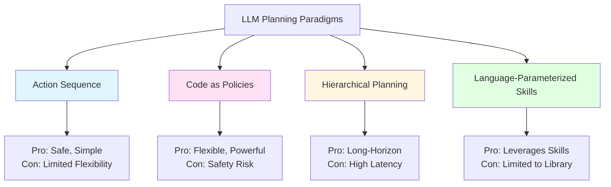

# Chapter 18: How LLMs Generate Robot Actions

## Learning Objectives

By the end of this chapter, you will:

1. Understand how large language models (LLMs) perform task planning for robots
2. Learn different LLM planning paradigms (action sequences, code generation, hierarchical planning)
3. Explore prompt engineering techniques for robot control
4. Understand how LLMs ground abstract commands in concrete robot actions
5. Learn about few-shot learning and in-context demonstrations
6. Explore error handling, constraint satisfaction, and safety in LLM planning
7. Understand how to evaluate and debug LLM-generated robot plans

## Prerequisites

Before starting this chapter, you should understand:

- **VLA fundamentals**: Vision-language-action models (Chapter 16)
- **Voice-to-action pipeline**: Whisper ASR and LLM integration (Chapter 17)
- **ROS 2 actions and services**: Robot control interfaces (Chapter 5)
- **Basic prompt engineering**: How to structure LLM prompts (helpful but not required)
- **Python programming**: For code generation and execution

Recommended background:
- Familiarity with transformer architecture and attention mechanisms
- Understanding of LLM capabilities (reasoning, code generation, commonsense knowledge)
- Exposure to planning algorithms (A*, hierarchical task networks)

## Introduction: Why This Matters

Traditional robot task planning requires explicit algorithms (A* for path planning, grasp planners, motion planners). Each new task requires custom code. **Large language models (LLMs)** offer a different approach: **learning to plan from text**.

Consider the command: *"Set the table for dinner."*

A traditional robot needs:
- Hardcoded knowledge: Table = flat surface, Dinner = plates + forks + knives + glasses
- Explicit task decomposition: Navigate to cabinet → Open door → Grasp plate → Place on table (repeat for each item)
- Custom logic for each object type and spatial arrangement

An LLM-based planner can:
- **Infer** what "set the table" means from its training on web text (cooking blogs, household guides)
- **Decompose** the task into subgoals without explicit programming
- **Adapt** to variations ("Set the table for 4 people" vs. "Set the table for a picnic")
- **Reason** about object affordances and spatial relationships

This chapter explores **how LLMs convert natural language commands into executable robot action plans**, including:
- **Planning paradigms**: Action sequences, code generation, hierarchical decomposition
- **Prompt engineering**: Structuring inputs to guide LLM reasoning
- **Grounding**: Mapping abstract language ("set the table") to concrete actions (`grasp(plate_1)`)
- **Safety and constraints**: Ensuring LLM plans are feasible and safe

```mermaid
graph LR
    A[Natural Language<br/>"Set the table"] --> B[LLM Planner<br/>GPT-4 / Claude]
    B --> C[Reasoning Process<br/>Chain-of-Thought]
    C --> D[Action Sequence<br/>Step 1-10]
    D --> E[VLA Executor<br/>Low-level Control]
    E --> F[Humanoid Robot<br/>Executes Task]

    style B fill:#ffe1f5
    style C fill:#fff5e1
    style E fill:#e1ffe1
```

### Why LLMs for Robot Planning?

**1. Commonsense Knowledge**: LLMs know that "water" is a liquid, "mug" is a container, "heavy" means hard to lift
**2. Zero-Shot Generalization**: Can plan for novel tasks without task-specific training
**3. Natural Language Interface**: Users can give instructions in plain English
**4. Adaptability**: Can handle variations ("set table for 2" vs. "set table for 4") without reprogramming
**5. Explainability**: LLMs can articulate their reasoning in natural language

**Challenges**:
- **Grounding**: LLMs don't inherently understand physical constraints (can't "teleport" to a location)
- **Reliability**: LLMs occasionally generate nonsensical or unsafe plans ("juggle knives")
- **Computational cost**: LLM inference is slower than classical planners

## LLM Planning Paradigms

LLMs can generate robot plans in different formats, each with trade-offs:

### 1. Action Sequence Planning

**Approach**: LLM outputs a sequence of predefined robot actions

**Format**: JSON, YAML, or structured text
```json
[
  {"action": "navigate", "params": {"location": "kitchen"}},
  {"action": "open_gripper", "params": {}},
  {"action": "grasp", "params": {"object": "mug"}},
  {"action": "navigate", "params": {"location": "table"}},
  {"action": "release", "params": {}}
]
```

**Pros**:
- Simple to parse and execute
- Safe (actions are predefined, can't do undefined behaviors)
- Fast execution (no runtime interpretation)

**Cons**:
- Limited to predefined action space (can't handle novel actions)
- Less flexible than code-based approaches

**When to use**: Well-defined tasks with fixed action vocabularies (pick-and-place, navigation, manipulation)

### 2. Code as Policies

**Approach**: LLM generates Python code that executes robot actions

**Format**: Executable Python functions
```python
def set_table_for_dinner():
    robot.navigate("kitchen")
    plate = robot.detect_object("plate")
    robot.grasp(plate)
    robot.navigate("table")
    robot.place(plate, position=(0.3, 0.0, 0.8))  # x, y, z
    # Repeat for fork, knife, etc.
    robot.say("Table is set!")
```

**Pros**:
- Highly flexible (can use control flow: loops, conditionals)
- Access to full Python ecosystem (math, geometry libraries)
- Can define new helper functions on the fly

**Cons**:
- **Safety risk**: LLM could generate malicious code (`os.system("rm -rf /")`)
- Harder to validate before execution
- Requires sandboxed execution environment

**When to use**: Complex tasks requiring loops, math, or custom logic

**Example**: Code as Policies (Google Research)
- LLM (GPT-4) generates Python code for robot manipulation tasks
- Code calls predefined robot API functions
- Achieves 70-90% success on tabletop manipulation benchmarks

### 3. Hierarchical Planning

**Approach**: LLM generates high-level plan, then recursively decomposes subgoals

**Format**: Tree of goals and subgoals
```
Goal: Set the table for dinner
  ├─ Subgoal 1: Gather utensils
  │   ├─ Navigate to cabinet
  │   ├─ Open cabinet door
  │   ├─ Grasp plate
  │   └─ Place plate on table
  ├─ Subgoal 2: Gather cups
  │   └─ ...
  └─ Subgoal 3: Arrange items on table
      └─ ...
```

**Pros**:
- Handles long-horizon tasks (many steps)
- Mirrors human planning (decompose big problems into smaller ones)
- Can replan at each level if subgoal fails

**Cons**:
- Requires multiple LLM calls (one per subgoal level)
- Higher latency and cost
- Complex orchestration logic

**When to use**: Long-horizon tasks (&gt;20 steps) requiring structured decomposition

**Example**: Saycan (Google DeepMind)
- LLM generates high-level plan ("Go to kitchen, get water, return")
- VLA policy executes each subgoal
- LLM replans if subgoal fails (e.g., can't find water → "Go to fridge instead")

### 4. Language-Parameterized Skills

**Approach**: LLM selects from a library of pre-trained robot skills

**Format**: Skill name + parameters
```python
skills = {
    "pick_and_place": PickAndPlaceSkill(),
    "pour": PourSkill(),
    "wipe": WipeSkill()
}

# LLM output
plan = [
    ("pick_and_place", {"object": "mug", "target": "table"}),
    ("pour", {"source": "water_bottle", "target": "mug"}),
]

# Execute
for skill_name, params in plan:
    skills[skill_name].execute(params)
```

**Pros**:
- Leverages existing robot capabilities (skills are pre-trained)
- Fast execution (skills are optimized)
- Safer (skills have been tested)

**Cons**:
- Limited to skill library (can't do novel actions)
- Requires maintaining skill library

**When to use**: Domains with well-defined, reusable skills (manipulation, navigation, assembly)



## Prompt Engineering for Robot Planning

The quality of LLM-generated plans depends critically on **prompt design**. Effective prompts must:
1. Define robot capabilities (action space)
2. Provide environment context (objects, locations)
3. Specify output format (JSON, code, etc.)
4. Include constraints (safety, feasibility)
5. Give examples (few-shot learning)

### Anatomy of a Robot Planning Prompt

```python
SYSTEM_PROMPT = """
You are an AI planner for a humanoid robot.

Robot Capabilities:
- Actions: navigate(location), detect_objects(query), grasp(object_id), release(), place(object_id, x, y, z)
- Sensors: RGB camera (front-facing), depth sensor, IMU
- Constraints: Max payload 5kg, max reach 0.8m, battery 60 mins

Environment:
- Locations: kitchen, living_room, bedroom, hallway
- Objects in kitchen: plates (4x), forks (4x), knives (4x), glasses (4x), water_bottle (1x)
- Objects in living_room: table (1x, dimensions 1.2m x 0.8m)

Task: {user_command}

Output Format (JSON):
[
  {{"action": "navigate", "params": {{"location": "kitchen"}}}},
  {{"action": "grasp", "params": {{"object_id": "plate_1"}}}}
]

Constraints:
- Do not grasp objects heavier than 5kg
- Ensure stable placement (objects don't fall)
- Minimize total steps

Generate the plan:
"""

# Use with LLM
def generate_plan(user_command):
    prompt = SYSTEM_PROMPT.format(user_command=user_command)
    response = llm_api_call(prompt)
    return json.loads(response)
```

### Few-Shot Learning: Teaching by Example

Include 2-3 example inputs and outputs in the prompt to guide the LLM:

```python
FEW_SHOT_PROMPT = """
You are a robot planner. Here are examples:

Example 1:
Input: "Bring me a glass of water"
Output:
[
  {"action": "navigate", "params": {"location": "kitchen"}},
  {"action": "detect_objects", "params": {"query": "glass"}},
  {"action": "grasp", "params": {"object_id": "glass_1"}},
  {"action": "navigate", "params": {"location": "sink"}},
  {"action": "activate_faucet", "params": {"duration_sec": 3}},
  {"action": "navigate", "params": {"location": "user"}},
  {"action": "handover", "params": {}}
]

Example 2:
Input: "Put the book on the shelf"
Output:
[
  {"action": "detect_objects", "params": {"query": "book"}},
  {"action": "grasp", "params": {"object_id": "book_1"}},
  {"action": "navigate", "params": {"location": "shelf"}},
  {"action": "place", "params": {"object_id": "book_1", "x": 0.5, "y": 0.0, "z": 1.2}}
]

Now generate a plan for: {user_command}
"""
```

**Why few-shot learning works**:
- LLMs learn patterns from examples (format, action sequencing, common subgoals)
- Reduces ambiguity in output format
- Improves consistency across different user commands

**Empirical results** (from SayCan paper):
- Zero-shot planning: 40% success rate
- Few-shot planning (3 examples): 75% success rate
- Shows 87% improvement with just 3 examples!

### Chain-of-Thought Prompting

Encourage LLM to **articulate reasoning steps** before generating the plan:

```python
COT_PROMPT = """
You are a robot planner. Before generating the action plan, explain your reasoning step-by-step.

User command: {user_command}

Reasoning:
1. What is the goal? [Identify task objective]
2. What objects are needed? [List required objects]
3. Where are the objects located? [Identify locations]
4. What is the action sequence? [Decompose into steps]

Action Plan (JSON):
[...]
"""
```

**Example**:
- Command: "Make me a coffee"
- Reasoning (LLM output):
  1. Goal: Brew coffee and deliver to user
  2. Objects needed: Coffee mug, coffee machine, coffee grounds
  3. Locations: Kitchen (coffee machine and mug), pantry (coffee grounds)
  4. Sequence: Navigate to pantry → Get coffee grounds → Navigate to kitchen → Place grounds in machine → Activate machine → Pour coffee into mug → Navigate to user

**Benefits**:
- Improved plan quality (LLM catches logical errors during reasoning)
- Debugging aid (you can see why the LLM chose certain actions)
- Handles complex tasks better (multi-step reasoning)

**Cost**: Longer LLM output (more tokens = higher latency and cost)

### Dynamic Replanning

LLMs can replan when the robot encounters unexpected situations:

```python
def execute_plan_with_replanning(plan):
    for action in plan:
        success = execute_action(action)

        if not success:
            # Action failed, ask LLM to replan
            failure_description = get_failure_reason(action)
            new_plan = llm_replan(
                original_command=user_command,
                failed_action=action,
                failure_reason=failure_description,
                completed_actions=plan[:plan.index(action)]
            )
            plan = new_plan  # Update plan

# LLM replanning prompt
REPLAN_PROMPT = """
The robot was executing this plan:
{original_plan}

Action {failed_action} failed because: {failure_reason}

Completed actions so far: {completed_actions}

Generate a new plan to complete the task, avoiding the failed action.
"""
```

**Example scenario**:
- Plan: Navigate to kitchen → Grasp mug → Navigate to table
- Execution: Navigate to kitchen ✓ → Grasp mug ✗ (mug not detected)
- Replan: LLM suggests alternative: "Search in cabinet → Grasp mug from cabinet → Navigate to table"

## Grounding Language in Robot Actions

LLMs operate on abstract language ("pick up", "move to"), but robots need concrete parameters (joint angles, coordinates). **Grounding** bridges this gap.

### Spatial Grounding

**Problem**: "Place the mug on the left side of the table"

**Solution**: Convert spatial language to coordinates
```python
def ground_spatial_reference(location_description, reference_object):
    # Get reference object pose
    ref_pose = get_object_pose(reference_object)  # e.g., table center at (1.0, 0.5, 0.8)

    # Parse spatial preposition
    if "left" in location_description:
        offset = (-0.3, 0.0, 0.0)  # 30cm to the left
    elif "right" in location_description:
        offset = (0.3, 0.0, 0.0)
    elif "behind" in location_description:
        offset = (0.0, 0.3, 0.0)

    # Compute target pose
    target_pose = ref_pose + offset
    return target_pose

# LLM generates: {"action": "place", "params": {"location": "left side of table"}}
# Grounding converts to: {"action": "place", "params": {"x": 0.7, "y": 0.5, "z": 0.8}}
```

### Object Grounding

**Problem**: "Grasp the red mug" → Which mug (if there are multiple red mugs)?

**Solution**: Vision-language grounding
```python
def ground_object_reference(object_description, camera_image):
    # Run object detection
    detected_objects = vision_model.detect(camera_image)

    # Parse object attributes from language
    color = extract_color(object_description)  # "red"
    object_type = extract_type(object_description)  # "mug"

    # Filter objects by attributes
    candidates = [
        obj for obj in detected_objects
        if obj.type == object_type and obj.color == color
    ]

    if len(candidates) == 0:
        return None  # Object not found
    elif len(candidates) == 1:
        return candidates[0].id  # Unique match
    else:
        # Ambiguous, select most salient (closest, largest, etc.)
        return select_most_salient(candidates).id

# LLM generates: {"action": "grasp", "params": {"object": "red mug"}}
# Grounding converts to: {"action": "grasp", "params": {"object_id": "mug_3"}}
```

### Action Affordance Grounding

**Problem**: LLM suggests "pour water" but doesn't specify how

**Solution**: Pre-trained action skills with parameters
```python
class PourSkill:
    def execute(self, source_object, target_object):
        # Grasp source container
        self.robot.grasp(source_object)

        # Move to pouring pose above target
        target_pose = self.robot.get_object_pose(target_object)
        pour_pose = target_pose + (0, 0, 0.15)  # 15cm above target

        # Execute pouring motion (tilt container)
        self.robot.move_to_pose(pour_pose)
        self.robot.tilt_gripper(angle=60)  # degrees

        # Wait for liquid to pour
        time.sleep(2.0)

        # Return to upright
        self.robot.tilt_gripper(angle=0)

# LLM generates: {"action": "pour", "params": {"source": "water_bottle", "target": "mug"}}
# Skill library executes complex manipulation without LLM specifying low-level details
```

```mermaid
graph TD
    A[LLM Output<br/>"Place mug on left side of table"] --> B[Grounding Module]

    B --> C[Spatial Grounding<br/>"left side" → x: 0.7, y: 0.5]
    B --> D[Object Grounding<br/>"mug" → object_id: mug_3]
    B --> E[Action Grounding<br/>"place" → PlaceSkill params]

    C --> F[Grounded Action]
    D --> F
    E --> F

    F --> G[VLA Executor<br/>Low-level Control]

    style B fill:#fff5e1
    style G fill:#e1ffe1
```

## Constraint Satisfaction and Safety

LLM plans must satisfy robot constraints and safety requirements.

### Physical Constraints

**Problem**: LLM suggests navigating through a wall

**Solution**: Validate plan feasibility
```python
def validate_plan(plan, robot_state, environment_map):
    for action in plan:
        if action["action"] == "navigate":
            # Check if path exists and is collision-free
            target = action["params"]["location"]
            path = compute_path(robot_state.location, target, environment_map)
            if path is None or has_collision(path, environment_map):
                return False, f"Cannot navigate to {target}: no collision-free path"

        elif action["action"] == "grasp":
            # Check if object is within reach
            object_id = action["params"]["object_id"]
            object_pose = get_object_pose(object_id)
            if distance(robot_state.position, object_pose) > MAX_REACH:
                return False, f"Object {object_id} is out of reach"

        elif action["action"] == "place":
            # Check if target location is stable
            target_pose = action["params"]
            if not is_stable_surface(target_pose):
                return False, "Target location is not a stable surface"

    return True, "Plan is feasible"
```

### Safety Constraints

**Problem**: LLM suggests picking up a knife by the blade

**Solution**: Safety shield with domain rules
```python
SAFETY_RULES = {
    "knife": {"grasp_location": "handle", "max_speed": 0.1},
    "hot_object": {"requires_protective_gear": True},
    "fragile_object": {"max_grip_force": 5.0},  # Newtons
}

def apply_safety_constraints(action, object_id):
    object_type = get_object_type(object_id)

    if object_type in SAFETY_RULES:
        safety_rule = SAFETY_RULES[object_type]

        if "grasp_location" in safety_rule:
            action["params"]["grasp_location"] = safety_rule["grasp_location"]

        if "max_speed" in safety_rule:
            action["params"]["max_speed"] = safety_rule["max_speed"]

        if "requires_protective_gear" in safety_rule:
            if not robot_has_protection():
                raise SafetyException(f"Cannot handle {object_type} without protection")

    return action
```

### Human-in-the-Loop Confirmation

For critical tasks, require human approval:

```python
def execute_plan_with_confirmation(plan, critical_actions=["grasp_knife", "use_tool"]):
    for action in plan:
        # Check if action is critical
        if action["action"] in critical_actions:
            # Show action to user
            print(f"About to execute: {action}")
            print("Robot will grasp knife by the handle. Approve? (y/n)")
            user_input = input()

            if user_input.lower() != 'y':
                print("Action cancelled by user")
                return False

        execute_action(action)

    return True
```

## Advanced Techniques

### Multi-Agent LLM Planning

For complex tasks, use multiple specialized LLMs:

```python
# Specialist LLMs
navigation_llm = LLM(model="gpt-4", system_prompt=NAVIGATION_PROMPT)
manipulation_llm = LLM(model="gpt-4", system_prompt=MANIPULATION_PROMPT)
coordinator_llm = LLM(model="gpt-4", system_prompt=COORDINATOR_PROMPT)

# Coordinator decomposes task
def plan_task(user_command):
    # Coordinator generates high-level plan
    high_level_plan = coordinator_llm.generate(user_command)
    # Example output: [{"subgoal": "go to kitchen"}, {"subgoal": "pick up mug"}]

    full_plan = []

    for subgoal in high_level_plan:
        # Route subgoal to specialist
        if "navigate" in subgoal["subgoal"] or "go to" in subgoal["subgoal"]:
            subplan = navigation_llm.generate(subgoal["subgoal"])
        elif "pick" in subgoal["subgoal"] or "grasp" in subgoal["subgoal"]:
            subplan = manipulation_llm.generate(subgoal["subgoal"])

        full_plan.extend(subplan)

    return full_plan
```

**Benefits**: Each LLM is specialized (better performance), easier to debug (isolate failures to specific domain)

### Learned Value Functions for Action Selection

Combine LLM planning with learned value functions:

```python
# LLM generates multiple candidate plans
def generate_candidate_plans(user_command, num_candidates=5):
    plans = []
    for _ in range(num_candidates):
        plan = llm_generate_plan(user_command, temperature=0.7)  # Higher temp for diversity
        plans.append(plan)
    return plans

# Value function ranks plans by expected success
def rank_plans_by_value(plans):
    scored_plans = []
    for plan in plans:
        # Value function learned from past execution data
        value = value_function.predict(plan)
        scored_plans.append((value, plan))

    # Sort by value (descending)
    scored_plans.sort(key=lambda x: x[0], reverse=True)
    return [plan for (value, plan) in scored_plans]

# Execute highest-value plan
def execute_best_plan(user_command):
    candidates = generate_candidate_plans(user_command, num_candidates=5)
    ranked_plans = rank_plans_by_value(candidates)
    best_plan = ranked_plans[0]
    execute_plan(best_plan)
```

**Example**: SayCan (Google) uses this approach to select LLM plans most likely to succeed based on learned affordance functions.

## Evaluating LLM Planning Performance

How do we measure if an LLM is a good robot planner?

### Success Rate

**Metric**: Percentage of tasks completed successfully

```python
def evaluate_llm_planner(llm, test_tasks, num_trials_per_task=10):
    results = []

    for task in test_tasks:
        successes = 0

        for trial in range(num_trials_per_task):
            plan = llm.generate_plan(task)
            success = execute_and_check_success(plan, task)
            if success:
                successes += 1

        success_rate = successes / num_trials_per_task
        results.append((task, success_rate))

    # Average success rate across tasks
    overall_success_rate = sum(sr for (task, sr) in results) / len(results)
    return overall_success_rate, results
```

**Benchmarks**:
- **VirtualHome**: Household tasks (make coffee, set table) in simulation → 60-80% success
- **ALFRED**: Embodied instruction following in virtual homes → 40-60% success
- **RLBench**: Robot manipulation tasks (pick and place, stack blocks) → 50-70% success

### Plan Efficiency

**Metric**: Number of actions in plan (fewer is better, assuming task is completed)

```python
def evaluate_plan_efficiency(llm_plan, optimal_plan):
    llm_length = len(llm_plan)
    optimal_length = len(optimal_plan)

    efficiency = optimal_length / llm_length  # 1.0 = optimal, <1.0 = suboptimal
    return efficiency
```

**Example**:
- Task: "Bring me water"
- Optimal plan: 5 actions (navigate kitchen, grasp glass, fill glass, navigate user, handover)
- LLM plan: 7 actions (navigate kitchen, open cabinet, close cabinet, grasp glass, fill glass, navigate user, handover)
- Efficiency: 5/7 = 0.71 (LLM added unnecessary cabinet actions)

### Safety Violations

**Metric**: Number of unsafe actions generated

```python
def count_safety_violations(plan):
    violations = 0

    for action in plan:
        # Check unsafe actions
        if action["action"] == "grasp" and action["params"]["object_id"] == "knife":
            if "grasp_location" not in action["params"] or action["params"]["grasp_location"] != "handle":
                violations += 1  # Grasping knife unsafely

        # Check impossible actions
        if action["action"] == "navigate" and action["params"]["location"] not in VALID_LOCATIONS:
            violations += 1  # Navigating to non-existent location

    return violations
```

### Latency

**Metric**: Time from command to plan generation

- **Target for interactive robots**: &lt;2 seconds
- **GPT-4 latency**: 1-3 seconds for typical planning prompts (500-1000 tokens)
- **Local LLM latency**: 0.5-2 seconds on GPU (LLaMA-2-7B)

## Debugging LLM Planning Failures

When an LLM generates a bad plan, how do you diagnose the issue?

### Failure Modes and Fixes

| Failure Mode | Example | Root Cause | Fix |
|--------------|---------|------------|-----|
| **Hallucinated actions** | `{"action": "teleport"}` | LLM invents actions not in action space | Add explicit action list to prompt |
| **Missing objects** | Grasp "unicorn" (doesn't exist) | LLM assumes objects exist | Provide object inventory in prompt |
| **Infeasible sequence** | Navigate → Grasp (without detecting object first) | LLM doesn't understand preconditions | Add example plans showing correct sequencing |
| **Unsafe actions** | Grasp knife by blade | LLM lacks safety knowledge | Add safety rules to system prompt + safety shield |
| **Ignoring constraints** | Grasp 10kg object (max payload 5kg) | LLM doesn't respect constraints | Make constraints explicit and bold in prompt |
| **Ambiguous grounding** | "Bring me that" (no visual grounding) | LLM can't resolve references | Provide visual context or ask for clarification |

### Debugging Workflow

```python
def debug_plan(llm, user_command):
    # Step 1: Generate plan
    plan = llm.generate_plan(user_command)
    print(f"Generated plan: {plan}")

    # Step 2: Validate feasibility
    is_feasible, error_msg = validate_plan(plan)
    if not is_feasible:
        print(f"INFEASIBLE: {error_msg}")

        # Step 3: Ask LLM to explain reasoning
        explanation = llm.explain_plan(plan, user_command)
        print(f"LLM explanation: {explanation}")

        # Step 4: Provide feedback and regenerate
        feedback = f"Your plan failed because: {error_msg}. Please fix and regenerate."
        corrected_plan = llm.regenerate_plan(user_command, feedback)
        print(f"Corrected plan: {corrected_plan}")

        return corrected_plan

    return plan
```

## Integration: LLM Planning in the Full System

```mermaid
graph TD
    A[User Command<br/>"Set the table"] --> B[Whisper ASR]
    B --> C[Text: "Set the table"]
    C --> D[LLM Planner<br/>GPT-4]

    D --> E[Chain-of-Thought<br/>Reasoning]
    E --> F[Action Sequence<br/>JSON]

    F --> G[Validation Module]
    G --> H{Feasible + Safe?}

    H -->|No| I[Replan with Feedback]
    I --> D

    H -->|Yes| J[Grounding Module]
    J --> K[Grounded Actions<br/>with IDs and Coordinates]

    K --> L[Action Executor]
    L --> M{Action Type}

    M -->|Navigate| N[Nav2]
    M -->|Grasp/Place| O[VLA Policy]
    M -->|Detect| P[Vision Module]

    N --> Q[Humanoid Robot]
    O --> Q
    P --> Q

    Q --> R{Success?}
    R -->|No| S[Error Report]
    S --> D
    R -->|Yes| T[Next Action]
    T --> L

    style D fill:#ffe1f5
    style G fill:#fff5e1
    style O fill:#e1ffe1
```

## Questions and Answers

**Q1: Can LLMs plan for tasks they've never seen?**

Yes, to some extent. LLMs exhibit **zero-shot generalization** by leveraging commonsense knowledge from web-scale training:
- Example: LLM trained on cooking blogs can plan "bake a cake" even if never explicitly trained on that task
- Limitation: Performance degrades for tasks requiring domain-specific expertise (e.g., surgical robotics)

**Q2: How do I prevent the LLM from generating dangerous plans?**

Multi-layered safety:
1. **System prompt**: Explicitly list safety rules ("Never grasp sharp objects by the blade")
2. **Output validation**: Check each action against safety constraints before execution
3. **Sandboxing**: For code-as-policies, run generated code in a sandbox with restricted permissions
4. **Human-in-the-loop**: Require human approval for high-risk actions

**Q3: What if the LLM generates syntactically correct but semantically wrong plans?**

**Root cause**: LLM misunderstands task semantics

**Fix approaches**:
- **Add more context**: Provide object descriptions, spatial layouts, task examples
- **Interactive clarification**: LLM asks user questions ("Should I place the mug upright or upside-down?")
- **Verification**: After planning, ask LLM "Will this plan achieve the goal? Explain why." (self-consistency check)

**Q4: How do I reduce LLM planning latency?**

Optimizations:
- **Smaller models**: Use LLaMA-2-7B instead of GPT-4 (10x faster, 20% accuracy drop)
- **Plan caching**: Store common command→plan mappings
- **Speculative planning**: Pre-generate plans for likely next commands in background
- **Prompt compression**: Reduce prompt size (fewer examples, shorter descriptions)

**Q5: Can LLMs learn from execution feedback?**

Not directly (LLMs don't update weights during deployment), but you can:
- **In-context learning**: Add successful/failed plans to prompt as examples
- **Retrieval-augmented planning**: Retrieve similar past tasks and their plans from a database
- **Fine-tuning**: Periodically retrain LLM on robot execution data (offline learning)

## Connections to Other Modules

- **Chapter 5 (ROS 2 Actions)**: LLM-generated plans execute via ROS 2 action servers
- **Chapter 16 (VLA Models)**: LLM plans are grounded and executed by VLA policies
- **Chapter 17 (Whisper)**: Whisper transcribes speech to text for LLM planning
- **Chapter 19 (Capstone)**: Integrates LLM planning with full autonomous humanoid system

## Summary

Large language models transform robot task planning from handcrafted algorithms to **learned, language-grounded reasoning**.

**Key takeaways**:
1. **Planning paradigms**: Action sequences (safe, simple), code-as-policies (flexible, risky), hierarchical (long-horizon), skill-parameterization (reusable)
2. **Prompt engineering**: System prompts define capabilities, few-shot examples improve quality, chain-of-thought enables reasoning
3. **Grounding**: Convert abstract language to concrete parameters (spatial coordinates, object IDs, action skills)
4. **Safety**: Validate plans for feasibility, apply safety constraints, use human-in-the-loop for critical actions
5. **Evaluation**: Measure success rate, efficiency, safety violations, and latency
6. **Debugging**: Identify failure modes (hallucinations, infeasibility, ambiguity) and iteratively refine prompts

LLM planning enables robots to understand natural language commands, decompose complex tasks, and generate executable action sequences without task-specific programming. By combining LLMs' commonsense knowledge and reasoning with VLA models' embodied execution, we create **intelligent, language-driven autonomous humanoid robots**.

The next chapter (19) brings everything together: a capstone implementation that integrates vision, language, and action into a complete autonomous humanoid system.

## References

1. Ahn, M., Brohan, A., Brown, N., et al. (2022). Do As I Can, Not As I Say: Grounding Language in Robotic Affordances. *Conference on Robot Learning (CoRL)* (SayCan).

2. Liang, J., Huang, W., Xia, F., et al. (2023). Code as Policies: Language Model Programs for Embodied Control. *IEEE International Conference on Robotics and Automation (ICRA)*.

3. Huang, W., Xia, F., Shah, D., et al. (2023). Grounded Decoding: Guiding Text Generation with Grounded Models for Embodied AI. *arXiv preprint arXiv:2303.00855*.

4. Singh, I., Blukis, V., Mousavian, A., et al. (2023). ProgPrompt: Generating Situated Robot Task Plans using Large Language Models. *IEEE International Conference on Robotics and Automation (ICRA)*.

5. Wei, J., Wang, X., Schuurmans, D., et al. (2022). Chain-of-Thought Prompting Elicits Reasoning in Large Language Models. *Advances in Neural Information Processing Systems (NeurIPS)*.

6. Driess, D., Xia, F., Sajjadi, M. S., et al. (2023). PaLM-E: An Embodied Multimodal Language Model. *International Conference on Machine Learning (ICML)*.

7. Vemprala, S., Bonatti, R., Bucker, A., & Kapoor, A. (2023). ChatGPT for Robotics: Design Principles and Model Abilities. *Microsoft Research Technical Report*.

8. Wake, N., Kanehira, A., Sasabuchi, K., et al. (2023). ChatGPT Empowered Long-Step Robot Control in Various Environments. *arXiv preprint arXiv:2304.03893*.

9. Hu, R., Girdhar, R., Gupta, A., & Darrell, T. (2023). Prompter: Utilizing Large Language Model Prompting for a Data Efficient Embodied Instruction Following. *arXiv preprint arXiv:2211.03267*.

10. Stone, A., Xiao, T., Lu, Y., et al. (2023). Open-World Object Manipulation using Pre-trained Vision-Language Models. *arXiv preprint arXiv:2303.00905*.
