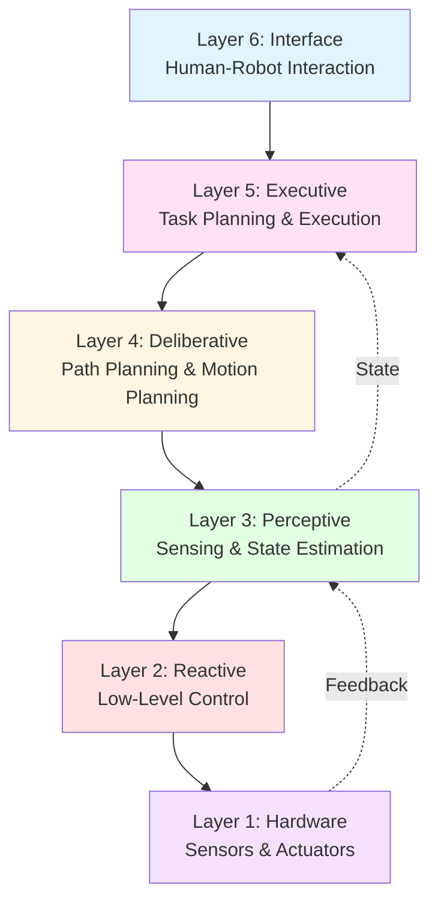
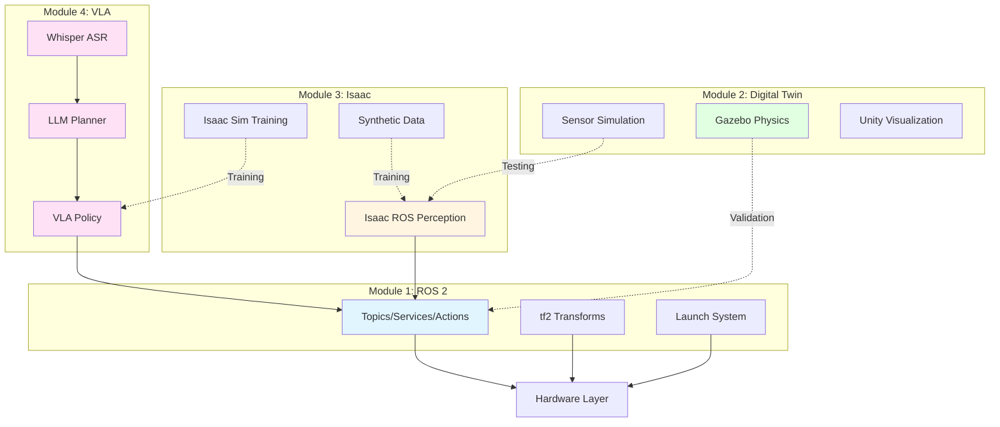
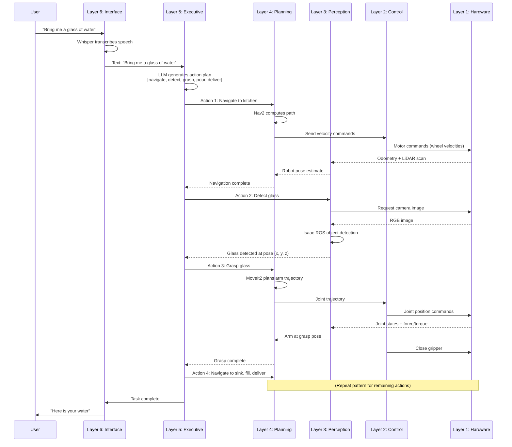

# Chapter 20: Complete Architecture Overview

## Learning Objectives

By the end of this chapter, you will:

1. Understand the complete layered architecture of an autonomous humanoid robot system
2. Learn how all four modules (ROS 2, Digital Twin, Isaac, VLA) interconnect
3. Explore data flow patterns from sensors to actions
4. Understand architectural design principles for humanoid robotics
5. Learn how to trace system behavior from high-level commands to low-level control
6. Explore scalability, modularity, and maintainability considerations

## Prerequisites

You should have completed:
- **All of Part 1** (Foundations)
- **Module 1** (ROS 2 - Chapters 4-7)
- **Module 2** (Digital Twin - Chapters 8-11)
- **Module 3** (Isaac - Chapters 12-15)
- **Module 4** (VLA - Chapters 16-19)

## Introduction

Throughout this book, you've learned the individual components of humanoid robotics. This chapter provides the **30,000-foot view**: how everything fits together into a cohesive,  production-ready system.

We'll explore:
- **The 6-layer architecture** that organizes complexity
- **Data flow patterns** showing how information moves through the system
- **Module integration** demonstrating how ROS 2, Digital Twin, Isaac, and VLA work together
- **Design principles** that make systems scalable and maintainable

## The Six-Layer Architecture



### Layer 1: Hardware (Physical)
**Responsibility**: Physical sensors and actuators

**Components**:
- Motors (base, arms, head, grippers)
- Sensors (cameras, LiDAR, IMU, force/torque)
- Power system (battery, voltage regulators)
- Compute (GPU for perception, CPU for control)

**Technologies**: Servo drivers, CAN bus, USB cameras, Jetson/Xavier compute modules

### Layer 2: Reactive (Control)
**Responsibility**: Real-time low-level control loops

**Components**:
- Joint PID controllers (position, velocity, torque control)
- Motor drivers and communication protocols
- Sensor data acquisition and preprocessing
- Safety monitors (collision detection, e-stop)

**Technologies**: ROS 2 control, ros2_control hardware interfaces
**Cycle time**: 1-10ms (hard real-time)

### Layer 3: Perceptive (Sensing)
**Responsibility**: Environment understanding and state estimation

**Components**:
- Object detection (Isaac ROS DNNs)
- SLAM (visual, LiDAR-based localization)
- Depth processing (point cloud generation)
- Semantic segmentation
- Robot state estimation (pose, velocity)

**Technologies**: Isaac ROS, OpenCV, PCL (Point Cloud Library)
**Cycle time**: 10-100ms (soft real-time)

### Layer 4: Deliberative (Planning)
**Responsibility**: Motion planning and path planning

**Components**:
- Navigation planner (Nav2 for mobile base)
- Motion planner (MoveIt2 for arm trajectories)
- Grasp planner (grasp pose generation)
- Footstep planner (for bipedal locomotion)

**Technologies**: Nav2, MoveIt2, OMPL, custom planners
**Cycle time**: 100ms-1s

### Layer 5: Executive (Task Management)
**Responsibility**: High-level task planning and execution monitoring

**Components**:
- LLM task planner (GPT-4/Claude for action sequences)
- Task executor (orchestrates lower layers)
- Failure recovery (detects failures, triggers replanning)
- Behavior trees or state machines

**Technologies**: LangChain, BehaviorTree.CPP, SMACH
**Cycle time**: 1-10s per task

### Layer 6: Interface (Human Interaction)
**Responsibility**: User interaction and communication

**Components**:
- Speech recognition (Whisper)
- Natural language understanding (LLM)
- Text-to-speech (feedback to user)
- Visualization (RViz, Unity)
- Teleoperation interfaces

**Technologies**: Whisper, OpenAI API, gTTS, Docusaurus (web UI)
**Cycle time**: Variable (user-driven)

## Module Integration Map

How do the four modules fit into this architecture?



**Integration summary**:
- **Module 4 (VLA)** lives in **Layers 5-6**: Natural language interface and high-level planning
- **Module 1 (ROS 2)** spans **all layers**: Communication backbone
- **Module 3 (Isaac)** contributes to **Layers 3-5**: Perception models and planning algorithms
- **Module 2 (Digital Twin)** supports **offline development**: Testing and validation before hardware deployment

## Data Flow: Command to Action

Let's trace a complete data flow for: *"Bring me a glass of water"*



**Key observations**:
1. **Layer 6 → Layer 5**: User command translated to action sequence
2. **Layer 5 → Layer 4**: High-level actions decomposed to motion plans
3. **Layer 4 → Layer 2 → Layer 1**: Plans executed as motor commands
4. **Layer 1 → Layer 3 → Layer 5**: Sensor feedback closes the loop

## Design Principles

### 1. Separation of Concerns
Each layer has a **single responsibility**:
- Layer 6: *What* the user wants
- Layer 5: *Which* actions to take
- Layer 4: *How* to plan motions
- Layer 3: *Where* things are
- Layer 2: *Control* motors precisely
- Layer 1: *Physical* execution

**Benefit**: Changes to one layer don't cascade to others (e.g., swap LLM planner without touching motor controllers)

### 2. Abstraction Barriers
Higher layers don't know implementation details of lower layers:
- Executive layer calls `navigate(kitchen)`, doesn't care about A* vs. RRT path planning
- Planning layer commands `move_arm(pose)`, doesn't care about PID tuning

**Benefit**: Easier testing, clearer interfaces, modular development

### 3. Feedback Loops at Every Level
- **Layer 2**: Joint position feedback for PID control
- **Layer 3**: Sensor data for state estimation
- **Layer 5**: Task completion status for replanning

**Benefit**: Robustness to disturbances, adaptive behavior

### 4. Asynchronous Communication
Layers communicate via **ROS 2 topics/actions** (asynchronous pub-sub):
- Executive sends navigation goal → continues monitoring other tasks
- Perception publishes detections → multiple consumers can subscribe

**Benefit**: Parallelism, non-blocking operations, scalability

### 5. Fail-Safe Defaults
Every layer has safe fallback behavior:
- **Layer 2**: E-stop on collision detection
- **Layer 4**: Abort plan if path blocked
- **Layer 5**: Request human help if replanning fails

**Benefit**: Safety, graceful degradation

## Scalability Considerations

### Horizontal Scaling: Multiple Robots

```yaml
# Robot 1
namespace: /robot1
nodes:
  - llm_planner (ns: /robot1)
  - nav2 (ns: /robot1)
  - perception (ns: /robot1)

# Robot 2
namespace: /robot2
nodes:
  - llm_planner (ns: /robot2)
  - nav2 (ns: /robot2)
  - perception (ns: /robot2)

# Central Coordinator
- fleet_manager (coordinates /robot1 and /robot2)
```

**Design pattern**: Each robot runs complete stack with namespace isolation

### Vertical Scaling: More Compute

**Onboard**: Critical real-time components (Layers 1-3)
**Offboard**: Computationally expensive components (LLM, training)

```python
# Config for hybrid deployment
ONBOARD_NODES = ["motor_controllers", "sensor_drivers", "obstacle_avoidance"]
OFFBOARD_NODES = ["llm_planner", "object_detector_training", "slam"]
```

### Load Balancing: Task Distribution

For multi-robot systems:
- **Fleet manager** assigns tasks based on robot proximity and availability
- **Task auction** protocol: robots bid on tasks based on estimated cost
- **Load balancing**: Distribute tasks evenly across fleet

## Maintainability Patterns

### 1. Modular Node Design
Each ROS 2 node is self-contained:
```python
class PerceptionNode(Node):
    def __init__(self):
        # Single responsibility: object detection
        self.subscription = self.create_subscription(...)
        self.publisher = self.create_publisher(...)

    def detect_objects(self, image):
        # Core logic isolated for unit testing
        return detected_objects
```

### 2. Configuration Management
Use YAML config files for all tunable parameters:
```yaml
# robot_config.yaml
robot:
  max_speed: 0.5  # m/s
  max_acceleration: 0.2  # m/s²
  battery_low_threshold: 20  # %

perception:
  object_detector_model: "detectnet_v2.onnx"
  confidence_threshold: 0.7
```

### 3. Logging and Diagnostics
Structured logging at every layer:
```python
self.get_logger().info(f'Navigation goal: {goal.pose}')
self.get_logger().warn(f'Battery low: {battery_level}%')
self.get_logger().error(f'Grasp failed: {error_msg}')
```

### 4. Version Control for Models
Track ML model versions:
```
models/
├── object_detector_v1.0.onnx
├── object_detector_v1.1.onnx (current)
├── vla_policy_v2.3.pth
└── README.md  # Model changelog
```

## Summary

The six-layer architecture provides a clear organizational structure for autonomous humanoid robots:

1. **Layer 1 (Hardware)**: Physical sensors and actuators
2. **Layer 2 (Reactive)**: Real-time control loops
3. **Layer 3 (Perceptive)**: Environment understanding
4. **Layer 4 (Deliberative)**: Motion and path planning
5. **Layer 5 (Executive)**: Task planning and execution
6. **Layer 6 (Interface)**: Human-robot interaction

**Module integration**:
- **ROS 2** (Module 1): Communication backbone across all layers
- **Digital Twin** (Module 2): Offline development and validation
- **Isaac** (Module 3): Perception models and training infrastructure
- **VLA** (Module 4): Natural language interface and high-level planning

**Design principles**: Separation of concerns, abstraction barriers, feedback loops, asynchronous communication, fail-safe defaults

This architecture scales from single robots to multi-robot fleets and remains maintainable through modular design, configuration management, and comprehensive logging.

## Connections

- **Chapter 19**: Detailed implementation of this architecture for household assistant
- **Chapter 21**: Integration patterns showing how to connect these layers
- **Chapter 22**: Walkthrough demonstrating this architecture in action
