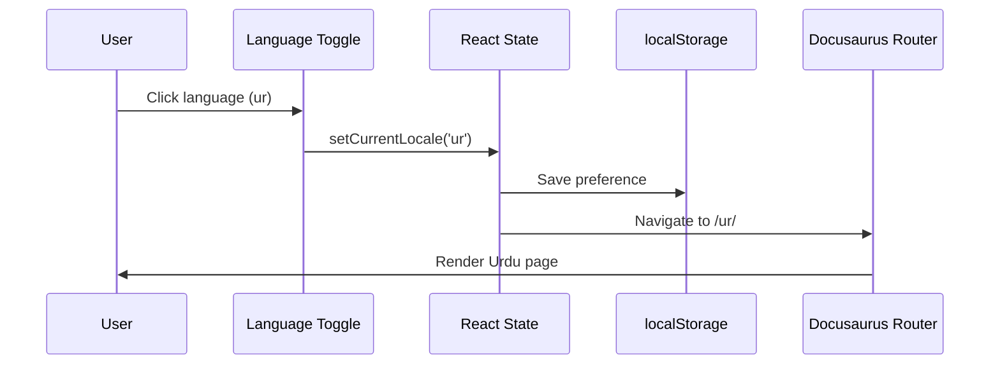
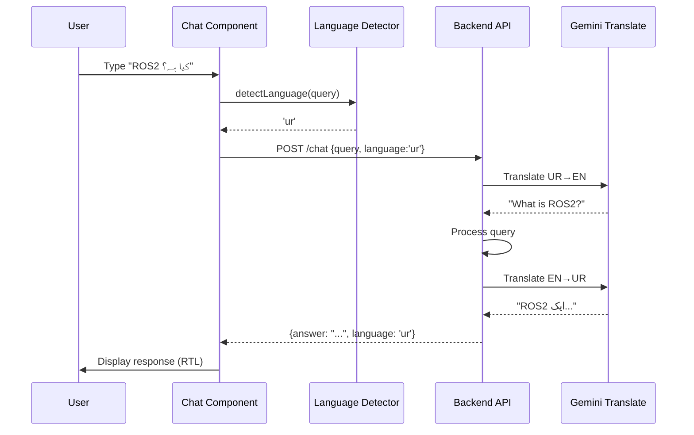

# Data Model: Urdu Translation Support

**Feature**: 002-urdu-i18n-support | **Date**: 2025-12-09 | **Phase**: 1 (Design)

## Purpose

This document defines the data structures, entities, and relationships required to implement Urdu translation support. It covers frontend state management, persistent storage, and API data contracts.

---

## Entities

### 1. LanguagePreference

**Description**: Represents the user's selected language preference, persisted across browser sessions.

**Storage**: Browser localStorage

**Schema**:
```typescript
interface LanguagePreference {
  locale: 'en' | 'ur';           // Selected language code
  timestamp: number;              // Unix timestamp when preference was set
  version: string;                // Data schema version (for future migrations)
}
```

**Key**: `docusaurus.locale` (Docusaurus convention)

**Validation Rules**:
- `locale` MUST be one of ['en', 'ur']
- `timestamp` MUST be a valid Unix timestamp (milliseconds since epoch)
- `version` MUST follow semver format (e.g., "1.0.0")

**Lifecycle**:
- **Created**: When user first visits site or explicitly selects language via toggle
- **Updated**: When user switches language via toggle
- **Read**: On every page load to determine initial language
- **Expired**: After 90 days of inactivity (optional, not enforced in v1)

**Example**:
```json
{
  "locale": "ur",
  "timestamp": 1702080000000,
  "version": "1.0.0"
}
```

---

### 2. TranslationBundle

**Description**: Collection of translated strings for UI elements (buttons, labels, navigation, etc.), organized by Docusaurus theme components.

**Storage**: Static JSON files in `i18n/ur/` directory

**Schema**:
```typescript
interface TranslationBundle {
  locale: 'ur';                   // Target language code
  messages: Record<string, string>; // Key-value pairs of translations
}
```

**File Structure**:
```text
i18n/ur/
├── code.json                      # Common UI strings
├── docusaurus-theme-classic/
│   ├── navbar.json                # Navbar translations
│   ├── footer.json                # Footer translations
│   ├── docs.json                  # Docs sidebar translations
│   └── ...
```

**Example (`i18n/ur/code.json`)**:
```json
{
  "theme.ErrorPageContent.title": "یہ صفحہ کریش ہو گیا۔",
  "theme.NotFound.title": "صفحہ نہیں ملا",
  "theme.NotFound.p1": "ہم وہ نہیں ڈھونڈ سکے جو آپ تلاش کر رہے تھے۔",
  "theme.NotFound.p2": "براہ کرم سائٹ کے مالک سے رابطہ کریں جس نے آپ کو اصل URL دیا۔",
  "theme.docs.paginator.previous": "پچھلا",
  "theme.docs.paginator.next": "اگلا",
  "theme.common.editThisPage": "یہ صفحہ ترمیم کریں",
  "theme.common.skipToMainContent": "مرکزی مواد پر جائیں"
}
```

**Example (`i18n/ur/docusaurus-theme-classic/navbar.json`)**:
```json
{
  "title": "ہیومنائیڈ روبوٹکس اور فزیکل اے آئی",
  "logo.alt": "ہیومنائیڈ روبوٹکس لوگو",
  "item.label.Tutorial": "ٹیوٹوریل",
  "item.label.Docs": "دستاویزات",
  "item.label.GitHub": "گٹ ہب"
}
```

**Validation Rules**:
- All translation keys MUST match English version keys
- Translation values MUST be non-empty strings
- RTL text MUST be used for Urdu (Unicode range U+0600 to U+06FF)
- Technical terms MAY remain in English (e.g., "GitHub", "API")

**Relationships**:
- Translation bundles are loaded by Docusaurus based on current `LanguagePreference.locale`
- Docusaurus automatically falls back to English if a key is missing in Urdu bundle

---

### 3. DocumentationPage

**Description**: Represents a documentation page that exists in both English and Urdu versions with parallel structure.

**Storage**: Markdown files in `docs/` (English) and `i18n/ur/docusaurus-plugin-content-docs/current/` (Urdu)

**Schema**:
```typescript
interface DocumentationPage {
  id: string;                     // Unique page identifier (e.g., "part1-foundations/intro")
  slug: string;                   // URL slug (e.g., "/part1-foundations/intro")
  title: string;                  // Page title (localized)
  content: string;                // Markdown content (localized)
  locale: 'en' | 'ur';            // Language of this version
  lastUpdated: Date;              // Last modification timestamp
  frontMatter: Record<string, any>; // YAML front matter (metadata)
}
```

**File Mapping**:
```text
English:  docs/part1-foundations/intro.md
Urdu:     i18n/ur/docusaurus-plugin-content-docs/current/part1-foundations/intro.md
```

**Validation Rules**:
- English and Urdu versions MUST have identical file structure (path parity)
- Front matter MUST be consistent (same sidebar_position, tags, etc.)
- Internal links MUST be updated to reference localized URLs in Urdu version
- Code blocks MUST remain in English (even in Urdu pages)

**Relationships**:
- Each `DocumentationPage` has 0 or 1 translated version (Urdu)
- If Urdu version missing, Docusaurus falls back to English
- Language toggle switches between `DocumentationPage` instances with same `id` but different `locale`

**Example Front Matter**:
```yaml
---
id: intro
title: فزیکل اے آئی کیا ہے؟  # Urdu title
sidebar_position: 1
---
```

---

### 4. ChatbotMessage

**Description**: Represents a user query or bot response in the chatbot interface, with language metadata.

**Storage**: In-memory (not persisted, ephemeral chat session)

**Schema**:
```typescript
interface ChatbotMessage {
  id: string;                     // Unique message ID (UUID)
  role: 'user' | 'assistant';     // Message sender
  content: string;                // Message text
  language: 'en' | 'ur';          // Detected or selected language
  timestamp: number;              // Unix timestamp (milliseconds)
  metadata?: {
    detectedLanguage?: 'en' | 'ur'; // Auto-detected language (may differ from selected)
    translatedFrom?: 'en' | 'ur';   // If response was translated, source language
  };
}
```

**Lifecycle**:
- **Created**: When user sends message or bot responds
- **Language Detection**: Frontend detects language from user input (Unicode heuristic)
- **API Call**: Frontend sends `ChatbotMessage.content` + `language` to backend
- **Response**: Backend returns translated response in requested `language`
- **Rendered**: Chat UI displays messages with appropriate RTL/LTR direction

**Example (User Message)**:
```json
{
  "id": "msg_123456",
  "role": "user",
  "content": "ROS2 کیا ہے؟",
  "language": "ur",
  "timestamp": 1702080000000,
  "metadata": {
    "detectedLanguage": "ur"
  }
}
```

**Example (Bot Response)**:
```json
{
  "id": "msg_123457",
  "role": "assistant",
  "content": "ROS2 (Robot Operating System 2) ایک اوپن سورس روبوٹکس مڈل ویئر ہے...",
  "language": "ur",
  "timestamp": 1702080002000,
  "metadata": {
    "translatedFrom": "en"
  }
}
```

**Validation Rules**:
- `role` MUST be one of ['user', 'assistant']
- `content` MUST be non-empty string
- `language` MUST be one of ['en', 'ur']
- `timestamp` MUST be valid Unix timestamp

**Relationships**:
- Chat messages are ephemeral (not persisted across sessions)
- Language detection infers `language` from `content` (Unicode pattern matching)
- Backend uses `language` to determine translation direction

---

## API Data Contracts

### ChatRequest

**Description**: Request payload sent from frontend to chatbot backend API

**Endpoint**: `POST /api/chat` (external API, not part of frontend)

**Schema**:
```typescript
interface ChatRequest {
  query: string;                  // User's question
  language: 'en' | 'ur';          // Target response language
  sessionId?: string;             // Optional session ID for context
  context?: string;               // Optional context (e.g., current page URL)
}
```

**Example**:
```json
{
  "query": "ROS2 کیا ہے؟",
  "language": "ur",
  "sessionId": "sess_abc123",
  "context": "https://hackathon1-9y2e.vercel.app/ur/part2-modules/module1-ros2/intro"
}
```

**Validation**:
- `query` MUST be non-empty string (max 2000 characters)
- `language` MUST be one of ['en', 'ur']
- `sessionId` is optional (UUID format if provided)
- `context` is optional (valid URL if provided)

---

### ChatResponse

**Description**: Response payload returned from chatbot backend API

**Schema**:
```typescript
interface ChatResponse {
  answer: string;                 // Bot's response in requested language
  language: 'en' | 'ur';          // Language of the response (matches request)
  confidence?: number;            // Optional confidence score (0-1)
  sources?: string[];             // Optional source URLs for answer
  error?: string;                 // Error message if request failed
}
```

**Example (Success)**:
```json
{
  "answer": "ROS2 (Robot Operating System 2) ایک اوپن سورس روبوٹکس مڈل ویئر ہے جو روبوٹ ایپلیکیشنز بنانے کے لیے استعمال ہوتا ہے۔",
  "language": "ur",
  "confidence": 0.95,
  "sources": [
    "https://hackathon1-9y2e.vercel.app/ur/part2-modules/module1-ros2/chapter-04-introduction-to-ros2"
  ]
}
```

**Example (Error)**:
```json
{
  "answer": "",
  "language": "en",
  "error": "Translation service temporarily unavailable. Please try again in English."
}
```

**Validation**:
- `answer` MUST be string (may be empty if error)
- `language` MUST match request language
- `confidence` is optional (0.0 to 1.0 if provided)
- If `error` is present, `answer` should be empty or contain fallback message

---

## State Management

### Frontend State

**Technology**: React useState + localStorage (no Redux/MobX needed for simple state)

**State Structure**:
```typescript
interface AppState {
  currentLocale: 'en' | 'ur';     // Current language (synced with URL and localStorage)
  chatMessages: ChatbotMessage[]; // In-memory chat history
  isLanguageToggleOpen: boolean;  // UI state for language dropdown
}
```

**State Transitions**:

1. **Page Load**:
   ```typescript
   // Read from localStorage or URL
   const storedLocale = localStorage.getItem('docusaurus.locale');
   const urlLocale = window.location.pathname.startsWith('/ur/') ? 'ur' : 'en';
   const currentLocale = urlLocale || storedLocale || 'en';
   ```

2. **Language Toggle Click**:
   ```typescript
   // Update state, localStorage, and URL
   setCurrentLocale(newLocale);
   localStorage.setItem('docusaurus.locale', JSON.stringify({
     locale: newLocale,
     timestamp: Date.now(),
     version: '1.0.0'
   }));
   router.push(newLocale === 'ur' ? '/ur/' : '/');
   ```

3. **Chat Message Sent**:
   ```typescript
   // Detect language, send API request, update chat history
   const detectedLang = detectLanguage(userQuery);
   const message: ChatbotMessage = {
     id: generateUUID(),
     role: 'user',
     content: userQuery,
     language: detectedLang,
     timestamp: Date.now(),
     metadata: { detectedLanguage: detectedLang }
   };
   setChatMessages([...chatMessages, message]);

   const response = await chatService.sendMessage(userQuery, detectedLang);
   const botMessage: ChatbotMessage = {
     id: generateUUID(),
     role: 'assistant',
     content: response.answer,
     language: response.language,
     timestamp: Date.now(),
     metadata: { translatedFrom: response.language === 'ur' ? 'en' : undefined }
   };
   setChatMessages([...chatMessages, message, botMessage]);
   ```

---

## Data Flow Diagrams

### Language Selection Flow



### Chatbot Interaction Flow



---

## Persistence Strategy

| Data | Storage | Persistence | Sync |
|------|---------|-------------|------|
| LanguagePreference | localStorage | 90 days | Per-device |
| TranslationBundles | Static files | Permanent | Version-controlled |
| DocumentationPages | Static files | Permanent | Version-controlled |
| ChatbotMessages | In-memory | Session-only | None |

**Notes**:
- localStorage is per-device, per-browser (not synced across devices)
- Translation bundles and docs are static (built at deploy time)
- Chat history is ephemeral (not persisted, for privacy)

---

## Migration Strategy

### v1.0.0 → v1.1.0 (Future)

If we need to add more languages or change data structures:

```typescript
// Migration example for LanguagePreference
function migrateLanguagePreference(stored: any): LanguagePreference {
  if (!stored.version) {
    // v0 format (before versioning)
    return {
      locale: stored.locale || 'en',
      timestamp: Date.now(),
      version: '1.0.0'
    };
  }
  // v1.0.0 format (no changes needed)
  return stored as LanguagePreference;
}
```

---

## Data Validation

### Client-Side Validation (TypeScript)

```typescript
// Zod schema for runtime validation
import { z } from 'zod';

const LanguagePreferenceSchema = z.object({
  locale: z.enum(['en', 'ur']),
  timestamp: z.number().positive(),
  version: z.string().regex(/^\d+\.\d+\.\d+$/)
});

function validateLanguagePreference(data: unknown): LanguagePreference {
  return LanguagePreferenceSchema.parse(data);
}
```

### Build-Time Validation (CI/CD)

```bash
# Check translation file integrity
npm run build -- --locale ur

# Check for missing translations (warning only)
node scripts/check-translations.js --locale ur --warn-only

# Validate Urdu Unicode range
node scripts/validate-urdu-content.js i18n/ur/
```

---

**Data Model Completed**: 2025-12-09
**Reviewed By**: Claude (AI Assistant)
**Status**: ✅ Ready for API Contracts and Quickstart
